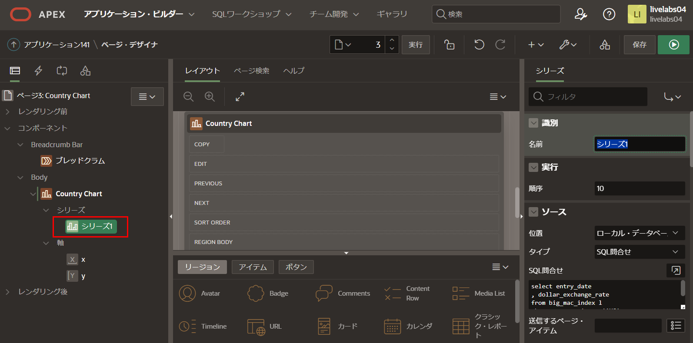

# チャートの追加

## はじめに
このラボでは、アプリケーションにチャートページを追加する方法を学びます。

所要時間: 5分

### 背景情報
Big Mac Indexには、過去20年間の各国のデータが含まれています。したがって、時間の経過とともに各国の為替レートの傾向をより視覚的に表すために、国ごとのチャートを作成すると便利です。

最初に、オーストラリア(COUNTRY_ISO = 'AUS')のドル為替レートを表示するチャートを作成します。次に、その他のデータ・シリーズを追加します。

## タスク1: 新しいページの作成 

1. ランタイム環境で、画面下部の**開発者ツールバー**をクリックし、**アプリケーション###**をクリックします。

   

2. アプリケーションのホームページで、**ページの作成**をクリックします。

   「ページの作成」ダイアログで、**チャート**をクリックします。

   

3. 「チャートの作成」ダイアログで、**折れ線**をクリックします。

   
   
4. 「チャートの作成」ダイアログで、次の項目を入力します。
   
      - **名前:** **Country Chart**と入力
      - **ソース・タイプ:** **SQL問合せ**をクリック
      - **SQL SELECT文を入力:** 次のSQLをコピー&ペースト

      ```
      <copy>select entry_date
      , dollar_exchange_rate
      from big_mac_index l
      where country_iso = 'AUS'
      order by entry_date</copy>
      ```

      **次 >** をクリックします。

      
   
5. 「チャートの作成」ダイアログで、次の項目を入力します。
   
      - **ラベル列:** **ENTRY\_DATE**を選択
      - **値列:** **DOLLAR\_EXCHANGE\_RATE**を選択
   
      **ページの作成**をクリックします。

      
   
6. ページ・デザイナから、右上の**保存して実行**ボタンをクリックします。
   
   

7. アプリケーションのランタイム環境に移動します。ページにチャートが表示されていることを確認します。

   
   
## タスク2: チャートの属性を調整する
最初のチャートの外観からわかるように、時間の表示方法など、まだ調整の余地があります。属性を更新することで改善できます。
   
1. ランタイム環境で、画面下部の開発者ツールバーから、**クイック編集**をクリックします。  
   チャート領域の上にマウスを置くと、青い枠で囲まれます。チャートをクリックします。

   
   
   または、APEXアプリケーション・ビルダーのタブまたはウィンドウに戻り、ページ3に移動します。
   
2. ページ・デザイナ内で、レンダリング・ツリー(左パネル)の**Country Chart**をクリックします。  
   プロパティ・エディタ(右パネル)で**属性**パネルを開きます。次の項目を入力します。
   
   - **設定 > 時間軸タイプ:** **混合頻度**を選択
   - **凡例 > 表示:** スイッチをオンにする

   

## タスク3: チャートのデータシリーズを更新する

既存のチャート・ライン(データ・シリーズ)を更新し、さらにデータ・シリーズを追加しましょう。

1. ページ・デザイナで、レンダリング・ツリー(左パネル)の**Country Chart**の下の**シリーズ1**をクリックします。

      

      プロパティ・エディタ(右パネル)に次の項目を入力します。

      - **識別 > 名前:** **Dollar Exchange Rate**と入力
      - **ラベル > 表示:** スイッチをオフにする

      

      - **軸 > y**を選択
      - **値 > 小数点**に**1**を入力すると、チャートのラベルに読みやすい小数点値が表示されます。

      

2. 次の2つのデータシリーズは最初のものと非常に似ているため、既存のデータシリーズを複製するのが最も簡単です。

   レンダリング・ツリー(左パネル)の**Country Chart**の下で、**Dollar Exchange Rate**を右クリックし、**重複**をクリックします。

      

3. 上記の手順を繰り返して、3番目のデータシリーズを作成します。  
   *注意: これで、3番目のシリーズを作成するためにコピーしたシリーズに応じて、Dollar Exchange Rate、Dollar Exchange Rate\_1、Dollar Exchange Rate\_2 または Dollar Exchange Rate\_1\_1の3つのデータシリーズがあるはずです。*
   
4. 2番目のチャートライン(データシリーズ)は、相対為替レートを表示します。

      レンダリング・ツリー(左パネル)の**Country Chart**の下で、2番目のデータシリーズをクリックします。  
      プロパティ・エディタ(右パネル)に次の項目を入力します。
   
      - **識別 > 名前:** **Relative Exchange Rate**と入力
      - **ソース > SQL問合せ:** 次のSQLをコピー&ペースト

         ```
         <copy>select entry_date
            , (local_price / (select local_price from big_mac_index u
                              where u.entry_date = l.entry_date
                              and u.country_iso = 'USA'
                              )
               ) relative_exchange_rate
            from BIG_MAC_INDEX l
            where country_iso = 'AUS'
            order by entry_date</copy>
         ```

      - **列マッピング > 値:** **RELATIVE\_EXCHANGE\_RATE** を選択

      

5. 3番目のチャートライン(データシリーズ)は、通貨と米ドルとのパーセンテージ差を表示します。

      レンダリング・ツリー(左パネル)の**Country Chart**の下で、3番目のデータ・シリーズをクリックします。  
      プロパティ・エディタ(右パネル)に次の項目を入力します。

      - **識別 > 名前:** **Percentage Difference (Y2)**と入力
      - **ソース > SQL問合せ:** 次のSQLをコピー&ペースト:

         ```
            <copy>select entry_date
            , ((  local_price / (select local_price from big_mac_index u
                                 where u.entry_date = l.entry_date
                                 and u.country_iso = 'USA'
                                 )
                  - dollar_exchange_rate
               ) * 100 / dollar_exchange_rate
               ) percentage_difference
            from BIG_MAC_INDEX l
            where country_iso = 'AUS'
            order by entry_date</copy>
         ```

      - **列マッピング > 値:** **PERCENTAGE\_DIFFERENCE**を選択
      - **外観 > Y2軸に割当て:** **はい**をチェック

      

      *注: 「Y2軸に割当て」にチェックしないと、チャートは適切に表示されません。*

6. ページ・デザイナーで、ツールバーの**保存して実行**をクリックします。チャートが以下のように表示されていることを確認します。

   
   
## **まとめ**

これでLab 5は完了です。このLabでは、複数のデータシリーズを追加してチャートを作成および変更する方法を学びました。[次のLab 6に進むにはここをクリック](?lab=lab-6-adding-chart-criteria)

## 謝辞

 - **作成者/投稿者** -  Salim Hlayel, Principle Product Manager
 - **投稿者** - Jaden McElvey, Technical Lead - Oracle LiveLabs Intern
 - **最終更新日** - Salim Hlayel, Principle Product Manager, November 2020

