# チャートの条件を追加する

## はじめに

このラボでは、ページ・アイテムを追加し、ページ・アイテムをチャートのシリーズで利用し、クライアント・サイドのインタラクティブ性を定義する方法を学びます。

所要時間: 5分 

### 背景情報

チャートには現在、オーストラリアのISOコード(AUS)がハード・コーディングされています。国のリストを持つ選択リストを追加し、チャートのデータ・シリーズをこのページ・アイテムに応じて変更することで、任意の国の為替レート履歴を簡単に確認できるようになります。

選択リストで国を変更する時にチャートを更新するには、動的アクションを利用することが必要です。動的アクションは、特定のアクション(選択リストの変更)に基づいて、指定された機能(更新)を、指定された要素(チャート領域)で実行することを定義します。

チャートが選択リストの更新された値を適切に利用するためには、その値をチャートのレンダリング時に送信する必要があります。

## タスク1: ページアイテムを追加する

1. ランタイム環境で、開発者ツールバー(画面下部)の**ページ3**をクリックします。

2. ページ・デザイナーで、ギャラリー(中央パネルのレイアウトの下)の**アイテム**をクリックします。  
   **選択リスト**をクリックしてマウス・ボタンを押したままにします。  
   **選択リスト**アイテムをCountry Chartリージョン内のREGION BODYセクションに来るまでドラッグします。  
   REGION BODYセクションが展開され、濃い黄色のボックスが表示されたら、**選択リスト**アイテムをドロップします(マウス・ボタンを離します)。

   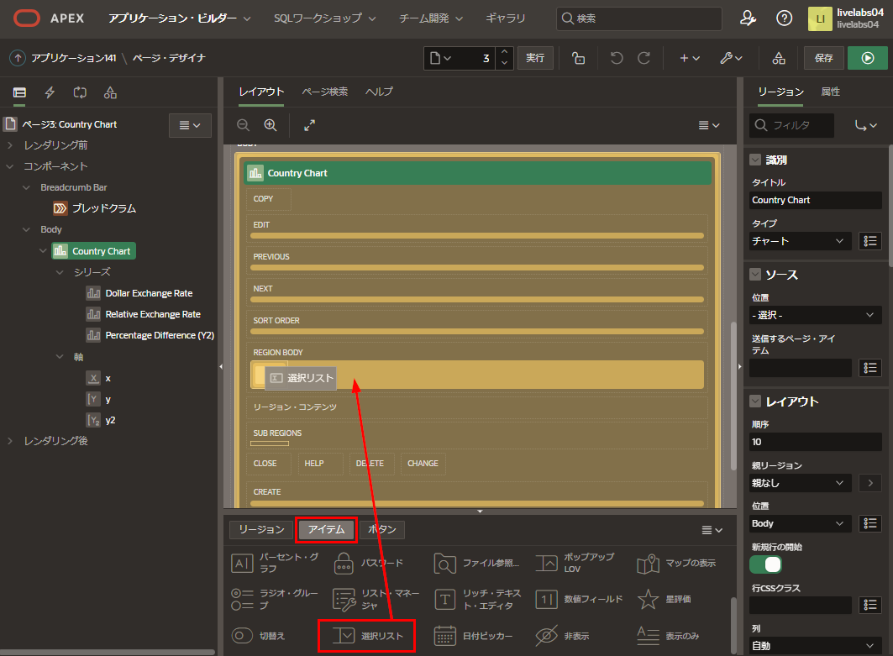
   
3. プロパティ・エディタ(右パネル)で、以下を入力します。
   - **識別 > 名前:** **P3_COUNTRY**と入力
   - **ラベル > ラベル:** **COUNTRY**と入力
   - **LOV > タイプ:** **SQL問合せ**を選択
   - **LOV > SQL問合せ:** 次のSQLをコピー&ペースト

      ```
      <copy>select distinct country_name d, country_iso r  
      from big_mac_index  
      order by 1</copy>
      ```

   - **LOV > 追加値の表示:** **いいえ** をクリック
   - **LOV > NULL表示値:** **Select Country -** と入力

   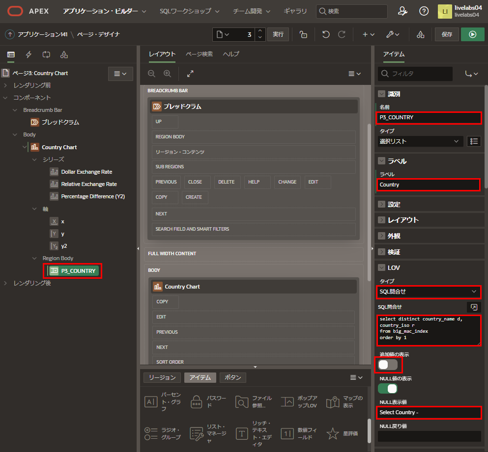


## タスク2: 動的アクションを追加する

新しいアイテムで国が選択された時に、チャートを更新するには、動的アクションを定義する必要があります。

1. レンダリング・ツリー(左パネル)で、**P3_COUNTRY** を右クリックし、**動的アクションの作成**を選択します。

   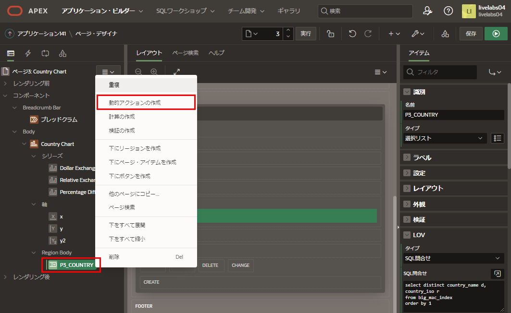

2. プロパティ・エディタ(右パネル)で、識別 > 名前に **Refresh Chart** と入力します。

   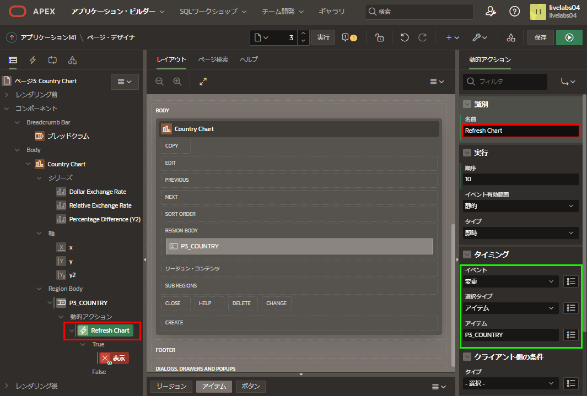
   
3. レンダリング・ツリー(左パネル)で、動的アクション > Trueの下の**表示**をクリックします。

   プロパティ・エディタ(右パネル)に以下を入力します。

   - **識別 > アクション:** **リフレッシュ**を選択
   - **影響を受ける要素 > 選択タイプ:** **リージョン**を選択
   - **影響を受ける要素 > リージョン:** **Country Chart**を選択

   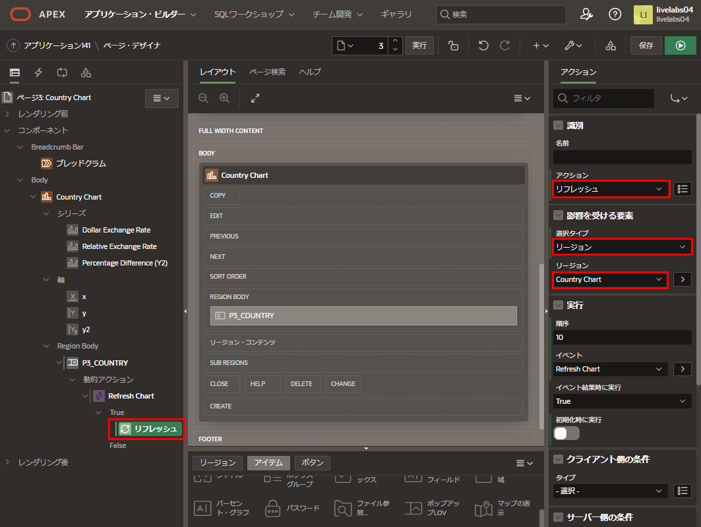
   
## タスク3: チャートを更新する

現在、3つのチャート・シリーズすべてに国がハード・コーディングされています。アイテムの値を使用できるようにするには、セッション・ステートに設定する必要があります。各シリーズごとにこれを行うのではなく、チャートに対して一度設定できます。アイテムがセッション・ステートになったら、各チャート・シリーズのwhere条件で利用できます。

1. レンダリング・ツリー(左パネル)のボディの下で、**Country Chart**をクリックします。

   プロパティ・エディタ(右パネル)のソース > 送信するページ・アイテムで、**P3_COUNTRY**を選択します。

   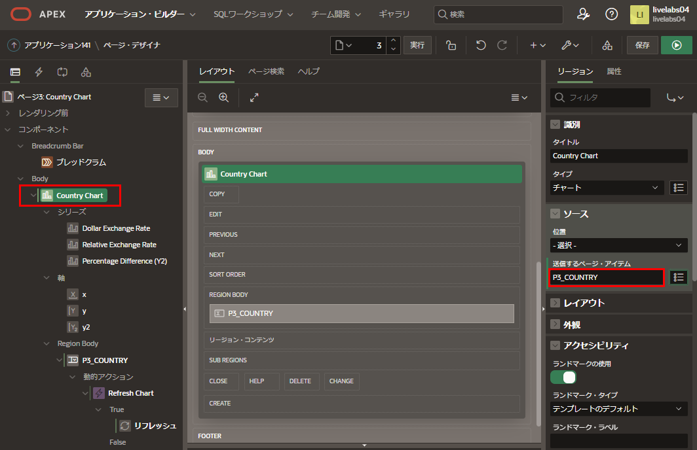
   
2. レンダリング・ツリー(左パネル)のシリーズの下で、**Dollar Exchange Rate**をクリックします。

   プロパティ・エディタ(右パネル)のソース > SQL問合せで、**'AUS'**を**:P3_COUNTRY**に置換します。

   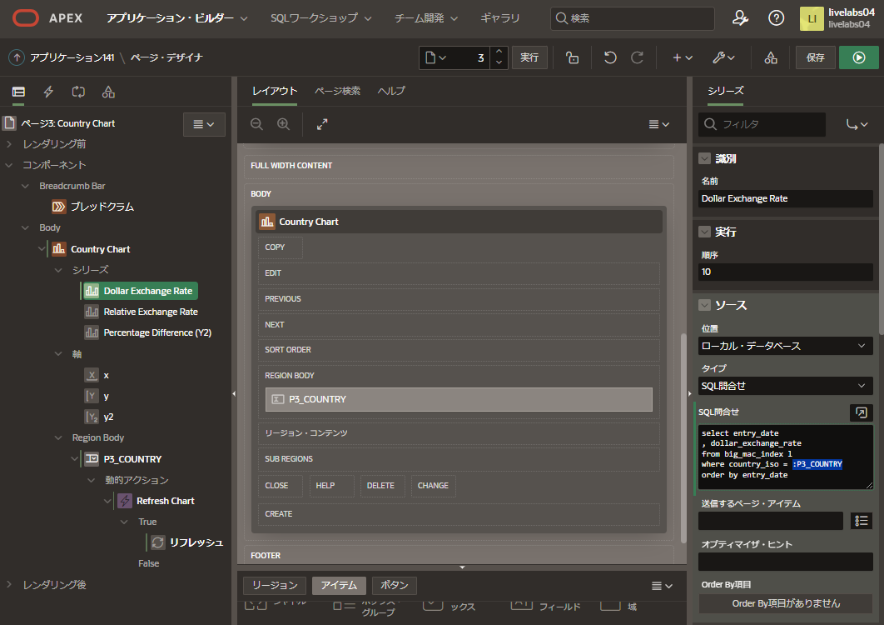

3. レンダリング・ツリー(左パネル)のシリーズの下で、**Relative Exchange Rate**をクリックします。  
   プロパティ・エディタ(右パネル)のソース > SQL問合せで、**'AUS'**を**:P3_COUNTRY**に置換します。
   
4. レンダリング・ツリー(左パネル)のシリーズの下で、**Percentage Difference**をクリックします。  
   プロパティ・エディタ(右パネル)のソース > SQL問合せで、**'AUS'**を**:P3_COUNTRY**に置換します。
   
## タスク4: チャートページを改善する

1. ページ・デザイナーで、ツールバーの**保存して実行**をクリックします。

   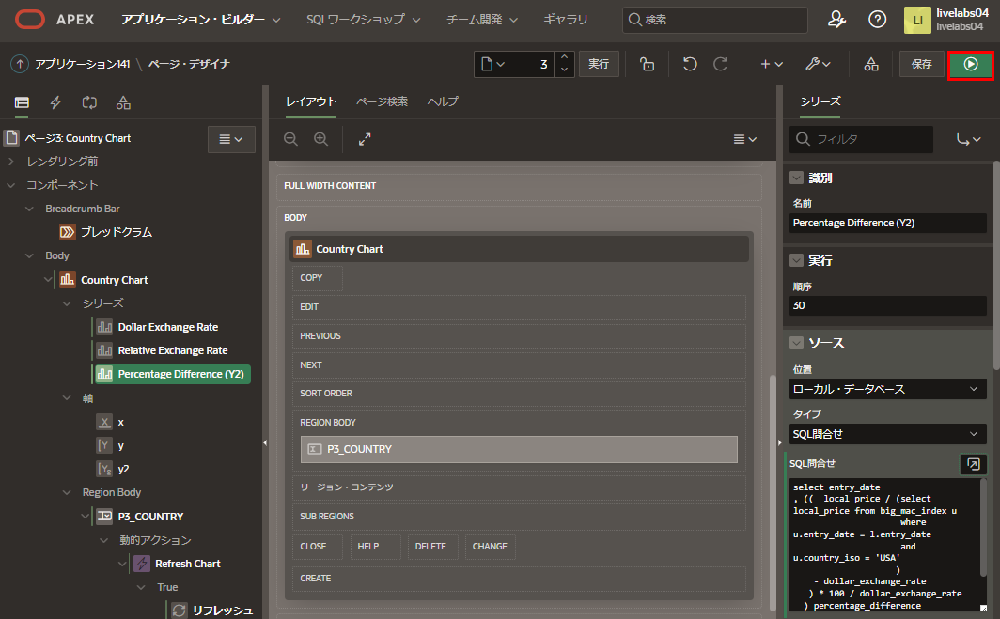

2. ランタイム環境で、異なる国を選択して、チャートを確認します。

   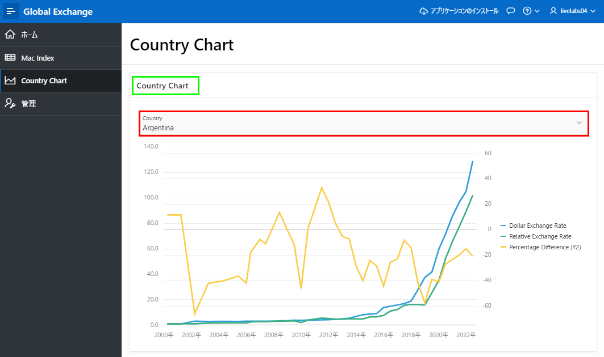
   
3. ランタイム環境を確認すると、リージョン名が重複で、非表示になる必要があります。これはライブ・テンプレート・オプションを使用してランタイム環境から行うことができます。

   ランタイム環境で、開発者ツールバーの**クイック編集**をクリックします。  
   マウスを上に動かして、チャートの周りに青いアウトラインが表示されるまで移動します。  
   チャート・リージョンの右上隅にある**レンチ**アイコンをクリックします。

   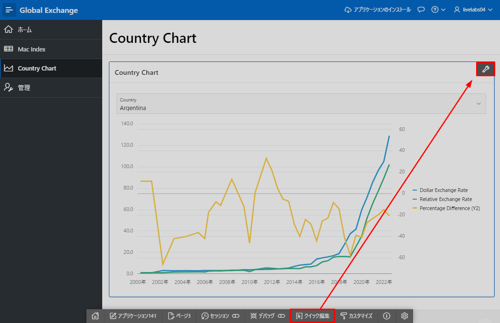
   
4. ライブ・テンプレート・オプションのダイアログで、**Header**に**Hidden but accessible**を選択します。  
   
   **保存**をクリックします。
   
   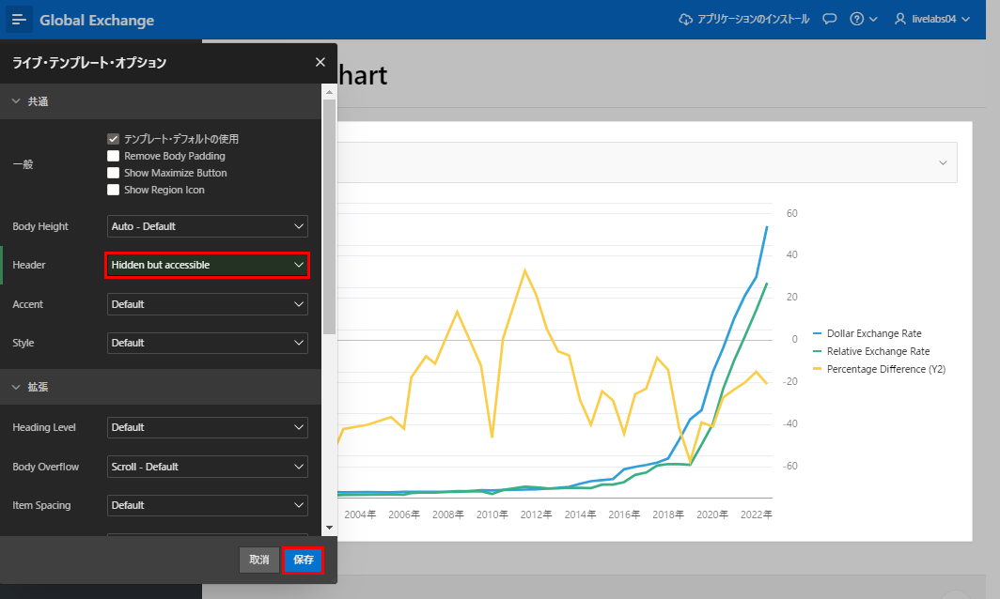
   
5. ランタイム環境で、画面を再確認します。

   
   
## **まとめ**

これでLab 6とワークショップは完了です。このラボでは、アイテムの作成、動的アクションの定義、ユーザー入力フィールドに基づくリージョンの更新方法を学びました。


## 謝辞

 - **作成者/投稿者** -  Salim Hlayel, Principle Product Manager
 - **投稿者** - Jaden McElvey, Technical Lead - Oracle LiveLabs Intern
 - **最終更新日** - Salim Hlayel, Principle Product Manager, November 2020

