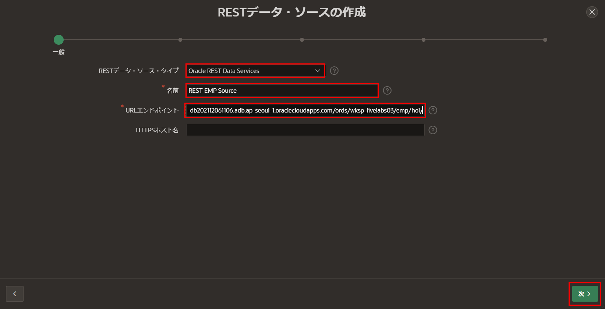
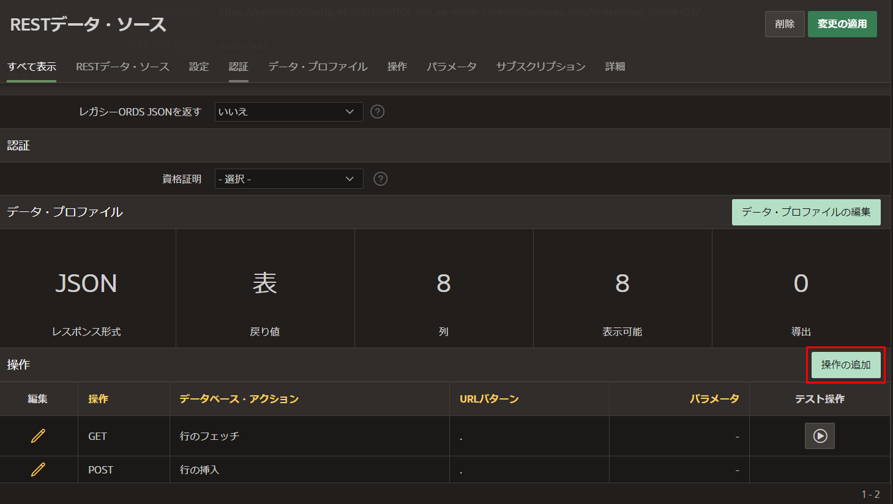
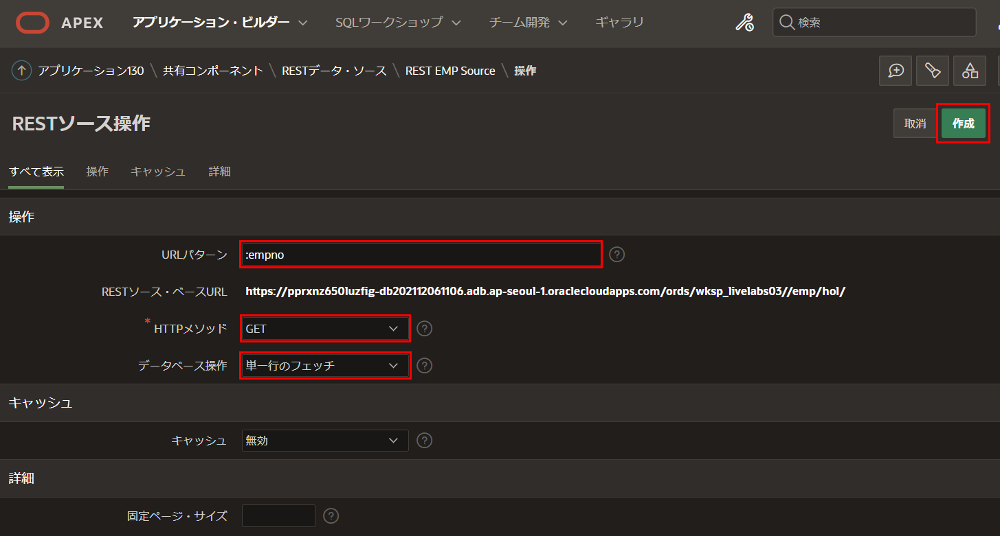
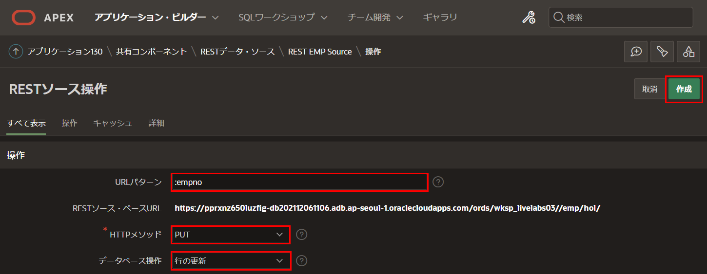

# RESTデータ・ソースの定義

## はじめに
このラボでは、前のラボで作成したREST APIを利用してRESTデータ・ソースを定義する方法を学びます。  

推定時間: 10分  

## タスク1: アプリの作成   
通常の開発環境では、REST APIを定義したリモート・データベースからログアウトし、アプリケーションを構築するローカル・データベースにログインします。ただし、このラボでは同じワークスペースを使用しているため、ログアウトして再ログインする必要はありません。

1. **アプリケーション・ビルダー**タブに戻ります。  

2. ツールバーで、**アプリケーション・ビルダー**をクリックし、**作成**をクリックします。  

       

3. **アプリケーションの作成**ページで、**新規アプリケーション**をクリックします。  

       

4. **アプリケーションの作成**ページで、**名前**に**REST Employees**と入力します。  

     **アプリケーションの作成**をクリックします。  

       

     *注意: この段階では、RESTデータ・ソースをまだ定義していないため、ページを追加する必要はありません。*

## タスク2: EMPのRESTデータ・ソースの追加

1. アプリケーションのホームページで、**共有コンポーネント**をクリックします。  

       

2. **データ・ソース**の下で、**RESTデータ・ソース**をクリックします。  

       

3. **RESTデータ・ソース**ページで、**作成 >**をクリックします。  

       

4. デフォルトのまま、**次 >**をクリックします。（*デフォルト: 最初から*）

       

5. **RESTデータ・ソースの作成**ウィザードで、**一般**ダイアログに次の内容を入力します。  
    - **RESTデータ・ソース・タイプ:** **ORACLE REST Data Services**を選択します。  
    - **名前:** **REST EMP Source**と入力します。  
    - **URLエンドポイント:** 前にテストしたREST URLを入力します。  

     *注意: URLエンドポイントは、https://{cloud_url}/ords/{{your_schema}}/emp/hol/*のようになります。  

     **次 >**をクリックします。  

     

6. **リモート・サーバー**ダイアログで、**ベースURL**と**サービスURLパス**を確認します。  
     **次 >**をクリックします。  

       

7. **認証**ダイアログで、**検出 >**をクリックします。  

     - **認証が必要:** いいえ

         

8. **プレビュー**ダイアログで、**RESTデータ・ソースの作成**をクリックします。 

       

## タスク3: 操作の追加
上記で使用したURLエンドポイントの場合、**RESTデータ・ソースの作成**操作により、**GET**および**POST**操作が定義されていることが判明しました。ですけど、RESTfulサービスに個々の従業員レコードの**GET**、**PUT**、**DELETE**のハンドラーも定義しました。したがって、これらのハンドラーに対してRESTデータ・ソースの操作を追加することが重要です。操作を追加しないと、単一のレコードの取得、レコードの更新、レコードの削除などの関連機能が含まれません。  

1. **RESTデータ・ソース**ページで、**REST EMP Source**をクリックします。  

       

2. **REST EMP Source**ページで、**操作の追加**をクリックします。

     

3. **RESTソース操作**ページで、次の内容を入力します。  
     - **URLパターン:** **:empno**と入力します(先頭のコロンを含む!)  
     - **HTTPメソッド:** **GET**を選択します。  
     - **データベース操作:** **単一行のフェッチ**を選択します。  

    **作成**をクリックします。  

       

4. **REST EMP Source**ページで、**操作の追加**をクリックします。  

     **RESTソース操作**ページで、次の内容を入力します。  
     - **URLパターン:** **:empno**(先頭のコロンを含む!)と入力します。  
     - **HTTPメソッド:** **PUT**を選択します。  
     - **データベース操作:** **行の更新**を選択します。  

   **作成**をクリックします。  

       

5. **REST EMP Source**ページで、**操作の追加**をクリックします。  

     **RESTソース操作**ページで、次の内容を入力します。  
     - **URLパターン:** **:empno**(先頭のコロンを含む!)と入力します。  
     - **HTTPメソッド:** **DELETE**を選択します。  
     - **データベース操作:** **行の削除**を選択します。  

   **作成**をクリックします。  

       
     

## **まとめ**
これでLab 3が完了しました。アプリケーション内でRESTデータ・ソースを定義し、完全なCRUD操作に必要な操作を追加する方法がわかりました。[Lab 4に移動するにはここをクリック](?lab=lab-4-creating-pages)。 

## **謝辞**

 - **作成者/投稿者** -  Salim Hlayel, Principle Product Manager
 - **投稿者** - Oracle LiveLabs Team (Arabella Yao, Product Manager Intern | Jaden McElvey, Technical Lead | Jeffrey Malcolm Jr, Intern)
 - **最終更新日** - Ankita Beri, Product Manager, June 2023
