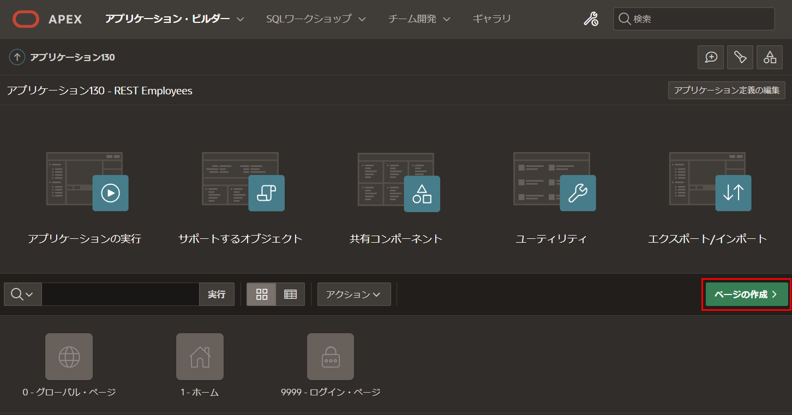
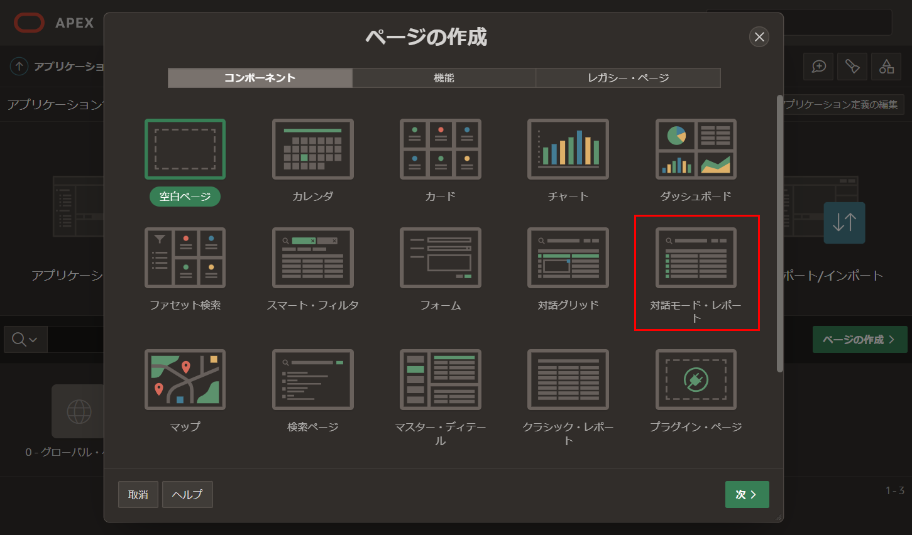

# ページの作成

## はじめに
このラボでは、RESTデータ・ソースを使用して、レポートとフォームを作成する方法を学びます。

推定時間: 15分  

## タスク1: ページ作成ウィザードの使用  

1. アプリケーションのホームページに戻ります。     
     **ページの作成 >**をクリックします。  

       

     **ページの作成**ダイアログで、**対話モード・レポート**をクリックします。  

       

2. **対話モード・レポートの作成**ダイアログで、**ページ属性**に次の内容を入力します。
     - **名前:** **従業員**と入力します。  
     - **フォーム・ページを含める:** 有効にします。  
     - **フォーム・ページ名:** **従業員の管理**と入力します。  
     - **フォーム・ページ・モード:** **モーダル・ダイアログ**をクリックします。  
     - **データ・ソース:** **RESTデータ・ソース**を選択します。  
     - **RESTデータ・ソース:** **REST EMP Source**を選択します。  

     **次 >**をクリックします。  

       

3. **対話モード・レポートの作成**ダイアログで、**主キー列1**で**EMPNO(Number)**を選択し、**ページの作成**をクリックします。  

     

## タスク2: レポートの改善
生成されたページの場合、デフォルトの列順序は最適ではありません。列を簡単に並べ替えてレポートのレイアウトを保存します。  

1. ページ・デザイナから、右上の**保存して実行**ボタンをクリックします。  

       

2. **ログインページ**で、ユーザーIDとパスワードを入力します。**サインイン**をクリックします。

3. **従業員**を確認します。  

       

4. **従業員レポート**ページで、**アクション**をクリックし、**列**をクリックします。 

       

5. **列の選択**ダイアログで、列を選択して**一番上**矢印をクリックして、ENAMEとDEPTNOが最初の2列になるように列順序を調整します。
     **適用**をクリックします。  

       

6. レポート・レイアウトを保存して、すべてのユーザーにこのように表示されるようにする必要があります。  

     **アクション**をクリックし、**レポート**を選択し、**レポートの保存**をクリックします。  

       

7. **レポートの保存**ダイアログで、**デフォルトのレポート設定として保存**を選択します。  

       

8. **デフォルト・レポートの保存**ダイアログで、**主**を選択して**適用**をクリックします。  

     

## タスク3: フォームページの更新
レコードを編集するフォームページもいくつか改善が必要です。  

1. 行の編集アイコンをクリックします。  
     フォームページが表示されます。  

     デベロッパー・ツールバーで、**ページ3**をクリックします。       
     現在のページのページ・デザイナが表示されます。  

       

     *注意: デベロッパー・ツールバーはアプリケーション・ビルダーからアプリを実行する場合にのみ表示されるため、エンドユーザーには表示されません。*  

2. 従業員番号(EMPNO)アイテムは現在隠されています。これはテーブルの主キーとして定義されているためです。ただし、ユーザーはレコードを挿入するときに値を入力できる必要があります。  

     ページ・デザイナ内で、レンダリング・タブ(左パネル)でアイテム**P3\_EMPNO**をクリックします。  

     プロパティ・エディター(右パネル)で、次の内容を入力します。  

     - **識別 > タイプ:** **数値フィールド**を選択します。  
     - **ラベル > ラベル:** **Employee Number**と入力します。  

       

3. 従業員番号(EMPNO)はテーブルの主キーであるため、挿入のみで、更新できないようにする必要があります。したがって、既存従業員番号アイテムを読み取り専用にする必要があります。  

     プロパティ・エディター(右パネル)で、**P3\_EMPNO**を選択して、次の内容を入力します。  
     - **読取り専用 > タイプ:** **アイテムはNULLではない**を選択します。 
     - **読取り専用 > アイテム:** **P3\_EMPNO**を選択します。  

        

4. ジョブと名前のアイテムは現在テキスト領域として定義されていますが、どちらもそれほど大きな値にはなりません。したがって、テキスト・フィールドに変更する必要があります。  

     レンダリング・タブ(左パネル)で、アイテム**P3\_JOB**をクリックします。        
     {Control}キーを押しながら**P3\_ENAME**をクリックします。  

     プロパティ・エディター(右パネル)で、**識別 > タイプ**で**テキスト・フィールド**を選択します。  

       

5. アイテムの順序を改善する必要があります。これはレンダリング・ツリーまたはレイアウトのいずれかでアイテムをドラッグ＆ドロップすることで簡単に実現できます。  

     レンダリング・ツリーで、アイテム**P3\_ENAME**をクリックします。       
     **P3\_ENAME**を**P3\_EMPNO**の下にドラッグします。  

      

6. レンダリングタブ(左パネル)で、アイテム**P3\_DEPTNO**をクリックします。       
     **P3\_DEPTNO**を**P3\_ENAME**の下にドラッグします。  

7. 手数料(COMM)アイテムは給与(SAL)と同じ行に配置する必要があります。  

     レイアウト(中央パネル)で、**P3\_COMM**を選択します。        
     **P3\_SAL**の隣にドラッグします。  

     *注意: 既存のアイテムの右側に大きな暗黄色の箱が表示されるまでアイテムをドロップしないでください。*    

       

8. ツールバーで、**保存**をクリックします。  

       

## タスク4: レコードの挿入  

1. ランタイム環境に戻ります。  

       

2. ブラウザを再読み込みします。

3. **従業員**レポート・ページで、**作成**をクリックします。  

     **従業員の管理**ページで、次の内容を入力します。  

     - **Employee Number:** **1234**と入力します。  
     - **Ename:** **PETERS**と入力します。  
     - **Deptno:** **10**と入力します。  
     - **Job:** **SALESMAN**と入力します。  
     - **Mgr:** **7839**と入力します。  
     - **Sal:** **1500**と入力します。  
     - **Comm:** **500**と入力します。  
     - **Hiredate:** 任意の日付を選択します。  

     **作成**をクリックします。  

       

4. **従業員**レポート・ページで、新しいレコードを確認します。  

       

## タスク5: レコードの更新  

1. **従業員**レポート・ページで、**BLAKE**を見つけ、編集アイコンをクリックします。  

     **従業員の管理**ダイアログで、次の内容を更新します。  

     - **Deptno:** **40**と入力します。  
     - **Sal:** **3500**と入力します。  

     **変更の適用**をクリックします。  

       

2. **従業員**レポート・ページで、BLAKEの**Deptno**と**Sal**を確認します。

## タスク6: レコードの削除  

1. **従業員**レポート・ページで、**TURNER**を見つけ、編集アイコンをクリックします。  

     **従業員の管理**ダイアログで、**削除**をクリックします。  
     削除の確認ダイアログで、**削除**をクリックします。  

       

2. **従業員**レポート・ページで、レコードを確認してTURNERが表示されなくなったことを確認します。  

       

## **まとめ**
これでLab 4が完了しました。RESTエンドポイントを利用してレポートとフォームを開発し、完全なCRUD操作を可能にする方法を学びました。[Lab 5に移動するにはここをクリック](?lab=lab-5-defining-list-values)。

## **謝辞**

 - **作成者/投稿者** -  Salim Hlayel, Principal Product Manager
 - **投稿者** - Oracle LiveLabs Team (Arabella Yao, Product Manager Intern | Jaden McElvey, Technical Lead | Jeffrey Malcolm Jr, Intern)
 - **最終更新日** - Ankita Beri ,Product Manager, June 2023
