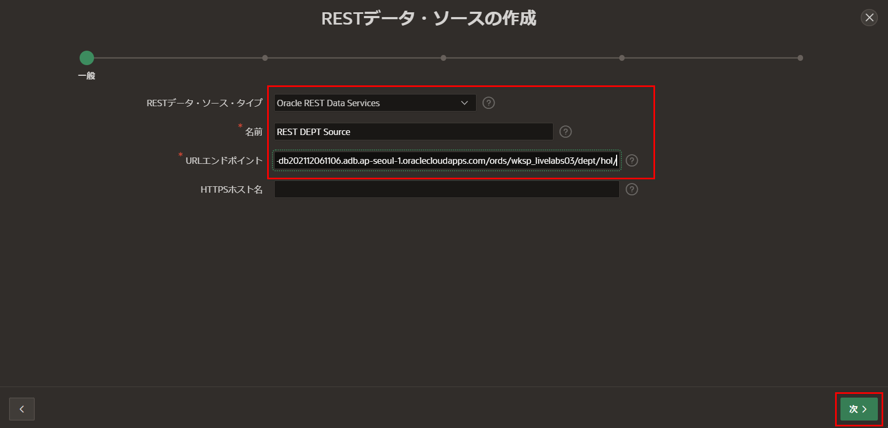
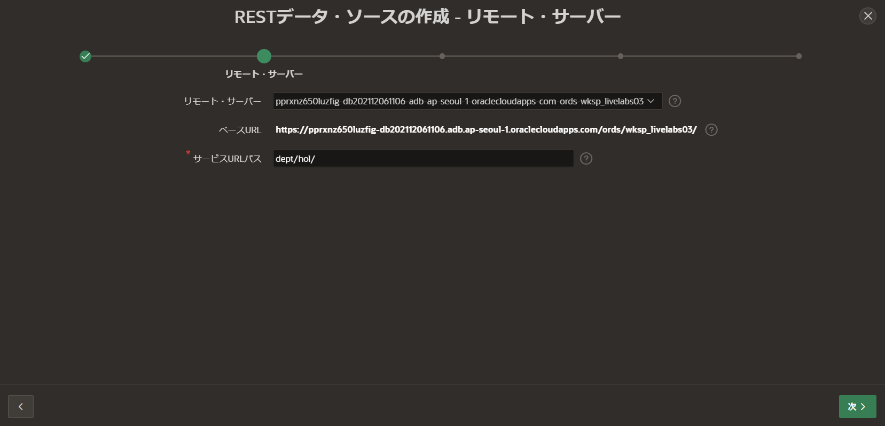
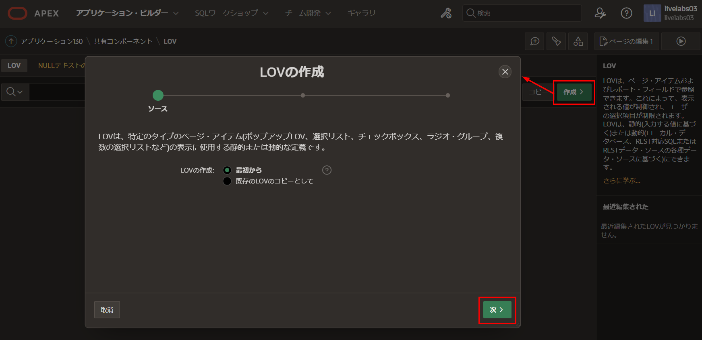
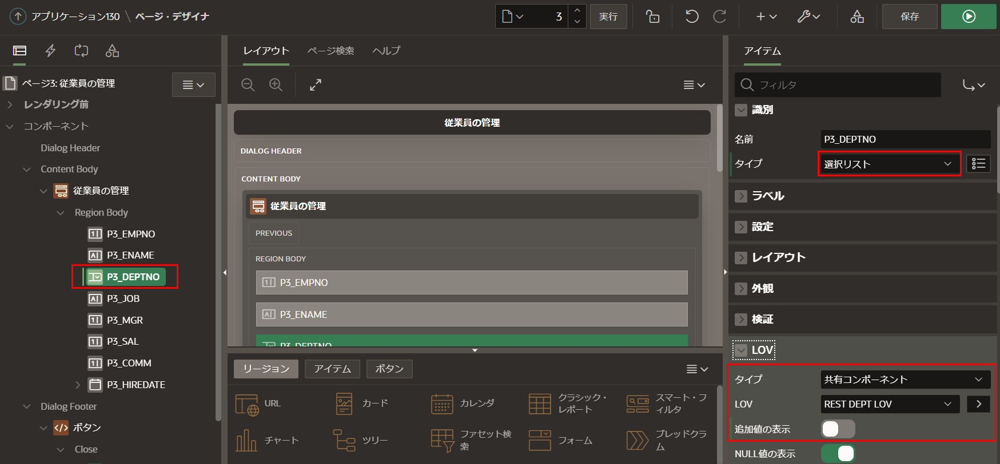
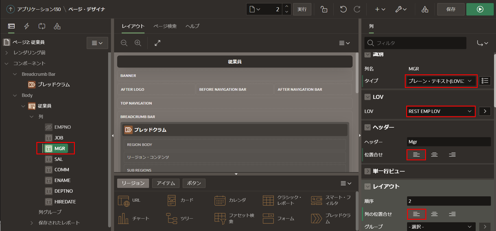

# LOVの定義  

## はじめに  
このラボでは、アプリケーション内でRESTデータ・ソースを利用して、LOVを定義する方法を学びます。  

推定時間: 10分  

### 情報  

最初のワークスペースでスクリプトを実行したときに、EMPとDEPTの両方のテーブルに対して、RESTハンドラーを作成しました。そして、すでにEMPテーブルのRESTデータ・ソースを作成しました。DEPTテーブルのRESTデータ・ソースも作成すると、共有コンポーネントにそれぞれのLOVを簡単に定義できます。ページ内で表示されるデータを改善し、データ・エントリーと品質を大幅に改善するために、それらのLOVを利用できます。  

## タスク1: DEPTのRESTデータ・ソースの追加  

1. アプリケーション・ビルダー・タブに戻ります。  
2. アプリケーション・ビルダーのホームページに移動します。  
3. アプリケーションを選択します。  
4. アプリケーションのホームページで、**共有コンポーネント**をクリックします。    

       

5. **共有コンポーネント**ページで、**データ・ソース**の下の**RESTデータ・ソース**をクリックします。  

     

6. **RESTデータ・ソース**ページで、**作成 >**をクリックします。  

    **RESTデータ・ソースの作成 - メソッド**ダイアログで、**次 >**をクリックします。(*デフォルト: 最初から*)  

      

7. **RESTデータ・ソースの作成 - 一般**ダイアログで、次の内容を入力します。  

    - **RESTデータ・ソース・タイプ:** **ORACLE REST Data Services**を選択します。  
    - **名前:** **REST DEPT Source**と入力します。  
    - **URLエンドポイント:** dept.restハンドラーのREST URIを入力します。https://{cloud\_url}/ords/{your_workspace}/**dept**/hol/のようなものです。  

    URLエンドポイントは、Lab 2のステップ3で入力したURLと同じですが、`emp`が`dept`に置き換えられています。  

    **次 >**をクリックします。  

      

8. **リモート・サーバー**ダイアログで、**ベースURL**と**サービスURLパス**を確認します。  
     **次 >**をクリックします。  

       

     *注意: 同じベースURLを持つRESTデータ・ソース(REST EMP Source)をすでに定義しているため、ベースURLを更新できません。*  

9. **認証**ダイアログで、**検出 >**をクリックします。  
     **認証が必要:** いいえ

10. **プレビュー**ダイアログで、**RESTデータ・ソースの作成**をクリックします。  

     

## タスク2: LOVの作成  
RESTデータ・ソースが作成しました。これから、LOVを作成しましょう。

1. **RESTデータ・ソース**ページから、パンくずリストで、**共有コンポーネント**をクリックします。  

       

2. **共有コンポーネント**ページで、**他のコンポーネント**の下の**LOV**をクリックします。  

       

3. **LOV**ページで、**作成 >**をクリックします。  

     **LOVの作成 - ソース**ダイアログで、**次 >**をクリックします。       
     (*デフォルト: 最初から*)  

       

4. **名前およびタイプ**ダイアログで、**名前**に**REST EMP LOV**と入力します。       
     **次 >**をクリックします。  

       

5. **LOVソース**ダイアログで、次の内容を入力します。  

     - **データ・ソース:** **RESTデータ・ソース**をクリックします。  
     - **RESTデータ・ソース:** **REST EMP Source**を選択します。  

     **次 >**をクリックします。  

     

6. **列マッピング**ダイアログで、次の内容を入力します。  

     - **戻り列:** **EMPNO**を選択します。  
     - **表示列:** **ENAME**を選択します。  

     **作成**をクリックします。  

       

7. 部署のLOVを作成するには、上記と同じです。  

     **LOV**ページで、**作成 >**をクリックします。       
     **LOVの作成 - ソース**ダイアログで、**次 >**をクリックします。       
     (*デフォルト: 最初から*) 

8. **名前およびタイプ**ダイアログで、**名前**に**REST DEPT LOV**と入力します。       
     **次 >**をクリックします。  

9. **LOVソース**ダイアログで、次の内容を入力します。  

     - **データ・ソース:** **RESTデータ・ソース**をクリックします。  
     - **RESTデータ・ソース:** **REST DEPT Source**を選択します。  

     **次 >**をクリックします。  

10. **列マッピング**ダイアログで、次の内容を入力します。  

     - **戻り列:** **DEPTNO**を選択します。  
     - **表示列:** **DNAME**を選択します。  

     **作成**をクリックします。

## タスク3: フォームの更新  
従業員の管理フォームページをよく確認すると、部署番号(DEPTNO)と管理者(MGR)のアイテムが数値のアイテムです。エンドユーザーは、関連付けられた数値を入力するのではなく、名前の選択リストから選択することを期待しています。

1. **LOV**ページから、アプリケーション・ビルダーのツールバーで、**ページ3**をクリックします。  

       

2. ページ・デザイナから、レンダリング・ツリー(左パネル)で**P3_DEPTNO**をクリックします。  

     プロパティ・エディター(右パネル)で、次の内容を入力します。  

     - **識別 > タイプ:** **選択リスト**を選択します。  
     - **LOV > タイプ:** **共有コンポーネント**を選択します。  
     - **LOV > LOV:** **REST DEPT LOV**を選択します。  
     - **LOV > 追加値の表示:** チェックを外します。  

       

3. ページ・デザイナから、レンダリング・ツリー(左パネル)で**P3_MGR**をクリックします。  

     プロパティ・エディター(右パネル)で、次の内容を入力します。  

     - **識別 > タイプ:** **選択リスト**を選択します。    
     - **LOV > タイプ:** **共有コンポーネント**を選択します。   
     - **LOV > LOV:** **REST EMP LOV**を選択します。  
     - **LOV > 追加値の表示:** チェックを外します。  

4. ページ・デザイナ・ツールバーで、**保存**をクリックします。  

     

## タスク4: レポートの更新  
また、従業員レポートに名前ではなく数値が表示されるので、これを修正しましょう。

1. ページ・デザイナ・ツールバーで、ページ・セレクターまたはページ番号の横の下矢印を使用して、**ページ2**に移動します。  

       

2. これはレポートであるため、アイテムではなく列になります。 

     レンダリング・ツリー(左パネル)で、列をクリックし、**MGR**をクリックします。  

     プロパティ・エディター(右パネル)で、次の内容を入力します。  

     - **タイプ:** **プレーン・テキスト(LOVに基づく)**を選択します。  
     - **LOV:** **REST EMP LOV**を選択します。  
     - **ヘッダー > 位置合せ:** **左寄せ**をクリックします。  
     - **レイアウト > 列の位置合せ:** **左寄せ**をクリックします。  

       

3. レンダリング・ツリー(左パネル)で、**DEPTNO**をクリックします。  

     プロパティ・エディター(右パネル)で、次の内容を入力します。  

     - **タイプ:** **プレーン・テキスト(LOVに基づく)**を選択します。  
     - **LOV:** **REST DEPT LOV**を選択します。  
     - **ヘッダー > 位置合せ:** **左寄せ**をクリックします。  
     - **レイアウト > 列の位置合せ:** **左寄せ**をクリックします。  

     **保存**をクリックします。   

       

4. アプリケーションのランタイム環境に移動します。  
5. ブラウザを更新します。  
     部署とマネジャーが数値ではなく名前になっていることを確認します。

       

6. 任意のレコードの編集アイコンをクリックします。       
     部署を選択します。        
     マネジャーを選択します。  
     部署とマネジャーが選択リストになっていることを確認します。

       

## **まとめ**  
これでLab 5とワークショップが完了しました。RESTエンドポイントに対してLOVを定義し、アプリケーション内でそれらを利用する方法を学びました。  

## さらに詳しく - 役立つリンク

- [APEX on Autonomous](https://apex.oracle.com/autonomous)  
- [APEXコラテラル](https://apex.oracle.com)  
- [チュートリアル](https://apex.oracle.com/en/learn/tutorials)  
- [コミュニティ](https://apex.oracle.com/community)  
- [外部サイト+ Slack](http://apex.world)

## **謝辞**

 - **作成者/投稿者** -  Salim Hlayel, Principal Product Manager
 - **投稿者** - Oracle LiveLabs Team (Arabella Yao, Product Manager Intern | Jaden McElvey, Technical Lead | Jeffrey Malcolm Jr, Intern)
 - **最終更新日** - Ankita Beri ,Product Manager, June 2023
