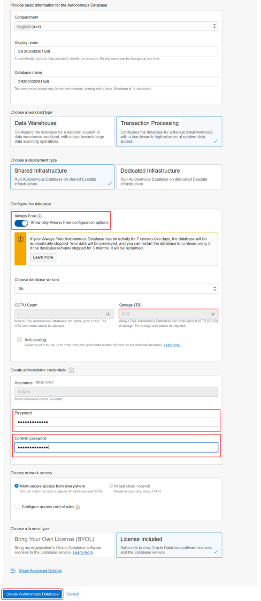
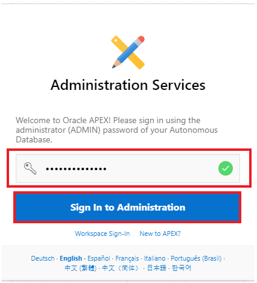
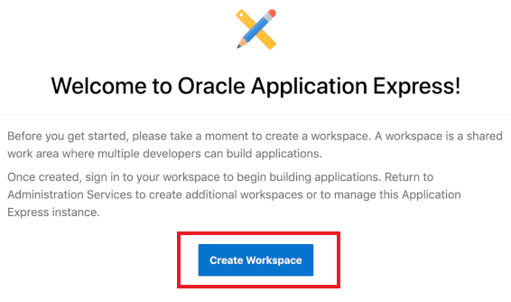
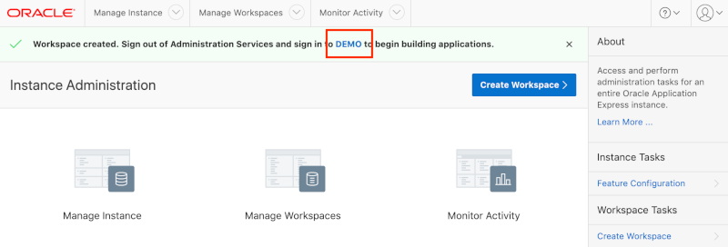

# Create an APEX Workspace

## Introduction

Oracle Application Express (APEX) is a feature of Oracle Database, including the Autonomous Data Warehouse (ADW) and Autonomous Transaction Processing (ATP) services. To start, you will need to create an ATP instance and then access APEX from within the new database.

An APEX Workspace is a logical domain where you define APEX applications. Each workspace is associated with one or more database schemas (database users) which are used to store the database objects, such as tables, views, packages, and more. These database objects are generally what APEX applications are built on top of.

Estimated Time: 10 minutes

### Objectives

- Create an Autonomous Transaction Processing instance
- Create a new workspace in APEX
- Log in to your new workspace

## Task 1: Create an Autonomous Transaction Processing instance

In this step, you will create an instance of the Autonomous Transaction Processing database service.

1.  From the Cloud Dashboard, select the navigation menu icon in the upper left-hand corner and then select **Autonomous Transaction Processing**.

    

2.  Click **Create Autonomous Database**.

    

3.  Select the **Always Free** option, enter **`SecretPassw0rd`** for the ADMIN password, then click **Create Autonomous Database**.

    

4. After clicking **Create Autonomous Database**, you will be redirected to the Autonomous Database Details page for the new instance.

    Continue when the status changes from:

    

    to:

    

## Task 2: Create a new workspace in APEX

Within your new database, APEX is not yet configured. Therefore, when you first access APEX you will need to log in as an APEX Instance Administrator to create a workspace.

1. Click the **Tools** tab.
    Click **Open APEX**.

    

3.  Enter the password for the Administration Services and click **Sign In to Administration**.     
    The password is the same as the one entered for the ADMIN user when creating the ATP instance: **`SecretPassw0rd`**

    

4.  Click **Create Workspace**.

   

5.  In the Create Workspace dialog, enter the following:

    | Property | Value |
    | --- | --- |
    | Database User | **DEMO** |
    | Password | **`SecretPassw0rd`** |
    | Workspace Name | **DEMO** |

    Click **Create Workspace**.

    

6.  In the APEX Instance Administration page, click the **DEMO** link in the success message.         
    *Note: This will log you out of APEX Administration so that you can log into your new workspace.*

    

7. On the APEX Workspace log in page, enter **`SecretPassw0rd`** for the password, check the **Remember workspace and username** checkbox, and then click **Sign In**.

    

## Summary

This completes this lab. At this point, you know how to create a new Autonomous Transaction Processing instance and create an APEX workspace within it. Click on **Lab 2: Create an APEX App from a Spreadsheet** to build an APEX application in your workspace.

## Acknowledgements
- **Author** - Salim Hlayel, Principle Product Manager
- **Contributors** - Jaden McElvey, Technical Lead - Oracle LiveLabs Intern
- **Last Updated By/Date** - Madhusudhan Rao, Apr 2022

