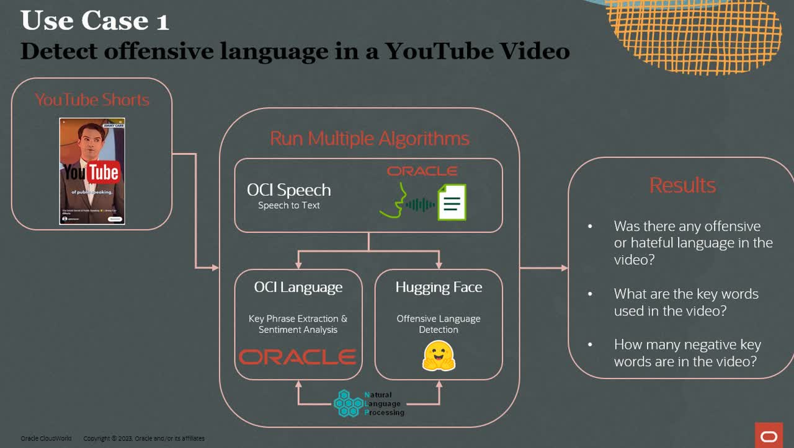
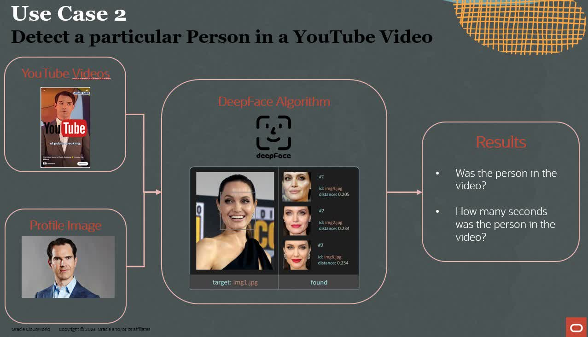

# Introduction

## About this Workshop

This workshop covers the integration of OCI Data Science & AI Services in combination with APEX running on the Autonomous Database. In this workshop, you will build an interesting use-case that allows you to analyze YouTube videos, transcribing them to text and understanding how offensive or hateful the videos are. Additionally, you can also detect a person's presence in the Video and understand how long they are visible for.

The workshop integrates different Oracle Cloud services to detect and manage offensive behaviour in YouTube videos.

Estimated Workshop Time: 1 hour 45 minutes

*The video below is an example of the final result when all steps have been performed*

### Objectives

In this workshop, you will follow multiple labs. For each lab, the individual steps are outlines below.

**Lab 1.**
* Log-in Oracle Cloud
* Create an Autonomous Database and download the Wallet
* Create API Key and download config and private key 
* Create a Log Group and Object Storage Bucket

**Lab 2.**
* Create OCI Data Science Notebook Session and pull Github Repo 
* Open first Jupyter Notebook and follow steps in the notebook
* Create and publish custom conda environment to Object Storage

**Lab 3.**
* Open second Jupyter Notebook and follow steps in the notebook
* Upload Config, private Key files, Autonomous Database Wallet and change parameters in Main.py 
* Add Log Group OCID, define Custom Conda Environmen, and run the second notebook (ie., create a Job and run a Job) 
* Get Job OCID, Project OCID, and Compartment OCID

**Lab 4.**
* Open APEX and create a Workspace, import pre-built application 
* Manage credentials (API Key) and configure the Data Sources (Project OCID, Job OCID, Compartment OCID)

**Lab 5.**
* Start analysis on Video, Audio, or Both 
* Optional: enhancing the APEX application

## Overview of Use Cases
The workshop aims to build two use cases. 

* **Use case 1:** Detect offensive language in the YouTube video. This use case focuses on the spoken text.
* **Use case 2:** Detect a particular person in the YouTube video. This use cases focuses on the persons in the video.

   
   

## Prerequisites
* An Oracle Cloud Account - Please view this workshop's LiveLabs landing page to see which environments are supported

## Services used in the Workshop

### APEX
* **Workspace:** is a virtual private database which enables multiple users to work within the same APEX installation while keeping their objects, data and applications private
* **ORDS:** is a Java application that enables developers with SQL and database skills to develop REST APIs for the Oracle Database, the Oracle Database 12c JSON Document store, and the Oracle NoSQL Database. Any application developer can use these APIs from any language environment, without installing and maintaining client drivers, in the same way they access other external services using the most widely used API technology: REST.

### OCI Data Science

* **Project:** Projects are collaborative workspaces for organizing and documenting Data Science assets, such as notebook sessions and models.
* **Notebook Session:** Data Science notebook sessions are interactive coding environments for building and training models. Notebook sessions come with many pre-installed open source and Oracle developed machine learning and data science packages.
* **Jobs:** Jobs give the data scientist the ability to execute batch jobs in either an ad hoc way or via a scheduler. Jobs can be used to perform batch inference, model training, feature engineering, and so on. ADS also provides a rich interface to interact with Jobs.
* **Conda environment:** Condas are collections of specific libraries and other resources that simplify library management. They are used to run notebook sessions, jobs, and deployed models.

### Other

* **OCI Speech:** is an AI service that applies automatic speech recognition technology to transform audio-based content into text. 
* **OCI Language:** allows you to perform sophisticated text analysis at scale. Using the pretrained and custom models, you can process unstructured text to extract insights without data science expertise.
* **Object Storage:** service is an internet-scale, high-performance storage platform that offers reliable and cost-efficient data durability. The Object Storage service can store an unlimited amount of unstructured data of any content type, including analytic data and rich content, like images and videos.
* **Oracle Autonomous Database:** is a fully automated service that makes it easy for all organizations to develop and deploy application workloads, regardless of complexity, scale, or criticality.

## Acknowledgements
* **Authors**:
    * [Bob Peulen](https://www.linkedin.com/in/bobpeulen/), Data Science and ML Specialist
    * [Piotr Kurzynoga](https://www.linkedin.com/in/piotr-kurzynoga/), Data Development Specialist
* **Last Updated By/Date** - Piotr Kurzynoga, November 2023
