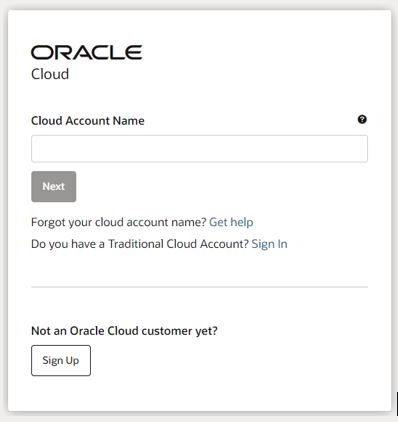
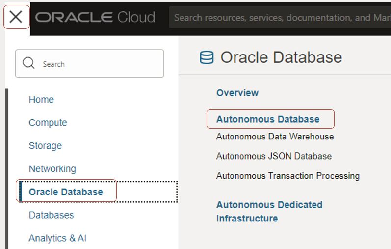
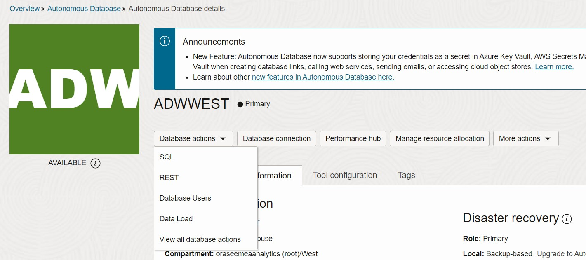
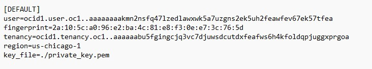
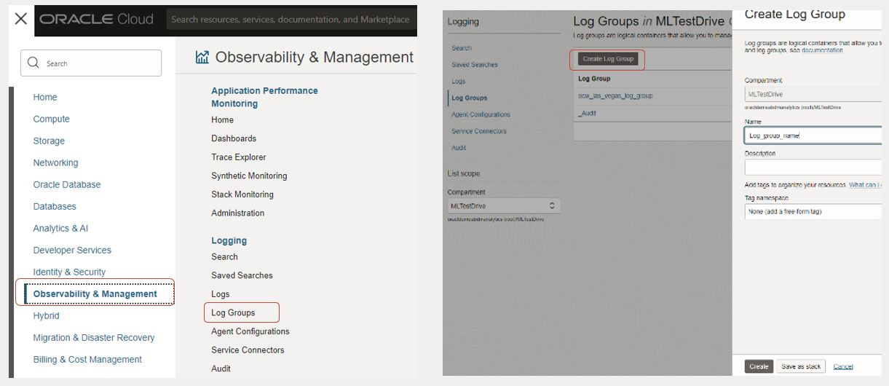
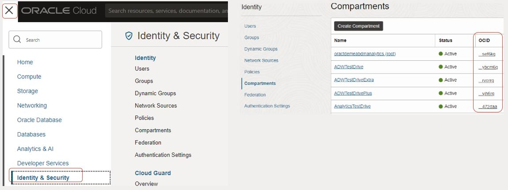

# Provision and Setup the Environment

## Introduction

In this lab, you will perform several steps. The steps may seem random, but all the individual steps are prerequisites to perform the full workshop. For example, we ask you to create an API Key, which is needed eventually to create and trigger your Job. In full, you will create an Autonomous Database, generate an API Key, set up a Log Group, and lastly create an Object Storage Bucket.

*Estimated Time:* 20 minutes

### Objectives

In this lab, you will:
* Log in Oracle Cloud and Provision an Autonomous Database
* Generate an API Key
* Create a Log Group
* Create an Object Storage Bucket
* Get the Compartment OCID

### Prerequisites

* An account that has permission to create an Autonomous Database
* An account that has permission to create Log Groups
* An account that has permission to create an Object Storage Bucket


## Task 1: Provision an Autonomous Database

1.	Go to **Oracle.cloud.com** and Log in using your tenancy and credentials
2.	In all the following steps, make sure you are working in the correct compartment you have rights to work in
    

First, we’ll create an Autonomous Database. This database will be used to store all results and will run APEX on top of it. 
3. Go to the hamburger menu, click on **Oracle Database**
4. Click on **Autonomous Database**
5. Click **Create Autonomous Database**. Make sure to be in the correct compartment when you do so
6. Leave the Display name and Database name as is
   

7. Select **Transaction Processing** under **Workload Type**
8. Select 1 OCPU and 1 TB. Feel free to increase the size of the database if needed
9. Enter your password twice. Note down the password locally, you will need this password
10. Choose **Secure access from everywhere** in the **Access Type** option
11. Click on **Create Autonomous Database**. This will take several minutes
    

12. When the Autonomous Database becomes **'Active'**, click on the display name to open the overview page
13. In the overview page, click on **'Database Connection'** and download the Database Wallet by clicking **'Download Wallet'**, save it for later you will need it in **Lab 3**
    
14. In the overview page, click on **'Database Actions'** and following on **'SQL**'. Note. When clicking on 'Database Actions', please wait to fully load the list of actions
    

15. A new landing page should open, proceed to the **SQL worksheet.** Note. By following these steps, you should be logged in as Admin automatically. If prompted to log in, log in in with your Admin credentials
    

16. In the SQL Worksheet, please copy the below **PL/SQL statement** and click on **Run Script**. This script will create a new user (i.e., schema) in the database including all needed permissions, you can always create the Database User and APEX Workspace/User through the wizard. 

    ```
    DECLARE
        l_workspace_id number;
        l_user varchar2(50) := 'apex_user_1';
        l_password varchar2(100) := 'Welcome*12345';

    BEGIN
        --Create the user and grant him the necessary privileges.
        execute immediate 'CREATE USER ' ||l_user|| ' IDENTIFIED BY ' || '"'|| l_password || '"';
        execute immediate 'GRANT CREATE SESSION, CREATE TABLE TO ' ||l_user;
        execute immediate 'GRANT UNLIMITED TABLESPACE TO ' ||l_user;
        --Create an APEX Workspace for the user.
        APEX_INSTANCE_ADMIN.ADD_WORKSPACE (
            p_workspace          => l_user,
            p_primary_schema     => l_user
            );
        --Fetch the workspace ID and set the appropriate security group.
        l_workspace_id := apex_util.find_security_group_id (p_workspace => l_user);
        apex_util.set_security_group_id (p_security_group_id => l_workspace_id);   
        --Create the APEX user.  
        APEX_UTIL.CREATE_USER(
            p_user_name                     => l_user,
            p_web_password                  => l_password,
            p_developer_privs               => 'ADMIN:CREATE:DATA_LOADER:EDIT:HELP:MONITOR:SQL',
            p_default_schema                => l_user,
            p_change_password_on_first_use  => 'N'
            );
        COMMIT;

    END;


    ```


## Task 2: Generate an API Key

Second, you will create an API Key. This API Key is needed to authenticate yourselves to invoke or use other services. Both APEX and OCI Data Science will need your API Key.

1. In the top-right corner, click the person Icon.
2. Click on **User Settings**
3. In the left, click on **API Keys** and following on **Add API Key**
4. First, click on **Download Private Key**. This will download the private key
5. Click on **Add**
6. Copy the **Configuration File Preview** starting with [DEFAULT] into a empty .txt file. Save the file as [**config**](https://docs.oracle.com/en-us/iaas/Content/API/Concepts/sdkconfig.htm) , without .txt as extension.
7. Important. Change the last line to key _ file = ./private _ key.pem. See an example config file with the made changes below
8. Important. In OCI Data Science, you have to rename the private key file to **private_key.pem**
9. Click on **Close** to close the window. You can review the API Key by click on the three dots on the right of it and select **View Configuration File**
    
    

## Task 3: Create a Log Group

Third, you will create Log Group. Eventually, each Job that you will run, will create a Log. That Log contains all output (and errors if any) stored in the Log Group.

1. Click on the hamburger menu, click on **Observability & Management**
2. Click on **Log Groups**
3. Click on **Create Log Group**
4. Add a Name to your Log Group and click **Create**
5. Step inside the Log Group and search for **OCID**. Copy the entire OCID. You will need this later
The OCID starts with **ocid1.loggroup.oc1.**
    

## Task 4: Create an Object Storage Bucket

Next, you will create an Object Storage bucket. This bucket will be used to store several things:
* The image (.jpg file) you will upload in APEX
* The output of OCI Speech (speech to text)
* Your published Conda environment

1.	Click on the hamburger menu, click on **Storage**
2.	Click on **Buckets**
3.	Make sure to be in the correct compartment.
4.	Click on **Create Bucket**
5.	Change the bucket name to **ocw_root** and click **Create**
    

## Task 5: Get the Compartment OCID

Lastly, you will retrieve the Compartment OCID of the compartment you are working in. 

1.	To get the Compartment ID, click on the hamburger menu, following on **Identity & Security**
2.	Click on **Compartments**
3.	Search for your compartment you are working in
4.	Hover over the OCID in the 3rd column belonging to your compartment, and click **Copy** 
5.	Paste the OCID locally 
    

You may now **proceed to the next lab.**

## Acknowledgements
* [Bob Peulen](https://www.linkedin.com/in/bobpeulen/), Data Science and ML Specialist
* [Piotr Kurzynoga](https://www.linkedin.com/in/piotr-kurzynoga/), Data Development Specialist
* **Last Updated By/Date** - Piotr Kurzynoga, May 2024
