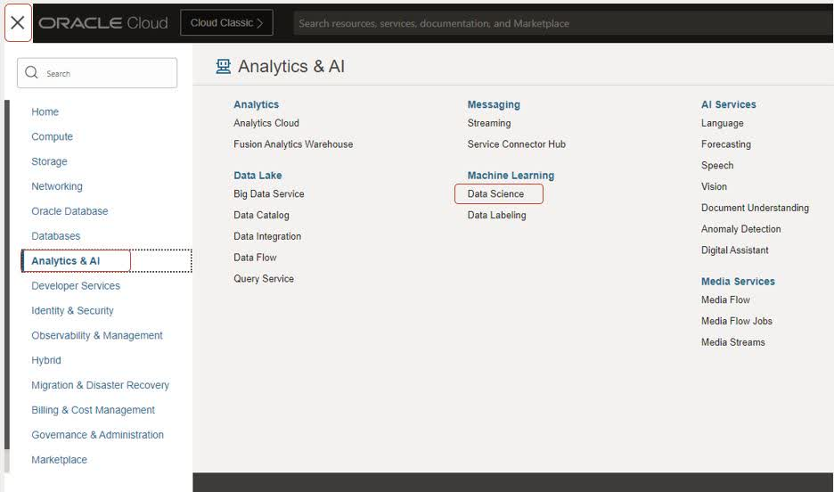
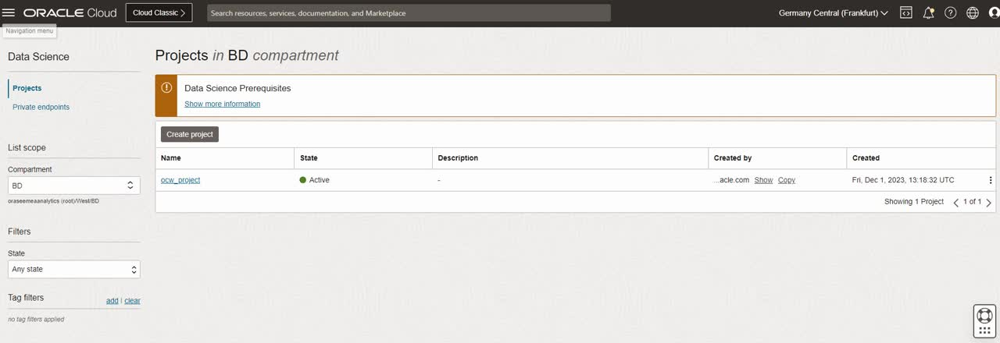
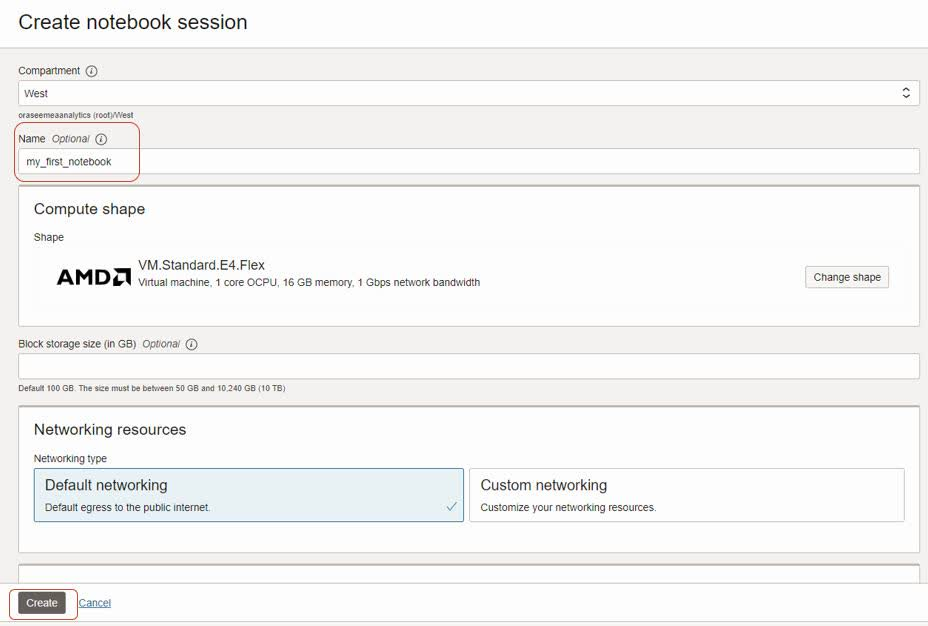
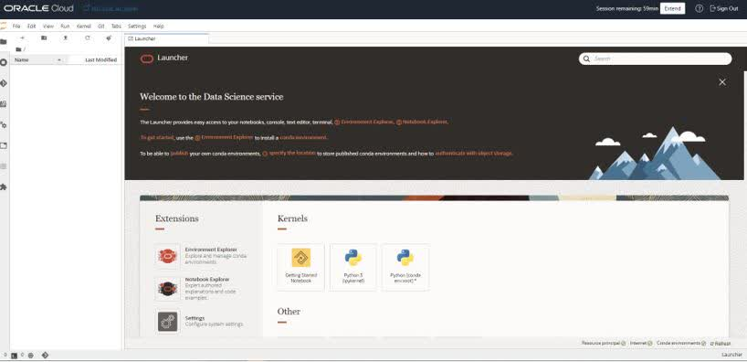
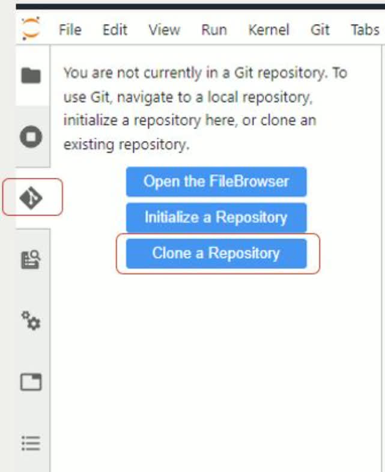
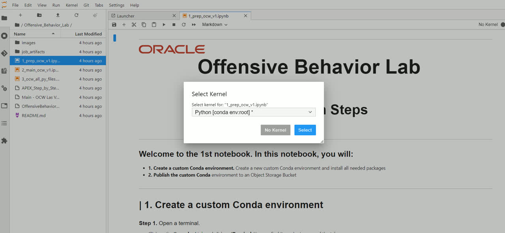

# Create an OCI Data Science Notebook

## Introduction

In this lab, you will first provision an OCI Data Science notebook session. Afterwards, you will clone a repository from Github. This will make sure all the files you  need in the remaining steps are within your reach. The repository consists of multiple files: 3 notebooks and several .py files. After cloning the repository, you are asked to open the first notebook and run the notebook cell by cell carefully. In the notebook, your main task is to create and publish a Conda environment to Object Storage.

*Estimated Time:* 25 minutes

### Objectives

In this lab, you will:
* Provision an OCI Data Science notebook
* Clone a respository from Github
* Run a Jupyter Notebook
* Create and publish a Conda environment to Object Storage

### Prerequisites

* A tenancy that is configured to work with the Data Science service, including Jobs. Make sure to have all [policies and dynamic groups](https://docs.oracle.com/en-us/iaas/data-science/using/policies.htm) in place.
* An account that has permission to create a Data Science project.
* An account that has permission to create a Data Science notebook session.

## Task 1: Create a Notebook session

1. In Oracle Cloud, click on the hamburger menu, and following on Analytics & AI
2. Click on **Data Science**
3. Select the correct compartment on the left
4. Select **Create Project**. You can name the Project to your own liking
5. Click on **Create**. This will create a project.
6. Step inside the project
  
  

7.	Click **Create Notebook**
8.	You can use all default settings, only change the name to **myfirstnotebook**
9.	Optional: change the shape of the notebook session by clicking on **Change Shape**
10.	Use **Default Networking**
11.	Leave Block storage size empty
12.	Click on **Create**
13.	This may take a few minutes, when the notebook is **Active**, click on the name of the notebook to access the main page
  

14.	Click on **Open** to open the notebook
15.	When you are prompted to log in, log in with your Oracle Cloud credentials
16.	The page as shown in the screenshot below should appear
  

## Task 2: Clone Repository and run notebook

1. Click on the **Git** tab on the left
2. Click on **Clone a Repository**
3. Add https://github.com/phantompete/Offensive_Behavior_Lab.git
4. Click **Clone**. A new, Offensive\_Behavior\_Lab repository should appear in the directory on the left
5. Step inside the **Offensive\_Behavior\_Lab**
6. Open the first notebook: **1\_prep\_ocw\_v1.ipnyb**
7. When prompted for **Select Kernel**, just click on **Select**
8. Follow the steps in the notebook closely. These steps are:

* **Create a custom Conda environment.** In a custom conda environment, we can install any PyPI package we need in order to run the Job. You will install several packages, like DeepFace and PyTube
* **Publish the custom Conda environment.** In order to use the custom Conda, you will publish it to Object Storage. That way, when triggering the Job, the Job can 'pull' the custom Conda environment from Object Storage
  
  

You may now **proceed to the next lab.**

## Acknowledgements
* [Bob Peulen](https://www.linkedin.com/in/bobpeulen/), Data Science and ML Specialist
* [Piotr Kurzynoga](https://www.linkedin.com/in/piotr-kurzynoga/), Data Development Specialist
* **Last Updated By/Date** - Bob Peulen, November 2023
