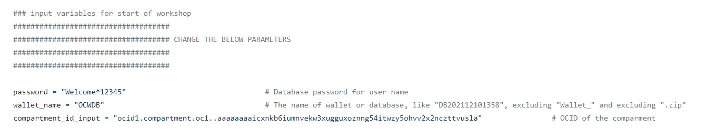
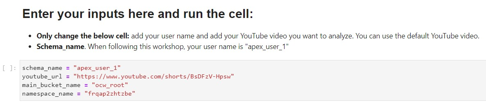

# Create and Trigger a Job

## Introduction

In this lab, you will run the second notebook. The second notebook will mainly create and trigger a Job. Oracle Cloud Infrastructure (OCI) Data Science [Jobs](https://docs.oracle.com/en-us/iaas/data-science/using/jobs-about.htm) enables you to define and run repeatable machine learning tasks on a fully managed infrastructure. The Job consists of multiple files, called 'artifacts'. These are multiple .py files, an autonomous database wallet, and your API key (config). 

The Job largely  has been constructed. The steps in the Job are:
- The Job downloads the YouTube video based on the YouTube URL you provide as input
- The Job calls OCI Speech API to transcribe the YouTube video from Speech to Text
- The Job calls OCI Language API to extract key phrases and sentiment from the transcribed text
- The Job loads and applies 3 open source machine learning models. These are DeepFace for face recognition and two types of roBERTa-base models to detect offensive- and hateful language
- Lastly, the Job pushes all results to the Autonomous database

**Please follow the steps inside the second notebook closely.**

*Estimated Time:* 20 minutes

### Objectives

In this lab, you will:
* Use a Notebook session to Create and Run an OCI Data Science Job
* Use the console to extract two OCIDs. The Project OCID and Job OCID

### Prerequisites

* An OCI Data Science notebook session.
* A working knowledge of Python.

## Task 1: Run Second Notebook

1.	After finishing the first notebook, open the second notebook named **2_ main_ocw _v1.ipynb**
2.	When prompted for a kernel, select the **custom conda** you just created and published in the first notebook
3.	Follow the steps in the notebook closely. The steps include the following:
* 1. You add your previously created config file and private _key.pem to the **'job _artifacts'** folder
* 2. You download the **Autonomous Database wallet** and upload the wallet to the **'job _artifacts/wallet** folder
* 3. You add the the **Log Group OCID** to the notebook
* 4. You will change 'password', 'wallet_ name', and 'compartment_ id _input' in the main.py file. In Lab 1, you extracted the Compartment OCID.
  

The below are two example screenshots of the changed parameters and inputs to run your first Job.
    
     

## Task 2: Retrieve OCIDS

After finishing the notebooks and successfully running your first Job, you need three OCID to run the same Job from APEX, these are:
* Project OCID
* Job OCID

1. To get the Project OCID, go back to Oracle Cloud. 
2. Go to **Data Science**. See steps 1-6 in Lab 2.
3. In your Project, you will see **OCID**, click on **Copy** just next to OCID to copy the entire OCID. Make sure to paste it locally.
  

4. Next, click on **Jobs** in the left menu
5. Click on **ocw_ my_ first_job** or when you renamed the Job during creation, click on the name
6. In the Job, you will see **OCID**. Click on **Copy** next to the OCID and paste the full OCID locally
  
  

You may now **proceed to the next lab.**

## Acknowledgements
* [Bob Peulen](https://www.linkedin.com/in/bobpeulen/), Data Science and ML Specialist
* [Piotr Kurzynoga](https://www.linkedin.com/in/piotr-kurzynoga/), Data Development Specialist
* **Last Updated By/Date** - Bob Peulen, November 2023
