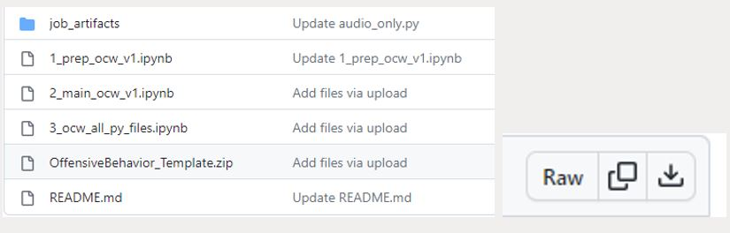
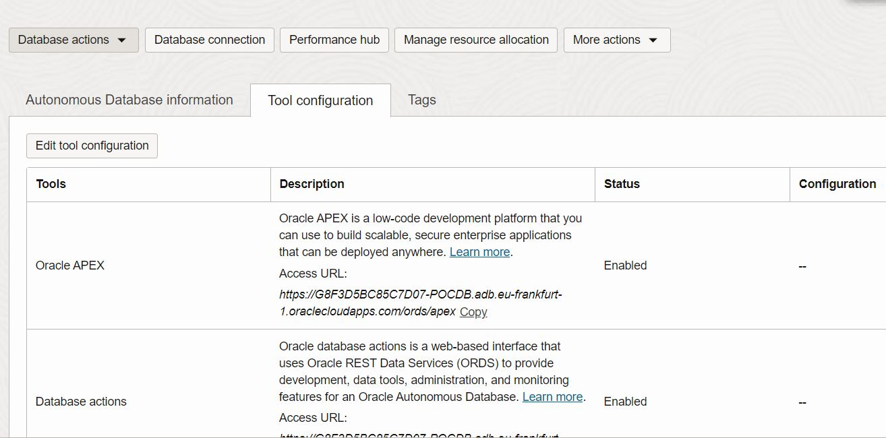
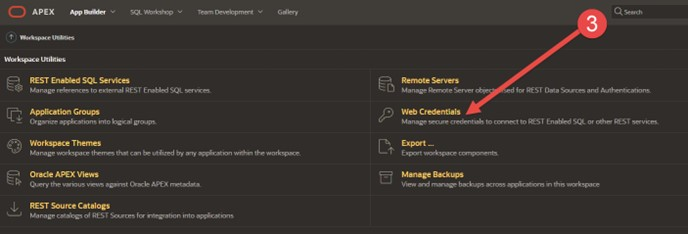

# Build and Launch APEX

## Introduction

In this lab, you will build and launch an [APEX](https://apex.oracle.com/en/) instance on top off the previously deployed Autonomous Database. After launching the APEX instance, you will first import a pre-built APEX image and second change several important parameters. Most importantly, you will add your API Key to the APEX instance and you will change the OCIDS (Project, Compartment, and Job OCID) as parameters.

*Estimated Time:* 20 minutes

### Objectives

In this lab, you will:
* Build and launch an APEX instance
* Import a pre-built application in APEX
* Add your API Key to the APEX configuration
* Change the OCID parameters in the APEX configuration

### Prerequisites

* A deployed and running Autonomous Database
* A working knowledge of APEX

## Task 1: Launch APEX and import application

Before you start in APEX, let’s download the pre-built application first.
1. Go to the GitHub repository https://github.com/phantompete/Offensive_Behavior_Lab
2. Download the application by clicking on **OffensiveBehavior_Template.zip**
3. Following, click on the **Download raw file** button
4. **(Optional)** You can also build the application from scratch by following the **APEX Step by Step Guide** available in the repository
  

4. Go back to Oracle Cloud and go to your Autonomous Database you provisioned in the first lab
5. Click on the name of the Autonomous Database to open the overview page
6. In the overview page, click on **Tool configuration** and copy the Access URL under the Oracle APEX row
7. Open the **Access URL** in a new tab in, for example, Chrome
8. Log in using the **user name and password** you created in Lab 1
  

Next, you will import the pre-built APEX application (the .zip file) into APEX.

11.	In APEX, go to **App Builder**
12.	Go to **Import**
13.	Drag & Drop the just downloaded .zip file into the dropzone
    
   	
15.	Press **Next** until the application is imported and installed
    

## Task 2: Add your API Key to APEX

In this task, you will add/update your own API Key, credentials to APEX. This will ensure APEX can invoke other services, like OCI Data Science – Jobs.

1. Go back to **App Builder**
2. Go to **Workspace Utilities**
3. Go to **Web Credentials**
  
  
4. Select **OCI_API** from the list
  

5. Enter the credentials from the created API key as required, these are:
  * User OCID
  * Full Private Key
  * Tenancy OCID
  * Public Key Fingerprint

6.	When done, press **Apply Changes**

Note: Whenever you make a change the OCI Private Key needs to be re-added.

## Task 3: Change your Data Sources

In this task, you will configure the data sources. These are used e.g., when you upload a .jpg file to a bucket.

1.	Step into your Application
2.	Open Page 1 (Home) 
3.	Navigate to the Processing Tab
4.	Expand **JobProcess**
5.	Expand **CreateJobRun**
6.	Expand **Parameters**
7.	Configure the Parameters as required. These are:
  * BUCKET_NAME - This your Object Storage Bucket Name
  * BUCKET_NAMESPACE - This is the namespace of Object Storage
  * Comparmenttid - This is the Compartment OCID
  * Jobid - This is the Data Science Job OCID
  * Projectid - This is the Data Science Project OCID

8. Search for the **Static Value** box. You will see (e.g., for Bucket name) **Enter your bucket name here**

  Note. Compartment OCID, Job OCID, and Project OCID can be found using Lab 3.

See below for an example of BUCKET_NAME and replacing the static value with the Bucket Name.
  
  

9.	Save and run the application when done.

You may now **proceed to the next lab.**

## Acknowledgements
* [Piotr Kurzynoga](https://www.linkedin.com/in/piotr-kurzynoga/), Data Development Specialist
* [Bob Peulen](https://www.linkedin.com/in/bobpeulen/), Data Science and ML Specialist
* **Last Updated By/Date** - Piotr Kurzynoga, November 2023
