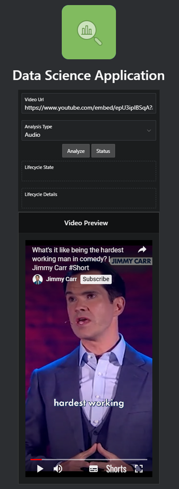

# Start Analysing in APEX!

## Introduction

In this lab, you will open and run your application. You can choose between "Video", "Audio", or "Both". When you run the analysis, the Job will run in the background for a few minutes, depending on the lenght of YouTube video. The results will apear automaticallly in screen. 

*Estimated Time:* 10 minutes

### Objectives

In this lab, you will:
* Open the application 
* Run audio, video, or both analysis on the YouTube video
* Review the results of the analysis

## Task 1: Audio Analysis

1.	Step into your Application and click **Run Application**
2.	Enter a YouTube URL. Please note:
* Use a YouTube video with English speakers.
* Do not use any YouTube video with restrictions (e.g,, Age restricted video). This will fail.
* Press Enter after pasting the Video URL.

3.	Select **Audio** in the **Analysis Type**
4.	Click **Analyze**, and wait for 2 seconds
5.	Click on **Status**

  

## Task 2: Video Analysis

1. Enter a YouTube URL. Make sure to refresh the page before you start.
2. Select **Video** in the **Analysis Type**.
3. Upload a .jpg image. This image is, for example, a **selfie** of the person you are trying to detect in the video. The algorithm will use that image to find the person in the video.
4. Click on **Analyze** and then on **status** to see the progress of the data science job.

## Acknowledgements
* [Piotr Kurzynoga](https://www.linkedin.com/in/piotr-kurzynoga/), Data Development Specialist
* [Bob Peulen](https://www.linkedin.com/in/bobpeulen/), Data Science and ML Specialist
* **Last Updated By/Date** - Piotr Kurzynoga, November 2023
