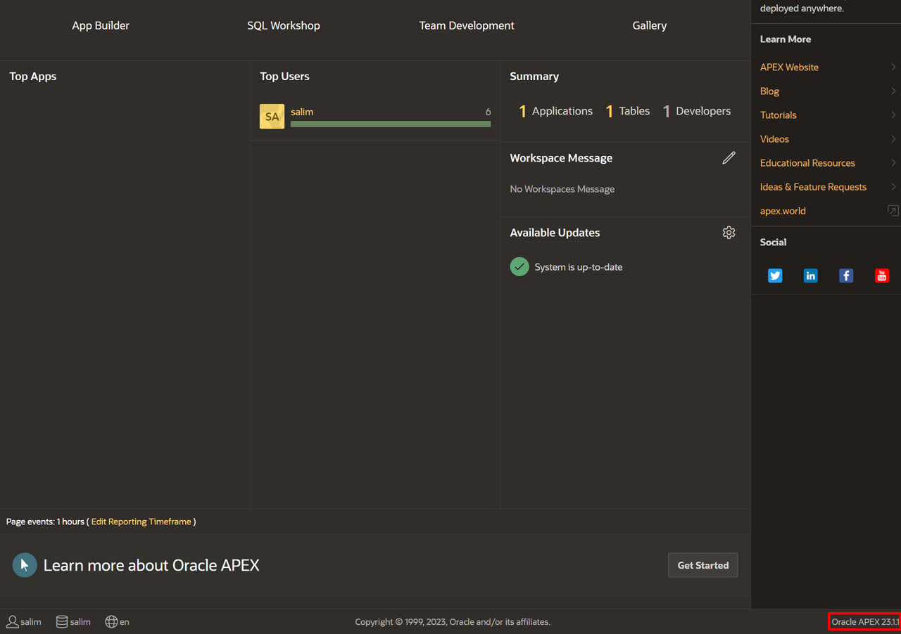
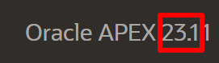
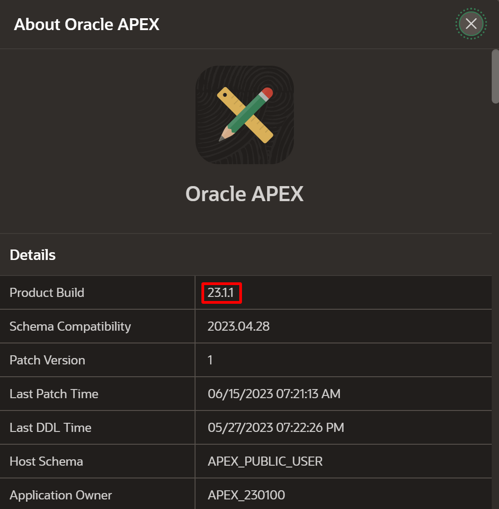
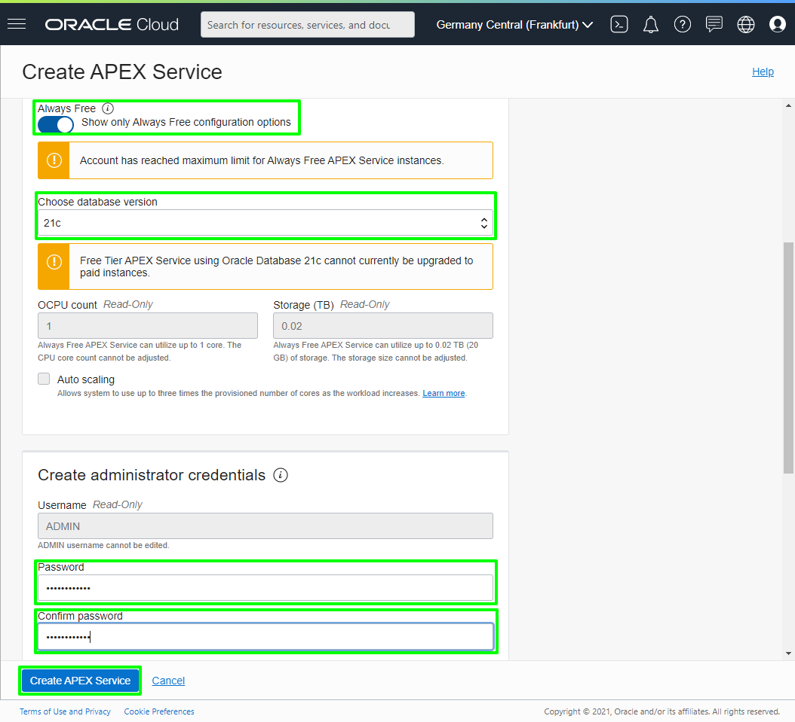
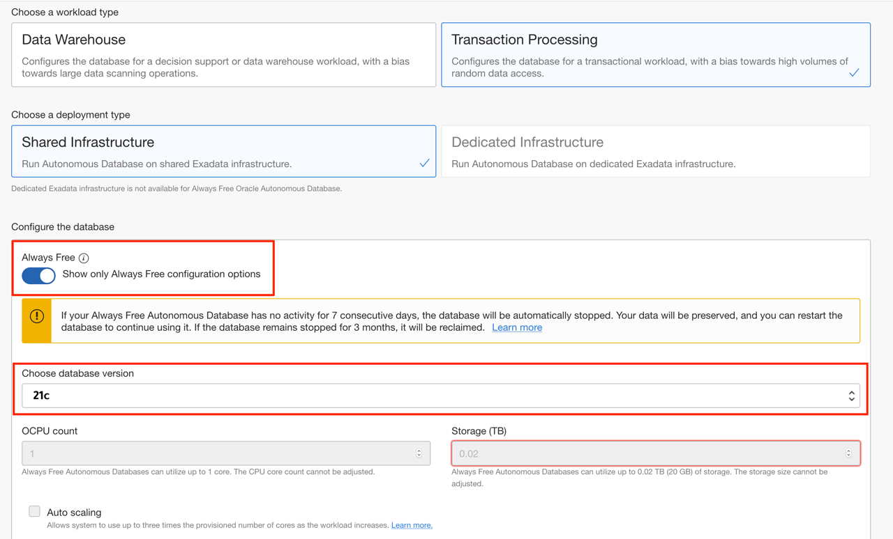
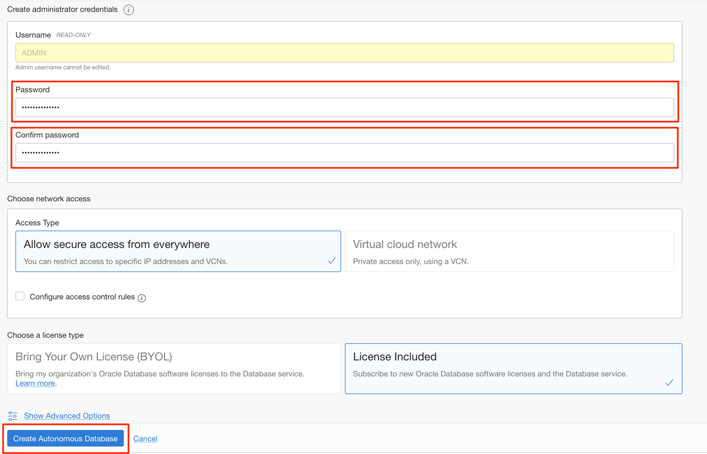
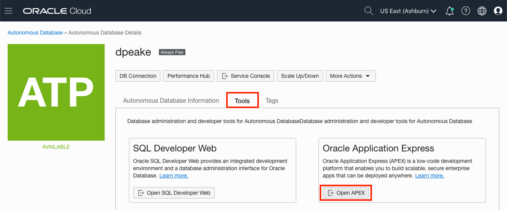

# Sign up for an APEX Workspace

## Introduction

Oracle Application Express (APEX) is a low-code application platform for Oracle Database. APEX Application Development, Autonomous Data Warehouse (ADW) and Autonomous Transaction Processing (ATP) are fully managed services, pre-integrated and pre-configured with APEX, for rapidly building and deploying modern data-driven applications in Oracle Cloud. Business users, citizen and application developers can create enterprise apps 20X faster with 100X less code—without having to learn complex web technologies with just a browser. To start, you will need to decide on the service you are going to use for this workshop, and then create an APEX workspace accordingly.

If you already have an APEX 20.2 Workspace provisioned, you can skip this lab.

Estimated Time: 5 minutes

### What is an APEX Workspace?
An APEX Workspace is a logical domain where you define APEX applications. Each workspace is associated with one or more database schemas (database users) which are used to store the database objects, such as tables, views, packages, and more. APEX applications are built on top of these database objects.

### How Do I Find My APEX Release Version?
To determine which release of Oracle Application Express you are currently running, do one of the following:
* View the release number on the Workspace home page:
    - Sign in to Oracle Application Express. The Workspace home page appears. The current release version displays in bottom right corner.

    
    

* View the About Application Express page:
    - Sign in to Oracle Application Express. The Workspace home page appears.
    - Click the Help menu at the top of the page and select About. The About Application Express page appears.

  

### Where to Run the Lab
You can run this lab in Oracle Database 21c with APEX 20.2 installed. This includes the new APEX Application Development Service and the "Always Free" Oracle Autonomous Database.

Below are steps on how to sign up for either an *APEX Application Development* Service, an *Oracle Autonomous Database* cloud service or *apex.oracle.com* service.
- The Always Free APEX Application Development Service is ideal for Oracle APEX Development. You can upgrade it with a flexible paid option that allows to concentrate your efforts on APEX development without worrying about the database management. It provides 1 OCPU and 20 GB and can be extended as needed once upgraded to a paid service.
- The Always Free Oracle Autonomous Database option is ideal for learning about the Oracle Database and APEX, and provides 1 OCPU and 20 GB of compressed storage. This service can also be utilized for production applications, and can readily be upgraded to a paid service as necessary.

***Note that this lab depends on In-Database JavaScript feature of the Oracle Database 21c which is currently available in four regions only. Please make sure to create a cloud account having one of the followings as the home region:***

- *Germany Central (Frankfurt)*
- *US East (Ashburn)*
- *US West (Phoenix)*
- *UK South (London)*

Click one of the options below to proceed.

## **Option 1**: Oracle APEX Application Development Service

In this part, you will create an Oracle APEX Application Development Service trial account. Once you have signed up for the service, you will create an *APEX Service*. The final step in the process is to provision Oracle APEX.

1.  Please [click this link to create your free account](https://signup.cloud.oracle.com). When you complete the registration process, you'll receive an account with a $300 credit that you can utilize to create an APEX Service. You can then use any remaining credit to continue to explore the Oracle Cloud.

2.  Once the Signup process is complete, you will be logged in automatically to the Oracle Cloud Infrastructure (OCI) Console.
    -  In case you have closed the browser, you can always refer to the **Get Started Now with Oracle Cloud** email that you should have received to login to OCI Console.   
    Make a note of your **Username**, **Password**, and **Cloud Account Name**.

        

    - Alternatively, you can login to your Oracle Cloud account by accessing the following URL from your browser:       
    [https://cloud.oracle.com](https://cloud.oracle.com)

        Enter your **Cloud Account Name** in the input field and click the **Next** button.

        

        Enter your **User Name** and **Password** in the input fields, and click **Sign In**.

        

3. From within your Oracle Cloud environment, you will create an instance of the Oracle APEX Application Development Service.

    Click the **Navigation Menu** in the upper left, navigate to **Developer Services**, and select **APEX Instances**.

	

4. Select a Compartment and Click **Create APEX Service**.

    

5. Enable the **Always Free** option.
   Select **21c** for the database version.
   Enter **```SecretPassw0rd```** for the ADMIN password then click **Create APEX Service**.

    

6. After clicking **Create APEX Service**, you will be redirected to the APEX Application Development Details page for the new instance.

    Continue when the status changes from:

    

    to:

    

7.  Within your new APEX Application Development Service, APEX Workspace is not yet configured. Therefore, when you first access APEX, you will need to log in as an APEX Instance Administrator to create a workspace.

    Click **Launch APEX**.

    

8.  Enter the password for the Administration Services and click **Sign In to Administration**.     
    The password is the same as the one entered for the ADMIN user when creating the APEX instance: **```SecretPassw0rd```**

    

9.  Click **Create Workspace**.

    

10. In the Create Workspace dialog, enter the following:

    | Property | Value |
    | --- | --- |
    | Database User | DEMO |
    | Password | **`SecretPassw0rd`** |
    | Workspace Name | DEMO |

    Click **Create Workspace**.

    

11. In the APEX Instance Administration page, click the **DEMO** link in the success message.         
    *Note: This will log you out of APEX Administration so that you can log into your new workspace.*

    

12. On the APEX Workspace log in page, enter **``SecretPassw0rd``** for the password, check the **Remember workspace and username** checkbox, and then click **Sign In**.

    


## **Option 2**: Oracle Autonomous Database

In this part, you will create an Oracle Cloud trial account. Once you have signed up for the service, you will create an *Autonomous Transaction Processing* database. The final step in the process is to provision Oracle APEX.

1.  Please [click this link to create your free account](https://signup.cloud.oracle.com). When you complete the registration process, you'll receive an account with a $300 credit and several "forever free" services that will enable you to complete the workshop for free. You can then use any remaining credit to continue to explore the Oracle Cloud. The forever free services will continue to work after the trial expires.

2.  Soon after requesting your trial, you will receive a  **Get Started Now with Oracle Cloud** email.   
    Make note of your **Username**, **Password**, and **Cloud Account Name**.

    

3. Now that you have a service, you will log into your Oracle Cloud account, so that you can start working with various services.        
    From any browser go to [https://cloud.oracle.com/en_US/sign-in](https://cloud.oracle.com/en_US/sign-in).

    Enter your **Cloud Account Name** in the input field and click the **Next** button.

    

4. Enter your **User Name** and **Password** in the input fields, and click **Sign In**.

    

5. From within your Oracle Cloud environment, you will create an instance of the Autonomous Transaction Processing database service.

    From the Cloud Dashboard, select the navigation menu icon in the upper left-hand corner and then select **Autonomous Transaction Processing**.

    

6. Click **Create Autonomous Database**.

    

7. Select the **Always Free** option, enter **```SecretPassw0rd```** for the ADMIN password, then click **Create Autonomous Database**.

    
    
    

8. After clicking **Create Autonomous Database**, you will be redirected to the Autonomous Database Details page for the new instance.

    Continue when the status changes from:

    

    to:

    

9. Within your new database, APEX is not yet configured. Therefore, when you first access APEX, you will need to log in as an APEX Instance Administrator to create a workspace.

    Click the **Tools** tab.
    Click **Open APEX**.

    

    *Note: Always Free Autonomous Database will be stopped after being inactive for 7 days. If that happens, you need to click **More Actions** and then **Start** to start your Autonomous Database, and then **Open APEX**.*

10. Enter the password for the Administration Services and click **Sign In to Administration**.     
    The password is the same as the one entered for the ADMIN user when creating the ATP instance: **```SecretPassw0rd```**

    

11. Click **Create Workspace**.

    

12. In the Create Workspace dialog, enter the following:

    | Property | Value |
    | --- | --- |
    | Database User | DEMO |
    | Password | **`SecretPassw0rd`** |
    | Workspace Name | DEMO |

    Click **Create Workspace**.

    

13. In the APEX Instance Administration page, click the **DEMO** link in the success message.         
    *Note: This will log you out of APEX Administration so that you can log into your new workspace.*

    

14. On the APEX Workspace log in page, enter **``SecretPassw0rd``** for the password, check the **Remember workspace and username** checkbox, and then click **Sign In**.

    


## **Summary**

This completes lab 1. At this point, you know how to create an APEX Workspace and you are ready to start building amazing apps, fast.

You may now *proceed to the next lab*.

## **Acknowledgements**

 - **Author** -  Salim Hlayel, Principal Product Manager
 - **Contributors** - Arabella Yao, Product Manager Intern, Database Management | Jaden McElvey, Technical Lead - Oracle LiveLabs Intern
 - **Last Updated By/Date** - Salim Hlayel, Principal Product Manager, November 2020
