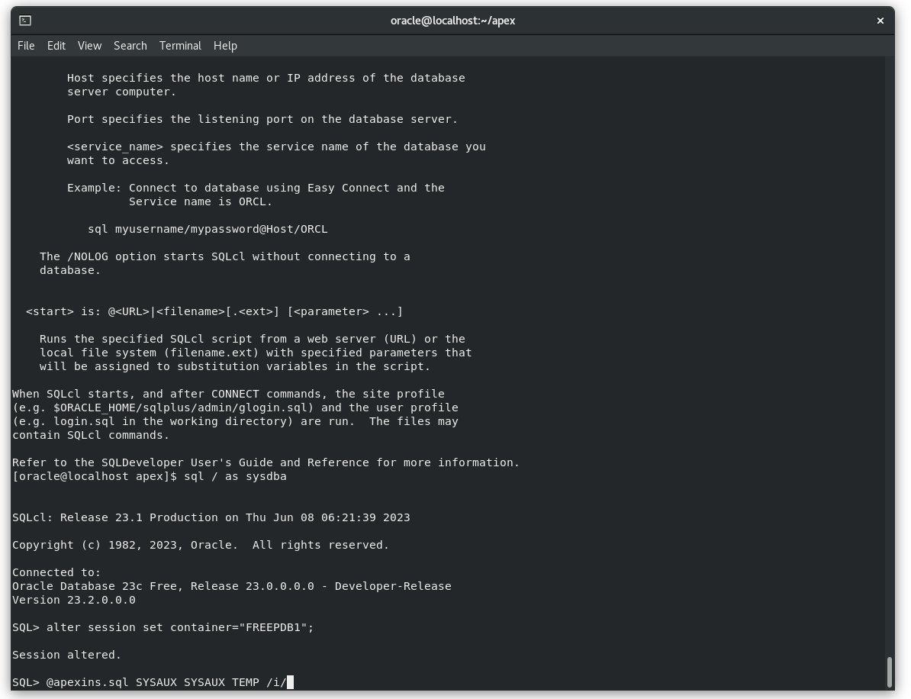

# Sign up for an APEX Workspace

## Introduction

Oracle APEX is a low-code application platform for Oracle Database. APEX Application Development, Autonomous Data Warehouse (ADW) and Autonomous Transaction Processing (ATP) are fully managed services, pre-integrated and pre-configured with APEX, for rapidly building and deploying modern data-driven applications in Oracle Cloud. Business users, citizen and application developers can create enterprise apps 20X faster with 100X less code—without having to learn complex web technologies with just a browser. To start, you will need to decide on the service you are going to use for this workshop, and then create an APEX workspace accordingly.

If you already have an APEX 23.1 Workspace provisioned on Oracle Database 23ai, you can skip this lab.

Estimated Time: 5 minutes

### What is an APEX Workspace?
An APEX Workspace is a logical domain where you define APEX applications. Each workspace is associated with one or more database schemas (database users) which are used to store the database objects, such as tables, views, packages, and more. APEX applications are built on top of these database objects.

### How Do I Find My APEX Release Version?
To determine which release of Oracle APEX you are currently running, do one of the following:
* View the release number on the Workspace home page:
    - Sign in to Oracle APEX. The Workspace home page appears. The current release version displays in bottom right corner.

    
    

* View the About APEX page:
    - Sign in to Oracle APEX. The Workspace home page appears.
    - Click the Help menu at the top of the page and select About. The About APEX page appears.

  

### Where to Run the Lab
You can run this lab in Oracle Database 23ai with APEX 23.1 installed.
Click one of the options below to proceed.

## **Option 1**: Oracle Database 23ai Free - Developer Release VirtualBox Appliance

You need to have [VirtualBox](https://www.oracle.com/virtualization/technologies/vm/downloads/virtualbox-downloads.html) installed in your system to use this option.

1.  Download the VirtualBox Appliance from this link: [https://www.oracle.com/database/technologies/databaseappdev-vm.html](https://www.oracle.com/database/technologies/databaseappdev-vm.html)

2. Follow the steps to import the VirtualBox Appliance as described in the previous link.

3. Once the import process is complete start your newly imported Virtual Machine.

4. The Virtual Appliance has Oracle APEX 22.2 installed. We need to download and install APEX 23.1

5. Open your Guest Linux Machine and paste the following command in the open shell:

    ```
    <copy>
    wget https://download.oracle.com/otn_software/apex/apex_23.1.zip
    </copy>
    ```

    

6. Unzip the apex_23.1.zip and when asked the replace the files answer with "A"

    ```
    <copy>
    unzip apex_23.1.zip
    </copy>
    ```
    

7. Move inside the APEX folder and run the following commands to connect to Oracle Database, change the container to FREEPDB1 and install Oracle APEX 23.1

    ```
    <copy>
    cd apex
    unset TWO_TASK
    sql / as sysdba
    alter session set container="FREEPDB1";
    @apexins.sql SYSAUX SYSAUX TEMP /i/
    </copy>
    ```
    

8. Once the installation is complete, replace the APEX images files with the files for the new version:

    ```
    <copy>
    cp -fR images/* ../apex_images/
    </copy>
    ```

9. The Oracle APEX 23.1 is installed and ready to be used. You can now exit the SQL Command Line by typing "Exit"

    

10. Open your browser in the Host Machine and visit the link: [localhost:8080/ords](localhost:8080/ords)

11. Enter the following credentials to access the internal admin workspace
    - Workspace: internal
    - Username: admin
    - Password: oracle

12. Go to Manage Workspaces => Create Workspace

    

13. In the Create Workspace dialog, enter the following:

    | Property | Value |
    | --- | --- |
    | Database User | DEMO |
    | Password | **`SecretPassw0rd`** |
    | Workspace Name | DEMO |

    Click **Create Workspace**.

    

14. In the APEX Instance Administration page, click the **DEMO** link in the success message.         
    *Note: This will log you out of APEX Administration so that you can log into your new workspace.*

    

15. On the APEX Workspace log in page, enter **``SecretPassw0rd``** for the password, check the **Remember workspace and username** checkbox, and then click **Sign In**.

    

## **Summary**

This completes lab 1. At this point, you know how to create an APEX Workspace and you are ready to start building amazing apps, fast.

You may now *proceed to the next lab*.

## **Acknowledgements**

 - **Author** -  Salim Hlayel, Principal Product Manager
 - **Contributors** - Arabella Yao, Product Manager Intern, Database Management | Jaden McElvey, Technical Lead - Oracle LiveLabs Intern
 - **Last Updated By/Date** - Salim Hlayel, Principal Product Manager, June 2023
