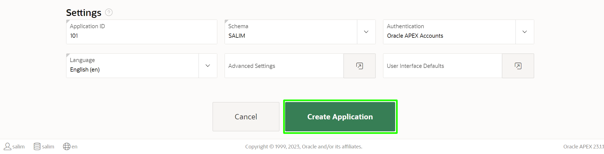

# Creating an App from a Spreadsheet

In this lab, you will learn how to create an APEX application using data imported from a spreadsheet. To simplify the lab, you will use sample data that's built into APEX. However, the sequence will be the same when uploading your own data.

## Introduction
Now that you are logged into your workspace, you can start creating APEX applications. In this lab, you will build a simple application based on a spreadsheet. Keep in mind that APEX is great for a variety of apps, from simple ones like this to large, sophisticated apps based on local database objects, REST enabled SQL objects, and even REST APIs.

While APEX developers spend the majority of their time in the App Builder, you should also investigate the SQL Workshop, where you can create and maintain database objects, Team Development, where you can track large APEX development projects, and the App Gallery, which contains numerous productivity and sample apps that can be installed within minutes.

Estimated Lab Time: 5 minutes

## Task 1: Loading project and tasks data  

1.  From your APEX workspace home page, click **App Builder**.
2.  Click **Create a New App**.

    

3.  Click **From a File**.

    

    When creating an application from a file, APEX allows you to upload CSV, XLSX, XML, or JSON files and then build apps based on their data. Alternatively, you can also copy and paste CSV data or load sample data.

4.  Within the Load Data wizard, click the **Copy and Paste** option at the top.

    

5. Select **Project and Tasks** from the sample data set list and then click **Next**.

    

6.  Review the parsed data. Enter **PROJECT_TASKS** for Table Name and Click **Load Data**.

    

    After clicking **Load Data** you will see a spinner until the wizard finishes loading the data. Continue to Part 2 at that point.

## Task 2: Creating an application

The Data Load wizard has created a new table and populated that table with the records from the sample data. Now you can create an app based on this new table.

1.  In the Load Data dialog, verify that 73 rows have been loaded into the **PROJECT_TASKS** table, then click **Create Application**.

    

[//]: # (click **Create Application**. )
[//]: # (images/continue-to-create-application-wizard.png " ")

[//]: # (Remove Steps 2 and 3)

2. In the Create Application page, review the pages listed. Click the **Edit** button for a page to review more details.

    Click **Check All** for Features, and then click **Create Application**.

    
    

    When the wizard finishes creating the application, you will be redirected to the application's home page in the App Builder.

## Task 3: Running and exploring the new app

1.  Click **Run Application**. This will open the runtime application in a new browser tab, allowing you to see how end users will view the app.

    

2.  Enter your user credentials and click **Sign In**.

    *Note: Use the same Username and Password you used to sign into the APEX Workspace.*

    

3. Click on the navigation menu icon to expand the navigation menu
    

4.  Explore the application a little. Click **Dashboard** (in the home menu or the navigation menu) to view the charts created. Click **Project Tasks Search**, in the navigation menu, to play with the faceted search. Click **Project Tasks Report** to view an interactive report, then click the edit icon for a record to display the details in an editable "form" page. Next, navigate to the **Calendar** page and review the data displayed (*Note: You may need to scroll back several months to see data*). Finally, review the options available under **Administration**.

    

## **Summary**

You now know how to create an application from a spreadsheet by either dragging and dropping a file or loading sample data for training purposes.

## **Acknowledgements**

 - **Author** -  Salim Hlayel, Principal Product Manager 
 - **Last Updated By/Date** - Madhusudhan Rao, Apr 2022

