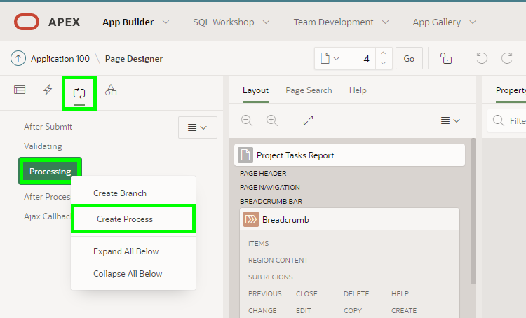
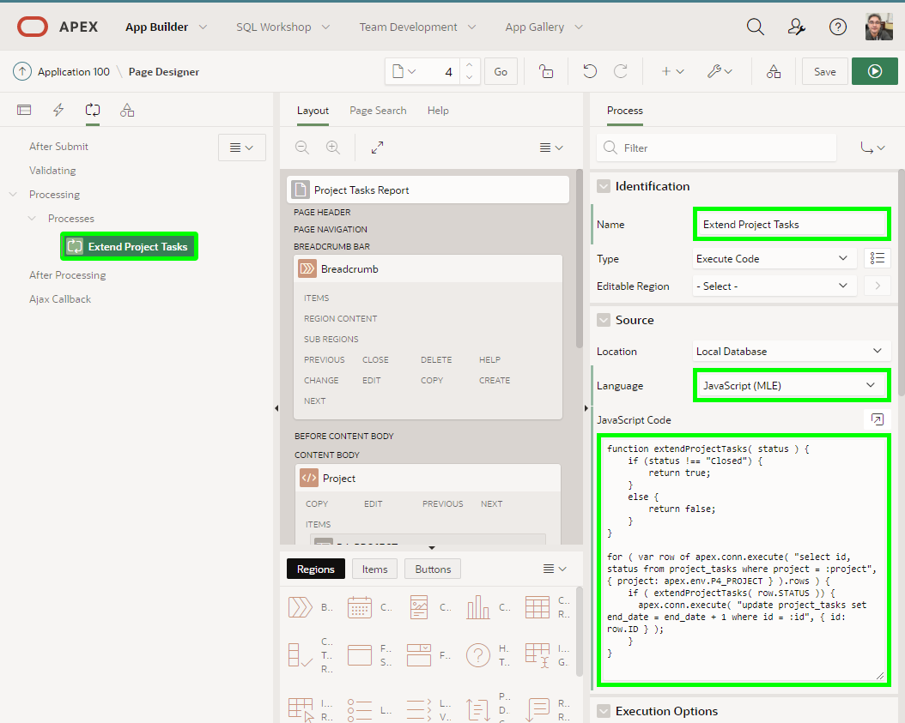
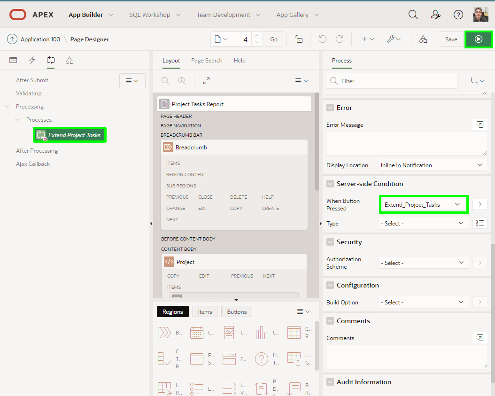
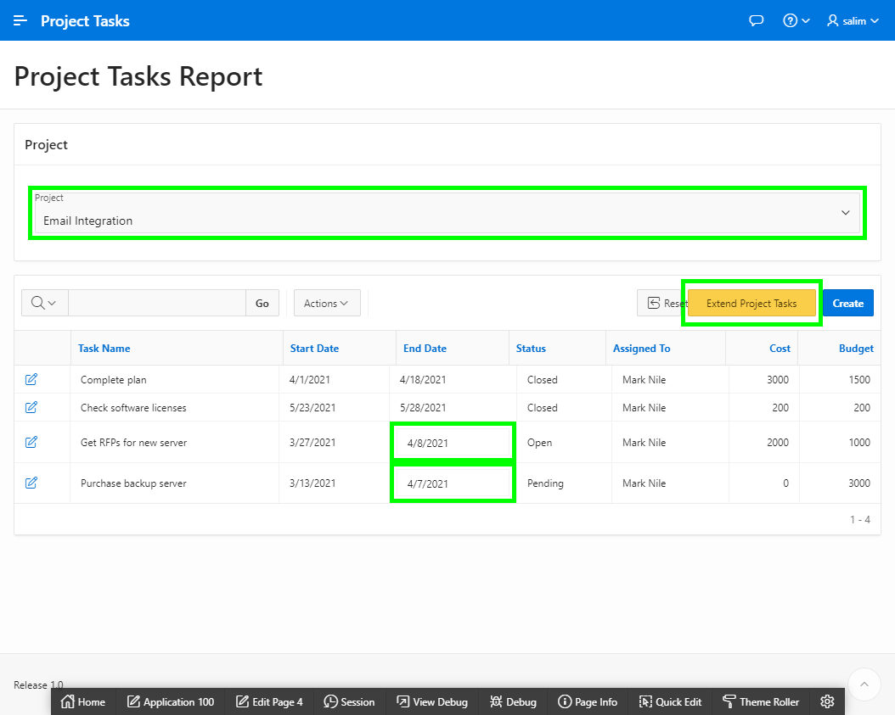
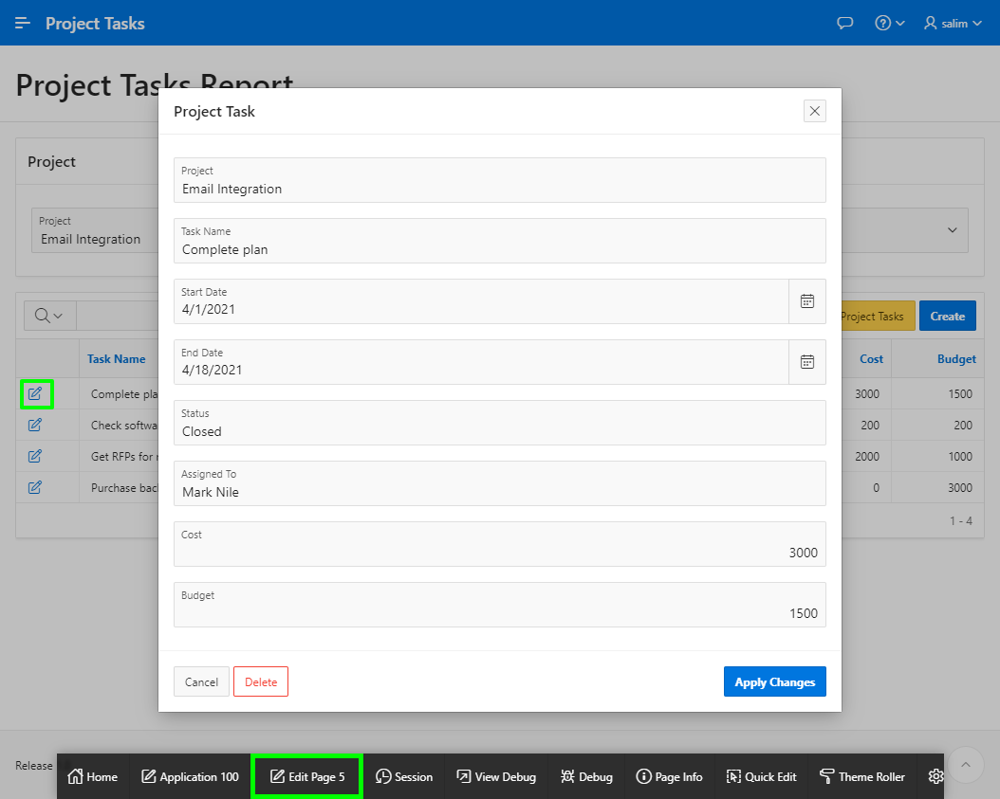
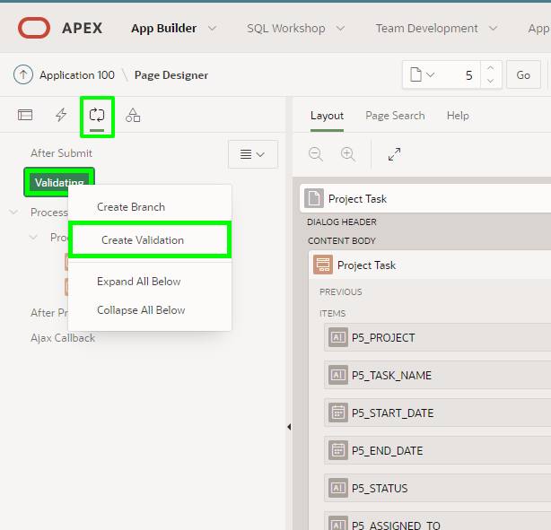
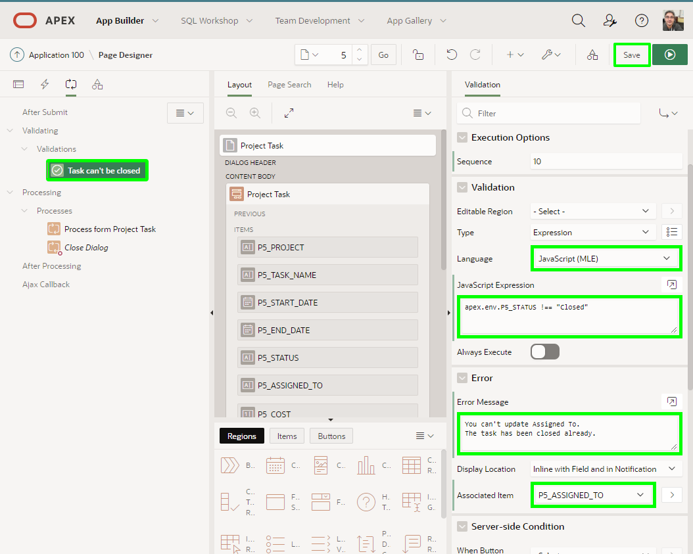
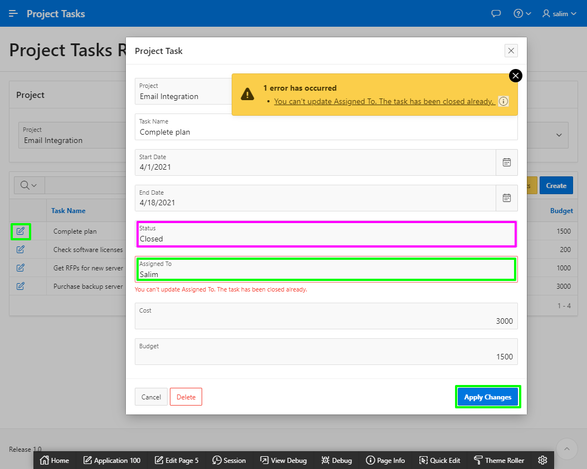

# Extending Application Using Server-Side JavaScript

## Introduction
In this lab, you will execute a JavaScript code to extend the project tasks once click on Extend Project Task button. Next, you will add a JavaScript validation to the form page to prevent updating a task's owner if the task's status is Closed.

Estimated Lab Time: 15 minutes

## Task 1: Extend Report with JavaScript Process

1. Navigate to **Page 4** in **Page Designer**. 

    Select the **Processing** tab

    Right click on **Processing** and click on **Create Process** menu item
    
    

2. Set the following values for the property values of the new process:

    **Name** => **Extend Project Tasks**

    **Language** => **JavaScript (MLE)**

    Copy the following code and paste it in **JavaScript Code** property:

    ```
    <copy>
    function extendProjectTasks( status ) {
        if (status !== "Closed") {
            return true;
        }
        else {
            return false;
        }
    }

    for ( var row of apex.conn.execute( "select id, status from project_tasks where project = :project", { project: apex.env.P4_PROJECT } ).rows ) {
        if ( extendProjectTasks( row.STATUS )) {
            apex.conn.execute( "update project_tasks set end_date = end_date + 1 where id = :id", { id: row.ID } );
        }
    }
    </copy>
    ```

    *Note: The above code now uses apex.env.P4\_PROJECT to pass the values from the P4\_PROJECT page item to the JavaScript code.*

    

3. Update the **When Button Pressed** property in the **Server-side Condition** with **Extend\_Project\_Tasks**

    This will ensure that the process will not be executed unless the **Extend\_Project\_Tasks** button is clicked.

    Click on **Save and Run Page** button to view your page.

    

4. Select the **Email Integration** project from the project's select list. 
   
   If you click on **Extend Project Tasks** button you will notice that the tasks with non closed status will be extended.

    

## Task 2: Add JavaScript Validation to Form

1. While in **Project Tasks Report** page click on the edit icon.

    Click on **Edit Page 5** in the developer toolbar

    

2. Select **Processing** tab and then right click on **Validating**. 

    Click on **Create Validation** menu item.

    

3. In the Property Editor, under Validation, select / enter the following:

    **Name** = > **Tasks can't be closed**

    **Language** => **JavaScript (MLE)**

    **JavaScrtipt Expression** to the following code:

    ```
    apex.env.P5_STATUS !== "Closed"
    ```

    **Error Message** => **You can't update Assigned To. The task has been closed already.**

    **Associated Item** => **P5\_ASSIGNED\_TO**

    Click the **Save** button.

    

4. Navigate back to Project Tasks Report and click on the edit icon of the **Complete plan** task.
    
    For **Assigned To**, enter a name or text of your choice and click **Apply Changes**.

    You will receive now the error message that you specified earlier protecting the record from getting updated.

    


## **Summary**

You now know how to utilize the database MLE JavaScript capabilities in Oracle APEX processes and validations.

## **Acknowledgements**

 - **Author/Contributors** -  Salim Hlayel, Principal Product Manager
 - **Last Updated By/Date** - Salim Hlayel, Principal Product Manager, November 2020

