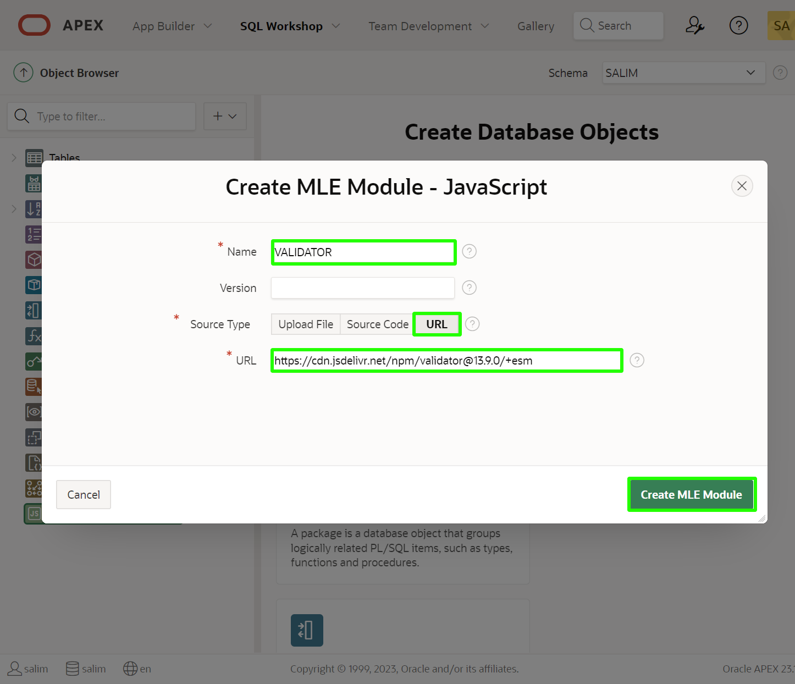
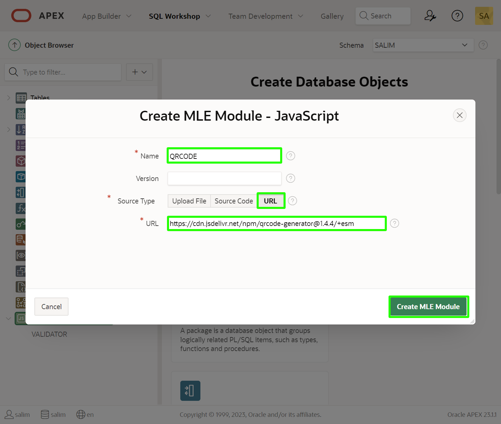
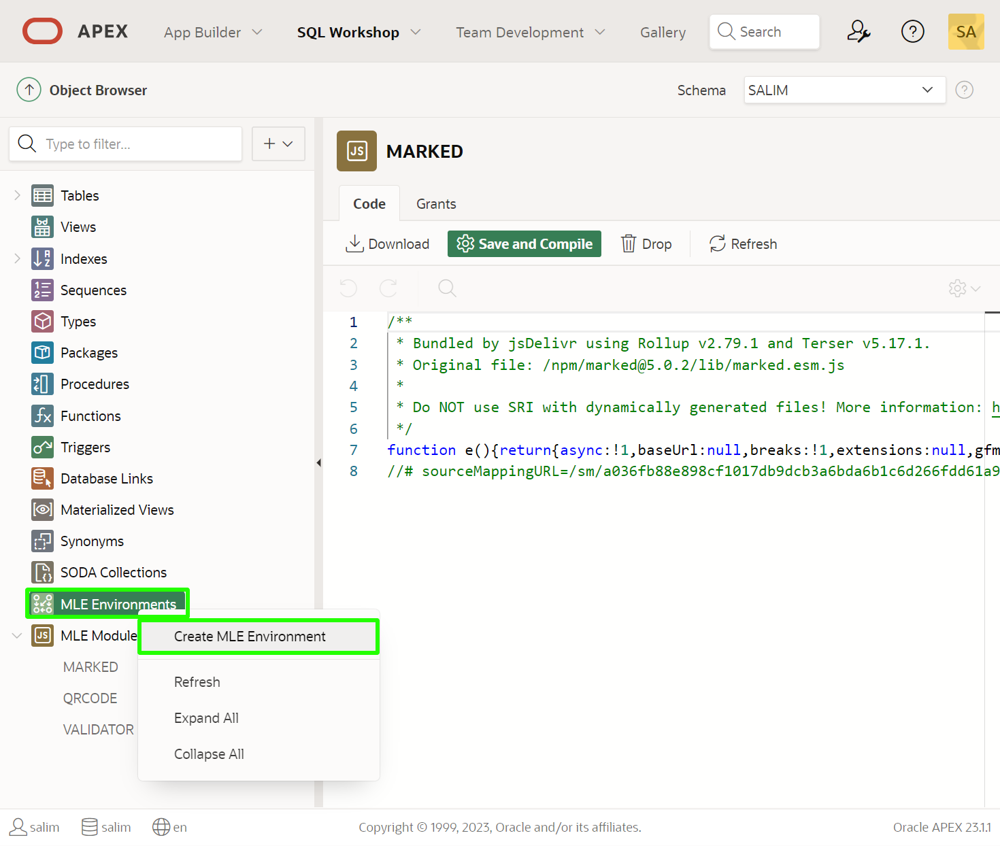
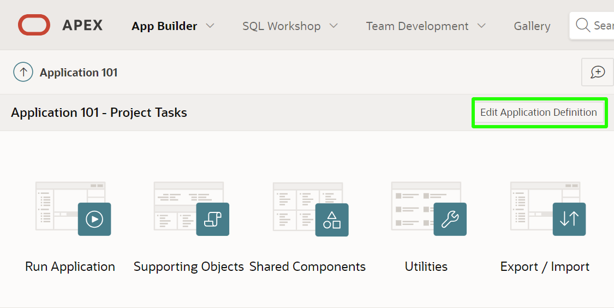
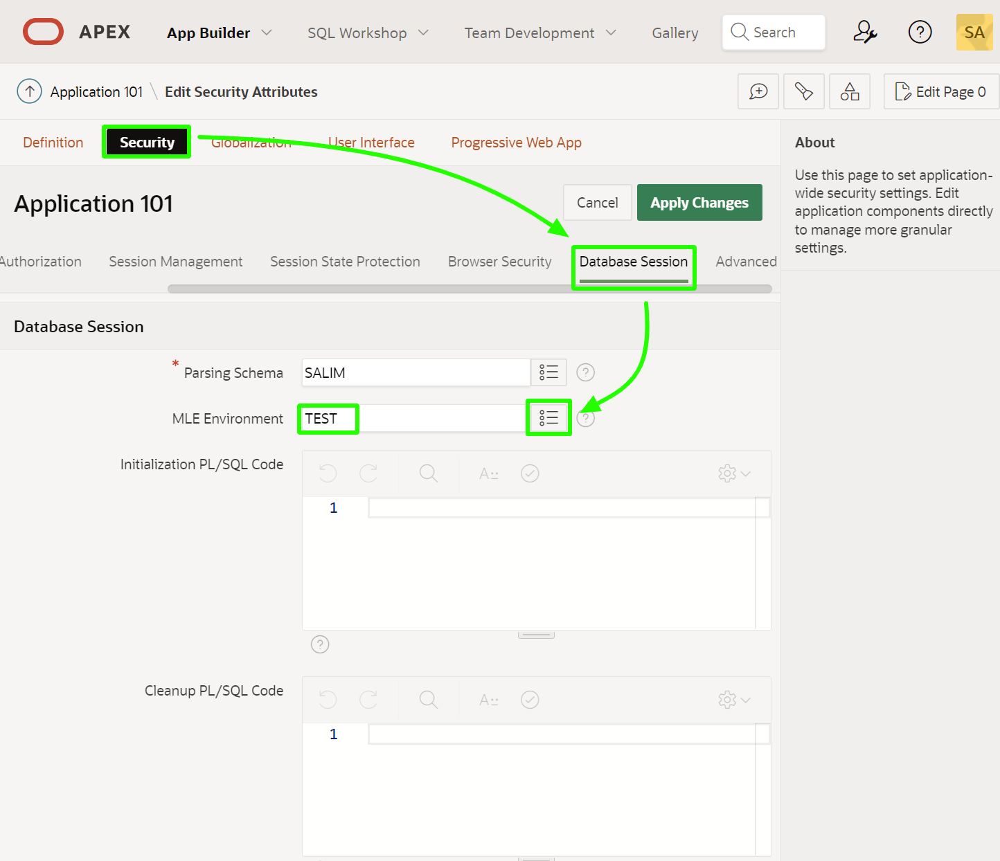

# Using External Modules

## Introduction
In this lab, you will learn how to load external JavaScript modules. The modules will be saved in a local new table and the code for the modules will be fetched from that table.
You will utilize the following three external JavaScrip libraries/modules:

- Email Verification
- QR Code generation
- Markdown conversion to HTML

Estimated Lab Time: 20 minutes

## Task 1: Importing JavaScript Modules and Creating MLE Evnironment

1. Navigate to SQL Workshop => Object Browser

    

2. Right click on the MLE Modules - JavaScript => Create MLE Module - JavaScript

    

3. Enter the following values

    Name => VALIDATOR

    URL => https://cdn.jsdelivr.net/npm/validator@13.9.0/+esm

    

4. Repeat the last step to import the qrcode module 

    Name => QRCODE

    URL => https://cdn.jsdelivr.net/npm/qrcode-generator@1.4.4/+esm

    

5. Repeat the last step to import the qrcode module 

    Name => MARKED

    URL => https://cdn.jsdelivr.net/npm/marked@5.0.2/+esm

    

6. Right click on MLE Environments => Create MLE Environment 
    
    Name your Environment TEST

    

7. Click on TEST environment
    
    - Click + Add Import
    - Select Module Owner, Module Name and click Create

    

8. Repeat the previous step to add all the three Modules to the MLE Environment 

    

9. Navigate to App Builder => Click on your Application "Project Tasks" 

    

10. Click "Edit Application Definition" 

    

11. Go to Security => Database Session
    
    Select TEST MLE environment to assign to this APEX App.

    

## Task 2: Email Validation

1. In the top of the **Page Designer** type **5** and click **Go** button to start editing Page 5

    

2. Right click on **P5_EMAIL** page item and then click on **Create Validation** menu item

    

3. Set the property values for the new validation to the followings:
    
    **Name** => **Is Valid Email?**

    **Language** => **JavaScript (MLE)**

    **JavaScript Expression** => **(await import ("validator")).default.isEmail(apex.env.P5_EMAIL)**

    **Error Message** => **Please enter a valid email address**

    

4. Run **Project Tasks Report** page and click on **Edit** icon for the **Get RFPs for new server** task record. Try to update the **Email** field with the **test@test** value and click **Apply Changes**.

    The external email JavaScript module will run and validation will fail

    

## Task 3: QR Code Generation
Next you will utilize the QR Code Generation JavaScript module to generate QR Code for the URL page item.

1. Right click on **QR Code** sub region and click on **Create Page Item** menu item

    

2. Set the property values for the new item as the followings:
    
    **Name** => **P5_URL**

    **Label** => **URL**

    **Form Region** => **Project Task**

    **Column** => **URL**

    **Data Type** => **VARCHAR2**

    

3. Create another page item with the following property values:
   
   **Name** => **P5_QRCODE**

   **Label** => make this blank

   **Based On** => **Image URL stored In Page Item Value**    

    

4. Right click on **Region Buttons** and click on **Create Button** menu item 

    

5. Set the property values for the new button as the followings:

    **Name** => **Generate\_QR\_Code**

    **Label** => **QR Code**

    **Sequence** => **1**

    **Button Position** => **Next**

    **Hot** => **Enabled**

    

    Click on **Template Options** and set the **Style** to **Simple**

    **Database Action** => **SQL Update Action**

    

6. Click on **Processing** tab

    Right click on **Processes** and click **Create Process** menu item

    

7. Update the property values for the new process as the followings:
    
    **Name** => **Generate QR Code**

    **Language** => **JavaScript (MLE)**

    Copy and use the following **JavaScript Code**:

    ```
    <copy>
    // importing the qrcode Module
    const { default: qrcode } = await import ("qrcode");

    // library specific options
    const code = qrcode(0, 'L');

    code.addData(apex.env.P5_URL);

    code.make();

    // saving the base64 result into a page item of type Display Image
    apex.env.P5_QRCODE = code.createDataURL(4);
    </copy>
    ```

    **When Button Pressed** => **Generate\_QR\_Code**

    Finally click **Save** button

    

8. Run **Project Tasks Report** page and click on **Edit** icon for the **Get RFPs for new server** task record. 
   
    Click on **QR Code** tab

    In the **URL** field enter **apex.oracle.com**

    Click **QR Code** button

    The QR Code is generated for the entered URL

    

## Task 4: Markdown Conversion to HTML
The final step is to create a Project Details page item. The poge item will save the project details for the task in Markdown format. 

Then you will use the Markdown module to generate and preview the details in HTML.

1. Right Click on **Markdown Details** region and click on **Create Page Item** menu item

    

2. Set the property values for the new created page item as the followings:

    **Name** => **P5\_PROJECT\_DETAILS**

    **Type** => **Textarea**

    **Form Region** => **Project Task**

    **Column** => **PROJECT_DETAILS**

    **Data Type** => **VARCHAR2**

    

3. Create another Page item under the  **Markdown Details** region and set the property values as the followings:

     **Name** => **P5\_PROJECT_DETAILS\_HTML**

    **Type** => **Display Only**

    **Escape special characters** => **Disabled**

    

4. Right click on the **Generate\_QR\_Code** button and click on **Duplicate** menu item

    

5. Set the property values for the generated button as the followings:
   
   **Button Name** => **Convert_Markdown**

   **Label** => **Markdown**

    

6. Click on **Processing** tab. Right click on **Processes** and click on **Create Process** menu item
   
    

7. Set the property values for the new process as the followings:

    Name => Convert

    Language => JavaScript (MLE)

    Copy and use the following JavaScript Code:

    ```
    <copy>
    const { parse, setOptions } = await import("marked");

    // library-specific options
    setOptions({
        headerIds: false
    });

    apex.env.P5_PROJECT_DETAILS_HTML = parse(apex.env.P5_PROJECT_DETAILS);
    </copy>
    ```
    
    **When Button Pressed** => **Convert_Markdown**

    Click **Save** button

    

8. Run **Project Tasks Report** page and click on **Edit** icon for the **Get RFPs for new server** task record. 

   Copy and set the **Project Details** field with the following **Markdown** code 

    ```
    <copy>
    # Project Details
    ## The following are some details about this project
      - Make sure to check this item on regular basis
      - Show Markdown in HTML region
    </copy>
    ```

    Click **Markdown** button and observe the generated HTML code

    

## **Summary**

You now know how to load external JavaScript modules and use them in your APEX applications.

## **Learn More** - *Useful Links*

- [APEX on Autonomous](https://apex.oracle.com/autonomous)
- [APEX Collateral](https://www.oracle.com/database/technologies/appdev/apex/collateral.html)
- [Tutorials](https://apex.oracle.com/en/learn/tutorials)
- [Community](https://apex.oracle.com/community)
- [External Site + Slack](http://apex.world)

## **Acknowledgements**

 - **Author/Contributors** -  Salim Hlayel, Principal Product Manager
 - **Last Updated By/Date** - Salim Hlayel, Principal Product Manager, November 2020

