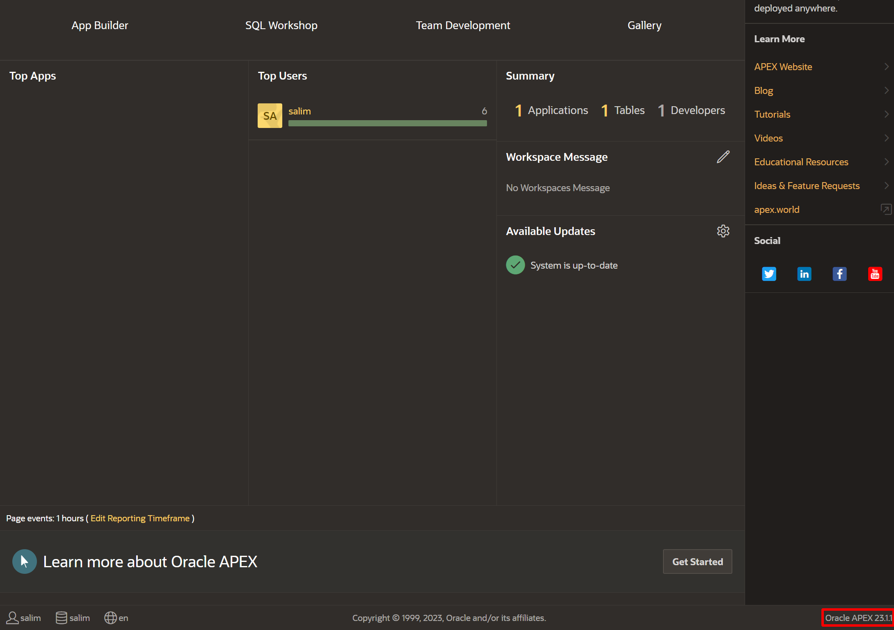
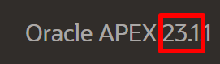
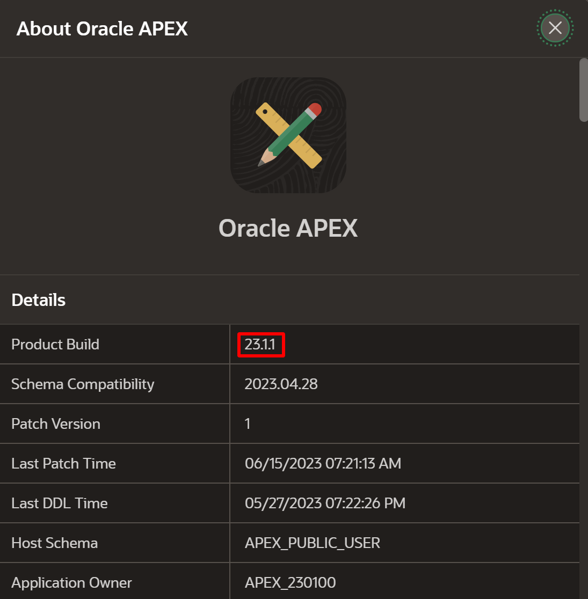

# Sign up for an APEX Workspace

## Introduction

Oracle APEX is a low-code application platform for Oracle Database. APEX Application Development, Autonomous Data Warehouse (ADW) and Autonomous Transaction Processing (ATP) are fully managed services, pre-integrated and pre-configured with APEX, for rapidly building and deploying modern data-driven applications in Oracle Cloud. Business users, citizen and application developers can create enterprise apps 20X faster with 100X less code—without having to learn complex web technologies with just a browser. To start, you will need to decide on the service you are going to use for this workshop, and then create an APEX workspace accordingly.

If you already have an APEX 23.1 Workspace provisioned on Oracle Database 23ai, you can skip this lab.

Estimated Time: 5 minutes

### What is an APEX Workspace?
An APEX Workspace is a logical domain where you define APEX applications. Each workspace is associated with one or more database schemas (database users) which are used to store the database objects, such as tables, views, packages, and more. APEX applications are built on top of these database objects.

### How Do I Find My APEX Release Version?
To determine which release of Oracle APEX you are currently running, do one of the following:
* View the release number on the Workspace home page:
    - Sign in to Oracle APEX. The Workspace home page appears. The current release version displays in bottom right corner.

    
    

* View the About APEX page:
    - Sign in to Oracle APEX. The Workspace home page appears.
    - Click the Help menu at the top of the page and select About. The About APEX page appears.

  

### Where to Run the Lab
You can run this lab in Oracle Database 23ai with APEX 23.1 installed.
Click one of the options below to proceed.

## **Option 1**: LiveLabs Sandbox

In order to use APEX in LiveLabs Sandbox, you need to first start ORDS. The following command will run ORDS in the background of your terminal. Do not close the terminal window or the ORDS server will stop.

1. Run the following command in the terminal to start **ORDS**

    ```
    <copy>
    ords serve > /dev/null 2>&1 &
    </copy>
    ```

    Copy the above command and paste it in the Clipboard section of the Sandbox by clicking the paste icon in the noVNC toolbar.
    Use the Clipboard section for further copy and paste in the upcoming steps.

    

2. To import external JavaScript modules we need to allow accessing some hosts. 
    While the terminal is open, copy the following command and paste it in the terminal, then hit **Enter**:

    ```
    <copy>
    sudo gedit /etc/hosts
    </copy>
    ```
    

    Enter the following line in the last line in **gedit** editor.
    
    ```
    <copy>
    151.101.141.229 jsdelivr.map.fastly.net cdn.jsdelivr.net
    </copy>
    ```

    
    
    Close the editor and save the changes by clicking **Save** button.

    

    *Note: Don't close the Terminal window so **ORDS** will not be shutdown.

3. Open Activities -> Google Chrome -> New Window

    

4. Go to this URL and wait for the screen to load.

    ```
    <copy>
    http://localhost:8080/ords/apex_admin
    </copy>
    ```

    

5. Login as ADMIN with the password Welcome123# and reset it to as you please.

    

6. You can see the welcome screen for APEX now.

    

7. Click create workspace

    


8. Name the workspace 'HOL23C' and click Next

    

9. Set **Re-use existing schema** to No. Enter Schema Name (e.g. salim) and password. Click **Next** button.

    

10. Admin username: admin, password: Welcome123#, email: your email.

    

11. Review the output then click Create workspace.

    

12. Success! Now click done.

    

13. Click the profile icon, then click **Sign out**
    
    *Note: This will log you out of APEX Administration so that you can log into your new workspace.*

    

14. On the APEX Workspace log in page, enter the workspace name, the password you have entered previously, check the **Remember workspace and username** checkbox, and then click **Sign In**.

    

## **Summary**

This completes the getting started lab. At this point, you know how to create an APEX Workspace and you are ready to start building amazing apps, fast.

You may now *proceed to the next lab*.

## **Acknowledgements**

 - **Author** -  Salim Hlayel, Principal Product Manager
 - **Contributors** - Arabella Yao, Product Manager Intern, Database Management | Jaden McElvey, Technical Lead - Oracle LiveLabs Intern
 - **Last Updated By/Date** - Salim Hlayel, Principal Product Manager, June 2023
