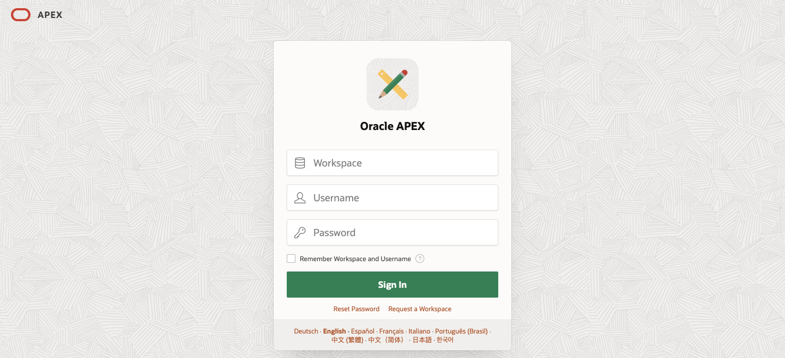
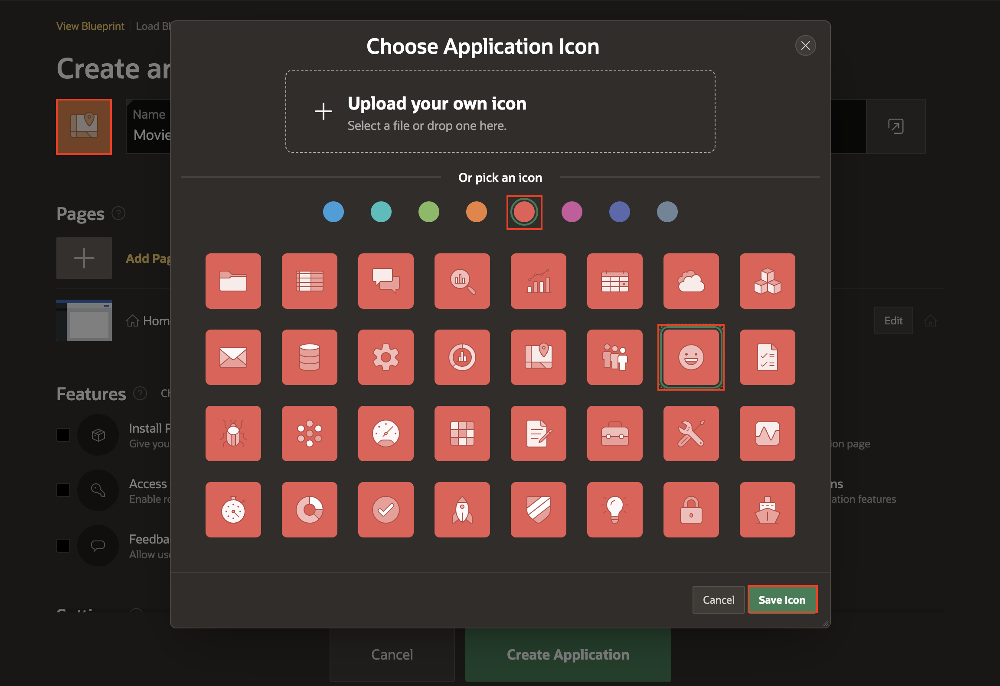
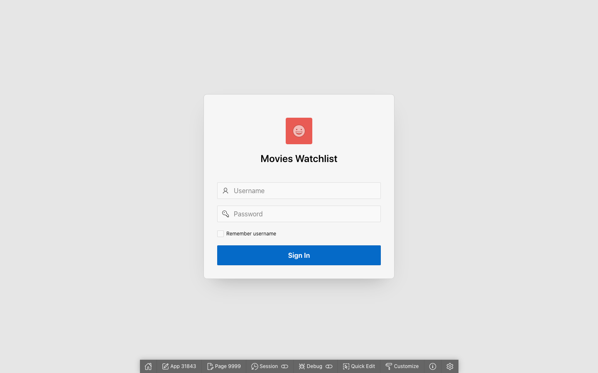
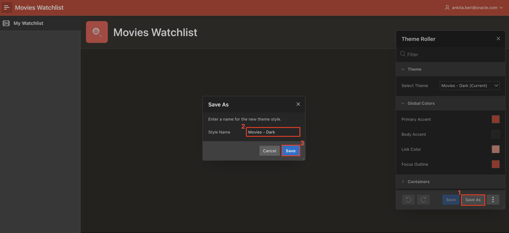

# Create the Application

## Introduction

You will get started by creating a skeleton application and you will add to it in each lab until you have built a full application that allows you to create and manage a personal list of movies you have watched or want to watch.

You will also need to sign up for an account on The Movie Database and obtain an API Key. A TMDB API Key is required for this tutorial, as authentication is needed to get data from The Movie Database API.

Estimated Lab Time: 10 minutes

Watch the video below for a quick walk-through of the lab.
[Create the Application](videohub:1_wnfxin31)

### Objectives
In this lab, you will:  
- Create a new application.  
- Edit the appearance and theme of your application.  
- Run your application.  
- Sign up for a TMDB API key.

### Prerequisites
- An Oracle APEX workspace

## Task 1: Create the App

1. If you have not already logged into your Oracle APEX workspace, sign in using the workspace name, email, and password you signed up with.

    

2. At the top left of your workspace, click **App Builder**.

    

3. On the App Builder page, click the **Create** button.

    

4. Select the **Use Create App Wizard** option.

    

5. In the Create an Application wizard, set Name to **Movies Watchlist**.

6. Open the Choose Application Icon dialog by clicking on the icon to the left of the Name field.

    * Select the red color swatch (fifth from the left) and the smiley face icon.

    * Click **Save Icon**.

    

7. In the Pages section of the Create Application wizard, click the **Edit** button next to Home.

    

    * In the dialog, set Page Name: **My Watchlist**

    * Click the **Set Icon** button.

        - In the Select Icon dialog, search for **film**.

        - Click the film icon that has the play button in the middle.

    * Click **Save Changes**.

    

8. Click **Create Application** to create your app and go to the application home page.

    

## Task 2: Run the App

1. On your application home page, click **Run Application**.

    

2. On the sign in page that opens in a new tab in your browser, enter your username and password that you used to sign in to your workspace.

3. Click **Sign In**.

    

## Task 3: Update the Theme of the App

1. In the tab that your app is running in, there will be a grey toolbar at the bottom of the page. This is your development toolbar that allows you to edit regions in your application user interface (UI) directly in the tab it's running in.  
*Note: If you do not see the grey developer toolbar, mouse over the bottom of your browser window to make it display. End users who log directly into the app will not see this toolbar.*

2. In the dev toolbar, click on **Customize** and then click **Theme Roller**.

    

3. Within the Theme Roller, you can modify many different aspects of the application UI. You will use it right now to update the color scheme.

4. Under the **Theme** section, click on the Select Theme select box and choose **Vita - Dark**.

4. Click on **Global Colors** to expand the section.

    * Copy the HEX color code: **C74634**

    * Click on the color swatch next to **Primary Accent** and paste the HEX code in the Hex text box.

    

    * Click on the color swatch next to **Body Accent** and paste the HEX code **312D2A** in the Hex text box.

    * The other color swatches automatically updated to variations of the Header Accent color.

    * Click **Save As**.

    * Style Name: **Movies - Dark**

    * Click **Save**.

    * Close the Theme Roller window.

    

5. You have now updated the color scheme of your app.

## Task 4: Sign up for a TMDB API Key

1. Go to [The Movie Database (TMDB)](https://www.themoviedb.org/signup) to sign up for a free account.

2. Once registered, follow the [Getting Started](https://developers.themoviedb.org/3/getting-started/introduction) instructions on TMDB Developer site. You will need to enter some of your app and contact information:

    

3. After you have received your API Key, copy it and store it somewhere where you will be able to easily access it.

You now know how to create, run, and update the theme of an application. You may now **proceed to the next lab**.

## Learn More

- [App Builder Concepts](https://docs.oracle.com/en/database/oracle/apex/23.2/htmdb/application-builder-concepts.html)

- [Universal Theme](https://apex.oracle.com/pls/apex/apex_pm/r/ut/getting-started)

- [The Movie Database](https://www.themoviedb.org/)

- [The Movie Database API](https://developers.themoviedb.org/3/getting-started/introduction)

## Stuck? Download the Application Here
Stuck on a step or struggling with the lab? You can download a copy of the Movies Watchlist application through Lab 1 and follow the instructions below to import it into your Oracle APEX workspace.  

- [Click here](https://objectstorage.us-ashburn-1.oraclecloud.com/p/Ei1_2QRw4M8tQpk59Qhao2JCvEivSAX8MGB9R6PfHZlqNkpkAcnVg4V3-GyTs1_t/n/c4u04/b/livelabsfiles/o/oci-library/build-movies-watchlist-app-using-apex/lab-1-232.sql) to download a copy of the app at the end of Lab 1.

- You can import the app to your APEX workspace by clicking **Import** in the App Builder home page and following the wizard steps.

## Acknowledgements

- **Author** - Paige Hanssen
- **Last Updated By/Date** - Paige Hanssen, November 2023
