# Create the Movie Search Page

## Introduction

You will create and set up the Movie Search page so that you can view popular movies and search for a movie of your choice. The search functionality must be built out before the watchlist even though the My Watchlist page is the home page of the application. You will create not only the Movie Search page, but also a button on the home page that links to the Search page. On the Movie Search page you will create regions that display the data from the REST sources you created in the previous lab, and you will implement a search bar that lets you search for movies.

Estimated Lab Time: 20 minutes

Watch the video below for a quick walk-through of the lab.
[Create the Movie Search Page](videohub:1_x3bb4sv0)

### Objectives

In this lab, you will:

- Create a new page.

- Link the Popular Movies REST data source to the new page.

- Link the Search Movies REST data source to the new page.

- Set up search functionality to allow a user to search for a movie.

- Add a button to link the Movie Search page to the Movie Watchlist page.

### Prerequisites

- Completion of workshop through Lab 2

## Task 1: Create the Movie Search Page

To start, you will create the Movie Search page and do a little page setup before adding content to display movie data.

1. In the **Movies Watchlist** application home, click **Create Page**.

    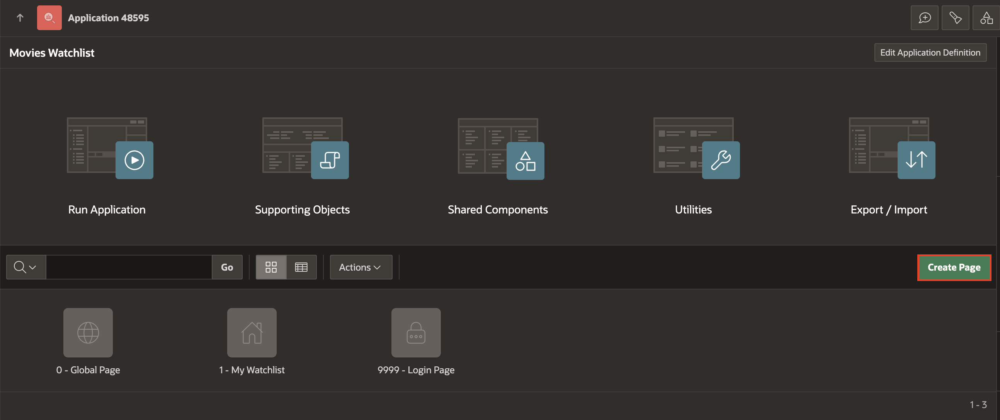

2. In the **Create a Page** wizard, click **Blank Page**.

    

3. Enter/select the following page attributes:

    - Page Number: **2**

    - Name: **Movie Search**

    - Page Mode: **Modal Dialog**

    Click **Create Page** to create and go to the new page.

    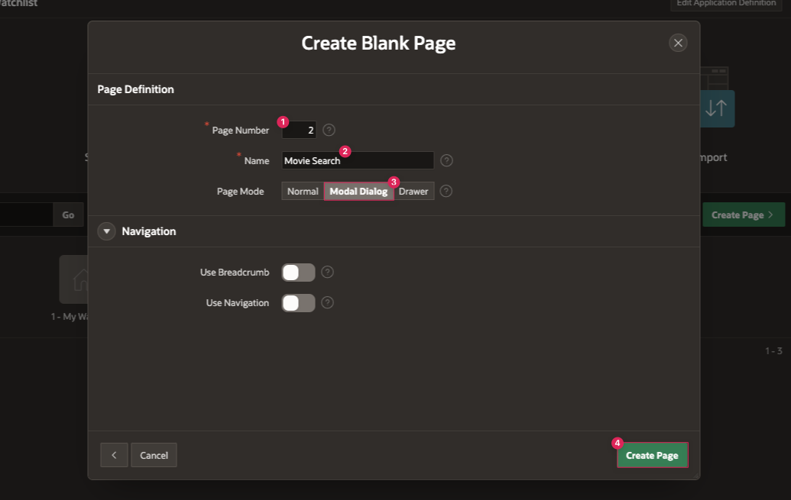

4. The Page Designer in APEX is broken up into a few different panes: the rendering pane on the left, the layout pane in the middle, and the properties pane on the right. On your new page, make sure that **Page 2: Movie Search** root node is selected in the rendering pane.

5. In the Property Editor, enter/select the following:

    - Under Appearance:

        - Click on the **Use Template Defaults** button next to Template Options.

        - In the Template Options popup dialog, check the **Stretch to Fit Window** box under Common.

        Click **Ok**.

    

    - Under Navigation:

        - Cursor Focus: **First item on page**

        - Warn on Unsaved Changes: Toggle **Off**

    - Inline > CSS: Copy the code below and paste it in the **Inline** property code box:

        ```
        <copy>
        /* Set posters to be the same size/ratio */
        .a-CardView-media--square:before {
            padding-top: 150%; /* 2:3 ratio */
        }

        /* set position of the Card badge */
        .a-CardView-badge {
            position: absolute;
            top: 12px;
            right: 12px;
            margin: 0;
        }

        /* style the movie rating under the movie title */
            .movie-rating {
            margin-top: 4px;
        }

        /* style both the movie rating and the star icon under the movie title */
        .movie-rating,
        .movie-rating .fa {
            font-size: 12px;
            line-height: inherit;
            vertical-align: bottom;
            opacity: 0.75;
        }
        ```

     *Note: The above code styles the movie poster images to all be the same size. It also adds some styling for the Cards region badge attribute that will be used in a later lab, to place it in the top right of a card. Finally, it adds some styling for the movie rating that you will display on the Card along with the movie title and poster.*

6. Click the **Save** button to save your changes.

    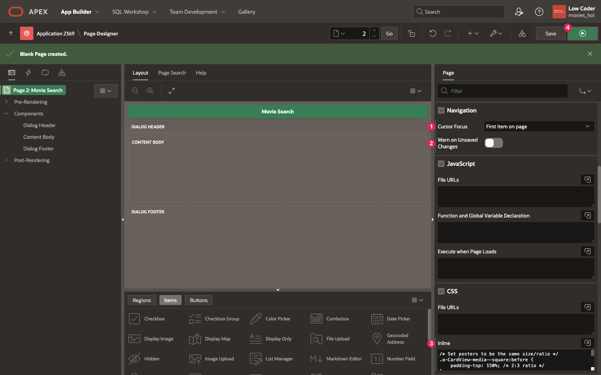

## Task 2: Set up Popular and Searched Movies

In this step, you will start to add content to your app using the REST data sources you set up in Lab 2. First, you will be using the Popular Movies source to get the list of current popular movies and display them when a user has not searched for any movies. Then you will create a similar region for the Search Movies source that displays a list of movies based on a search query.

1. In the **Rendering** tab, right-click **Content Body** and click **Create Region**.

    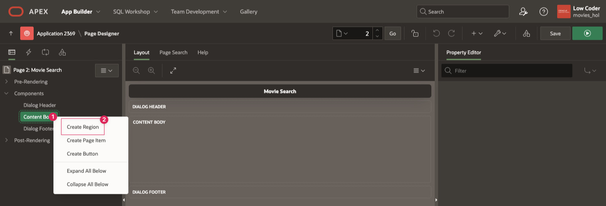

2. In the Property Editor, enter/select the following properties:

    - Under Identification:

        - Title: **Popular Movies**

        - Type: **Cards**

    - Under Source:

        - Location: **REST Source**

        - REST Source: **Popular Movies**

        When you click the dropdown for REST Source, you should see all the REST data sources you set up earlier - Popular Movies, Search Movies, Movie Details, and Movie Cast. This will allow the Cards region to use the columns and data associated with the Popular Movies REST data source and populate the region.

    

3. Navigate to **Attributes** tab at the top of the properties pane on the right of Page Designer. This is where you can select what data will display on each movie card. Enter/select the following:

    - Appearance > Grid Columns: **5 Columns**

    - Card > Primary Key Column 1: **ID**

    - Title > Column: **TITLE**

    - Under Subtitle:

        - Advanced Formatting: Toggle **On**

            In your Cards region, you will show a star icon with the average rating of the movie next to it. Including multiple columns or custom text is not built-in to an attribute, but you can use Advanced Formatting to replace it with an HTML expression.

        - HTML Expression: Copy and paste the below HTML expression

            ```
            &lt;div class="movie-rating">
            &lt;span aria-hidden="true" class="fa fa-star">&lt;/span> &VOTE_AVERAGE.&lt;/div>
            ```

        > *Note: In the HTML Expression, the &NAME. syntax is used to create a substitution string for the value of the VOTE_AVERAGE column for each movie. To learn more, check out the Resources section at the end of this lab.*

        

    - Under Media:

        - Source: **Image URL**

        - URL: **https://image.tmdb.org/t/p/w500&POSTER\_PATH.**

        - Position: **First**

        - Appearance: **Square**

        - Sizing: **Cover**

        

4. You also need to create a Cards region to display the data from the Search Movies REST source.  It will be almost exactly like the Popular Movies region, with a few minor changes.

5. In the Rendering pane, right-click **Popular Movies** region and select **Duplicate** to create a copy of the region.

    

6. In the Property Editor, enter/select the following properties:

    - Identification > Title: **Searched Movies**

    - Source > REST Source: **Search Movies**

    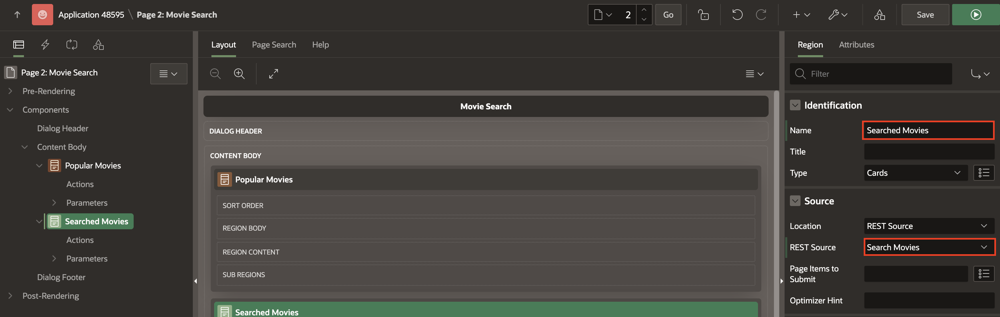

7. You also need to set the pagination attributes for the Searched Movies region, because you are getting all the search results at one time. Within Searched Movies, set the following **Pagination** properties in Searched Movies region under **Attributes** tab:

    - Type: **Page**

    - Cards per page: **25**

    

8. Click the **Save** button to save your changes.

## Task 3: Add the Search Bar

The final region that needs to be added to the Movie Search page is the search bar, which will allow a user to search for movies. Additionally, both the Popular and Searched movie regions are currently displaying at the same time on the Movie Search page. You want to only show one at a time based on the condition that the Searched Movies region displays only if the search bar page item has a value. If the search bar has no value, the page will only display the Popular Movies region.

1. In the **Rendering** tab, right-click **Dialog Header** and click **Create Region**.

    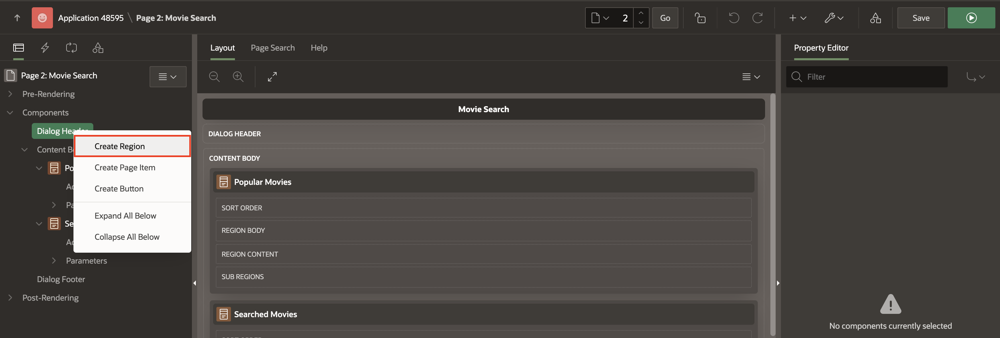

2. In the Property editor, enter/select the following:

    - Identification > Title: **Search Bar**

    - Under Appearance:

        - Template: **Blank with Attributes**

        - CSS Classes: **padding-sm**

    > *Note: If you open the options dialog next to the CSS Classes property, the only option available is margin-sm, so you need to manually enter padding-sm in the property text box.*

    

3. Right-click **Search Bar** region and click **Create Page Item**.

    

4. In the Property editor, enter/select the following:

    - Identification > Name: **P2_SEARCH**

    - Under Appearance:

        - Template: **Hidden**

        - Open the **Template Options** dialog:

            - Select **Stretch Form Item**

            - Size: **X Large**

            Click **Ok**.

        - Icon: **fa-search**

        - Value Placeholder: **Search for a movie...**

    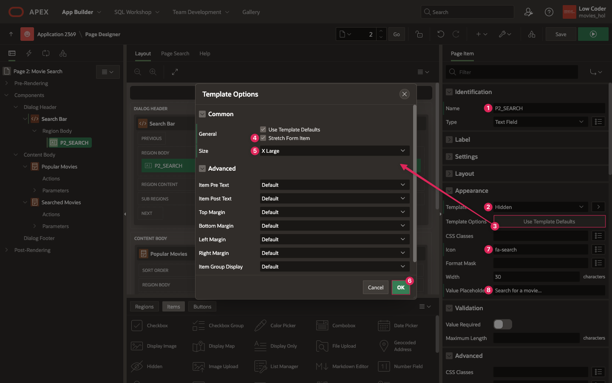

5. Navigate to **Popular Movies** region. In the Property editor, enter/select the following:

    - Under Server-Side Condition:

        - Type: **Item is NULL**

        - Item: **P2_SEARCH**

    > *Note: Now you are displaying the Popular Movies region based on a condition. If the P2_SEARCH item is NULL, then the region will display. You will create an opposite condition for the Searched Movies region.*

    

6. Navigate to **Searched Movies** region. In the Property editor, enter/select the following:

    - Under Server-Side Condition:

        - Type: **Item is NOT NULL**

        - Item: **P2_SEARCH**

    > *Note: Now, you are only displaying Searched Movies if the P2_SEARCH item is NOT NULL (has a value).*

    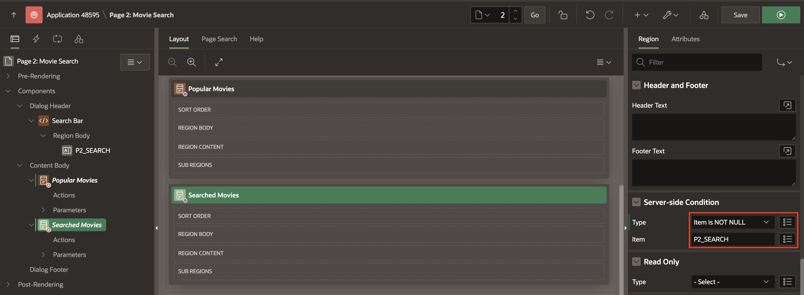

7. In order to actually search for a movie, you have to edit the query parameter that is submitted with a call to TMDB Search Movies API. A search query is required, otherwise you will not get any results back. When you look at the two Cards regions in the rendering pane, you can see that underneath Searched Movies there is a **Parameters** section.

8. Expand the section and you will see **query** listed as a parameter. This is what you will link to the P2_SEARCH page item in order to control the search.

9. Click on the **query** parameter.

    - You will see that its Type is REST Source Default, which is using the default value from the used in the URL to set up the REST source.

    - Change the Type from REST Source Default to **Item**.

    - In the Item field, enter **P2_SEARCH**.

    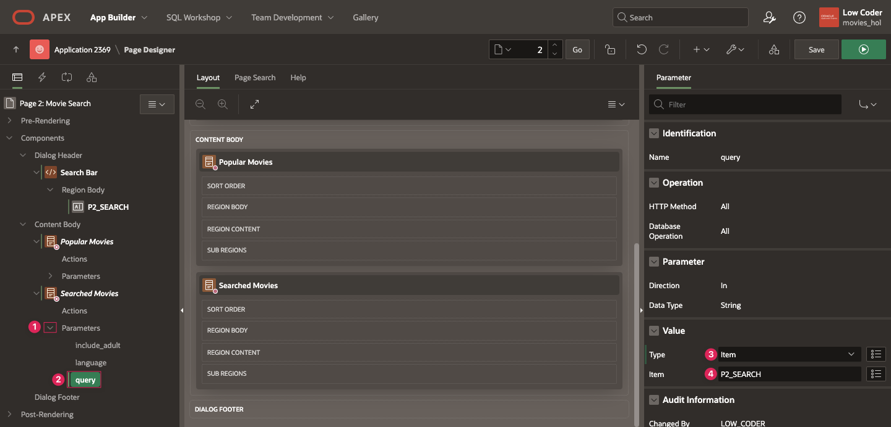

10. Save your changes by clicking the **Save** button in the top right of the Page Designer.

## Task 4: Link Movie Search to Watchlist Page

The last task in this lab is linking the Movie Search page to the My Watchlist page. A modal dialog page like Movie Search can only be run on by launching it from another page, so you will create a button on the Watchlist page that will open the Search page.

1. Go to page 1 by clicking the down arrow in the page navigation on the Page Designer toolbar.

    

2. In the Rendering pane on the left, click **Movies Watchlist** region in the Breadcrumb Bar position.

    - In the Property editor on the right, set the Title: **My Watchlist**

    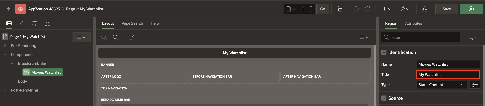

3. Right-click **My Watchlist** region and select **Create Button**.

    

4. In the Property editor, enter/select the following:

    - Identification > Button Name: **ADD_MOVIE**

    - Layout > Slot: **Next**

    - Appearance > Hot: Toggle **On**

    - Under Behavior:

        - Action: **Redirect to Page in this Application**

        - Target: Click **No Link Defined** to open the Link Builder dialog.

            - Page: **2**

            - Clear Cache: **2**

    > *Note: 2 is the ID of your Movie Search page. Clearing the Movie Search page cache will ensure the page items in are cleared each time the page is opened so users can perform new searches.*

    Click **Ok** to close the dialog.

    

5. You also need to add a Dynamic Action to the button so that the My Watchlist page updates properly when the Movie Search page dialog closes.

6. Right-click **ADD_MOVIE** button and click **Create Dynamic Action**.

    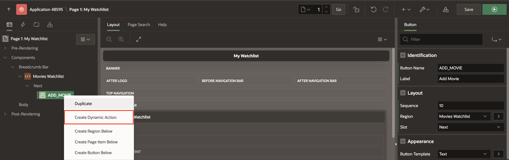

7. In the Property editor, enter/select the following:

    - Identification > Name: **Refresh on Dialog Closed**

    - When > Event: **Dialog Closed or Canceled**

    

8. In the **Rendering** tab, click the arrow next to Refresh on Dialog Closed to expand the event.

9. Click **Refresh** action under True. In the Property editor, select the following:

    - Identification → Action: **Submit Page**

10. Click the **Save and Run** button at the top right of the Page Designer.

    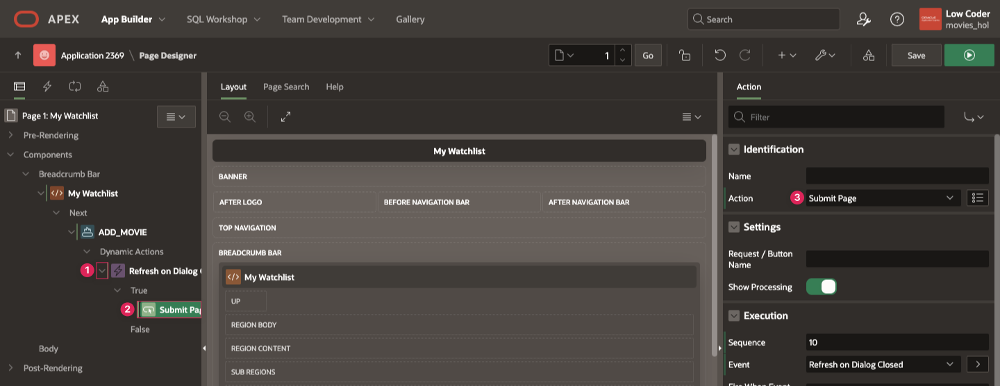

11. Click the **Add Movie** button to open the Movie Search page.

    

12. You should only see the search bar and the list of popular movies.

    

13. Type "harry potter" in the search bar and hit Enter (Return on Mac).

    - You should get results for movies with the search term "harry potter" in the title.

    

14. Delete "harry potter" from the search bar and press Enter (Return on Mac). The popular movies should reappear.

15. In the Development Bar at the bottom of the page, click **Page 2** to return to editing Page 2 in Page Designer.

    

## Summary

You now know how to create a page in your APEX application and add components to define content in Page Designer. You may now **proceed to the next lab**.

## Learn More

- [Page Designer Documentation](https://docs.oracle.com/en/database/oracle/apex/24.2/htmdb/about-page-designer.html)

- [Cards Documentation](https://docs.oracle.com/en/database/oracle/apex/24.2/htmdb/managing-cards.html)

- [Cards in Universal Theme](https://apex.oracle.com/pls/apex/r/apex_pm/ut/card-regions)

- [Modal Dialog Pages](https://docs.oracle.com/en/database/oracle/apex/24.2/htmdb/creating-dialog-pages.html)

- [Variables in APEX](https://www.talkapex.com/2011/01/variables-in-apex/)

- [Intro to Dynamic Actions Video](https://www.youtube.com/watch?v=hpcYevCC-Ow)

- [Dynamic Actions Documentation](https://docs.oracle.com/en/database/oracle/apex/24.2/htmdb/managing-dynamic-actions.html)

## Stuck? Download the Application Here

Stuck on a step or struggling with the lab? You can download a copy of the Movies Watchlist application through Lab 3 and follow the instructions below to import it into your Oracle APEX workspace.

- [Click here](https://c4u04.objectstorage.us-ashburn-1.oci.customer-oci.com/p/EcTjWk2IuZPZeNnD_fYMcgUhdNDIDA6rt9gaFj_WZMiL7VvxPBNMY60837hu5hga/n/c4u04/b/livelabsfiles/o/lab-3-241.sql) to download a copy of the app at the end of Lab 3.

- You can import the app to your APEX workspace by clicking **Import** in the App Builder home page and following the wizard steps.

- You will be prompted for the Credentials for Movies web credential that was set up in lab 2. You can see in the screenshot below that Credentials for Movies does not already exist in the workspace.

    > *Note: If you completed Lab 2, Credentials for Movies will already exist in your workspace and this will be pre-filled.*

    

- If Credentials for Movies does not already within your workspace, set the following for the Credentials for Movies row:

    - In the Client ID or Username column, enter **api\_key**.

    - In the Client Secret or Password column, paste your unique API key that you got from The Movie Database.

    - In the Verify Client Secret/Password column, past your API key again.

    

- Click **Next**.

- Make sure Install Supporting Objects is **on** and click **Next** again.

- Click **Install** to install the supporting objects and finish importing the application.

## Acknowledgements

- **Author** - Paige Hanssen
- **Last Updated By/Date** - Ankita Beri, Product Manager, April 2025