# Create Users and Watchlist Tables

## Introduction
Up to this point, most of the work has revolved around implementing REST data sources and creating pages to use that data on. In this lab, you will create local tables to store user and movie data. You will also add an application item and process, which will capture and store a user email and ID when a user logs into the app. This is what allows multiple users to have their own watchlist.

Estimated Lab Time: 10 minutes

Watch the video below for a quick walk-through of the lab.
[Create Users and Watchlist Tables](videohub:1_rrs5gczn)

### Objectives
In this lab, you will:  
- Set up the movie_users and watchlist tables using Quick SQL.  
- Create an application process and item for storing user information.

### Prerequisites
- Completion of workshop through Lab 4

## Task 1: Create the Movie Users Table
The first table you need to create is the movie\_users table. It is very simple, but it needs to be created before the watchlist table so that you can access the user ID. The watchlist table has a foreign key, user\_id, that will link it to the movie\_users table and allow different users to have their own unique lists.

1. In the Page Designer tab in your browser, click the down arrow next to SQL Workshop in the APEX navigation bar, hover over Utilities, and select **Quick SQL**. 

    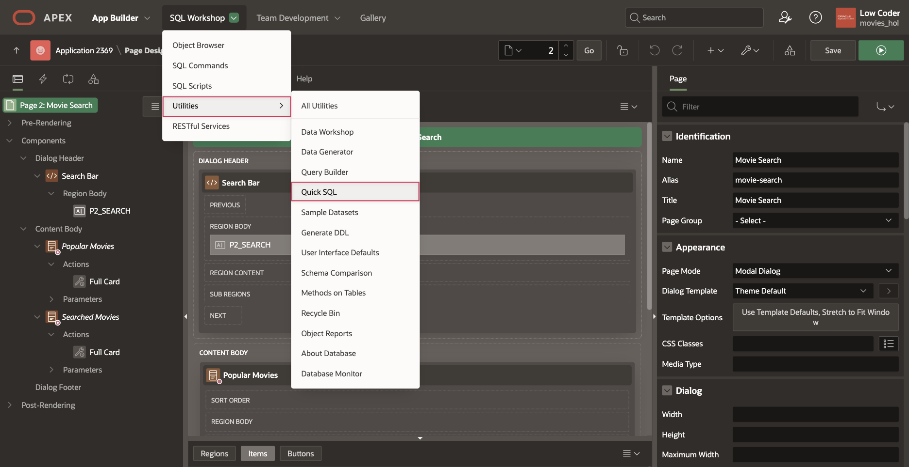

2. Copy the code below and paste into the first line of the code editor:

    ```
    <copy>
    movie_users
        username /unique
    ```

    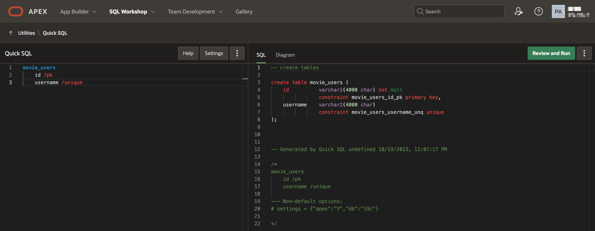

3. Click **Settings** on the top right of the Quick SQL toolbar. 

    * Scroll down to Additional Columns and check **Audit columns**.

    * This will automatically add the Created, Created\_By, Updated, and Updated\_By columns to the table.

    * Click **Save Changes**.

    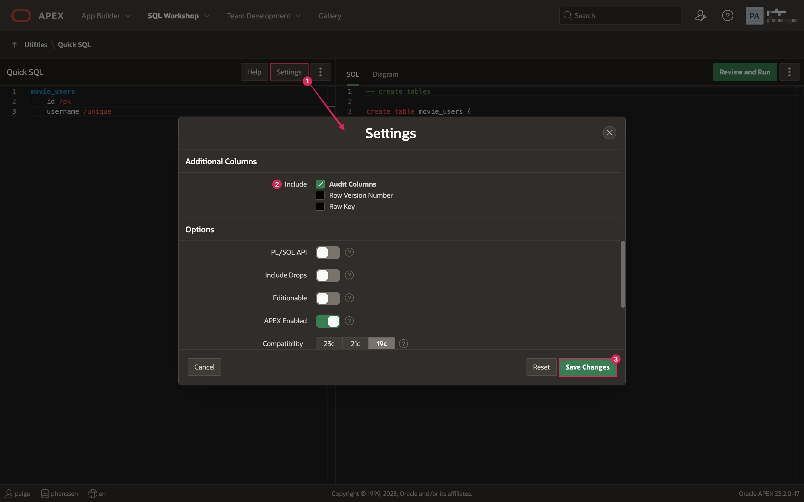

4. Click the **Review and Run** button. 

    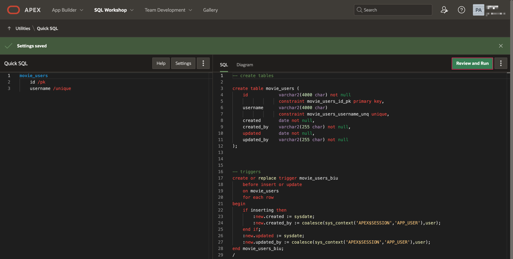

5. Enter **Create movie users** as the name for the script and select **Run**.

    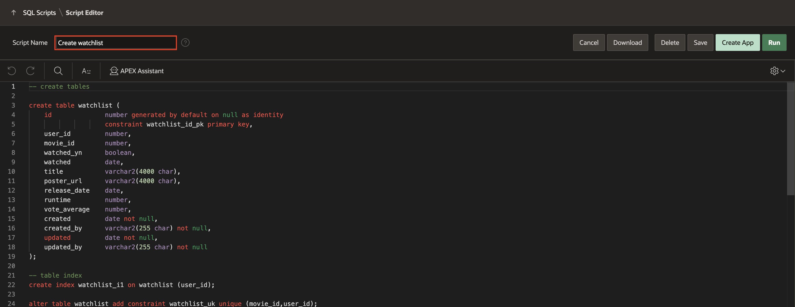

6. Click **Run Now**. You should see a success page with 2 statements successfully processed.

    

7. Now you will add an Application Item and Application Process, which will capture a user's email when they log in and assign them an ID so that you can keep track of their unique watchlist.

## Task 2: Create the Application Item and Process
To store data within the movie\_users database, you will use an application process. The process checks a user's email when they log in and if they are a new user, it adds them to a local table, assigning them an ID. The ID of the current user is also stored in an application item, which will be used when a user adds, removes, or updates movies in their watchlist.

1. Click on **App Builder** in the top APEX toolbar.

2. Click on your **Movies Watchlist** app.

3. Click on **Shared Components**.

4. In the Application Logic section of the page, click **Application Items**.

    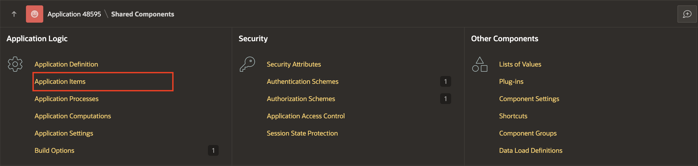

5. Click **Create**.

    * Set Name: **USER_ID**

    * Click **Create Application Item**.

    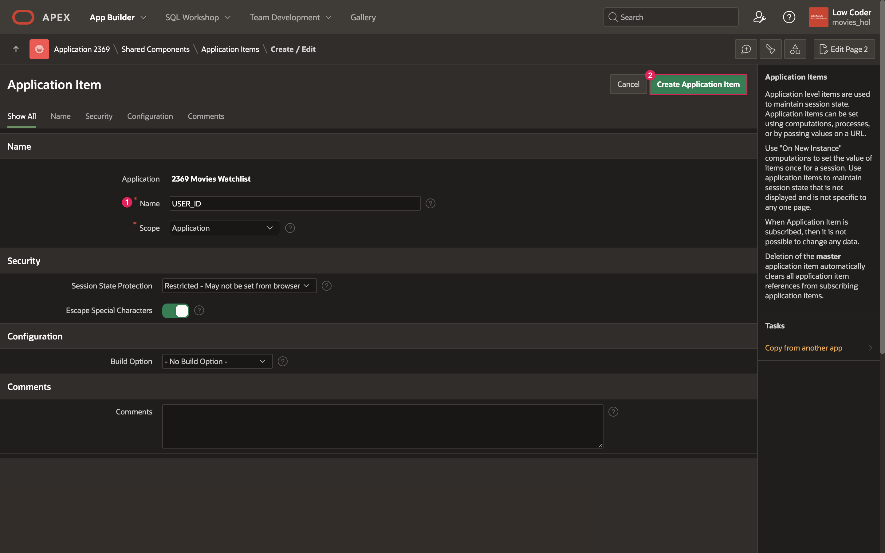

6. Go back to Shared Components and click on **Application Processes**.

    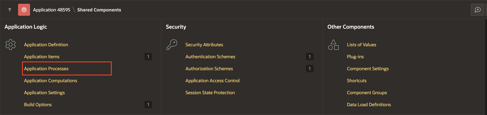

7. Click **Create**.

    * Name: **Add User**

    * Point: **After Authentication**

    * Click **Next**.

    

    * Copy and paste the following code into the Code editor box in the Source section:

    ```
    <copy>
    -- create movie user ID
    -- query movie_users table to check for existing user
    -- if yes, return PK as user_id
    -- if no, add new user to movie_users
    declare
        l_user_id number;
    begin
        select id into l_user_id from movie_users where username = :APP_USER;
        
        :USER_ID := l_user_id;
        
        exception
            when no_data_found then
            insert into movie_users 
                    (username)
                values 
                    (:APP_USER)
                returning 
                    id into :USER_ID;
    end;
    ```

    * Click **Next**.

    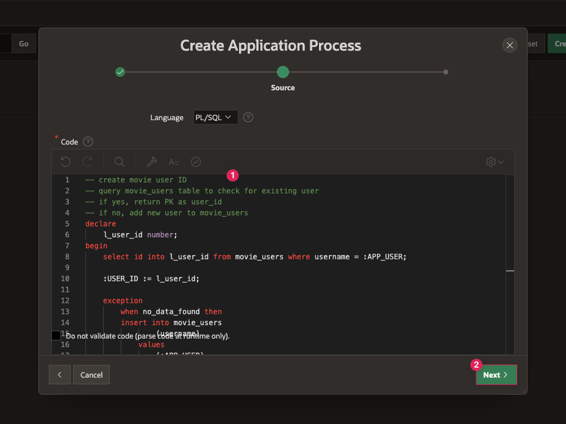

    * Click **Create Process**.

8. You have now set up an application item that keeps track of the current user's ID and added a process to store a user in the movie\_users table.

9. To initialize the user id for your movies app, you will need to sign out of your app in the tab in your browser where your app is running and sign back in.

10. On the My Watchlist page of your app, click the button at the top right of the screen where your username is displayed and click Sign Out.

    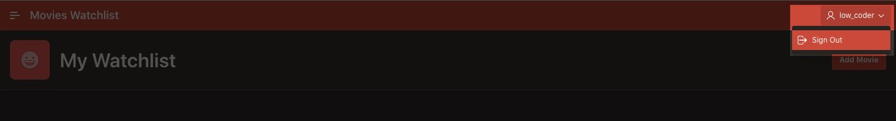

11. Now, sign back in and your new application process will run and store your user ID in the movie\_users table and the USER\_ID application item.

    

12. Next, you'll set up a new table using Quick SQL to store all of a user's movies that they add to their list.

## Task 3: Create the Watchlist Table
You will need a table to store some basic movie information in addition to the user information. This data is what will be the source for the My Watchlist page.

1. In the toolbar at the top of your APEX workspace, click the down arrow next to SQL Workshop, hover over Utilities, and select **Quick SQL**.

2. Copy the code below and replace the existing code by pasting it into the Quick SQL pane:

    ```
    <copy>
    watchlist /unique movie_id, user_id
        movie_id
        user_id /fk movie_users
        watched_yn
        watched date
        title
        poster_url
        release_date
        runtime num
        vote_average num
    ```

	* Note the /unique directive in the last line of the Quick SQL code. In the movie\_users table, you created a unique key by using the /unique directive for the username column. This prevents the same user from getting put into the table more than once by making sure the username is always unique. In the watchlist table, the unique key actually comes from two different columns: movie\_id and user\_id. A single user cannot add the same movie to the watchlist table more than once. Unique keys are extremely helpful when it comes to maintaining the integrity of the data in your local tables.

3. Just like you did for the movie\_users table, click Settings and select **Audit columns**. 

4. Click **Save Changes**.

    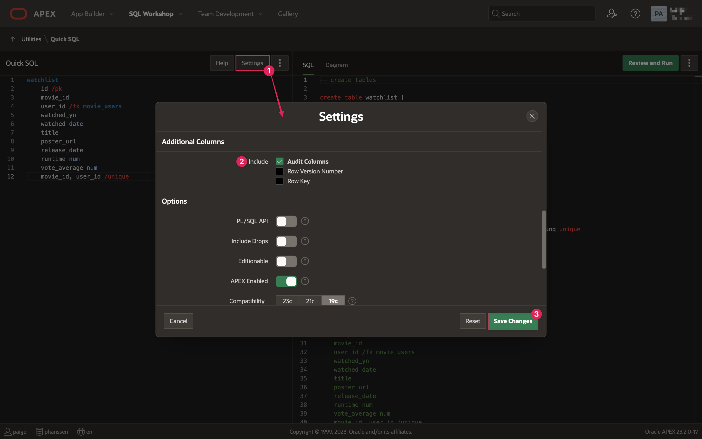

5. Click **Review and Run**.

6. Enter **Create watchlist** as the name for the script and select **Run**.

    

7. Click **Run Now**. You should see 3 statements executed successfully.

    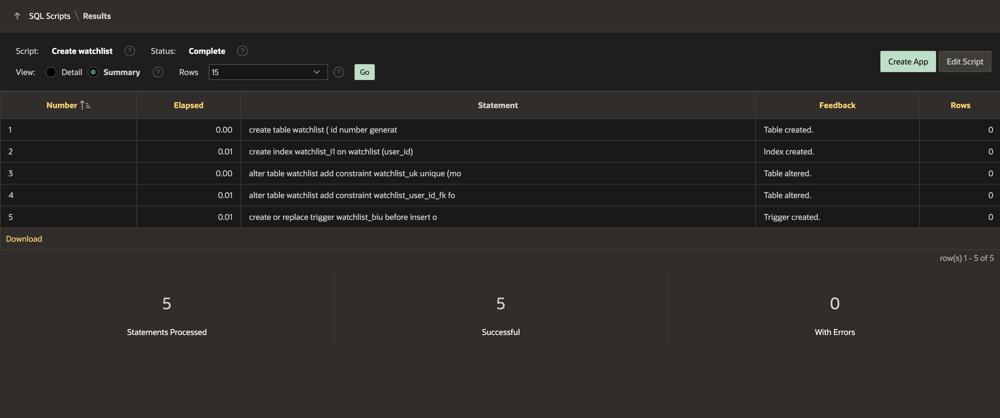

8. The watchlist table has now been created. When a user clicks the Add to Watchlist button in the Movie Details dialog, the SQL action will capture the movie and user data and store it in this table so that you can access it later to build out our Watchlist on the front end.

You now know how to use Quick SQL to define new tables, and create application items and processes to store information and at specific points in your app. Next you will set up your Back, Add, Remove, and Mark Watched buttons. You may now **proceed to the next lab**.

## Learn More

- [Tour of SQL Workshop](https://www.youtube.com/watch?v=bdglHoq-Hbs)  

- [Quick SQL Documentation](https://docs.oracle.com/en/database/oracle/apex/23.2/aeutl/using-quick-sql.html)

## Stuck? Download the Application Here
Stuck on a step or struggling with the lab? You can download a copy of the Movies Watchlist application through Lab 5 and follow the instructions below to import it into your Oracle APEX workspace.

- [Click here](https://c4u04.objectstorage.us-ashburn-1.oci.customer-oci.com/p/EcTjWk2IuZPZeNnD_fYMcgUhdNDIDA6rt9gaFj_WZMiL7VvxPBNMY60837hu5hga/n/c4u04/b/livelabsfiles/o/lab-5-241.sql) to download a copy of the app at the end of Lab 5.

- You can import the app to your APEX workspace by clicking **Import** in the App Builder home page and following the wizard steps.

- You will be prompted for the Credentials for Movies web credential that was set up in lab 2. You can see in the screenshot below that Credentials for Movies does not already exist in the workspace.  
*Note: If you completed Lab 2, Credentials for Movies will already exist in your workspace and this will be pre-filled*

      

- If Credentials for Movies does not already within your workspace, set the following for the Credentials for Movies row:

    - In the Client ID or Username column, enter **api\_key**.

    - In the Client Secret or Password column, paste your unique API key that you got from The Movie Database.

    - In the Verify Client Secret/Password column, past your API key again.

        

- Click **Next**.

- Make sure Install Supporting Objects is **on** and click **Next** again.

- Click **Install** to install the supporting objects and finish importing the application.

## Acknowledgements

- **Author** - Paige Hanssen
- **Last Updated By/Date** - Paige Hanssen, June 2024