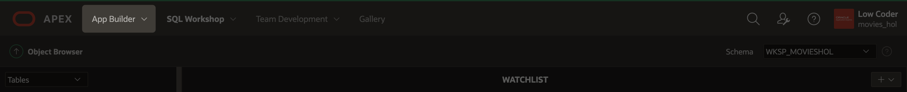
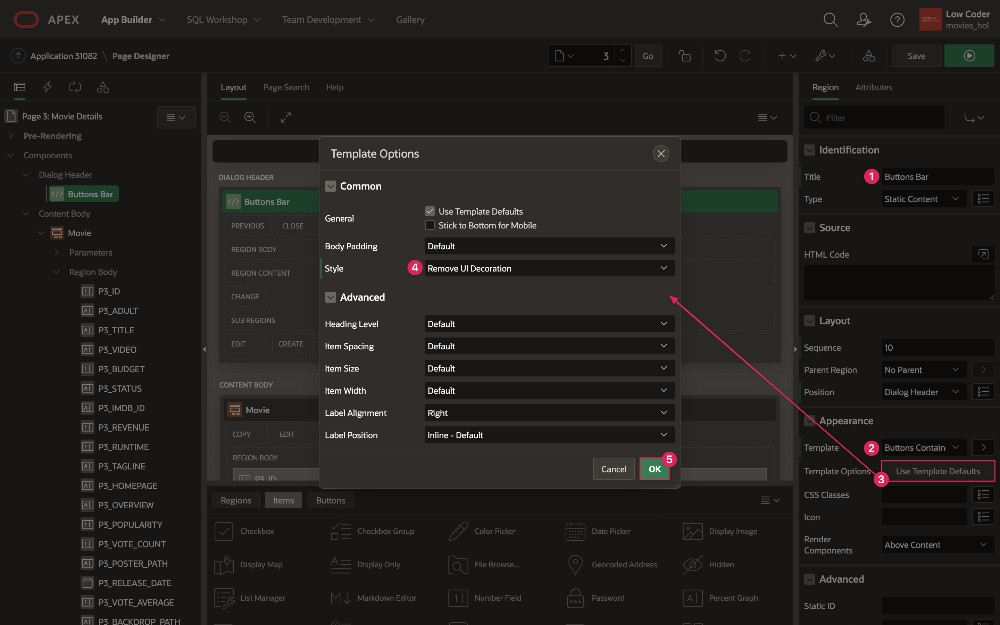
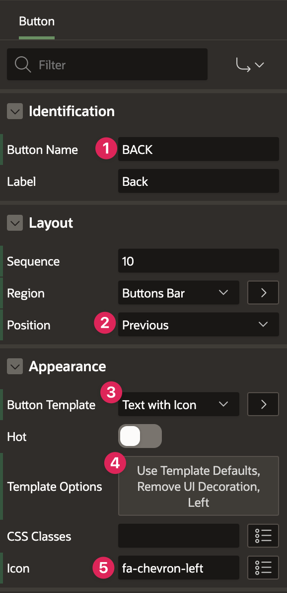
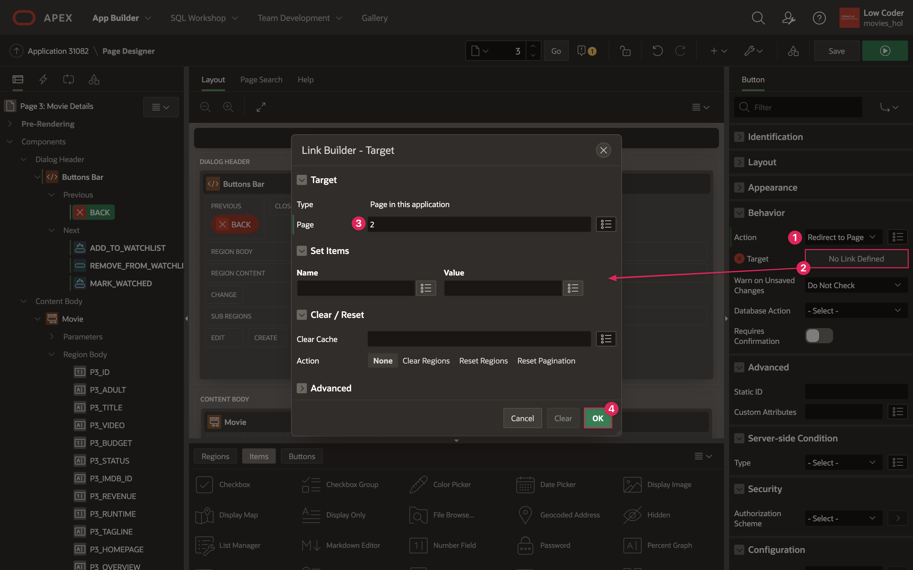
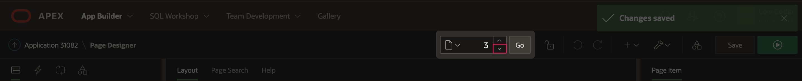
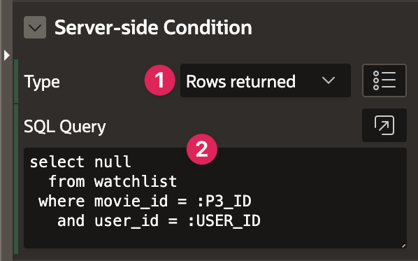

# Implement Movie Details Buttons and Movie Search Badges

## Introduction
In the previous lab, you did the backend work to set up tables and application items. In this lab, you will be creating Add, Remove, Watched, and Back buttons that will control the flow between the Movie Search and Movie Details page, as well as the data stored in the watchlist table. You will also add a badge to the Cards on the Movie Search page to have a visual cue for movies that a user has already marked as added or watched.

Estimated Lab Time: 15 minutes

### Objectives
In this lab, you will:  
- Implement an Add button that inserts a movie into the watchlist table.  
- Implement a Remove button that deletes a movie from the watchlist table.  
- Implement a Watched button that marks a movie as watched in your watchlist table.  
- Implement a Back button that takes you back to the Movie Search page.  
- Use badges on the Movie Search page to display what movies have been marked as added or watched.

### Prerequisites
- Completion of workshop through Lab 5

## Task 1: Create the Movie Details Buttons

1. Click on **App Builder** in the top APEX toolbar.

    

2. Click on your **Movies Watchlist** app.

3. Click on the **Movie Details** page (page 3).

4. In the rendering pane, right click on Dialog Header and select **Create Region**.

5. Set the following properties:

    * Identification → Title: **Buttons Bar**

    * Appearance → Template: **Buttons Container**

    * Appearance → Template Options:

        - Style: **Remove UI Decoration**

    

6. Right click the Buttons Bar region and select **Create Button**.

    * Identification → Button Name: **BACK**

    * Layout → Position: **Previous**

    * Appearance → Button Template: **Text with Icon**

    * Appearance → Template Options:

        - Style: **Remove UI Decoration**

        - Icon Position: **Left**

        - Click **Ok** to close the dialog.

    * Appearance → Icon: **fa-chevron-left**

    

7. Right click the Buttons Bar region and select **Create Button**.

    * Identification → Button Name: **ADD\_TO\_WATCHLIST**

    * Layout → Position: **Next**

    * Appearance → Hot: **on**

    

8. Right click the Buttons Bar region and select **Create Button**.

    * Identification → Button Name: **REMOVE\_FROM\_WATCHLIST**

    * Layout → Position: **Next**

    

9. Right click the Buttons Bar region and select **Create Button**.

    * Identification → Button Name: **MARK\_WATCHED**

    * Identification → Label: **I've Watched This**

    * Layout → Position: **Next**

    * Appearance → Hot: **on**

    

## Task 2: Implement Button Actions
Now that you have made the 4 buttons, it's time to connect actions to them. You first will connect each button to a database action so that APEX knows what SQL commands will be used for each. Then, you will need to implement those actions using a process for each button. You will also use a branch to redirect the user back to the previous page once the process is complete.

1. In the rendering pane, click on the **BACK** button and scroll down to the Behavior section.

    * Action: **Redirect to Page in this Application**

    * Click the button next to Target to open the Link Builder → Target dialog.

        - Page: **2**

        - Click **Ok**.

    

2. Click on **ADD\_TO\_WATCHLIST**.

    * Scroll down to Behavior and set Database Action to **SQL INSERT action**.

    

3. Click on **REMOVE\_FROM\_WATCHLIST**.

    * Set Database Action to **SQL DELETE action**.

4. Click on **MARK\_WATCHED**.

    * Set Database Action to **SQL UPDATE action**.

5. At the top of the rendering pane, click the **Processing** tab (the two looping arrows).

    

6. Right click on Processing and select **Create Process**.

    * Identification → Name: **Add to watchlist**

    * Copy the following code and paste it into the PL/SQL code box in the Source property group:

		```
	    <copy>
	    insert into watchlist
			(
				movie_id,
				user_id,
				watched_yn,
				title,
				poster_url,
				release_date,
				runtime,
				vote_average
			)
		values
			(
				:P3_ID,
				:USER_ID,
				'N',
				:P3_TITLE,
				:P3_POSTER_URL,
				:P3_RELEASE_DATE,
				:P3_RUNTIME,
				:P3_VOTE_AVERAGE
			);
	    ```

    * Server-side Condition → When Button Pressed: **ADD\_TO\_WATCHLIST**

    

7. Right click on Processing and select **Create Process**.

    * Identification → Name: **Remove from watchlist**

    * Copy the following code and paste it into the PL/SQL code box in the Source property group:

		```
	    <copy>
	    delete from watchlist 
		 where movie_id = :P3_ID 
		   and user_id = :USER_ID;
	    ```

    * Server-side Condition → When Button Pressed: **REMOVE\_FROM\_WATCHLIST**

8. Right click on Processing and select **Create Process**.

    * Identification → Name: **Update watchlist**

    * Copy the following code and paste it into the PL/SQL code box in the Source property group:

		```
	    <copy>
	    update watchlist
		   set watched_yn = 'Y',
			   watched = SYSDATE
		 where movie_id = :P3_ID
		   and user_id = :USER_ID;
	    ```

    * Server-side Condition → When Button Pressed: **MARK\_WATCHED**

9. Finally, you will add a branch that runs after processing to redirect the user to the previous page, regardless of which button they pressed.

10. In the processing pane on the left, right click on After Processing and select **Create Branch**.

    * Identification → Name: **Redirect to previous page**

    * Click on **Target** to open the Link Builder

        - Page: **&P3\_PREVIOUS\_PAGE\_ID.**

        - The item P3\_PREVIOUS\_PAGE\_ID contains the page number of the page you were on before the Movie Details page. This is to return to whichever page the user was on previously when any of the buttons on the Movie Details page get clicked. However, you still need to set up the Previous Page ID item, so you will do that now.

        - Click **Ok**.

11. Click the **Rendering** tab at the top of the left pane. 

    

12. Right click on the Movie region and select **Create Page Item**.

    * Name: **P3\_PREVIOUS\_PAGE\_ID**

13. Click **Save**.

14. Navigate to Page 2 in your application builder. 

    

15. Click on the **Full Card** action under the Popular Movies region.

    * In the Link properties group, click on **Target**. 

    * Under Set Items, add an item: 

        - Name: **P3\_PREVIOUS\_PAGE\_ID**

        - Value: **2**

        - Click **Ok**.

    

18. Follow Step 15 again for the Searched Movies Full Card action.

19. Click **Save**.

## Task 3: Add Server-Side Conditions to Buttons
At this point, all of the buttons on the Movie Details page display at all times, regardless of whether or not you've already added a movie to your list or marked something as watched. You should really only show the Remove or Watched buttons if a movie exists in the watchlist table, meaning the user has added it. Similarly, you should only display the Added button if a user has not yet added a movie to the the watchlist table.

To accomplish this, you are going to use Server-Side Conditions, like you did for the Popular Movies and Searched Movies regions on page 2. You will also add a condition for the Back button, so that it only displays if the previous page is the Movie Search page.

1. In the application builder tab in your browser, navigate to page 3, Movie Details, and click on the **ADD\_TO\_WATCHLIST** button.

2. Type **server** into the search field at the top of the properties pane to find the **Server-side Condition** property group. Click the pin button to keep the filtered property group even when you move to other components, and then set the following properties:

    * Type: **No Rows returned**

    * SQL Query:

	    ```
	    <copy>
	    select null
	      from watchlist
	     where movie_id = :P3_ID
	       and user_id = :USER_ID
	    ```

        

3. Click on the **REMOVE\_FROM\_WATCHLIST** button.

4. Set the following Server-side Condition properties:

    * Type: **Rows returned**

    * SQL Query:

	    ```
	    <copy>
	    select null
	      from watchlist
	     where movie_id = :P3_ID
	       and user_id = :USER_ID
	    ```

        

5. Click on the **MARK\_WATCHED** button.

6. Set the following Server-side Condition properties:

    * Type: **Rows returned**

    * SQL Query:

	    ```
	    <copy>
	    select null
	      from watchlist
	     where movie_id =:P3_ID
	       and user_id = :USER_ID
	       and watched_yn = 'N'
	    ```

        

7. Click on the **BACK** button.

8. Set the following Server-side Condition properties.

    * Type: **Item = Value**

    * Item: **P3\_PREVIOUS\_PAGE\_ID**

    * Value: **2**

    
    
9. Click the pin button in the search field at the top of the properties pane to display all property groups when you navigate to a new page component.

9. Click **Save**.

10. Before you test the buttons, you will add badges to the Movie Search page so that you have a visual cue of what has been added and marked as watched.

## Task 4: Add Badges to Movie Search Cards
Before you test the buttons you just implemented, you will add badges to the Movie Search page so that you have a visual cue of what has been added and marked as watched. You can extend the Popular and Search Movies data that gets returned from the REST data source by checking the WATCHLIST table to find movies with a matching ID to the displayed movies on the search page.

1. Navigate to page 2 in your Movies Watchlist application and click on the **Popular Movies** region.

    * Scroll down to the Local Post Processing property group and set Type: **SQL Query**

    * Replace the existing SQL Query with the query below:

        ```
        <copy>
        select ads.id,
               ads.adult,
               ads.title,
               ads.video,
               ads.overview,
               ads.popularity,
               ads.vote_count,
               ads.poster_path,
               ads.release_date,
               ads.vote_average,
               ads.backdrop_path,
               ads.original_title,
               ads.original_language,
               ads.poster_url,
               case when w.watched_yn = 'Y' then 'Watched'
                    when w.watched_yn = 'N' then 'Added'
                    end as badge_label,
               case when w.watched_yn = 'N' then 'u-success'
                    end as badge_color
          from #APEX$SOURCE_DATA# ads
        LEFT OUTER JOIN
            -- doing inline select to limit rows to current user
            (select * from watchlist where user_id = :USER_ID) w
            ON w.movie_id = ads.ID
        ```

        - The above code extends the Popular Movies data that gets returned from the REST data source by joining the REST data source with the watchlist table to add two columns: BADGE\_LABEL and BADGE\_COLOR. For the BADGE\_LABEL column, each movie in the Popular Movies list has the value 'Watched' (movies in the WATCHLIST table that are marked as Watched), 'Added' (movies in the WATCHLIST table that are not marked as Watched), or NULL (movies that are not in the WATCHLIST table). Similarly, the BADGE\_COLOR list contains values 'u-success' or NULL, based on whether or not a movie is in the WATCHLIST table and not marked as Watched.

        

    * Click on the **Attributes** tab.

    * Icon and Badge → Badge Column: **BADGE\_LABEL**

    * Icon and Badge → Badge CSS Classes: **&BADGE\_COLOR.**

    

2. Now that you have set up badges on the Popular Movies region, return to the beginning of step 1 and follow the same steps for Searched Movies.

3. Save your changes and refresh the tab where your app is running. Now you can play around with the Movie Search and Movie Details page and test out adding, removing, and marking items as watched.

    * From the Movie Search page, select a movie and you will see the Back and Add to Watchlist buttons.

    

    * Click the Add to Watchlist button and you will be redirected back to the Movie Search page where you will see the Added label on the movie you added.

    

    * Click on the movie you just added to your watchlist, and you will see the Back, Remove From Watchlist, and I've Watched This buttons.

    

    * Click the I've Watched This button and you will be redirected back to the Movie Search page where you will see the Watched label on the movie you just marked as watched.

    
    
4. In the Development Bar at the bottom of the page, click **Application XXXXX** to return to the application builder.

You now know how to use SQL commands in Page Designer regions and processes to get, store, update, and delete data from your tables. You may now **proceed to the next lab**.

## Resources

- [Buttons Documentation](https://docs.oracle.com/en/database/oracle/application-express/21.1/htmdb/creating-buttons.html#GUID-F6DA76D1-2020-4930-8D26-12D0A3497C8E)

- [Intro to Dynamic Actions Video](https://www.youtube.com/watch?v=hpcYevCC-Ow)  

- [Dynamic Actions Documentation](https://docs.oracle.com/en/database/oracle/application-express/21.1/htmdb/managing-dynamic-actions.html#GUID-7E564715-E963-44AA-B620-5FFB5EFA62EE)  

- [Understanding Page Processes](https://docs.oracle.com/en/database/oracle/application-express/21.1/htmdb/understanding-page-processes.html#GUID-DE72F8ED-A3A0-4FBC-8362-ABA47E543466)  

- [Controlling Navigation Using Branches](https://docs.oracle.com/en/database/oracle/application-express/21.1/htmdb/controlling-navigation-using-branches.html#GUID-AE2164D3-6D95-4EB3-BF12-60C2278A1D0E)  

## Stuck? Download the Application Here
Stuck on a step or struggling with the lab? You can download a copy of the Movies Watchlist application through Lab 6 and follow the instructions below to import it into your Oracle APEX workspace.

- [Click here](./files/lab6.sql) to download a copy of the app at the end of Lab 6.

- You can import Lab 6 to your APEX workspace by clicking **Import** in the App Builder home page and following the wizard steps.

- When the install wizard prompts you for Credentials, follow the instructions in the <a href="?lab=creating-movie-details-page#Stuck?DownloadtheApplicationHere" target="_blank">Stuck?</a> section of Lab 4 to update the API key for the Movie Details REST source.

- Follow the instructions in the <a href="?lab=creating-movie-search-page#Stuck?DownloadtheApplicationHere" target="_blank">Stuck?</a> section of Lab 3 to update the Popular and Search Movies API keys.

## Acknowledgments

- **Author** - Paige Hanssen
- **Additional Contributors** - Kay Jasanya, Shakeeb Rahman, Steve Muench, Monica Godoy, Eli Feuerstein, Carlos Maciel, Dalia Vazquez
- **Last Updated By/Date** - Paige Hanssen, March 2022