# Implement Movie Details Buttons and Movie Search Badges

## Introduction

In the previous lab, you did the backend work to set up tables and application items. In this lab, you will be creating Add, Remove, Watched, and Back buttons that will control the flow between the Movie Search and Movie Details page, as well as the data stored in the watchlist table. You will also add a badge to the Cards on the Movie Search page to have a visual cue for movies that a user has already marked as added or watched.

Estimated Lab Time: 25 minutes

Watch the video below for a quick walk-through of the lab.
[Implement Buttons and Badges](videohub:1_72lhu5y9)

### Objectives

In this lab, you will:

- Implement an Add button that inserts a movie into the watchlist table.

- Implement a Remove button that deletes a movie from the watchlist table.

- Implement a Watched button that marks a movie as watched in your watchlist table.

- Implement a Back button that takes you back to the Movie Search page.

- Use badges on the Movie Search page to display what movies have been marked as added or watched.

### Prerequisites

- Completion of workshop through Lab 5

## Task 1: Create the Movie Details Buttons

1. Click **App Builder** in the APEX navigation bar.

2. Select your **Movies Watchlist** application. Select **Movie Details** page.

    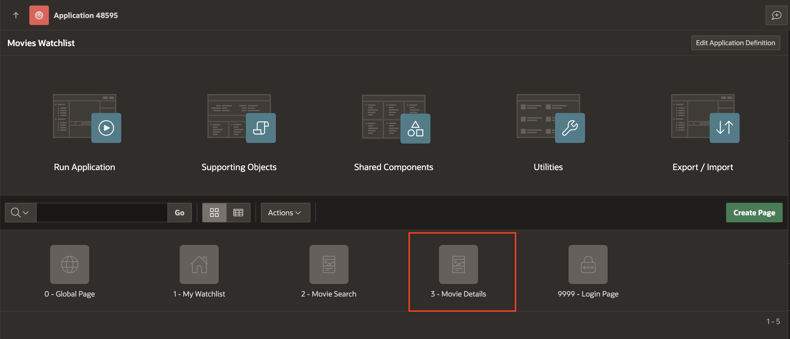

3. When you set up the Movie Details page, a Buttons region was automatically created in the Dialog Footer position of the page with a Cancel button. You are going to move this region to the Dialog Header position and add some buttons that will allow you to add, remove, and update your watchlist.

4. In the **Rendering** tab, navigate to **Buttons** region and enter/select following properties:

    - Layout > Slot: **Dialog Header**.

    - Appearance > Template Options > Click **Use Template Defaults**

        - Style: **Remove UI Decoration**

        Click **Ok**.

    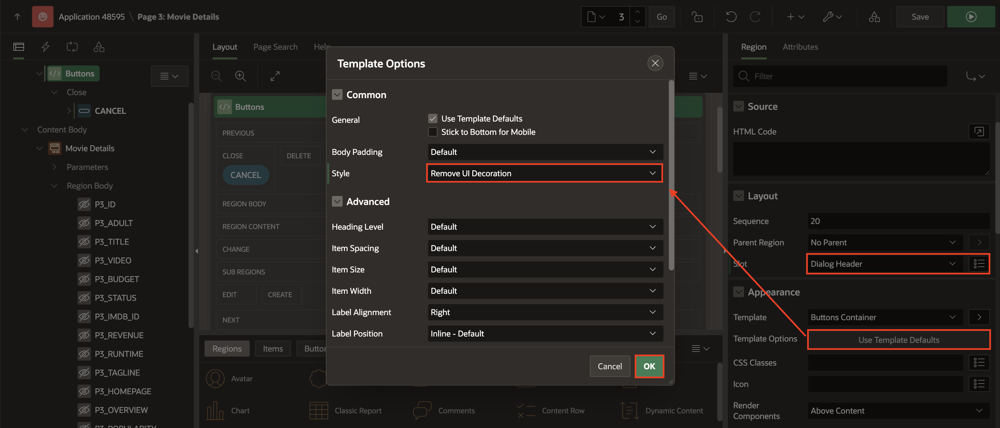

5. Now, navigate to **CANCEL** button under the **Buttons** region. In the Property editor, enter/select the following page attributes:

    - Identification > Button Name: **BACK**

    - Layout > Slot: **Previous**

    - Under Appearance:

        - Button Template: **Text with Icon**

        - Appearance > Template Options: Open **Use Template Defaults**

            - Style: **Remove UI Decoration**

            Click **OK** to close the dialog.

        - Icon: **fa-chevron-left**

    

6. Click the right arrow next to the BACK button and then the right arrow next to Dynamic Actions to see the Dynamic Action events connected to the button.

7. Delete the Dynamic Action by right clicking on the **Cancel Dialog** event under Dynamic Actions and selecting **Delete**.

    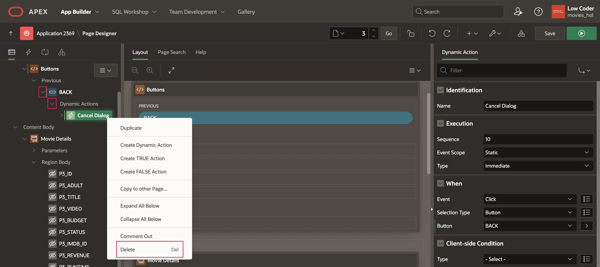

8. Right-click **Buttons** region and select **Create Button**.

    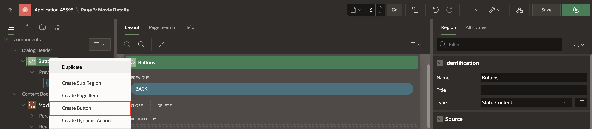

9. In the Property editor, enter/select the following page attributes:

    - Identification > Button Name: **ADD\_TO\_WATCHLIST**

    - Layout > Slot: **Next**

    - Appearance > Hot: Toggle **On**

    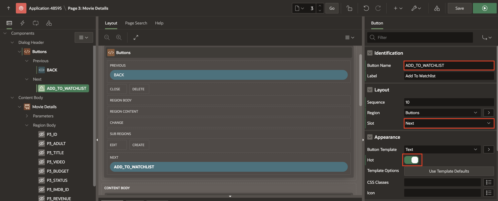

10. Right-click **Buttons** region and select **Create Button**.

11. In the Property editor, enter/select the following page attributes:

    - Identification > Button Name: **REMOVE\_FROM\_WATCHLIST**

    - Layout > Slot: **Next**

    

12. Right-click **Buttons** region and select **Create Button**.

    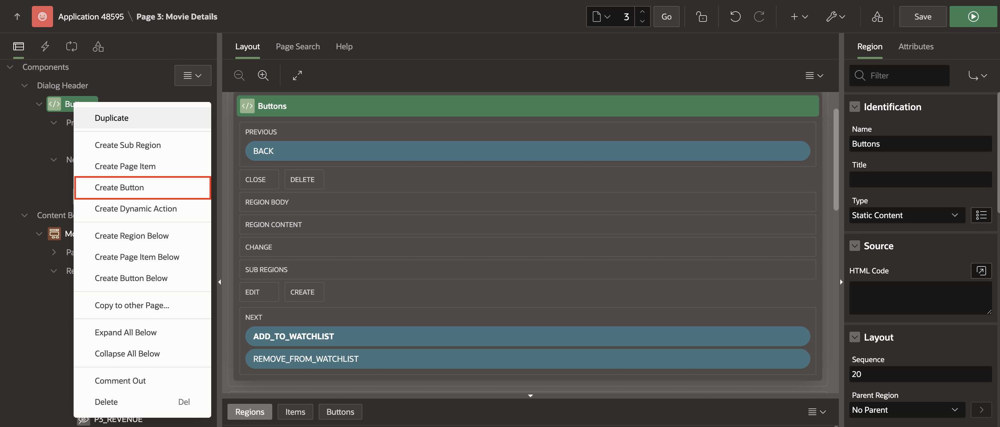

13. In the Property editor, enter/select the following page attributes:

    - Under Identification:

        - Button Name: **MARK\_WATCHED**

        - Label: **I've Watched This**

    - Layout > Position: **Next**

    - Appearance > Hot: Toggle **On**

    

14. Click **Save**.

## Task 2: Implement Button Actions

Now that you have the four buttons, it's time to connect actions to them. You first will connect each button to a database action. Then, you will implement those actions using a page process for each button. You will also use a branch to redirect the user back to the previous page once the process is complete.

1. In the **Rendering** tab, navigate to **BACK** button. In the Property editor, enter/select the following page attributes:

    - Under Behavior:

        - Action: **Redirect to Page in this Application**

        - Target: Click **No Link Defined**

            - Page: **2**

            Click **OK**.

    

2. Navigate to **ADD\_TO\_WATCHLIST** button. In the Property editor, select the following page attribute:

    - Behavior > Database Action: **SQL INSERT action**.

    

3. Navigate to **REMOVE\_FROM\_WATCHLIST** button. In the Property editor, select the following page attribute:

    - Behavior > Database Action: **SQL DELETE action**.

4. Navigate to **MARK\_WATCHED** button. In the Property editor, select the following page attribute:

    - Behavior > Database Action: **SQL UPDATE action**.

5. At the top of the rendering pane, click the **Processing** tab (the two looping arrows).

    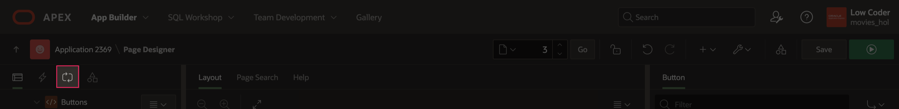

6. Under **Processing** tab, click on the existing **Close Dialog** process and make the following changes:

    - Under Identification:

        - Name: **Add movie**

        - Type: **Execute Code**

    - Source > PL/SQL Code: Copy the following code and paste it into the code editor:

		```
	    <copy>
	    insert into watchlist
			(
				movie_id,
				user_id,
				watched_yn,
				title,
				poster_url,
				release_date,
				runtime,
				vote_average
			)
		values
			(
				:P3_ID,
				:USER_ID,
				'N',
				:P3_TITLE,
				'https://image.tmdb.org/t/p/w500'||:P3_POSTER_PATH,
				:P3_RELEASE_DATE,
				:P3_RUNTIME,
				:P3_VOTE_AVERAGE
			);
	    ```

    - Under Server-side Condition:

        - When Button Pressed: **ADD\_TO\_WATCHLIST**

        - Type: **- Select -**

    

7. Right-click **Processing** and select **Create Process**.

    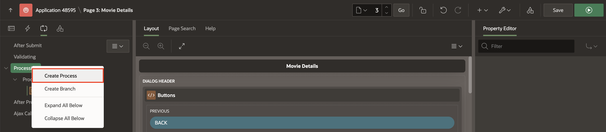

8. In the Property editor, enter/select the following page attributes:

    - Identification > Name: **Remove movie**

    - Source > PL/SQL Code: Copy the following code and paste it into the code editor:

		```
	    <copy>
	    delete from watchlist
		 where movie_id = :P3_ID
		   and user_id = :USER_ID;
	    ```

    - Server-side Condition > When Button Pressed: **REMOVE\_FROM\_WATCHLIST**

    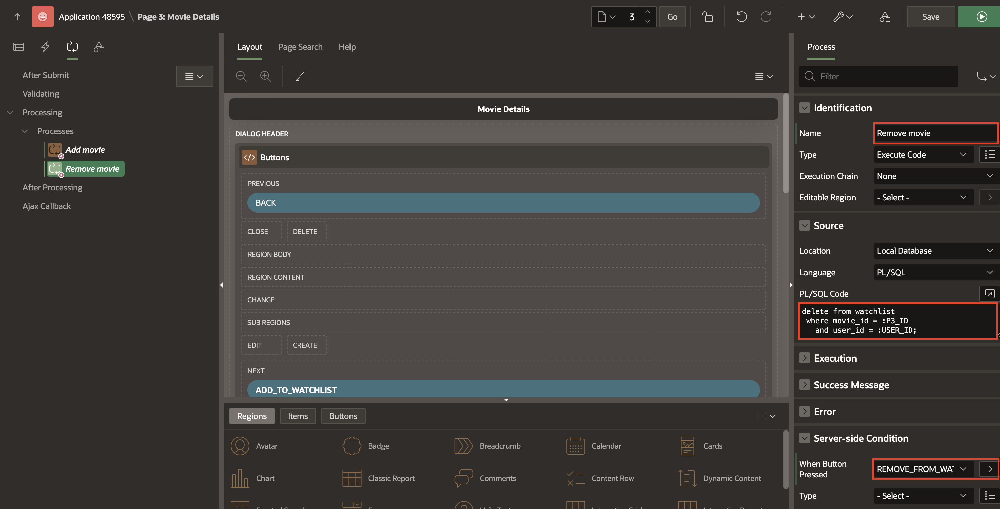

9. Right-click **Processing** and select **Create Process**.

10. In the Property editor, enter/select the following page attributes:

    - Identification > Name: **Update movie**

    - Source > PL/SQL Code: Copy the following code and paste it into the code editor:

		```
	    <copy>
	    update watchlist
		   set watched_yn = 'Y',
			   watched = SYSDATE
		 where movie_id = :P3_ID
		   and user_id = :USER_ID;
	    ```

    - Server-side Condition > When Button Pressed: **MARK\_WATCHED**

    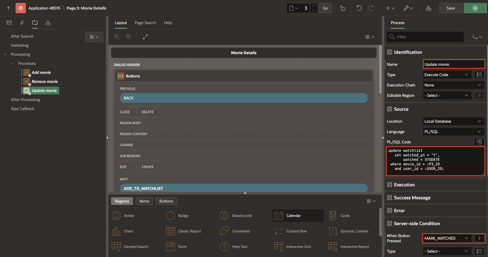

11. Finally, you will add a branch that runs after the processing action to redirect the user to the previous page.

12. In the **Processing** tab, right-click **After Processing** and select **Create Branch**.

    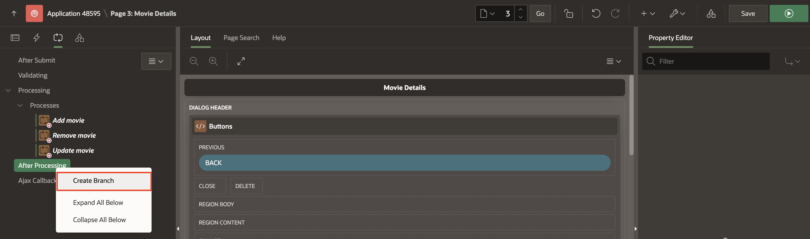

13. In the Property editor, enter/select the following page attributes:

    - Identification > Name: **Redirect to previous page**

    - Behavior > Target: Click **No Link Defined**

        - Page: **&P3\_PREVIOUS\_PAGE\_ID.**

        > *Note: The item P3\_PREVIOUS\_PAGE\_ID contains the page number of the page you were on before the Movie Details page. This is to return to whichever page the user was previously on when any of the buttons on the Details page get clicked. However, you still need to set up the Previous Page ID item, so you will do that now.*

        Click **OK**.

    

14. Navigate to **Rendering** tab at the top of the left pane.

15. Right-click **Movie Details** region and select **Create Page Item**.

    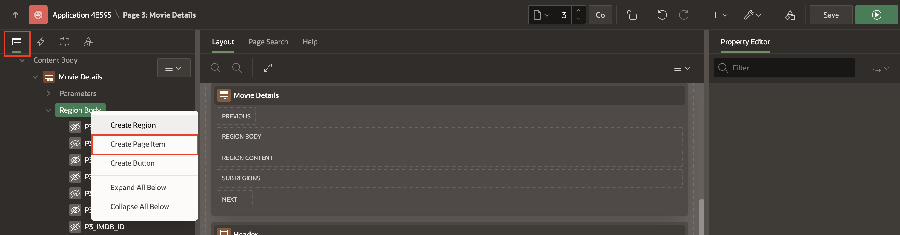

16. In the Property editor, enter/select the following page attributes:

    - Under Identification:

        - Name: **P3\_PREVIOUS\_PAGE\_ID**

        - Type: **Hidden**

     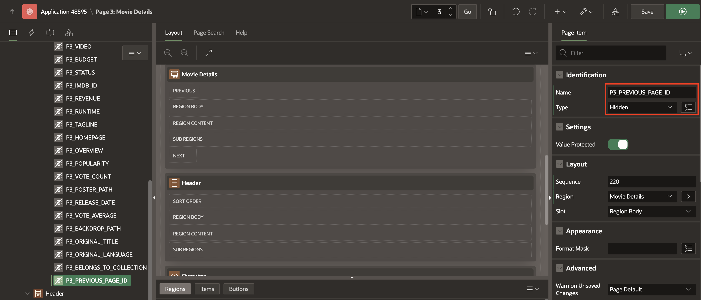

17. Click **Save**.

## Task 3: Add Server-Side Conditions to Buttons

At this point, all of the buttons on the Movie Details page display at all times, regardless of whether or not you've already added a movie to your list or marked something as watched. You should really only show the Remove or Watched buttons if a movie exists in the watchlist table, meaning the user has added it. Similarly, you should only display the Added button if a user has not yet added a movie to the the watchlist table.

To accomplish this, you are going to use Server-Side Conditions, like you did for the Popular Movies and Searched Movies regions on page 2. You will also add a condition for the Back button, so that it only displays if the previous page is the Movie Search page.

1. Under **Buttons** region, navigate to **ADD\_TO\_WATCHLIST** button.

2. In the Property editor, enter/select the following page attributes:

    - Under Server-side Condition:

        - Type: **No Rows returned**

        - SQL Query: Copy and paste the below code into the code editor:

	    ```
	    <copy>
	    select null
	      from watchlist
	     where movie_id = :P3_ID
	       and user_id = :USER_ID
	    ```

        

3. Now, navigate to **REMOVE\_FROM\_WATCHLIST** button.

4. In the Property editor, enter/select the following page attributes:

    - Under Server-side Condition:

        - Type: **Rows returned**

        - SQL Query: Copy and paste the below code into the code editor:

	    ```
	    <copy>
	    select null
	      from watchlist
	     where movie_id = :P3_ID
	       and user_id = :USER_ID
	    ```

        

5. Click on the **MARK\_WATCHED** button.

6. In the Property editor, enter/select the following page attributes:

    - Under Server-side Condition:

        - Type: **Rows returned**

        - SQL Query: Copy and paste the below code into the code editor:

	    ```
	    <copy>
	    select null
	      from watchlist
	     where movie_id =:P3_ID
	       and user_id = :USER_ID
	       and watched_yn = 'N'
	    ```

        

7. Click on the **BACK** button.

8. In the Property editor, enter/select the following page attributes:

    - Under Server-side Condition:

        - Type: **Item = Value**

        - Item: **P3\_PREVIOUS\_PAGE\_ID**

        - Value: **2**

    

9. Click **Save**.

10. Before you test the buttons, you will add badges to the Movie Search page and update the Cards region actions to give P3\_PREVIOUS\_PAGE_ID a value.

## Task 4: Add Badges to Movie Search Cards

Before you test the buttons you just implemented, you will add badges to the Movie Search page so that you have a visual cue of what has been added and marked as watched. You can extend the Popular and Search Movies data that gets returned from the REST data source by checking the watchlist table to find movies with a matching ID to the displayed movies on the search page. You also need to update the Full Card action for both the Popular Movies and Searched Movies regions to give the P3\_PREVIOUS\_PAGE\_ID page item a value so that the Movie Details redirect branch you created in Task 2 will go back to the correct page.

1. From the Page Designer toolbar, navigate to page **2** in your Movies Watchlist application.

    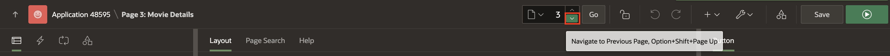

2. Navigate to the **Popular Movies** region. In the Property editor, enter/select the following page attributes:

    - Under Local Post Processing:

        - Type: **SQL Query**

        - SQL Query: Replace the existing SQL Query with the query below:

        ```
        <copy>
        select ads.id,
               ads.adult,
               ads.title,
               ads.video,
               ads.overview,
               ads.popularity,
               ads.vote_count,
               ads.poster_path,
               ads.release_date,
               ads.vote_average,
               ads.backdrop_path,
               ads.original_title,
               ads.original_language,
               case when w.watched_yn = 'Y' then 'Watched'
                    when w.watched_yn = 'N' then 'Added'
                    end as badge_label,
               case when w.watched_yn = 'N' then 'u-success'
                    end as badge_color
          from #APEX$SOURCE_DATA# ads
        LEFT OUTER JOIN
            -- doing inline select to limit rows to current user
            (select * from watchlist where user_id = :USER_ID) w
            ON w.movie_id = ads.ID
        ```

        > *Note: The above code extends the Popular Movies data that gets returned from the REST data source by joining the REST data source with the watchlist table to add two columns: BADGE\_LABEL and BADGE\_COLOR. For the BADGE\_LABEL column, each movie in the Popular Movies list has the value 'Watched' (movies in the WATCHLIST table that are marked as Watched), 'Added' (movies in the WATCHLIST table that are not marked as Watched), or NULL (movies that are not in the WATCHLIST table). Similarly, the BADGE\_COLOR list contains values 'u-success' or NULL, based on whether or not a movie is in the WATCHLIST table and not marked as Watched.*

    

3. Navigate to **Attributes** tab. In the Property editor, enter/select the following page attributes:

    - Under Icon and Badge:

        - Badge Column: **BADGE\_LABEL**

        - Badge CSS Classes: **&BADGE\_COLOR.**

    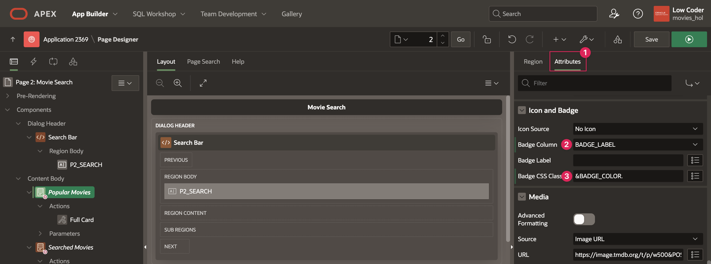

4. To pass in the value for P3\_PREVIOUS\_PAGE\_ID, click on the **Full Card** action under the Popular Movies region.

5. In the Property editor, enter/select the following page attributes:

    - Under Link:

    - Target: Click **Page 3**

        - Under Set Items, add an item:

            | Name | Value |
            | ---- | ----- |
            | P3\_PREVIOUS\_PAGE\_ID | 2 |

            Click **OK**.

    

6. Now that you have set up badges on the Popular Movies region, return to the beginning of **step 1** of this task and follow the same steps for **Searched Movies**.

7. Save your changes and refresh the tab where your app is running. Now you can play around with the Movie Search and Movie Details page and test out adding, removing, and marking items as watched.

    - From the Movie Search page, select a movie and you will see the Back and Add to Watchlist buttons.

    

    - Click the Add to Watchlist button and you will be redirected back to the Movie Search page where you will see the Added label on the movie you added.

    

    - Click on the movie you just added to your watchlist, and you will see the Back, Remove From Watchlist, and I've Watched This buttons.

    

    - Click the I've Watched This button and you will be redirected back to the Movie Search page where you will see the Watched label on the movie you just marked as watched.

    

## Summary

You now know how to use SQL commands in Page Designer regions and processes to get, store, update, and delete data from your tables. You may now **proceed to the next lab**.

## Learn More

- [Buttons Documentation](https://docs.oracle.com/en/database/oracle/apex/24.2/htmdb/creating-buttons.html)

- [Understanding Page Processes](https://docs.oracle.com/en/database/oracle/apex/24.2/htmdb/understanding-page-processes.html)

- [Controlling Navigation Using Branches](https://docs.oracle.com/en/database/oracle/apex/24.2/htmdb/controlling-navigation-using-branches.html)

## Stuck? Download the Application Here

Stuck on a step or struggling with the lab? You can download a copy of the Movies Watchlist application through Lab 6 and follow the instructions below to import it into your Oracle APEX workspace.

- [Click here](https://c4u04.objectstorage.us-ashburn-1.oci.customer-oci.com/p/EcTjWk2IuZPZeNnD_fYMcgUhdNDIDA6rt9gaFj_WZMiL7VvxPBNMY60837hu5hga/n/c4u04/b/livelabsfiles/o/lab-6-241.sql) to download a copy of the app at the end of Lab 6.

- You can import the app to your APEX workspace by clicking **Import** in the App Builder home page and following the wizard steps.

- You will be prompted for the Credentials for Movies web credential that was set up in lab 2. You can see in the screenshot below that Credentials for Movies does not already exist in the workspace.

    > *Note: If you completed Lab 2, Credentials for Movies will already exist in your workspace and this will be pre-filled*

    

- If Credentials for Movies does not already within your workspace, set the following for the Credentials for Movies row:

    - In the Client ID or Username column, enter **api\_key**.

    - In the Client Secret or Password column, paste your unique API key that you got from The Movie Database.

    - In the Verify Client Secret/Password column, past your API key again.

        

- Click **Next**.

- Make sure Install Supporting Objects is **on** and click **Next** again.

- Click **Install** to install the supporting objects and finish importing the application.

## Acknowledgements

- **Author** - Paige Hanssen
- **Last Updated By/Date** - Ankita Beri, Product Manager, April 2025