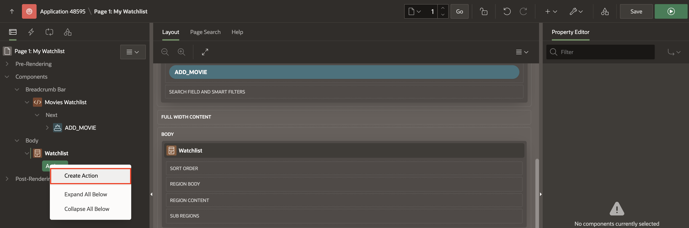
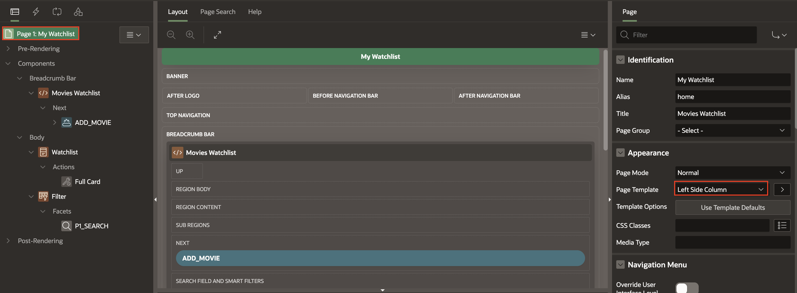
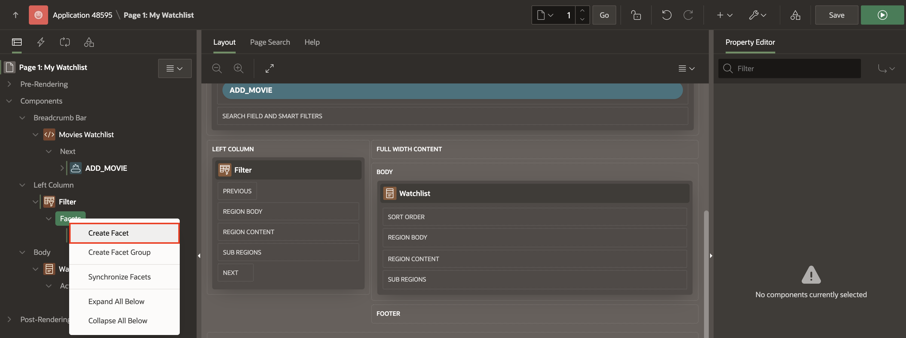
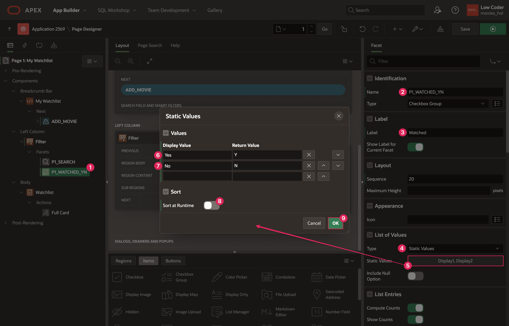
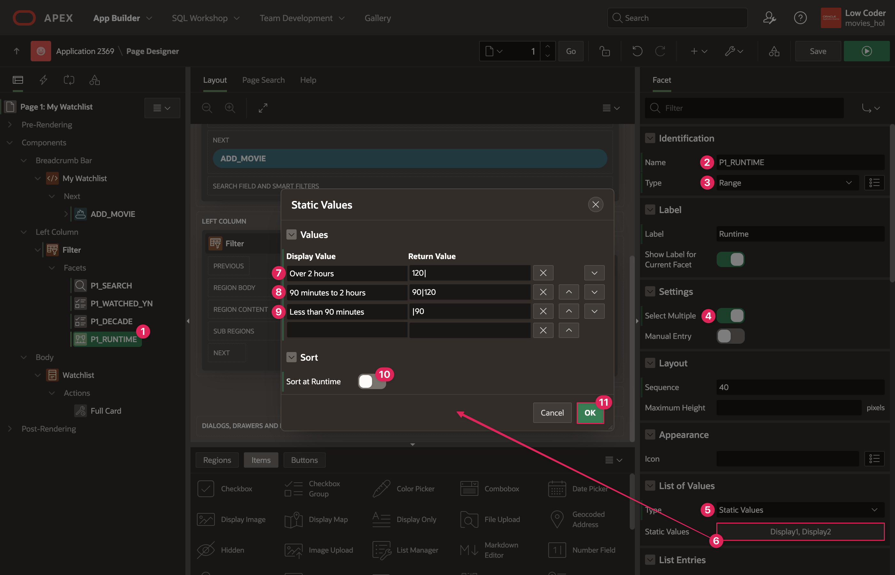
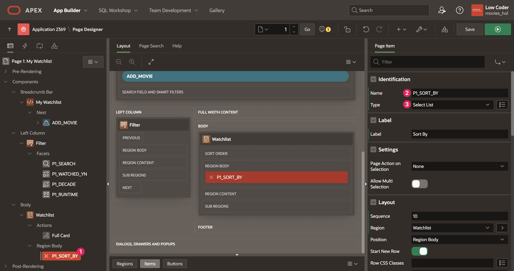

# Implement the Watchlist Page

## Introduction

Now that you have implemented functionality to find movies and add them to a table, you will set up the My Watchlist page to display each movie in that table, filter it, and modify it, which is the final piece of base functionality you will need to complete this app.

Estimated Lab Time: 25 minutes

Watch the video below for a quick walk-through of the lab.

[Implement the Watchlist Page](videohub:1_g0oio0jt)

### Objectives

In this lab, you will:

- Create cards to display watchlist movies.

- Connect the Movie Details page to open details directly from the Watchlist.

- Add facets to filter through movies.

### Prerequisites

- Completion of workshop through Lab 6

## Task 1: Create the Watchlist Cards

So far, you have only added a button in the Breadcrumb Bar region of page 1. You will start to build out the page by first adding a Cards region so that users can view their personal list of movies. It will be similar to the Cards regions on the Movie Search page, but these cards will be formatted a little differently and the source will not be a REST data source.

1. From the Page Designer toolbar, navigate to **page 1** of your Movies Watchlist application.

    

2. In the **Rendering** tab, right-click **Body** and select **Create Region**.

    

3. In the Property editor, enter/select the following page attributes:

    - Under Identification:

        - Title: **Watchlist**

        - Type: **Cards**

    - Under Source:

        - Type: **SQL Query**

        - SQL Query: Copy the code below and paste it into the code editor:

        ```
        <copy>
        select id,
               movie_id,
               user_id,
               watched_yn,
               watched,
               case when watched_yn = 'Y' then 'Watched' end as WATCHED_LABEL,
               case when watched_yn = 'Y'
                    then 'Marked as watched ' || apex_util.get_since(watched)
                    else 'Added to watchlist ' || apex_util.get_since(created)
                    end as movie_status,
               title,
               poster_url,
               release_date,
               to_char(release_date, 'YYYY') as release_year,
               floor( to_char(release_date, 'YYYY') / 10) * 10 as decade,
               runtime,
               vote_average,
               created,
               to_char(created, 'MM/YYYY') as created_on,
               created_by,
               updated,
               updated_by
          from watchlist
         where user_id = :USER_ID
        ```

    

4. Navigate to the **Attributes** tab of your new Watchlist region to customize your Watchlist cards.

5. In the Property editor, enter/select the following page attributes:

    - Appearance > Layout: **Horizontal (Row)**

    - Card > Primary Key Column 1: **ID**

    - Title > Column: **TITLE**

    - Under Body:

        - Advanced Formatting: Toggle **On**

        - HTML Expression: Copy and paste the below HTML expression in the code editor:

        ```
        <copy>
        Release Year: &RELEASE_YEAR.
        &lt;br>
        Rating: &VOTE_AVERAGE.
        ```

    

    - Secondary Body > Column: **MOVIE\_STATUS**

    - Icon and Badge > Badge Column: **WATCHED\_LABEL**

    - Under Media:

        - Source: **URL Column**

        - Media > URL: **POSTER\_URL**

    

## Task 2: Connect the Watchlist to the Movie Details Page

In this step, you are going to connect the My Watchlist page to the Movie Details page to allow a user to view details for any movie on the list, as well as remove a movie from their list or mark a movie as "Watched."

1. In the **Rendering** tab, under **Watchlist** region, right-click **Actions** and select **Create Action**.

    

2. In the Property editor, enter/select the following page attributes:

    - Identification > Type: **Full Card**

    - Link > Target: Click **No Link Defined**

        - Page: **3**

        - Set Items:

            | Name | Value |
            | ----- | ----- |
            | P3\_ID | &MOVIE\_ID.|
            | P3\_PREVIOUS\_PAGE\_ID | 1 |
            {title: Set Items}

            Click **OK**.

    

3. **Save and Run** the page.

    

4. On the tab where the app is running, click on a movie in your watchlist. The Movie Details dialog will pop up with information about that specific movie. Note that you are able to remove a movie or mark it as watched, but you cannot add the movie because it is already in your list. Additionally, there is no back button because you are going to the Movie Details page from the Watchlist page (page 1) instead of the Movie Search page (page 2).

    > *Note: If you have not added any movies to your watch list, the page will say "No data found." Make sure to add movies to your watch list so that you can view them on the Watchlist page!*

## Task 3: Add the Faceted Search

The next step is allowing a user to filter through movies in their watchlist to make it easier to explore and find movies they could watch based on specific criteria. You'll do this by using a Faceted Search to create facets for columns we can filter the movie list with.

1. In the **Rendering** tab, right-click **Body** and select **Create Region**.

    

2. In the Property editor, enter/select the following page attributes:

    - Under Identification:

        - Title: **Filter**

        - Type: **Faceted Search**

    - Source > Filtered Region: **Watchlist**

    - Appearance > Template: **Blank with Attributes**

    

3. If you look at the layout pane in the middle of Page Designer, the faceted search Filter region is underneath the Watchlist region and that is how it will appear in the runtime app. That is not a very convenient place and it would be better if the faceted search was sitting on the left side of the Watchlist region so users have easy access. You can change the page template to open up new positions on the page that the Filter region can go in, one of which is the Left Column.

4. At the top of the the Rendering Pane, click **Page 1: My Watchlist** root node.

5. In the  Property Editor, under **Appearance**, set Page Template to **Left Side Column**.

    

6. Navigate to **Filter** region and update the following:

    - Layout > Slot: **Left Column**

    

7. Notice that the facet **P1_SEARCH** was automatically created with the Faceted Search region.

8. Click **P1_SEARCH** and set Source > Database Column(s) to **TITLE**

    

9. Under **Filter** region, right-click **Facets** and select **Create Facet**.

    

10. In the Property editor, enter/select the following page attributes:

    - Identification > Name: **P1\_WATCHED\_YN**

    - Label > Label: **Watched**

    - Under List of Values:

        - Type: **Static Values**

        - Static Values > Click **Display1, Display2** to manually set up the display values that you will use for this facet.

            - Under Values:

                | Display Value | Return Value |
                | ------------  | ------------ |
                | Yes           | Y            |
                | No            | N            |

            - Sort > Sort at Runtime: Toggle **Off**

                Click **OK**.

    - Under Actions Menu:

        - Filter: Toggle **Off**

        - Chart: Toggle **Off**

    > *Note: Oracle APEX auto-fills the Source based on the facet name.*

    

    

11. You are going to add two more facets to allow a user to filter by release decade and runtime using the DECADE and RUNTIME columns. The DECADE column was created within the Watchlist Source SQL select statement as a simpler date column to filter movies by instead of RELEASE\_DATE.

12. Create a new facet within the Filter region and enter/select the following page attributes:

    - Identification > Name: **P1\_DECADE**

    - List of Values > Type: **Distinct Values**

    - List Entries > Sort By Top Counts:Toggle **Off**

    - Under Actions Menu:

        - Filter: Toggle **Off**

        - Chart: Toggle **Off**

    - Source > Data Type: **Number**

	> *Note: Again, Source auto-filled based on the Name of the facet. However, the data type did not change, so you have to manually change it to match the type of data in the DECADE column.*

    

13. Create another new facet within the Filter region and enter/select the following page attributes:

    - Under Identification:

        - Name: **P1\_RUNTIME**

        - Type: **Range**

    - Settings > Select Multiple: Toggle **On**

    - Under List of Values:

        - Type: **Static Values**

        - Static Values: Click **Display1, Display2** to manually set up the display values that you will use for this facet.

            - Under Values:

                - Display Value: **Over 2 hours**, Return Value: **120|**

                - Display Value: **90 minutes to 2 hours**, Return Value: **90|120**

                - Display Value: **Less than 90 minutes**, Return Value: **|90**

                > *Note: The | syntax is used to define a range of return values. To learn more, see the Resources section at the end of this lab.*

            - Sort > Sort at Runtime: Toggle **Off** 

                Click **OK**.

    - Under Actions Menu:

        - Filter: Toggle **Off**

        - Chart: Toggle **Off**

    - Source > Data Type: **Number**

    

    

14. Click **Save**.

## Task 4: Add a Sort By Item

In addition to the Faceted Search, it would be helpful for there to be a "Sort By" feature that allows users to reorder their list of movies a few different ways.

1. In the **Rendering** tab, right-click **Watchlist** region and select **Create Page Item**.

    

2. In the Property editor, enter/select the following page attributes:

    - Under Identification:

        - Name: **P1\_SORT\_BY**

        - Type: **Select List**

    - Under List of Values:

        - Type: **Static Values**

        - Static Values: Click **Display1, Display2** to manually set up the display values that you will use for this facet.

            - Values:

            | Display Value | Return Value |
            | ------------  | ------------ |
            | Title         |TITLE         |
            | Rating        | RATING       |
            | Date Added    | RECENT       |
            {title: Static Values}

            - Sort > Sort at Runtime: Toggle **Off**

            Click **Ok**.

        - Display Null Value: Toggle **Off**

    - Advanced > Warn on Unsaved Changes: **Ignore**

    

    

3. At this point, the sort item has been created but is not connected to anything else on the page.

4. You want the value of the Sort By page item to define what the Watchlist Cards region **order by** is, so you will use the Cards Order By properties to link the P1\_SORT\_BY item and use its value to order by the associated column.

5. Click on the **Watchlist** region. In the Property editor, enter/select the following page attributes:

    - Under Order By:

        - Type: **Item**

        - Item: Click **No Order By Item**

            - Order By Clauses: Enter the following:

                | Clause | Key | Display |
                | ------- | ---- | ------ |
                | "TITLE" asc | TITLE | Title |
                | "VOTE_AVERAGE" desc | RATING | Rating |
                | "CREATED" desc | RECENT | Date Added |
                {title: Order By Clauses}

            > *Note: The Key and Display values auto-fill with the values set in the P1\_SORT\_BY item, but you will need to add the Order By clause for each.*

            - Item > Name: **P1\_SORT\_BY**

                Click **OK**.

    

6. **Save and Run** the page to test out your app.

    

## Summary

You now know how to filter data using a Faceted Search and sort data with a select list. You may now **proceed to the next lab**.

## Learn More

- [Intro to Faceted Search](https://www.youtube.com/watch?v=xsA9SCFHDDI)

- **Range Facet Syntax:** When implementing the static list of values for the Range facet in the Faceted Search region in this lab, you use the | symbol to help define the return value for each item in the static list. The | character represents a range of values that the movies in the Watchlist will be filtered on.

    For example, when setting up the P1_RUNTIME facet, the first value in the list is "Over 3 hours" and has a return value of 180|. Because you are defining a facet that represents a range, the return value 180| means that you are searching for all movies that have a runtime in the range of 180 or higher.

    The second value in the P1_RUNTIME list is "2 to 3 hours," which has the return value 120|180. Here, the | symbol represents all the values between 120 and 180, meaning that when this option is selected, you will get all movies with a runtime of anything between 120 and 180.

## Stuck? Download the Application Here

Stuck on a step or struggling with the lab? You can download a copy of the Movies Watchlist application through Lab 7 and follow the instructions below to import it into your Oracle APEX workspace.

- [Click here](https://c4u04.objectstorage.us-ashburn-1.oci.customer-oci.com/p/EcTjWk2IuZPZeNnD_fYMcgUhdNDIDA6rt9gaFj_WZMiL7VvxPBNMY60837hu5hga/n/c4u04/b/livelabsfiles/o/lab-7-241.sql) to download a copy of the app at the end of Lab 7.

- You can import the app to your APEX workspace by clicking **Import** in the App Builder home page and following the wizard steps.

- You will be prompted for the Credentials for Movies web credential that was set up in lab 2. You can see in the screenshot below that Credentials for Movies does not already exist in the workspace.
*Note: If you completed Lab 2, Credentials for Movies will already exist in your workspace and this will be pre-filled*

    

- If Credentials for Movies does not already within your workspace, set the following for the Credentials for Movies row:

    - In the Client ID or Username column, enter **api\_key**.

    - In the Client Secret or Password column, paste your unique API key that you got from The Movie Database.

    - In the Verify Client Secret/Password column, past your API key again.

        

- Click **Next**.

- Make sure Install Supporting Objects is **on** and click **Next** again.

- Click **Install** to install the supporting objects and finish importing the application.

## Acknowledgements

- **Author** - Paige Hanssen
- **Last Updated By/Date** - Ankita Beri, Product Manager, April 2025