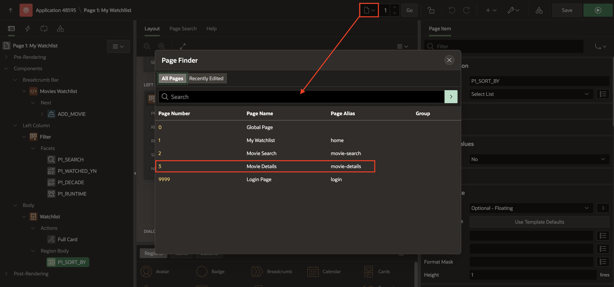
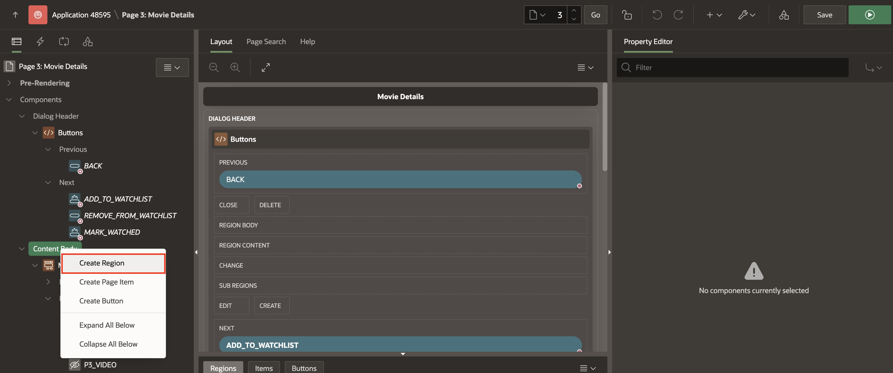
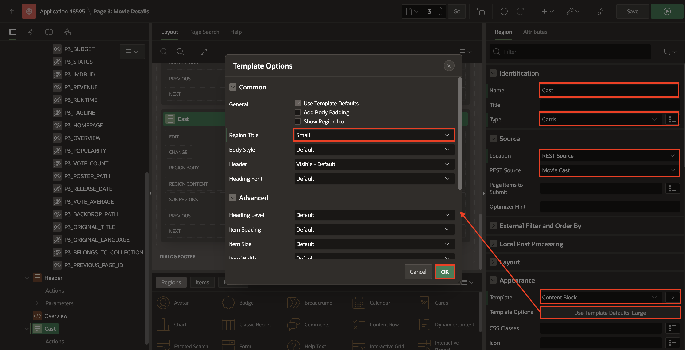
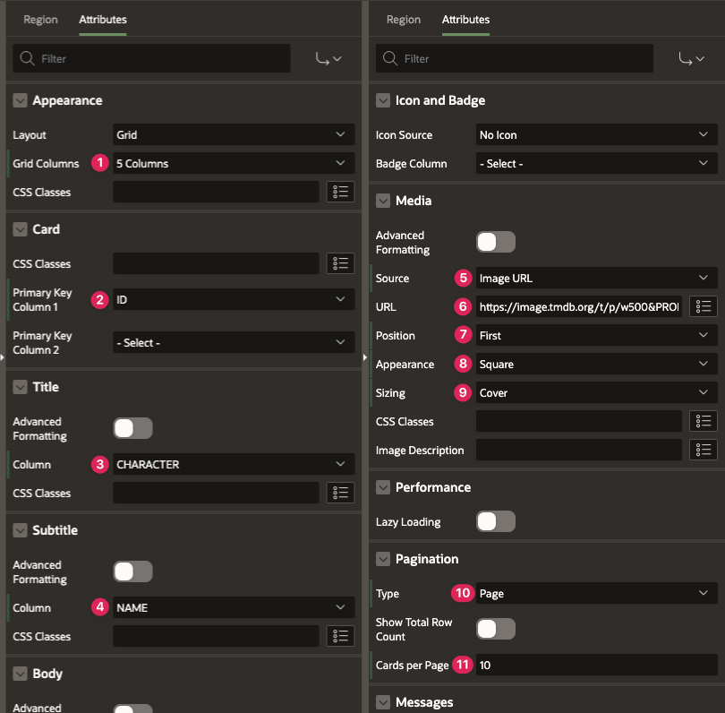
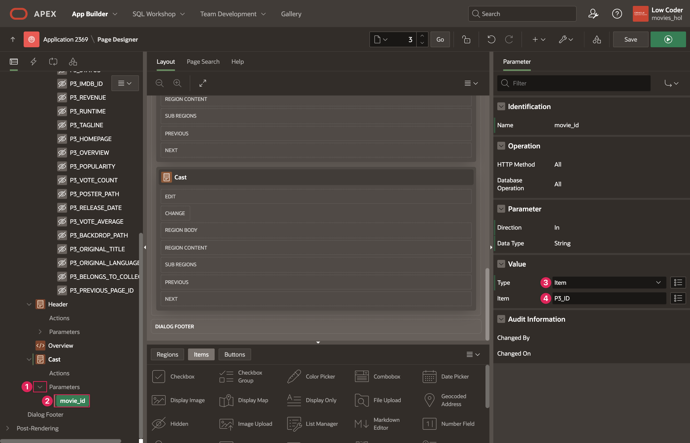
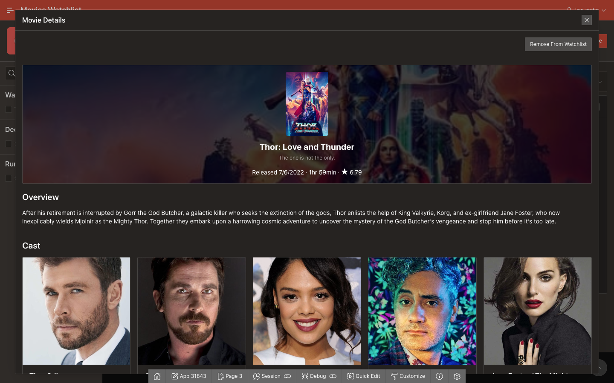

# Add Cast List to Movie Details Page (Optional)

## Introduction

This next lab is optional, but it would be fun and informative if a user were able to see not only the basic details of a movie but also the cast list when they open the Movie Details page. The steps are very similar to most of the work you have already done, but this lab will walk you through adding Cast Cards to your Movie Details page.

Estimated Lab Time: 5 minutes

[Add Cast List to Movie Details Page](videohub:1_b96xa2op)

### Objectives

In this lab, you will:

- Use the Movie Cast REST data source to add Cast Cards the Movie Details page.

### Prerequisites

- Completion of workshop through Lab 4

## Task 1: Add the Cast Region to Movie Details Page

You already created the Movie Cast REST data source in Lab 2, and now you can use it on the Details page to display the cast list along with the movie details and overview to bring everything together.

1. From Page Designer toolbar, navigate to the **Movie Details** page of your Movies Watchlist application.

    

2. In the **Rendering** tab, right-click **Content Body** and select **Create Region**.

    

3. In the Property editor, enter/select the following page attributes:

    - Under Identification:

        - Title: **Cast**

        - Type: **Cards**

    - Under Source:

        - Location: **REST Source**

        - REST Source: **Movie Cast**

    - Under Appearance:

        - Template: **Content Block**

        - Template Options: Click **Use Template Defaults**

            - Region Title: **Small**

                Click **Ok**.

    

4. Click **Attributes** tab and enter/select the following page attributes:

    - Appearance > Grid Columns: **5 Columns**

    - Card > Primary Key Column 1: **ID**

    - Title >  Column: **CHARACTER**

    - Subtitle > Column: **NAME**

    - Under Media:

        - Source: **Image URL**

        - URL: **https://image.tmdb.org/t/p/w500&PROFILE\_PATH.**

        - Position: **First**

        - Appearance: **Square**

        - Sizing: **Cover**

    - Under Pagination:

        - Type: **Page**

        - Cards per Page: **10**

    

5. In the **Rendering** tab, under the **Cast** region, expand the **Parameters** dropdown.

6. Click **movie\_id**.

7. In the Property editor, enter/select the following page attributes:

    - Under Value:

        - Type: **Item**

        - Item: **P3\_ID**

    

8. Click **Save**.

9. Refresh the tab where your app is running and click on a movie either from your Watchlist or from the Movie Search to view the updated Movie Details page.

    

## Summary

You have now improved the Movie Details page further by displaying a list of cast members along with the movie header and overview. You may now **proceed to the next lab**.

## Learn More

- [REST Data Sources Documentation](https://docs.oracle.com/en/database/oracle/apex/24.2/htmdb/managing-REST-data-sources.html)

- [Cards Documentation](https://docs.oracle.com/en/database/oracle/apex/24.2/htmdb/managing-cards.html)

## Stuck? Download the Application Here

Stuck on a step or struggling with the lab? You can download a copy of the Movies Watchlist application through this lab and follow the instructions below to import it into your Oracle APEX workspace.

- [Click here](https://c4u04.objectstorage.us-ashburn-1.oci.customer-oci.com/p/EcTjWk2IuZPZeNnD_fYMcgUhdNDIDA6rt9gaFj_WZMiL7VvxPBNMY60837hu5hga/n/c4u04/b/livelabsfiles/o/lab-8-241.sql) to download a copy of the app at the end of this lab.

- You can import the app to your APEX workspace by clicking **Import** in the App Builder home page and following the wizard steps.

- You will be prompted for the Credentials for Movies web credential that was set up in lab 2. You can see in the screenshot below that Credentials for Movies does not already exist in the workspace.

    > *Note: If you completed Lab 2, Credentials for Movies will already exist in your workspace and this will be pre-filled*

    

- If Credentials for Movies does not already within your workspace, set the following for the Credentials for Movies row:

    - In the Client ID or Username column, enter **api\_key**.

    - In the Client Secret or Password column, paste your unique API key that you got from The Movie Database.

    - In the Verify Client Secret/Password column, past your API key again.

    

- Click **Next**.

- Make sure Install Supporting Objects is **on** and click **Next** again.

- Click **Install** to install the supporting objects and finish importing the application.

## Acknowledgements

- **Author** - Paige Hanssen
- **Last Updated By/Date** - Ankita Beri, Product Manager, April 2025