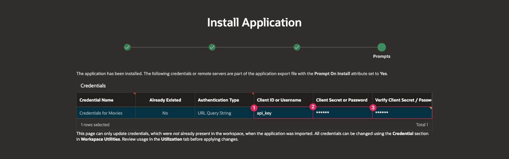

# Introduction

## About this Workshop

In this workshop, you will create an application that allows you and your friends to search for movies and create personal watchlists. You will use [The Movie Database (TMDB)](https://www.themoviedb.org/), which is a database that contains a large amount of data about a vast number of movies and TV shows. TMDB has an extensive API that you will access in this workshop to get lists of popular movies, search for movies, and get details and cast lists for movies.

When individual users log into the app, the home page will display their own unique watchlist. They can add movies to their watchlist from either a list of current popular movies or by searching for a specific movie of their choice. After adding movies to their list, users can use filters to browse through their list based on watched status, release decade, and runtime.

While the end result is a simple version of a movies watchlist application, you can continue to build it out far past what this workshop takes you through, using many of the same concepts you will learn. The Movie Database API has a lot of options that you can use in your application, such as streaming providers for individual movies, videos related to movies, upcoming movies, and more. There are also a lot of features in Oracle APEX that you can use to allow users to rate movies they have watched, make comments on movies, and more.

Estimated Workshop Time: 2 hours 15 minutes

Watch the video below for a quick walk-through of the workshop.
[Walkthrough video of the entire workshop](videohub:1_vdi0shy5)

> *Note: This workshop assumes you are using Oracle APEX 24.2. Some of the features might not be available in prior releases and the instructions, flow, and screenshots might differ if you use an older version of Oracle APEX.*

### Objectives

In this lab, you will:

- Obtain a free development environment.

- Learn how to create REST data sources.

- Learn how to create local tables.

- Learn how to use application items and processes.

- Learn how to create a page to view data from a REST source.

- Learn how to create a page to view data from a local table.

- Learn how to synchronize REST Data source data into new table.

- Learn how to create vector search configuration and a search page.

### Labs

| #   | Module                                                           | Est. Time |
| --- | ---------------------------------------------------------------- | --------- |
| -   | [Getting Started](?lab=1-sign-up-apex)                           | 5 min     |
| 1   | [Create the Application](?lab=create-app)                        | 10 min    |
| 2   | [Create REST Data Sources](?lab=creating-rest-sources)           | 10 min    |
| 3   | [Create the Search Page](?lab=creating-movie-search-page)        | 20 min    |
| 4   | [Create the Details Page](?lab=creating-movie-details-page)      | 20 min    |
| 5   | [Create Local Tables](?lab=creating-tables)                      | 10 min    |
| 6   | [Implement Buttons and Badges](?lab=creating-buttons-badges)     | 25 min    |
| 7   | [Implement the Watchlist Page](?lab=implementing-watchlist-page) | 25 min    |
| 8   | [Add Cast List (Optional)](?lab=adding-cast-list)                | 5 min     |
| 9   | [Create Vector Search Configuration (Optional)](?lab=movies-vector-search)   | 10 min     |
| 10   | [Improve the UI (Optional)](?lab=improving-watchlist-page)       | 5 min     |

### **Let's Get Started!**

- [Click here](?lab=1-sign-up-apex) or select **Getting Started** from the menu on the left to start the workshop and set up an Oracle APEX workspace.

- If the menu is not displayed, you can open by clicking the menu button () at the top of the page.

## Stuck? Download the Application Here

Stuck on a step or struggling with the lab? You can download a copy of the Movies Watchlist application and follow the instructions below to import it into your Oracle APEX workspace.

- [Click here](https://c4u04.objectstorage.us-ashburn-1.oci.customer-oci.com/p/EcTjWk2IuZPZeNnD_fYMcgUhdNDIDA6rt9gaFj_WZMiL7VvxPBNMY60837hu5hga/n/c4u04/b/livelabsfiles/o/movies-watchlist-export.sql) to download a copy of the completed app.

- You can import the app to your APEX workspace by clicking **Import** in the App Builder home page and following the wizard steps.

- You will be prompted for the Credentials for Movies web credential that is set up in lab 2. You can see in the screenshot below that Credentials for Movies does not already exist in the workspace.

    

- If Credentials for Movies does not already within your workspace, follow Lab 2 - [Create REST Data Sources](?lab=creating-rest-sources) > Task 3 for the Credentials for Movies row and then enter the following:

    - In the Client ID or Username column, enter **api\_key**.

    - In the Client Secret or Password column, paste your unique API key that you will get from The Movie Database.

    - In the Verify Client Secret/Password column, past your API key again.

    

- Click **Next**.

- Make sure Install Supporting Objects is **on** and click **Next** again.

- Click **Install** to install the supporting objects and finish importing the application.

- To use the Vector Search capabilities of this application, you need to perform the steps mentioned in Lab 9 - [Create Vector Search Configuration (Optional)](?lab=movies-vector-search) > Task 1, Task 2 and Task 4.

## Learn More

- [The Movie Database](https://www.themoviedb.org/)
- [The Movie Database API](https://developers.themoviedb.org/3/)
- [APEX on Autonomous](https://apex.oracle.com/autonomous)
- [APEX Service](https://apex.oracle.com/en/platform/apex-service/)
- [APEX Collateral](https://apex.oracle.com)
- [Tutorials](https://apex.oracle.com/en/learn/tutorials)
- [Community](https://apex.oracle.com/community)
- [External Site + Slack](http://apex.world)

## Acknowledgements

- **Author** - Paige Hanssen
- **Last Updated By/Date** - Ankita Beri, Product Manager, April 2025