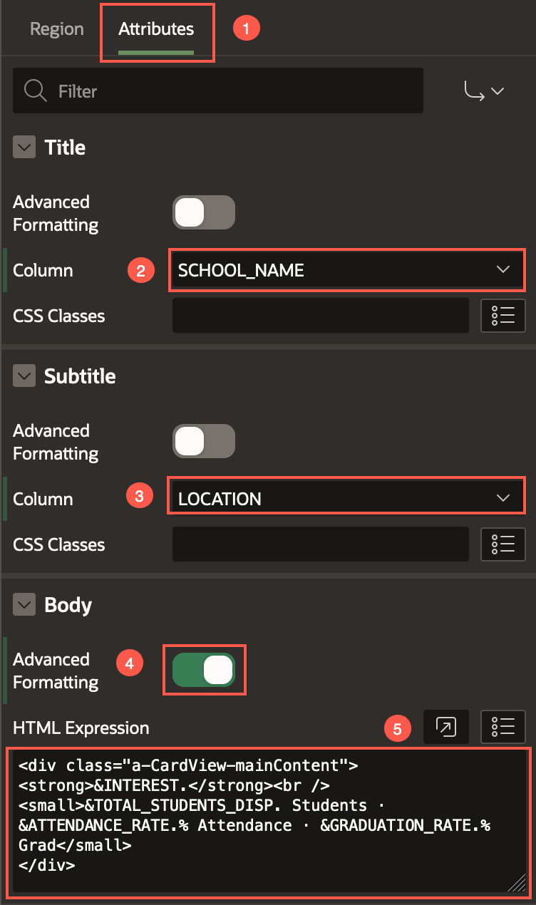

# Create an APEX Application

## Introduction
In this lab, you learn to create an APEX application by importing data from a spreadsheet. APEX can build an app directly from a table created using the spreadsheet. Later, you learn to modify the pages and the theme of the application.

**Note:** The screenshots in this workshop are taken using Dark Mode in APEX 24.1.

Estimated Time: 10 minutes

<!-- Watch the video below for a quick walk-through of the lab.
[Create an APEX App](videohub:1_a6bi2e62) -->

### Objectives

In this lab, you will:
- Create a new APEX application
- Configure a Cards region
- Customize the app theme using Theme Roller

### Prerequisites

- An Oracle APEX workspace

## Task 1: Load the Highschool Data 

1.  From your APEX workspace home page, click **App Builder**.
2.  Click **Create a New App**.

    

3.  Click **Create App from a File**.

    

    When creating an application from a file, APEX allows you to upload CSV, XLSX, XML, or JSON files and then build apps based on their data. Alternatively, you can also copy and paste CSV data or load sample data.

4.  Within the Load Data wizard, click the **Choose File** option or drag and drop the [nyc\_high\_schools.xlsx](files/nyc_high_schools.xlsx) file on to the dialog window.

    

5.  Review the parsed data. Set Table Name to **HIGHSCHOOLS** and click **Load Data**. Note: You can configure what columns to load from the spreadsheet by clicking the **Configure** button.

    

    After clicking **Load Data**, you will see a spinner until the wizard finishes loading the data. Continue to Task 2 at that point.

## Task 2: Create an Application

The Data Load wizard has created a new table and populated that table with the records from the sample data. Now you can create an app based on this new table.

1.  In the Load Data dialog, verify that 427 rows have been loaded into the **HIGHSCHOOLS** table, then click **Create Application**.

    

2. On the Create Application page, click the application icon.
   

3. In the Choose Application Icon wizard, upload your own icon by selecting or dragging and dropping an image. Download a sample icon from [here](images/ai-highschools.png).
  

4. Once you select an image, the wizard allows you to crop or resize the image. Click **Save Icon**.
    

5. In the Create Application page, review the pages listed.
  Click the **Edit** button for **Highschools Search** and update the following:
    - Page Name: **Search and Apply** 
    - For Page Type, choose **Cards** toggle button.

    
    

6.  For the Cards properties, select the following:
    - Title Column: **SCHOOL_NAME**
    - Body Column: **NEIGHBORHOOD**
    - Expand Advanced section and check the **Set as Home Page** box

    Click **Save Changes**.
    

7. Next, we delete the pages that we no longer need. Click **Edit** next to the Home page.
    

8. Click **Delete**. In the dialog 'Would you like to perform this delete action?', select **OK**.
    

    

9. Repeat Steps 7 and 8 to delete the **Highschools Report** page.
    

10. Repeat Steps 7 and 8 to delete the **Dashboard** page.
    

10. In the Create Application wizard, under Features, check the following checkboxes:
    - **Install Progressive Web App**
    - **Push Notifications** 
    
    Click **Create Application**. 

    

    When the wizard finishes creating the application, you will be redirected to the application's home page in the App Builder.

## Task 3: Configure the Cards Region

In this task, we configure the Cards region to display the information that we need.

1. Navigate to **Search and Apply** page.
    

2. In the rendering tree, select **Search Results** card region. In the property editor, switch to the **Attributes** tab and select the following:
    - Title > Column: **SCHOOL_NAME**
    - Subtitle > Column: **INTEREST**
    - Secondary Body > Column: **BOROUGH**

    

    

3. Click **Save and Run** page.
    

    

    

## Task 4: Customize the Application Theme

1. From the Developer Toolbar, click **Customize** and select **Theme Roller**.

    

2. In the Theme Roller dialog, for Select Theme, choose **Redwood Light**. Click **Save**. 

    

    
    You have successfully customized the application theme.

## Summary

You now know how to create an Oracle APEX application from a spreadsheet. You also learnt to customize the pages and the theme of the application.

You may now **proceed to the next lab**.   

## Acknowledgments

 - **Authors** - Toufiq Mohammed, Senior Product Manager; Apoorva Srinivas, Senior Product Manager
 - **Last Updated By/Date** - Apoorva Srinivas, Senior Product Manager, June 2024

