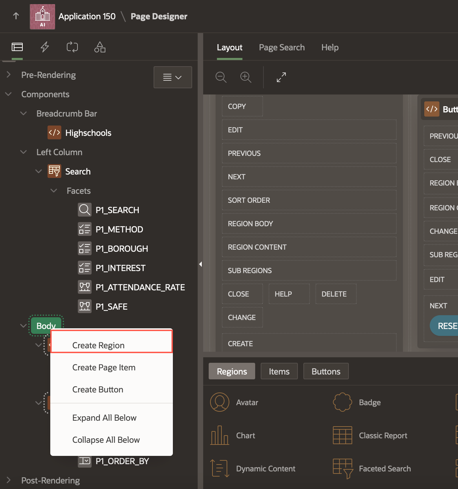
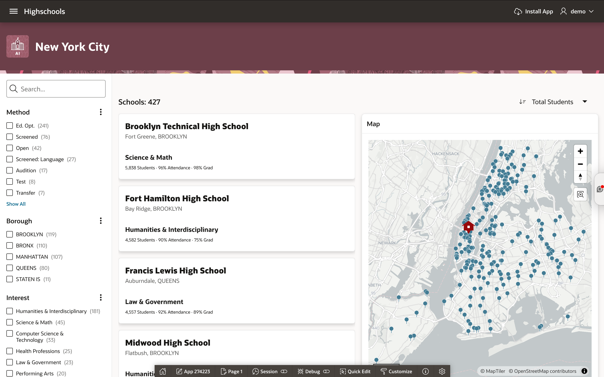
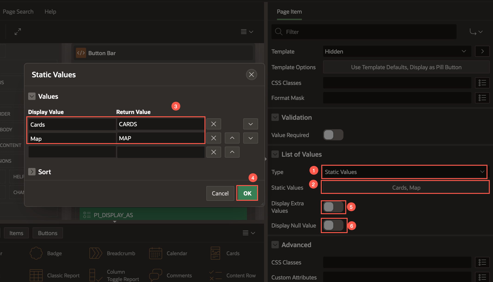
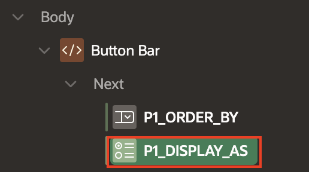
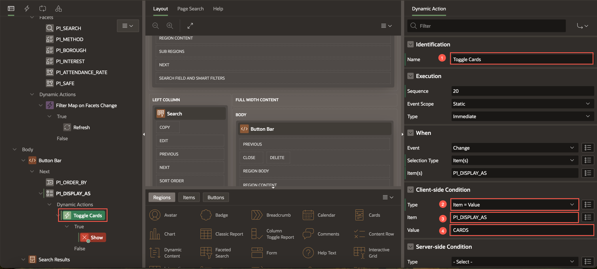
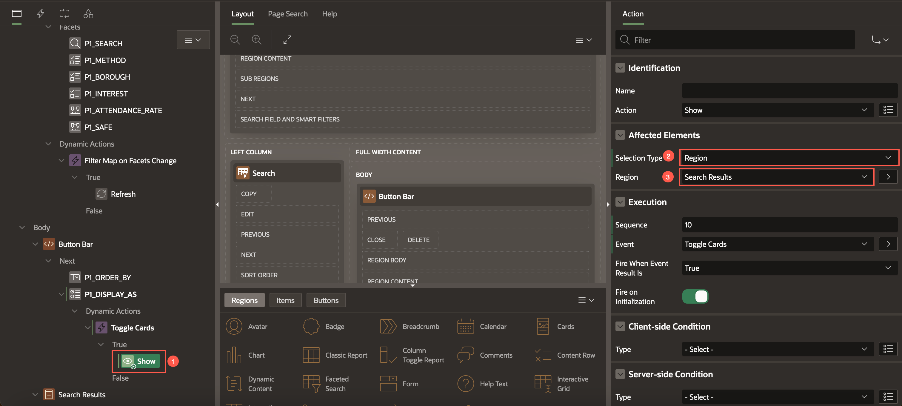
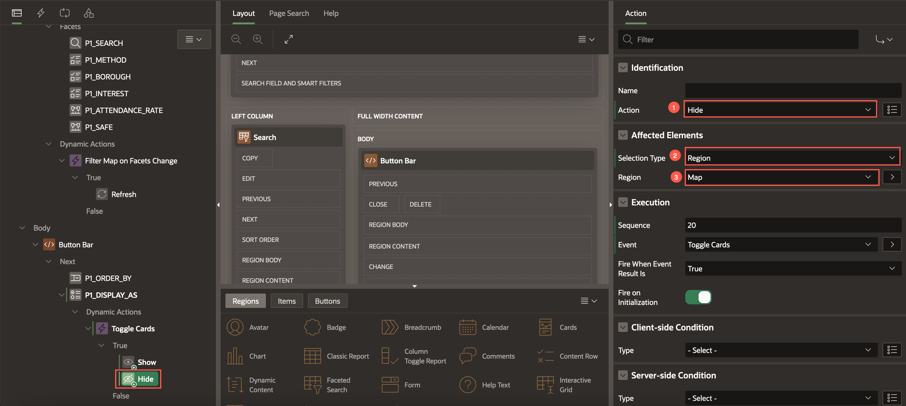
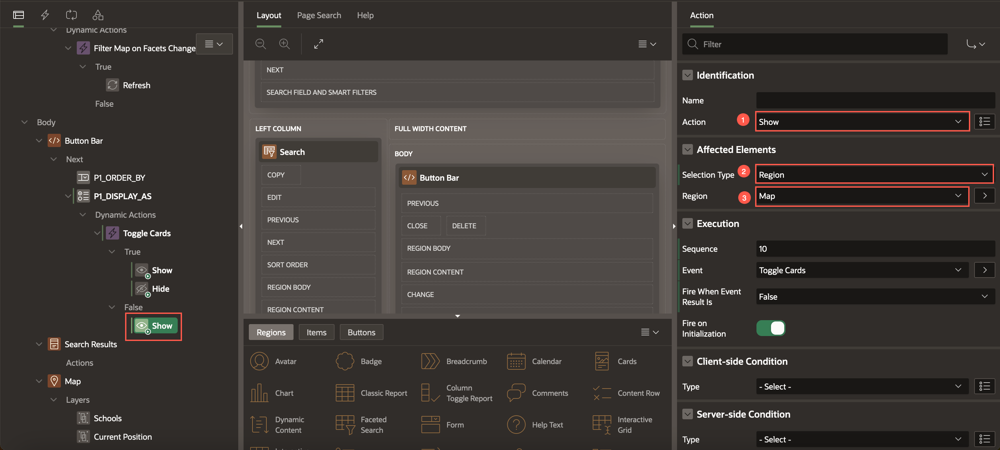
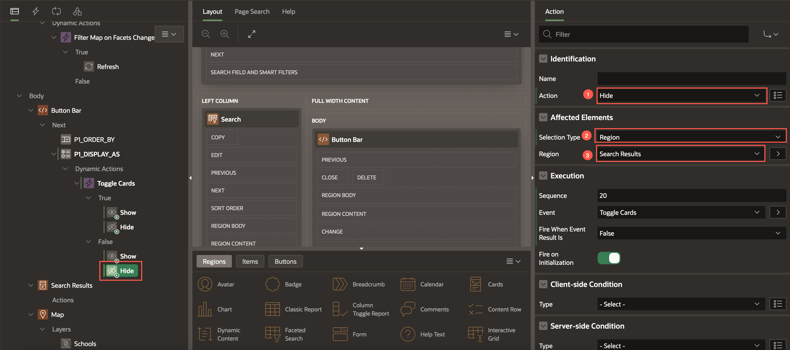

# Visualize Schools on a Map

## Introduction

In this lab, you learn to create a Map region and display the schools as Points on the map. You also learn to customize and filter the results on the map based on the faceted search results.

**Note:** The screenshots in this workshop are taken using Dark Mode in APEX 24.1.2

Estimated Time: 10 minutes

<!-- Watch the video below for a quick walk-through of the lab.
[Create an APEX App](videohub:1_a6bi2e62) -->

### Objectives

In this lab, you will:

- Create a Map region
- Link the Faceted Search region with the Map region
- Display Cards region and the Map region in two different tabs
- Filter Schools based on spatial distance

## Task 1: Create a Map Region

1. Navigate to Page 1 (Search and Apply) in the Page Designer. In the rendering tree, right-click **Body** and select **Create Region**.

    

2. Enter/select the following in the property editor:
    - Under Identification:
        - Name: **Map**
        - Type: **Map**

    - Under Source:
        - Location: **Local Database**
        - Table Name: **HIGHSCHOOLS**

    - Layout > Start New Row: Disable the toggle button to **OFF**

    

    

3. In the rendering tree, select the new layer created under Map.
    

4. In the Property Editor, enter/select the following:
    - Under Identification:
        - Name: **Schools**
        - Layer Type: **Points**
    - Source > Location: **Region Source**

    

    - Under Column Mapping:
        - Geometry Column Data Type: **Longitude/Latitude**
        - Longitude Column: **LONGITUDE**
        - Latitude Column: **LATITUDE**
        - Primary Key Column: **ID**
    - Point Objects > Shape: **Pin Circle**

    - Under Appearance:
        - Stroke Color: **#ffffff**

    

5. In the rendering tree, under Map, right-click **Layers** and select **Create Layer**.
    

6. In the property editor, enter/select the following:
    - Identification > Name: **Current Position**
    - Under Source:
        - Type: **SQL Query**
        - SQL Query:
            ```
            <copy>
            SELECT 40.748817 AS LATITUDE, -73.985428 AS LONGITUDE FROM DUAL;
            </copy>
            ```
    
    In this workshop, we use the following coordinates as the current Geo Loacation:
        - Latitude: 40.748817
        - Longitude: -73.985428

    - Under Column Mapping:
        - Geometry Column data Type : **Longitude/Latitude**
        - Longitude Column: **LONGITUDE**
        - Latitude Column: **LATITUDE**
    - Under Point Objects:
        - Shape: **Home**
        - Shape Scale: **2**
    - Appearance > Fill Color: **#970909**

    

7. Click **Save and Run**.
    

## Task 2: Link Faceted Search to the Map Region

In this task, we use Dynamic Action and custom PL/SQL code to fetch the Faceted Search region results and filter the Map region accordingly.

1. Navigate to **SQL Workshop > SQL Commands**.

    

2. Copy and paste the below SQL command to create a Type. Click **Run**.

    ```
    <copy>
    create or replace type t_pk_ids as table of number; 
    </copy>
    ```

    

3. Now, copy an paste the below PL/SQL code in the editor and click **Run**.

    ```
    <copy>
    create or replace function get_search_results_pk_ids(
        p_page_id          in number,
        p_region_static_id in varchar2,
        p_pk_column_name in varchar2 )
    return t_pk_ids pipelined
    is
    l_region_id   number;
    l_context     apex_exec.t_context;

    begin
    -- 1. get the region ID of the Faceted Search region
        select region_id
        into l_region_id
        from apex_application_page_regions
        where application_id = v('APP_ID')
            and page_id        = p_page_id
            and static_id      = p_region_static_id;

    -- 2. Get a cursor (apex_exec.t_context) for the current region data
        l_context := apex_region.open_query_context(
                     p_page_id      => p_page_id,
                     p_region_id    => l_region_id );

    while apex_exec.next_row( p_context => l_context ) loop
        pipe row(
                    apex_exec.get_varchar2( p_context => l_context, p_column_idx => apex_exec.get_column_position(
                                                 p_context => l_context,
                                                 p_column_name => p_pk_column_name ) ) );
    end loop;

    apex_exec.close( l_context );

    return;
    exception
    when no_data_needed then
        apex_exec.close( l_context );
        return;
    when others then
        apex_exec.close( l_context );
        raise;
    end get_search_results_pk_ids;
    </copy>
    ```

    

4. Navigate to **App Builder** > **Highschools** > **Search and Apply**.
   In the rendering tree, select the **Map** region. In the property editor, enter the following:
    - Source > Where Clause:
        ```
        <copy>
            (ID IN (SELECT COLUMN_VALUE from table(get_search_results_pk_ids(1, 'S_SEARCH_RESULTS','ID'))))
        </copy>
        ```


    - Page Items to Submit: **P1\_SEARCH, P1\_METHOD, P1\_BOROUGH, P1\_INTEREST, P1\_ATTENDANCE_RATE ,P1\_SAFE**

    

5. In the rendering tree, navigate to the Dynamic Actions tab. Right-click on **Events**, and select **Create Dynamic Action**.

    

6. In the property editor, enter/select the following:
    - Identification > Name: **Filter Map on Facets Change**
    - Under When:
        - Event: **Facets Change [Faceted Search]**
        - Selection Type: **Region**
        - Region: **Search**

       

7. Now, select **Show** under **Filter Map on Facets Change** > **True**. In the property editor, enter/select the following:
    - Action: **Refresh**
    - Selection Type: **Region**
    - Region: **Map**

    

8. Click **Save**.

## Task 3: Display Cards and Maps as Radio Group

1. In the Rendering Tree, right-click Button Bar and select **Create Page Item**.
    

2. Enter/select the following in the property editor:
    - Under Identification:
        - Name: **P1\_DISPLAY\_AS**
        - Type: **Radio Group**
    - Settings > Number of Columns: **2**
    - Layout > Slot: **Next**
    - Under Appearance:
        - Template: **Hidden**
        - Template Options >  Item Group Display: **Display as Pill Button**

        

        

    - Under List of Values:
        - Type: **Static Values**
        - Static Values: click **Display1, Display 2** to edit the Static Values.
            |Display Value| Return Value|
            |-------------|-------------|
            |Cards| CARDS|
            |Map| MAP|
             {: title="Static Values"}

        - Display Extra Values: Disable the toggle button to **OFF**.
        - Display Null Values: Disable the toggle button to **OFF**.
            

    - Under Default:
        - Type: **Static**
        - Static Value: **CARDS**

         

3. Drag and drop the **P1\_DISPLAY\_AS** page item below **P1\_ORDER\_BY**.

    

4. Right-click **P1\_DISPLAY\_AS** and select **Create Dynamic Action**.
    

5. Enter/select the following in the property editor:
    - Identification > Name: **Toggle Cards**
    - Under Client-side condition:
        - Type: **Item = Value**
        - Item: **P1\_DISPLAY\_AS**
        - Value: **CARDS**

        

6. In the Rendering Tree, select **True** Action , enter/select the following in the property editor:
    - Under Affected Elements:
        - Selection Type: **Region**
        - Region: **Search Results**

        

7. Create another TRUE action. Right-click **True** and select **Create TRUE Action**.
    

8. Enter/select the following:
    - Identification > Action: **Hide**
    - Under Affected Elements:
        - Selection Type: **Region**
        - Region: **Map**

    

9. Right-click **False** and select **Create FALSE Action**.
    

10. Enter/select the following:
    - Identification > Action: **Show**
    - Under Affected Elements:
        - Selection Type: **Region**
        - Region: **Map**

        

11. Similarly, create another **FALSE** action. Right-click False and select **Create FALSE Action**.

12. Enter/select the following:
    - Identification > Action: **Hide**
    - Under Affected Elements:
        - Selection Type: **Region**
        - Region: **Search Results**

        

## Task 4: Add Distance Facet

In this task, you add a new Distance facet to filter schools based on Spatial distance.

1. In the rendering tree, select the **Search Results** region.

    

2. In the property editor, under Source > SQL Query, replace the code by copying and pasting the following SQL query:

    ```
    <copy>
    select ID,
       BOROUGH,
       NEIGHBORHOOD ||', '|| BOROUGH as LOCATION,
       SCHOOL_NAME,
       NEIGHBORHOOD,
       INTEREST,
       METHOD,
       ATTENDANCE_RATE,
       GRADUATION_RATE,
       SCHOOL_SPORTS,
       TOTAL_STUDENTS,
       to_char(TOTAL_STUDENTS,'999G999G999G999G999') as total_students_disp,
       SAFE,
       sdo_geom.sdo_distance(
      sdo_geometry(2001, 4326, sdo_point_type(longitude, latitude, null), null, null),
      sdo_geometry(2001, 4326, sdo_point_type(-73.985428, 40.748817, null), null, null),
      0.01,
      'unit=MILE'
    ) DISTANCE
    from HIGHSCHOOLS
    </copy>
    ```

    Click **OK**.
    

3. In the rendering tree, under **Search**, right-click **Facets** and select **Create Facet**.

    

4. In the property editor, enter/select the following:
    - Under Identification:
        - Name: **P1_DISTANCE**
        - Type: **Range**
    - Settings > Select Multiple: Enable the toggle button to **ON**.

    

    - Under List of Values,
        - Type: **Static Values**
        - Static Values:

            |Display Value | Return Value|
            |--------------|-------------|
            | <5 miles     | \|5         |
            | 5 - 10 miles | 5\|10       |
            | 10 - 15 miles | 10\|15     |
            | 15 - 20 miles | 15\|20     |
            | >=20 miles    | 20\|       |

            - Sort > Sort at Runtime: Disable the Toggle button to **OFF**.

        Click **OK**.

        

    - Source > Data Type: **Number**

       

5. Update *Page Items to Submit* property of the Map Region to include the P1_DISTANCE facet.
    Select **Map** in the rendering tree, and in the property editor, enter/update the following:
    - Source > Page Items to Submit: **P1\_SEARCH, P1\_METHOD, P1\_BOROUGH, P1\_INTEREST, P1\_ATTENDANCE_RATE ,P1\_SAFE, P1\_DISTANCE**

        

    - Layout > Start New Row: Enable the Toggle Button to **ON**.

        

6. Rearrange the facets in the rendering tree by dragging and dropping, so that the facets are in the sequence as follows:
    - P1_SEARCH
    - P1_INTEREST
    - P1_DISTANCE
    - P1_BOROUGH
    - P1\_ATTENDANCE\_RATE
    - P1_SAFE
    - P1_METHOD

    

7. Select the **Method** facet, and in the property editor, edit the following:
    - Under Advanced:
        - Collapsible: Enable the Toggle Button to **ON**.
        - Initially Collapsed: Enable the Toggle Button to **ON**.

    

8. Click **Save and Run** page to see how the app looks.

    

## Summary

You now know how to map a Faceted Search to a Map region. You also learned to filter the schools based on spatial distance.

You may now **proceed to the next lab**.

## Acknowledgments

 - **Authors** - Toufiq Mohammed, Senior Product Manager; Apoorva Srinivas, Senior Product Manager
 - **Contributing Author** - Pankaj Goyal, Member Technical Staff
 - **Last Updated By/Date** - Apoorva Srinivas, Senior Product Manager, July 2024
