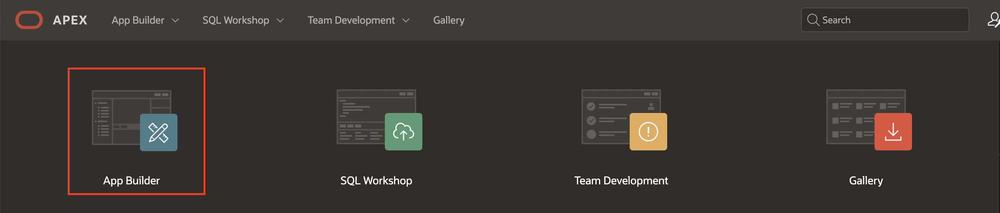
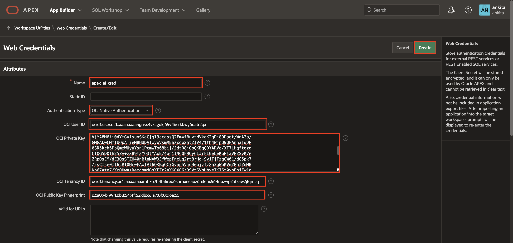

# Create the Web Credentials

## Introduction

In this workshop, you use OCI Generative AI as the AI provider to build a conversational chatbot. To use the OCI Generative AI Service in APEX, you will use the keys provided in the lab [Your OCI GenAI key](?lab=tut3253). 

Note: OCI Generative AI service is available in limited regions. If you are using your own cloud tenancy, check to see if your cloud region supports OCI Generative AI service, visit the [documentation](https://docs.oracle.com/en-us/iaas/Content/generative-ai/overview.htm#regions). 

**Note:** The screenshots in this workshop are taken using Dark Mode in APEX 24.1.2

Estimated Time: 10 Minutes

### Objectives
In this lab, you:

- Create Web Credentials in Oracle APEX

## Prerequisites
- Download the zip file from [Your OCI GenAI key](?lab=tut3253)

## Task 1: Create Web Credentials in Oracle APEX

Web credentials are used to authenticate connection to external REST services, or REST Enabled SQL services from APEX.

Creating Web Credentials securely stores and encrypts authentication credentials for use by Oracle APEX components and APIs. Credentials cannot be retrieved back in clear text. Credentials are stored at the workspace level and therefore are visible to all applications.

To create a Web Credential in Oracle APEX:

1. Login into your Oracle APEX workspace.

   

2. On the Workspace home page, click **App Builder**.

   

3. Click **Workspace Utilities**.

   

4. Select **Web Credentials**.

   

5. Click **Create**.

   

6. Enter the following details using the configuration file you copied in the previous task.

    - **Name**: apex\_ai\_cred

    - **Authentication Type**: OCI Native Authentication

    - **OCI User ID**: Enter the OCID of the Oracle Cloud user Account. You can find the OCID in the zip folder you downloaded as part of prerequisites.
    Your OCI User ID looks similar to **ocid1.user.oc1..aaaaaaaa\*\*\*\*\*\*wj3v23yla**

    - **OCI Private Key**: Open the private key (.pem file) downloaded in the previous task. Copy and paste the API Key.

      

    - **OCI Tenancy ID**: Enter the OCID for Tenancy. Your Tenancy ID looks similar to **ocid1.tenancy.oc1..aaaaaaaaf7ush\*\*\*\*cxx3qka**

    - **OCI Public Key Fingerprint**: Enter the Fingerprint ID. Your Fingerprint ID looks similar to **a8:8e:c2:8b:fe:\*\*\*\*:ff:4d:40**

   

5. Click **Create**.

## Summary

You now know how to create web credentials in Oracle APEX.

You may now **proceed to the next lab**.   

## Acknowledgments
- **Author** - Apoorva Srinivas, Senior Product Manager
- **Last Updated By/Date** - Apoorva Srinivas, Senior Product Manager, August 2024