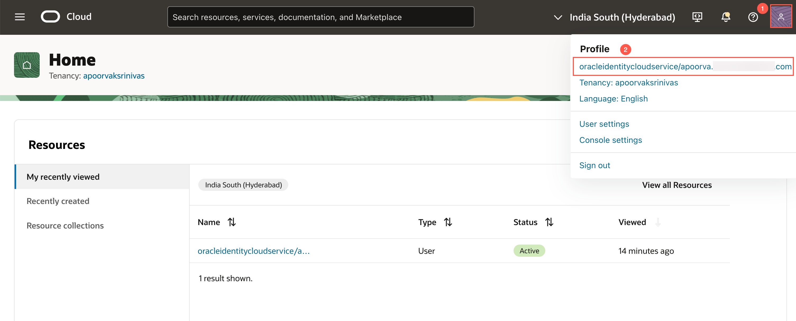
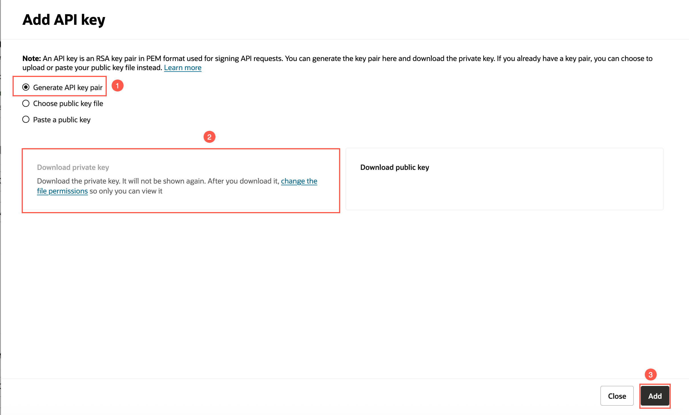
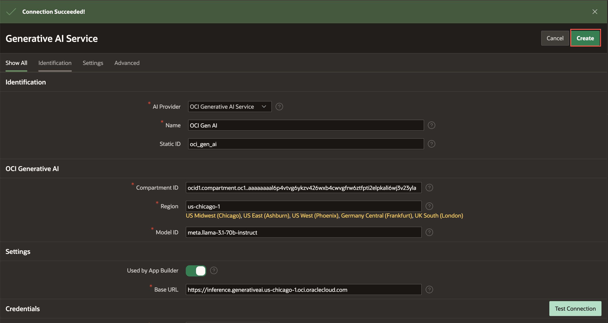
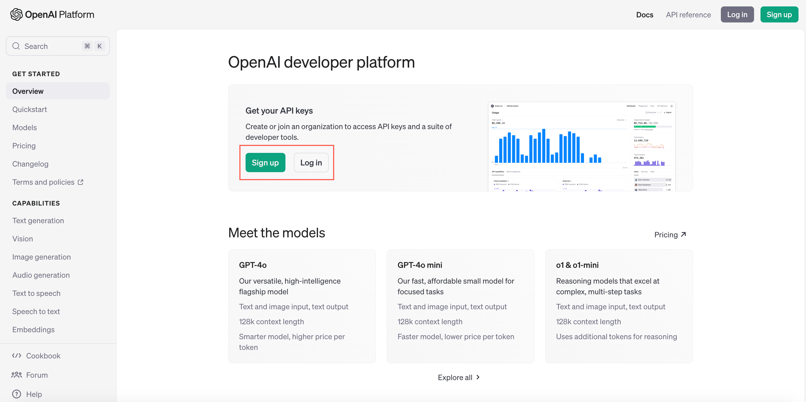
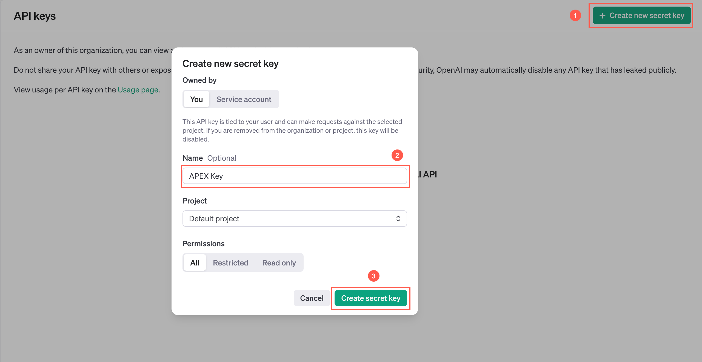
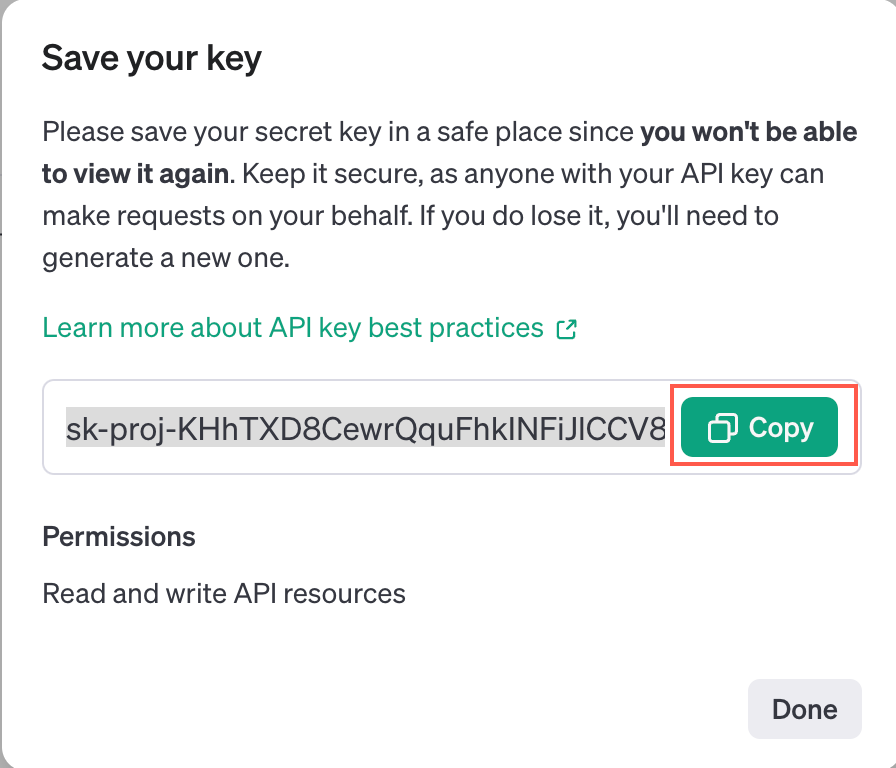

# Configure a Generative AI Service in APEX

## Introduction

To use the native GenAI features in APEX, you must configure a Generative AI service in APEX. To configure a Generative AI service, you will first need to obtain an API key from your preferred AI provider. You can either choose **OCI Generative AI** or **OpenAI** as your AI provider.

<if type="OCIGenAI">

In this lab, you use OCI Generative AI as the AI provider to build a conversational chatbot. To use the OCI Generative AI Service in APEX, you need to first configure the OCI API keys. In Oracle Cloud Infrastructure (OCI), API keys are used for secure authentication when accessing OCI resources through REST APIs.

OCI API keys consist of two parts: a **Public key** and a **Private key**. You use the OCI console to generate the Private/Public key pair.

**Note:** 
   - OCI Generative AI service is available in limited regions. To see if your cloud region supports OCI Generative AI service, visit the [documentation](https://docs.oracle.com/en-us/iaas/Content/generative-ai/overview.htm#regions).

   - The screenshots in this workshop are taken using Dark Mode in APEX 24.2

Estimated Time: 10 Minutes

Watch the video below for a quick walk-through of the lab.
[Configure a Generative AI Service in APEX](videohub:1_vdr019y8)

### Objectives

In this lab, you:

- Generate API Keys using OCI Console

### Downloads

If you are stuck or missed out on completing the previous labs, don't worry! Click [here](https://c4u04.objectstorage.us-ashburn-1.oci.customer-oci.com/p/EcTjWk2IuZPZeNnD_fYMcgUhdNDIDA6rt9gaFj_WZMiL7VvxPBNMY60837hu5hga/n/c4u04/b/livelabsfiles/o/labfiles%2Fnyc-starter-app.zip) to download the export file, which contains everything completed until Lab 2. To run the app, follow the steps described in the **Appendix Lab**:
    - [Task 1: Import the App into an APEX Workspace](?lab=8-appendix&type=OCIGenAI#Task1:ImporttheAppintoanAPEXWorkspace)
    - [Task 2: Update Web Credentials in Oracle APEX and Configure Generative AI](?lab=8-appendix&type=OCIGenAI#Task2:UpdateWebCredentialsinOracleAPEXandConfigureGenerativeAI)

## Task 1: Generate API Keys using OCI Console

Note: If you already have an OCI key pair, you may skip this lab.

To Generate the API Keys using OCI Console:

1. Login into your OCI Account.

   

2. Click **Profile** at the top-right corner and select your username.

    

3. Switch to the **Tokens and keys** tab. Click **Add API key**.

   

4. The Add API Key dialog is displayed. Select **Generate API Key Pair** to create a new key pair.

5. Click **Download Private Key**. A *.pem* file is saved to your local device. You do not need to download the public key.

   *Note: You will use this private key while configuring a Generative AI service in the upcoming lab.*

6. Click **Add**.

    

7. The key is added, and the Configuration File Preview is displayed. Copy and save the configuration file snippet from the text box into a notepad. You will use this information while configuring a Generative AI service in APEX.

    

## Task 2: Configure Generative AI Service

To use the Generative AI service in APEX, you need to first configure it at the workspace level.

1. From the App Builder, navigate to **Workspace Utilities** > **All Workspace Utilities**.

    

2. Select **Generative AI**.

     

3. Click **Create** to configure a Generative AI Service.

      

4. For this workshop, if you prefer to use OCI Generative AI Service as the AI provider, enter/select the following:

    - AI Provider: **OCI Generative AI Service**
    - Name: **OCI Gen AI**
    - Static ID: **oci\_gen\_ai**
    - Compartment ID: *Enter your OCI Compartment ID*. Refer to the [Documentation](https://docs.oracle.com/en-us/iaas/Content/GSG/Tasks/contactingsupport_topic-Locating_Oracle_Cloud_Infrastructure_IDs.htm#:~:text=Finding%20the%20OCID%20of%20a,displayed%20next%20to%20each%20compartment.) to fetch your Compartment ID. If you have only one compartment, then use the OCID from the configuration file you saved in Task 1 of this lab.
    - Region: **us-chicago-1** (Currently, the OCI Generative AI Service is only available in limited regions)
    - Model ID: **meta.llama-3.3-70b-instruct** (The pre-trained models are frequently deprecated. Refer to the [documentation](https://docs.oracle.com/en-us/iaas/Content/generative-ai/pretrained-models.htm#pretrained-models) for the latest pre-trained models.)
    - Used by App Builder: Toggle the button to turn it **ON**. Note that the Base URL is auto generated.

    

    - Credential: **Create New**
   
    - **OCI User ID**: Enter the OCID of the Oracle Cloud user Account. You can find the OCID in the Configuration File Preview generated during the API Key creation.
        Your OCI User ID looks similar to **ocid1.user.oc1..aaaaaaaa\*\*\*\*\*\*wj3v23yla**
    
    - **OCI Private Key**: Open the private key (.pem file) downloaded in the previous task. Copy and paste the API Key.
    
      
    
    - **OCI Tenancy ID**: Enter the OCID for Tenancy. Your Tenancy ID looks similar to **ocid1.tenancy.oc1..aaaaaaaaf7ush\*\*\*\*cxx3qka**
    
    - **OCI Public Key Fingerprint**: Enter the Fingerprint ID. Your Fingerprint ID looks similar to **a8:8e:c2:8b:fe:\*\*\*\*:ff:4d:40** 

   Click **Test Connection**.

   

5. If the connection is successful, click **Create**.
   If unsuccessful, verify if you have configured the IAM Policy on OCI correctly. Refer to the [Identity and Access Management](https://livelabs.oracle.com/pls/apex/r/dbpm/livelabs/run-workshop?p210_wid=624&p210_wec) workshop for more details.

    

## Summary
Congratulations! You've completed the lab.

You now know how to generate an API Key using OCI console and configure a Generative AI service in APEX.

You may now **proceed to the next lab**.

</if>

<if type="OpenAI">

In this lab, you use Open AI as the AI provider to build a conversational chatbot. 

**Note:** The screenshots in this workshop are taken using Dark Mode in APEX 24.2

Estimated Time: 10 Minutes

Watch the video below for a quick walk-through of the lab.
[Configure a Generative AI Service in APEX](videohub:1_caybibul)

### Objectives

In this lab, you:

- Generate API Key for OpenAI.

## Task 1: Generate API Keys using Open AI

1. Create and login to your [OpenAI account](https://platform.openai.com/).

   

2. Navigate to [API Keys](https://platform.openai.com/settings/organization/api-keys) page to create a new key.

   Click **Create new secret key**. Enter the details and click **Create secret key**.

   

3. A secret key is generated. **Copy** and save the API key into a notepad. You will use this information while configuring a Generative AI service in APEX.

   

## Task 2: Configure Generative AI Service

To use the Generative AI service in APEX, you need to first configure it at the workspace level.

1. From the App Builder, navigate to **Workspace Utilities** > **All Workspace Utilities**.

    

2. Select **Generative AI**.

     

3. Click **Create** to configure a Generative AI Service.

      

4. For this workshop, if you prefer to choose OpenAI as the AI provider, enter/select the following:

    - AI Provider: **Open AI**
    - Name: **Open AI**
    - Used by App Builder: Toggle the button to turn it **ON**
    - API Key: Enter your *Open AI API* key that you generated in Task 1 of this lab.
    - AI Model: **gpt-3.5-turbo** (Enter a preferred model of your choice)

    Click **Test Connection**.
    

5. If the connection is successful, click **Create**. 
   If unsuccessful, go to troubleshooting section in Appendix lab. (provide link to troubleshoot lab)
    

## Summary

Congratulations! You've completed the lab.

You now know how to an generate API Key using OpenAI.

You may now **proceed to the next lab**.
</if>

## Acknowledgments
- **Author** - Apoorva Srinivas, Senior Product Manager
- **Last Updated By/Date** - Apoorva Srinivas, Senior Product Manager, February 2025
