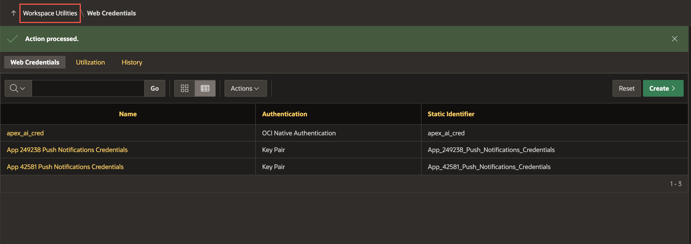
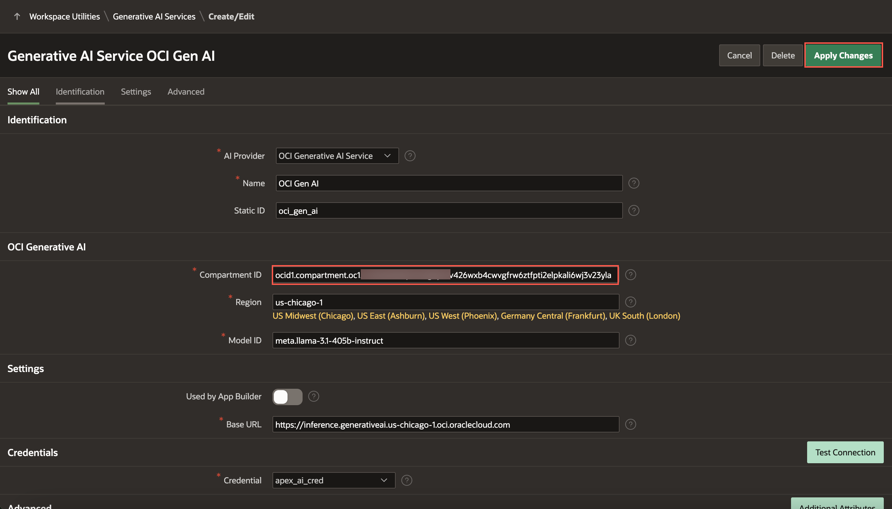

# Appendix: Download Instructions

This lab consists of tasks that need to be executed on a case-by-case basis. If you are directed to this lab at any point of time, choose the appropriate task that needs to be executed to proceed.

## Objectives

In this lab, you will:
- Download and install the final export of the app.

## Task 1: Import the App into an APEX Workspace

1. Navigate to **App Builder** and click **Import**.

    

2. Drag and drop your downloaded zip file, then click **Next**.

    

3. Click **Install Application**.

    

4. Click **Next**.

    

5. Click **Install Supporting Objects**.

    

## Task 2: Update Web Credentials in Oracle APEX and Configure Generative AI

Web credentials are used to authenticate connection to external REST services, or REST Enabled SQL services from APEX.

Creating Web Credentials securely stores and encrypts authentication credentials for use by Oracle APEX components and APIs. Credentials cannot be retrieved back in clear text. Credentials are stored at the workspace level and therefore are visible to all applications.

To update the Web Credential in Oracle APEX:

1. You need access to an OCI API Key Pair. To generate an OCI Key pair, refer to [Lab 3: Task 1 : Generate API keys using OCI Console](?lab=3-configure-oci&type=OCIGenAI#Task1:GenerateAPIKeysusingOCIConsole)

Skip this step if you already have the API key.


2. On the Workspace home page, click **App Builder**.

   

3. Click **Workspace Utilities**.

   

4. Select **Web Credentials**.

   

5. Click **apex_ai_cred**.

   

6. Enter the following details using the configuration file you copied while generating an API key in OCI Console.

    - **Name**: apex\_ai\_cred

    - **Authentication Type**: OCI Native Authentication

    - **OCI User ID**: Enter the OCID of the Oracle Cloud user Account. You can find the OCID in the Configuration File Preview generated during the API Key creation.
    Your OCI User ID looks similar to **ocid1.user.oc1..aaaaaaaa\*\*\*\*\*\*wj3v23yla**

    - **OCI Private Key**: Open the private key (.pem file) downloaded in the previous task. Copy and paste the API Key.

      

    - **OCI Tenancy ID**: Enter the OCID for Tenancy. Your Tenancy ID looks similar to **ocid1.tenancy.oc1..aaaaaaaaf7ush\*\*\*\*cxx3qka**

    - **OCI Public Key Fingerprint**: Enter the Fingerprint ID. Your Fingerprint ID looks similar to **a8:8e:c2:8b:fe:\*\*\*\*:ff:4d:40**

   

5. Click **Apply Changes**.


To Enable Generative AI in Oracle APEX:

6. Click **Workspace Utilities**.

    

7. Click **Generative AI**.

    

8. Click **OCI Gen AI**.

    

9. In the **Compartment ID** field, enter your **Compartment ID** and click **Apply Changes**. (Refer to the [Documentation](https://docs.oracle.com/en-us/iaas/Content/GSG/Tasks/contactingsupport_topic-Locating_Oracle_Cloud_Infrastructure_IDs.htm#:~:text=Finding%20the%20OCID%20of%20a,displayed%20next%20to%20each%20compartment.) to fetch your Compartment ID.)

    


## Task 3: Configure Vector Search using Search Configurations

1. To load the ONXX Model, refer to [Lab 7: Task 2: Load the ONNX Model](?lab=7-vector-search&type=OCIGenAI#Task2:LoadtheONNXModel).

2. Expand **App Builder**, then select **All Workspace Utilities** and click **Workspace Utilities**.

    

3. Click **Vector Providers**.

    

4. Click **DB ONXX Model**

    

5. Enter/select the following and click **Apply Changes**.

    - Under Local Embedding:

        - For ONNX Model Owner: *Select your Parsing Schema*

        - ONNX Model Name: **DOC_MODEL**

    

6. Expand **SQL Workshop** and select **SQL Commands**.

    

7. Copy and paste the SQL code below, then click **Run**.

    ```
    <copy>
    update HIGH_SCHOOL_INFO set chunk_v = apex_ai.get_vector_embeddings(p_value => chunk_c, p_service_static_id => 'db_onnx_model');
    </copy>
     ```

    

8. All set. Now, run the application and see it in action! Follow Lab 6: [Run the Application](?lab=6-run-app) to run the app.