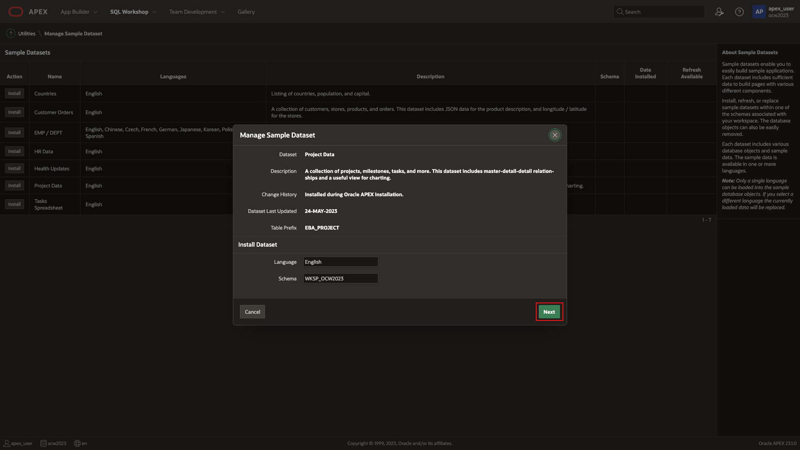
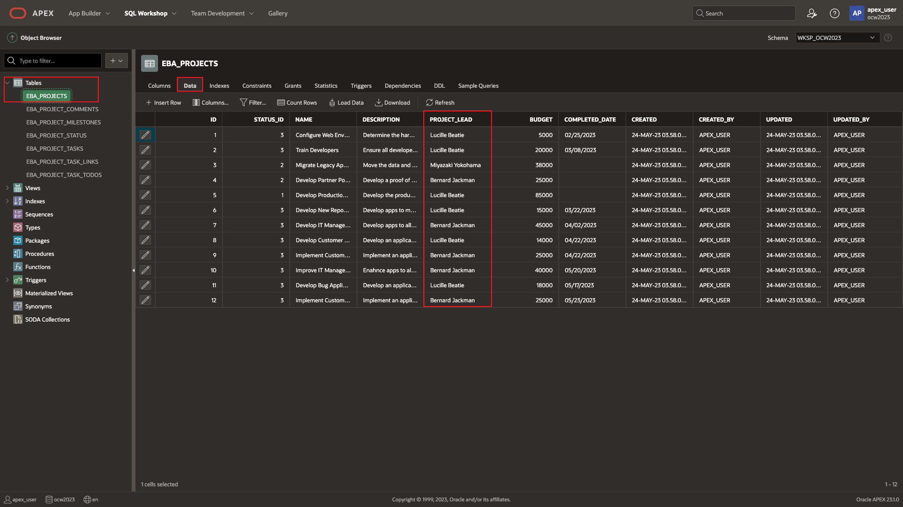
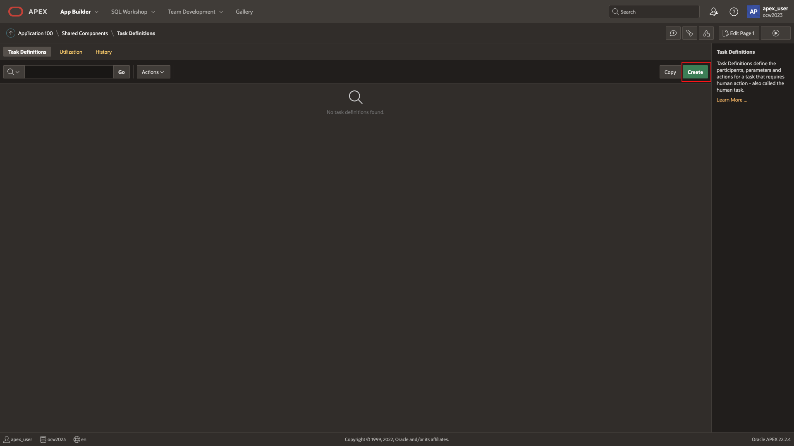
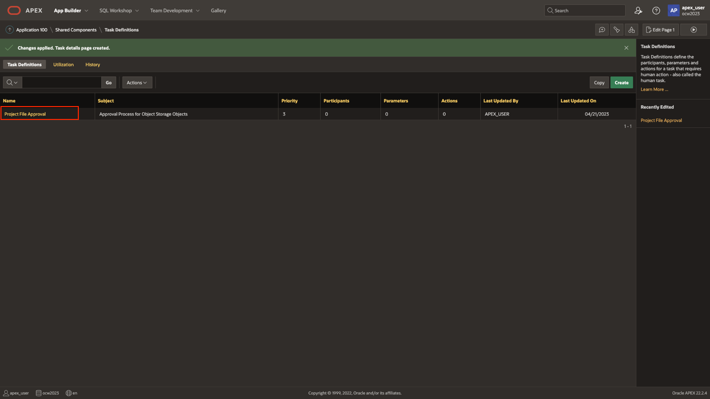
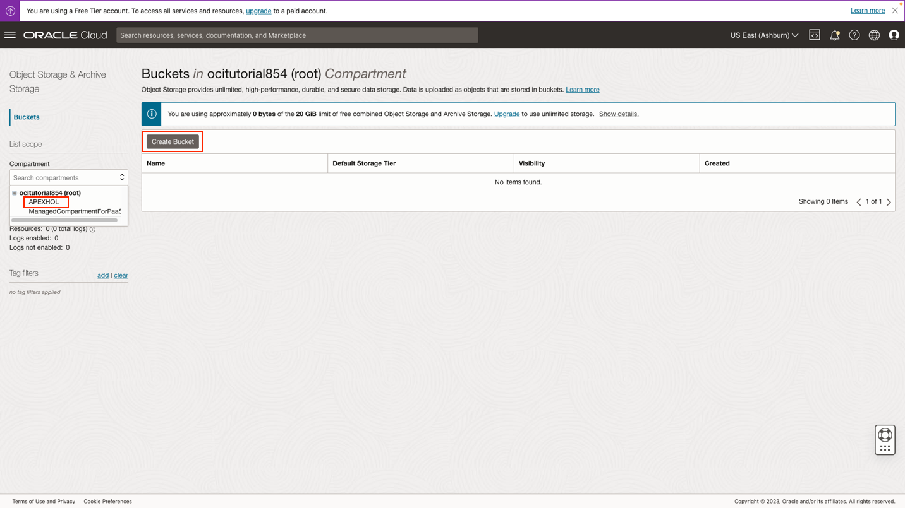
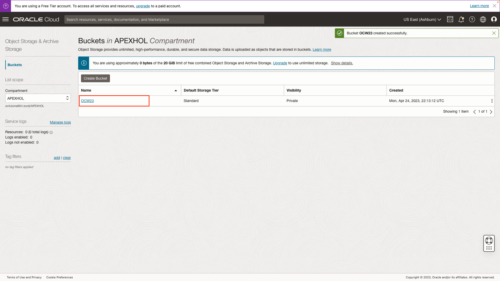
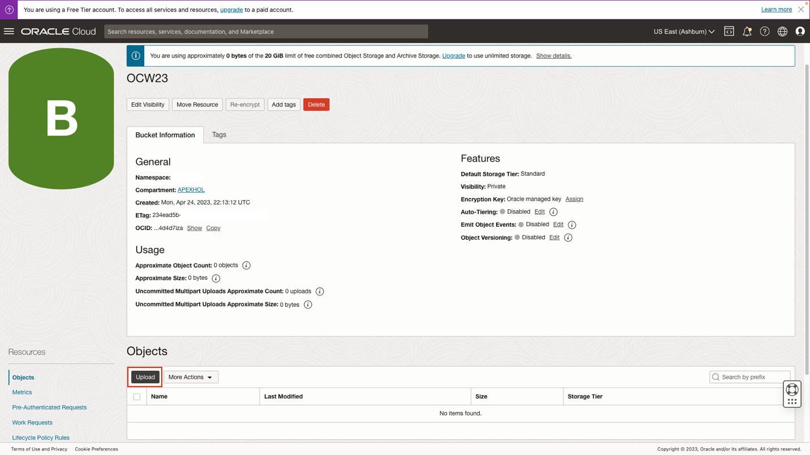
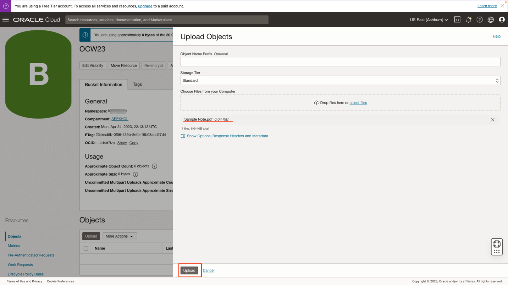

# Create application with task definition

## Introduction

In this lab, you will begin to create an APEX application using sample data.

Estimated Time: 15 minutes

[Lab 2](videohub:1_wubl4ys4)

### Objectives

In this lab, you will:

- Install sample data
- Create a "task definition"
- Enter task definition details
- Create an OCI Object Storage Bucket and upload sample image

### Prerequisites

To complete this lab, you need to have the following:

- All previous labs successfully completed

## Task 1: Create APEX Application

1. Log into the newly created workspace using the credentials for the user that was just created.

    

2. You have now reached the home page of the development workspace! The next step is to acquire some sample data and utilize that data to create a starter application.

    

3. Go to the **Sample Data Sets** section.

    

4. Select the **Project Data** sample data set and follow the wizard.

    

    

    

5. Click **Create Application** and deselect all features from the Features section.

    >**Note: While these features are important for any new application, to maintain simplicity, choose to deselect them at this time. These features can be added at a later time. To read more about APEX application features, click [here](https://docs.oracle.com/en/database/oracle/apex/23.1/htmdb/managing-feature-pages.html)**

    

    

    >**Note: De-select all features**

    

    

6. You may want to take a few minutes to explore the application that has been created using the sample dataset. This lab leverages the application as a foundation for showcasing how to upload and download files to and from object storage, and how to establish a task approval process.

    >**Note:** You can click on the **Run Application** button to view the application. The credentials were created earlier (Example Username: APEX_USER).

    

    

    

7. Back in the original browser tab, navigate to the object browser.

    

8. Within the object browser, there are 7 sample tables that were previously installed. In this hands-on-lab, the primary focus will be on the EBA\_PROJECTS table. To begin, it is necessary to create an approval process that allows any user of the application to submit a task. This task will then be automatically assigned by APEX page process to the project lead associated with it.

    

## Task 2: Task Definition

1. Visit **Shared Components** by returning to the home page by clicking on the APEX logo, and then access the newly created application by clicking on its icon.

    

    

    

    

2. Next, establish a new task definition and enter the necessary details, as illustrated below.

    

    

    

3. To proceed, we will create a task detail page in the APEX application. This page will serve as the central location for all relevant task information that the approval team can review before making any decisions. Fortunately, APEX streamlines this process by automatically generating a task detail page if one doesn't already exist.

    

4. APEX has generated a task details page on page 10, which we can review later to better understand its layout. For now, let's return to the Task Definition page to implement additional modifications.

    

5. Scroll down to add a new **Participant** For the Potential Owner, enter a **SQL Query** with a value as shown. This query will assign the newly created task to the project lead found in the EBA\_PROJECTS table.

    ```SQL
     <copy>
        select upper(substr(PROJECT_LEAD, 1,  instr(PROJECT_LEAD,' ') -1 )) from  EBA_PROJECTS where ID = :APEX$TASK_PK;
     </copy>
    ```

    

    

6. An additional parameter can be added to the task to store the name of the file that has been uploaded by the user to the object storage bucket. Once complete **Apply Changes** and return to the OCI console.

    

## Task 3: OCI Bucket

1. Proceed to the other tab, the OCI console, to create an object storage bucket and upload a temporary sample file. This file will be utilized later in APEX to test reading the contents of the bucket.

    

2. Select the APEXHOL compartment and click "Create Bucket".

    

3. Enter your bucket details. Add the bucket name as **OCW23**, and leave the rest as default.

    >**Note: If a bucket name other than "OCW23" is selected, please take note of it as it will be referenced later on.**

    

4. Once the bucket is created, click back into it, in order to add a sample file.

    

5. To upload a file, simply click on the **Upload** button and select any file from your computer.

    

6. Click upload, once the file is selected.

    

7. Make a note of the Tenancy Namespace on a notepad, it will be referenced later. Now that the file is uploaded into the new bucket we can move back to APEX.

    

You may now **proceed to the next lab**.

## Acknowledgements

- **Created By/Date** - Shayne Jayawardene, January 2023
- **Last Updated By/Date** - Shayne Jayawardene, July 2023
