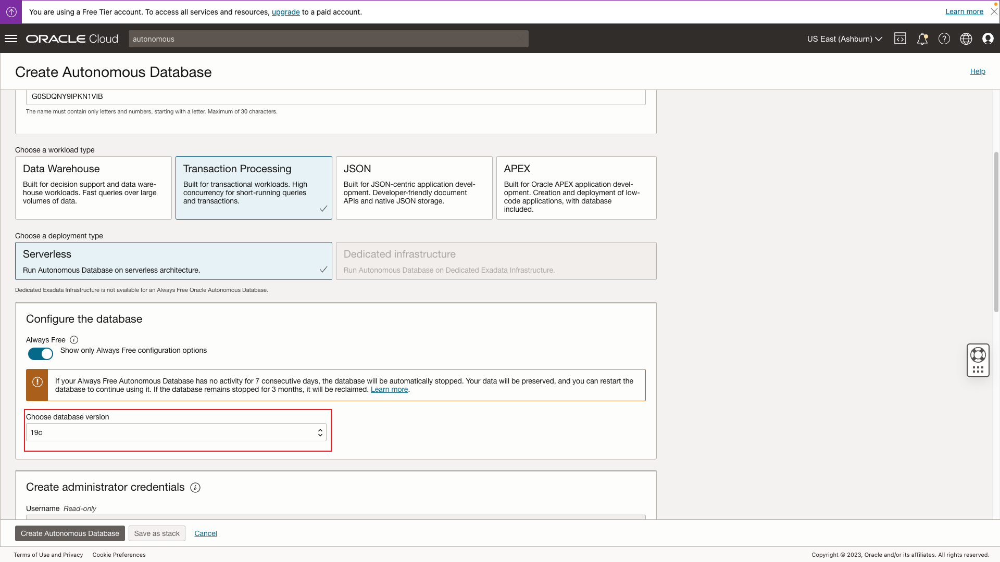
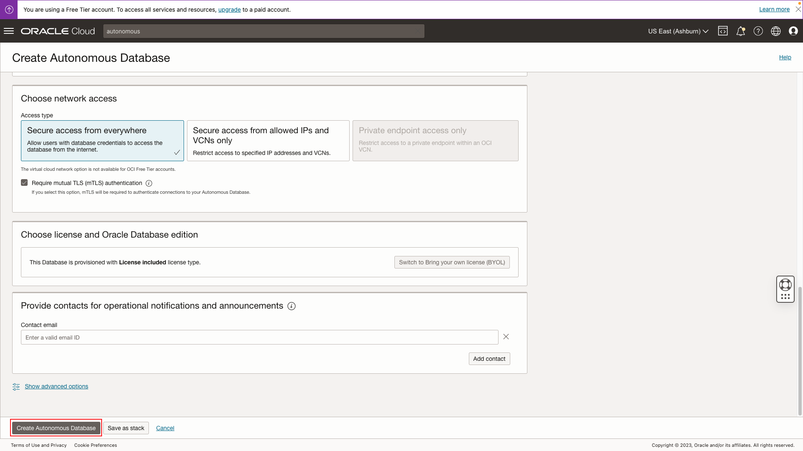
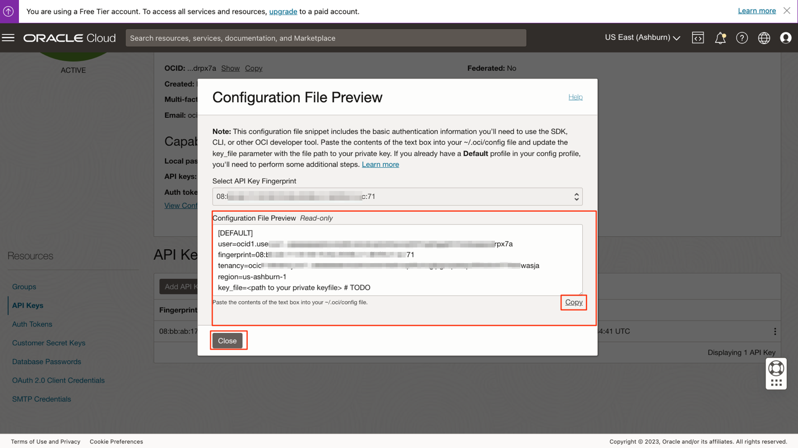
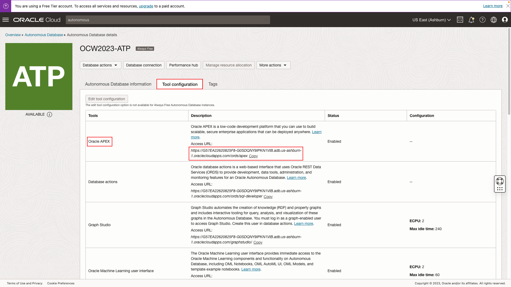
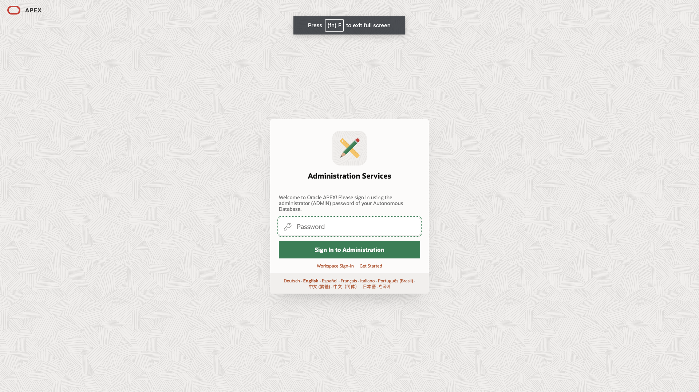
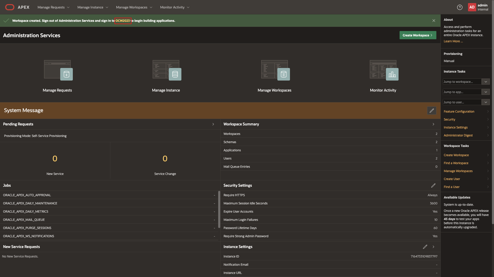

# Create autonomous instance

## Introduction

You will get started by creating an autonomous database, collecting user and tenancy OCIDs, and creating a APEX workspace.

>**Note: If you already have an APEX workspace, complete task 2 in this lab and then proceed to lab 2.**

Estimated Time: 10 minutes

[Lab 1](videohub:1_oiov76r9)

### Objectives

In this lab, you will:

- Create Autonomous Database
- Collect Tenancy/User information for subsequent lab(s)
- Create an APEX workspace

### Prerequisites

To complete this lab, you need to have the following:

- No prerequisites

## Task 1: Create Autonomous Instance

1. Log in to the [Oracle Cloud Infrastructure Console](https://www.oracle.com/cloud/sign-in.html) by navigating to the login page and entering your login credentials.

    

2. In the main navigation menu, click on **Identity** and then **Compartments** to access the compartment creation page.

    

    

3. Enter a name for the compartment and an optional description, select the parent compartment as the root, and click the **Create Compartment** button to create a new compartment.

    

4. Navigate to the **Autonomous Transaction Processing** option in the **Database** section of the main menu.

    

    

5. Click on **Create Autonomous Database** to configure the required parameters for the instance, such as the database name, password, and workload type.

    

6. Configure the required parameters for the instance, such as the display name name, password, and workload type.

    >**Note: Database Password must be 12 to 30 characters and contain at least one uppercase letter, one lowercase letter, and one number. The password cannot contain the double quote (") character or the username "admin".**

    

    

    

    

## Tak 2: Collect User Authorization Details

1. While the instance is being provisioned, gather important information required to connect to object storage later, including the profile and tenancy's unique OCIDs, OCI Private Key, and Fingerprint.

    

2. Navigate to your user profile in the top right of the console.

    

3. Scroll down to the **Resources** section and click on **API Keys** then click **Add API key**.

    

4. Download the private key and copy/save the additional information, including the user and tenancy OCIDs, and the API fingerprint.

    

5. Navigate back to the ATP instance that was created and into **OCW2023-ATP** and then click on **Tool Configuration**. Copy the provided link into a new browser tab.

    

    

## Task 3: Create new APEX Workspace

1. In the new window, log into the admin workspace to create a new APEX workspace.

    >**Note: This is the database ADMIN password that was created in step 6**

    

2. Click **Create New Workspace** and select **New Schema**

    

    

3. Enter new workspace credentials.

    >**Note: This step involves creating a workspace to serve as a container for the application, as well as a database user that will serve as the administrator for this new workspace.**

    

4. Click on the link to log out of the admin workspace.

    

You may now **proceed to the next lab**.

## Acknowledgements

- **Created By/Date** - Shayne Jayawardene, January 2023
- **Last Updated By/Date** - Shayne Jayawardene, July 2023
