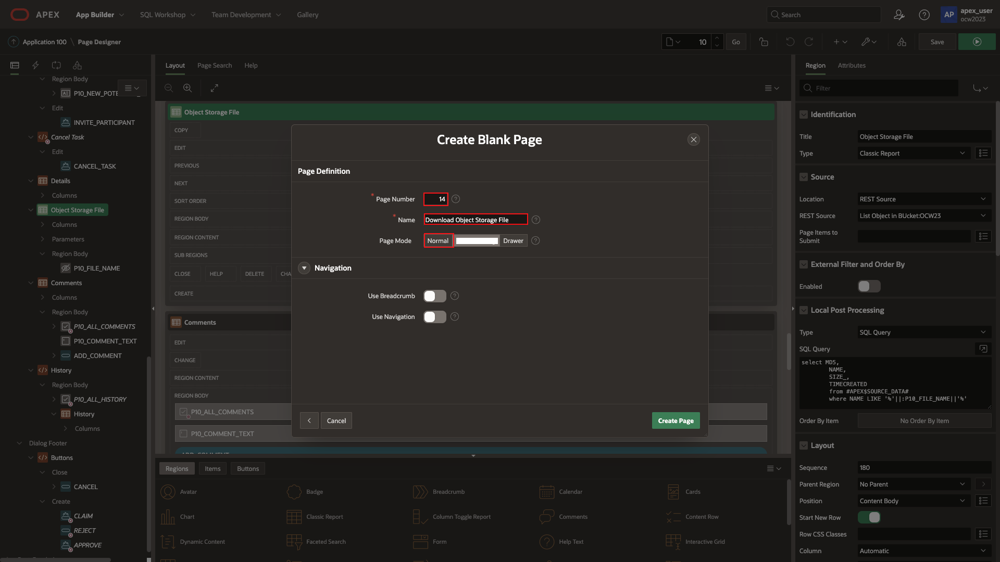
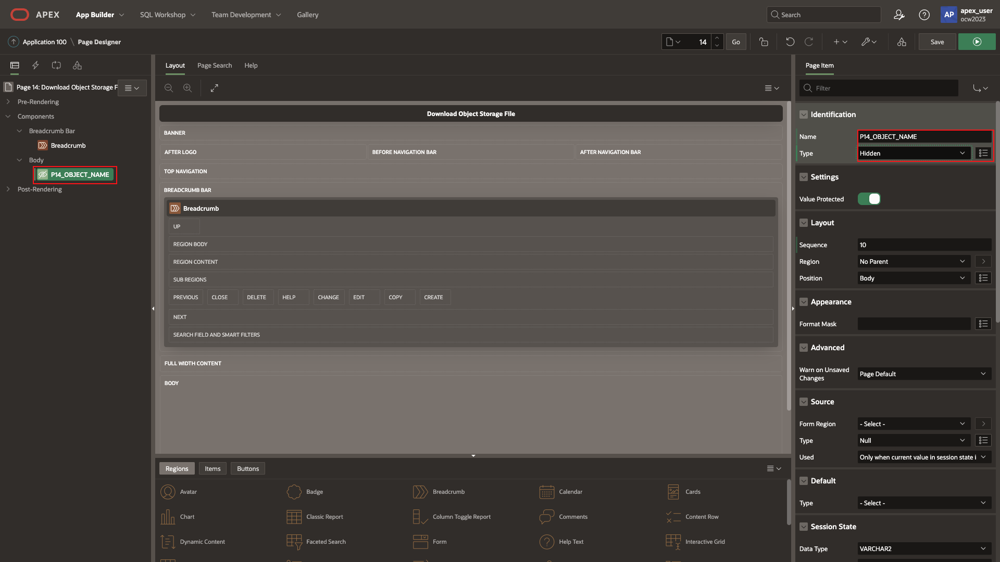
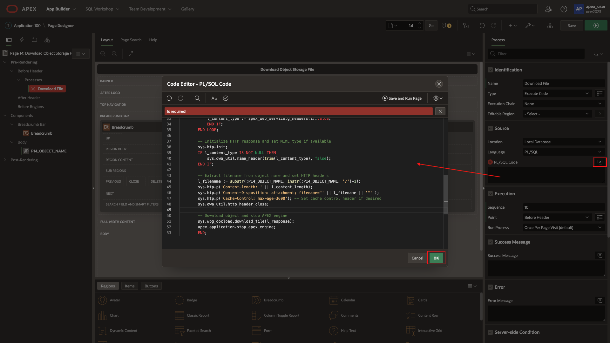
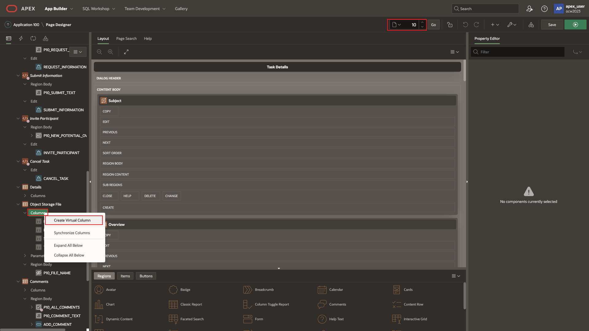

# Download Object Storage file

## Introduction

In this lab, complete the steps to download file from the Object Storage bucket.

Estimated Time: 5 minutes

[Lab 7](videohub:1_u1wvhgy7)

### Objectives

In this lab, you will:

- Create hidden page
- Establish **Before Header** process
- Download file

### Prerequisites

To complete this lab, you need to have the following:

- All previous labs successfully completed

## Task 1: Download Script

1. Create a new blank page

    

    

2. Create a hidden page item to hold the file name of the user's selected file.

    

    

3. Next, expand the pre-rendering and add a before header process.

    

4. Enter a new title of Download File, and enter the PL/SQL code as shown.
    

    ```SQL
        <copy>-- Declare variables
        DECLARE
        l_request_url varchar2(32767);
        l_content_type varchar2(32767);
        l_content_length varchar2(32767);
        l_filename varchar2(32767);
        l_response blob;
        download_failed_exception exception;
        BEGIN
        -- Construct URL for object storage object download
        l_request_url := :G_BASE_URL || '/b/' || 'OCW23' || '/o/' || apex_util.url_encode(:P14_OBJECT_NAME);
        -- Make REST request to download object
        l_response := apex_web_service.make_rest_request_b(
            p_url => l_request_url,
            p_http_method => 'GET',
            p_credential_static_id => 'OCI_AUTH'
        );
        -- If request was unsuccessful, raise an exception
        IF apex_web_service.g_status_code != 200 THEN
            raise download_failed_exception;
        END IF;
        -- Extract content length and content type from response headers
        FOR i IN 1..apex_web_service.g_headers.count LOOP
            IF apex_web_service.g_headers(i).name = 'Content-Length' THEN
            l_content_length := apex_web_service.g_headers(i).value;
            END IF;
            IF apex_web_service.g_headers(i).name = 'Content-Type' THEN
            l_content_type := apex_web_service.g_headers(i).value;
            END IF;
        END LOOP;
        -- Initialize HTTP response and set MIME type if available
        sys.htp.init;
        IF l_content_type IS NOT NULL THEN
            sys.owa_util.mime_header(trim(l_content_type), false);
        END IF;
        -- Extract filename from object name and set HTTP headers
        l_filename := substr(:P14_OBJECT_NAME, instr(:P14_OBJECT_NAME, '/')+1);
        sys.htp.p('Content-length: ' || l_content_length);
        sys.htp.p('Content-Disposition: attachment; filename="' || l_filename || '"' );
        sys.htp.p('Cache-Control: max-age=3600'); -- Set cache control header if desired
        sys.owa_util.http_header_close;
        -- Download object and stop APEX engine
        sys.wpg_docload.download_file(l_response);
        apex_application.stop_apex_engine;
        END;
        </copy>
    ```

    

## Task 2: Create Virtual Link

1. Save changes! Return to page 10 and create a virtual column for the object storage report. By default, it should be configured as a link.

    

    

2. Enter the new link information and items to set.

    

3. Change the icon for the link, if desired

    

4. Finally, it's time to perform a comprehensive test. Log into the application with 'APEX_USER' and upload a new project file, as done before. Then access the application by logging in with the user **Lucille** to view this task that was just created.

    >**Note: You may also see the previously uploaded file in a previous task that was used for testing.**

    

    

    

**Congratulations on completing the lab! You have successfully created an APEX application that enables users to log in, upload local files to object storage, and initiate a workflow process for project leads to review file(s). Project leads can review and take necessary actions on tasks, and download the files as needed. Well done on your achievement!**

## Acknowledgements

- **Created By/Date** - Shayne Jayawardene, January 2023
- **Last Updated By/Date** - Shayne Jayawardene, July 2023
