# Upload file to Object Storage

## Introduction

In this lab, you will create new APEX pages to view task(s) and implement the upload procedure.

Estimated Time: 10 minutes

[Lab 5](videohub:1_563cepqi)

### Objectives

In this lab, you will:

- Create **Unified Task List** pages
- Create sample users
- Create Pl/SQL process

### Prerequisites

To complete this lab, you need to have the following:

- All previous labs successfully completed

## Task 1: Unified Task Pages

1. To begin, two new pages will be added to the APEX application. The first page will display tasks initiated by the user, while the second page will show tasks assigned to the user.

    

2. Choose Unified Task list and choose the report context **My Tasks**.

    

    

3. Next, a second page will be created specifically for tasks initiated by the logged-in user. This time use the report context **Initiated by Me**.

    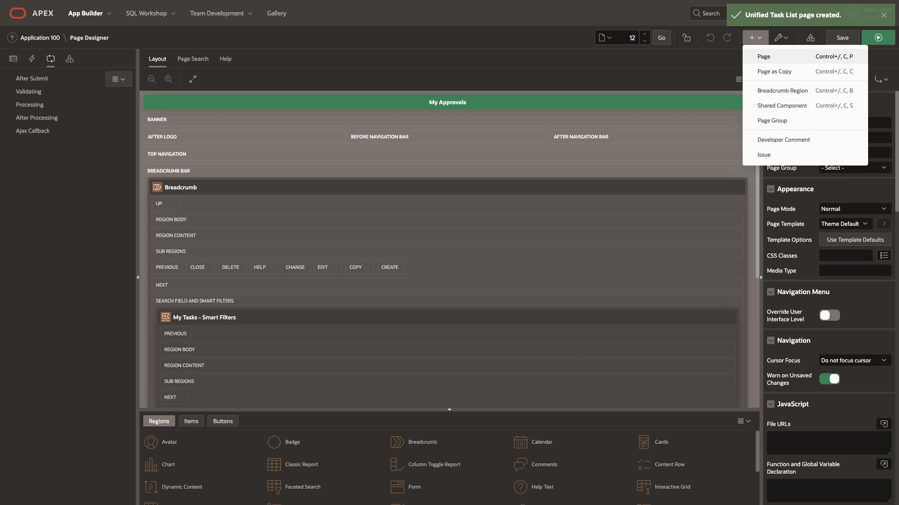

    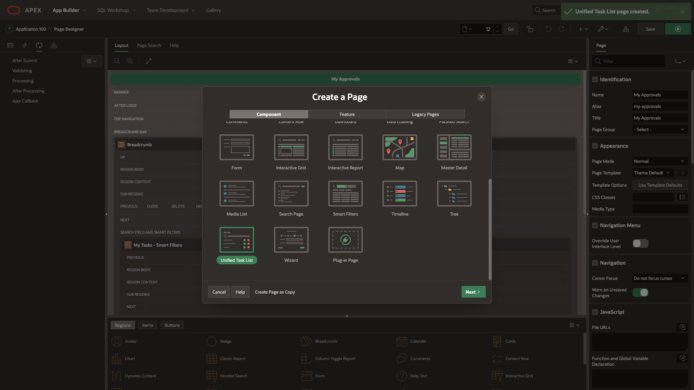

    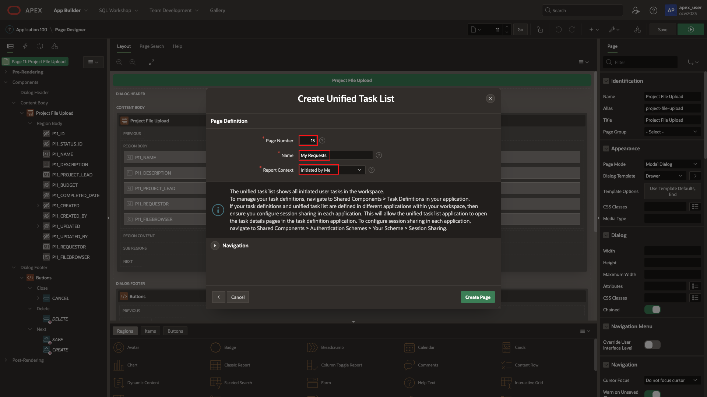

    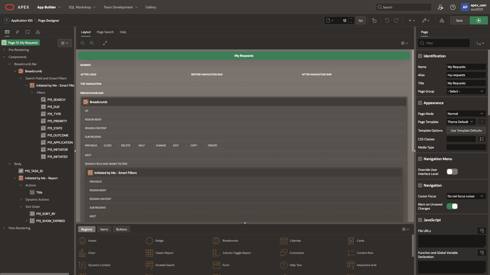

4. Now, saving the progress and running the application will allow you to observe the two newly created pages. It's important to note that both pages will initially appear blank since they do not contain any data yet.

    

5. Next, three sample users will be created to represent the project leads: Lucille, Bernard, and Miyazaki. To accomplish this, navigate to the **SQL Scripts** section and create a new script.

    >**Note: These names correspond to the values in the "Project Lead" column of the previously imported project dataset.**

    

    

## Task 2: Create New Sample Users

1. Insert the given script and run it to create 3 new users. This will create the users and set their password to the variable declared. Feel free to set the password to whatever you would like.

    >**Note: Alternatively, users can also be created under the "Manage Users and Groups" section. However, to simplify the process, we can utilize a script that will automatically create three users: Lucille, Bernard, and Miyazaki.**

    ```SQL
     <copy>
    DECLARE
            v_password VARCHAR2(100) := 'APEX_PASS1!'; --change password, if desired;
    BEGIN
        APEX_UTIL.CREATE_USER (
            p_user_name     => 'Lucille',              -- Specifies the username for the user
            p_email_address => 'lucille.beatie@example.com',  -- Specifies the email address for the user
            p_first_name    => 'Lucille',              -- Specifies the first name for the user
            p_last_name     => 'Beatie',               -- Specifies the last name for the user
            p_web_password  => v_password,            -- Specifies the web password for the user
            p_change_password_on_first_use  => 'N');
        APEX_UTIL.CREATE_USER (
            p_user_name     => 'Bernard',
            p_email_address => 'bernard.jackman@example.com',
            p_first_name    => 'Bernard',
            p_last_name     => 'Jackman',
            p_web_password  => v_password,
            p_change_password_on_first_use  => 'N');
        APEX_UTIL.CREATE_USER (
            p_user_name                     => 'Miyazaki',
            p_email_address                 => 'miyazaki.yokohama@example.com',
            p_first_name                    => 'Miyazaki',
            p_last_name                     => 'Yokohama',
            p_web_password                  =>  v_password,
            p_change_password_on_first_use =>  'N');
    END;
     </copy>
    ```

    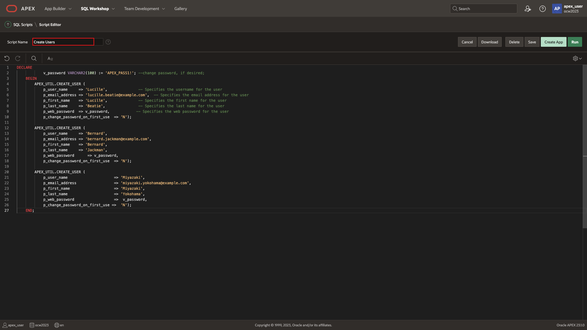

    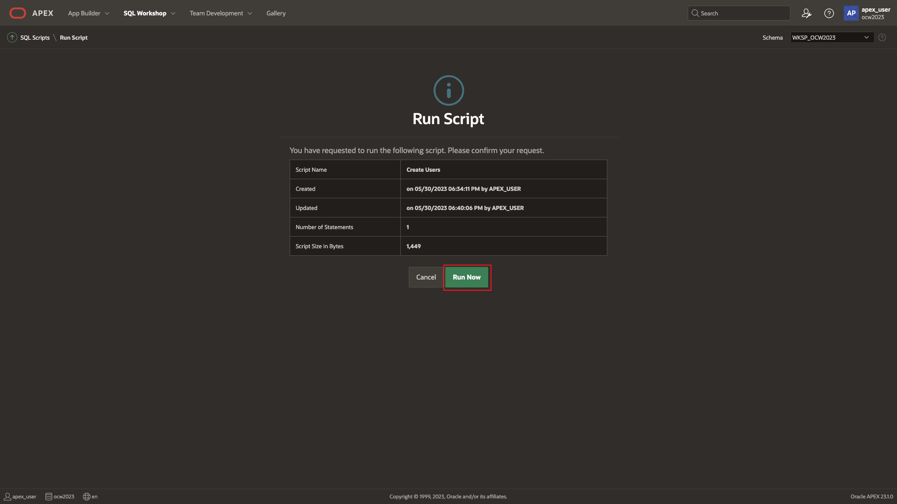

    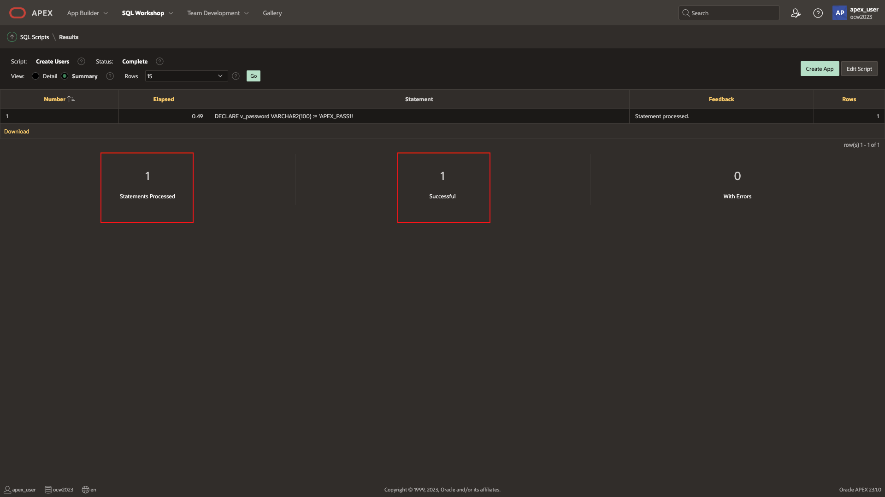

2. Return to page overview. Now, it's time to test the proper assignment of tasks before proceeding further.

    

    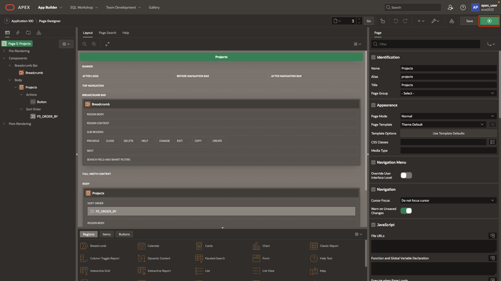

3. To proceed, please navigate to page 3 and locate the **Upload File** button under the **Configure Web Environment** section. For the purposes of this test, you can leave all the default settings as they are. Ensure that **no file is selected** in the file browser, and then proceed to submit the form.

    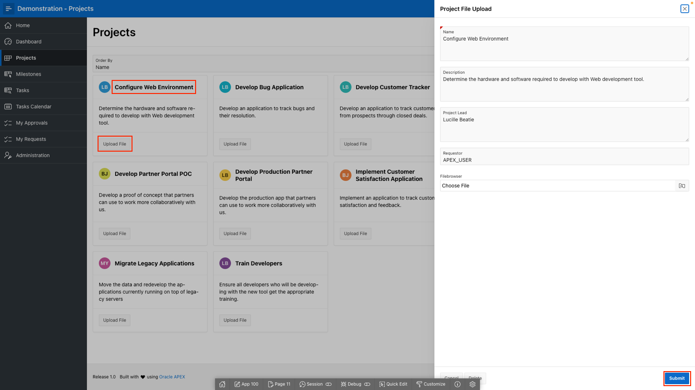

4. The task created by APEX_USER should now appear under the "My Requests" tab. After that, sign out and sign back in with Lucille (Project lead for Configure Web Environment).

    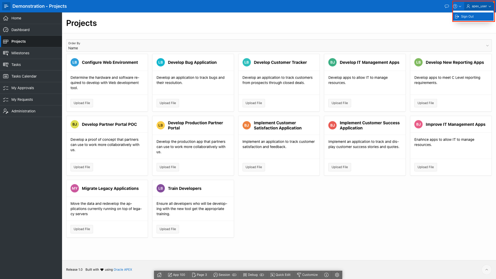

    >**Note: The password default will be APEX_PASS1! set by the SQL Script. If you receive an authorization error "Access denied by security check" you will need to add the user "Lucille" as a contributor under Shared Components -> Access Control -> Add new user role assignment**

    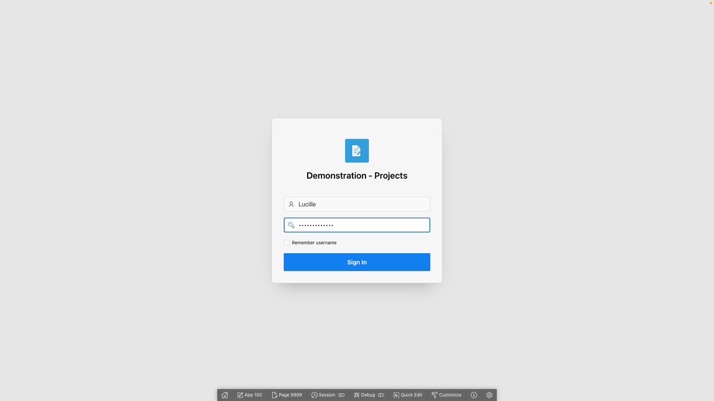

5. In the **My Approvals** tab, a task assigned by APEX\_USER will be visible. Clicking on the task title will provide more details. Do not approve this task, it will be used later to view and download the file that will be uploaded in the next few steps.
    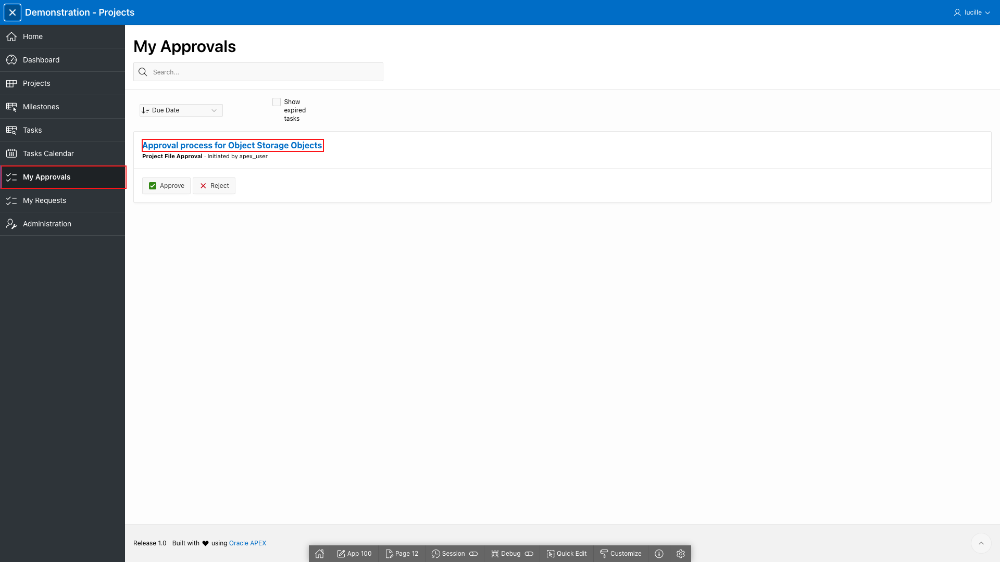

    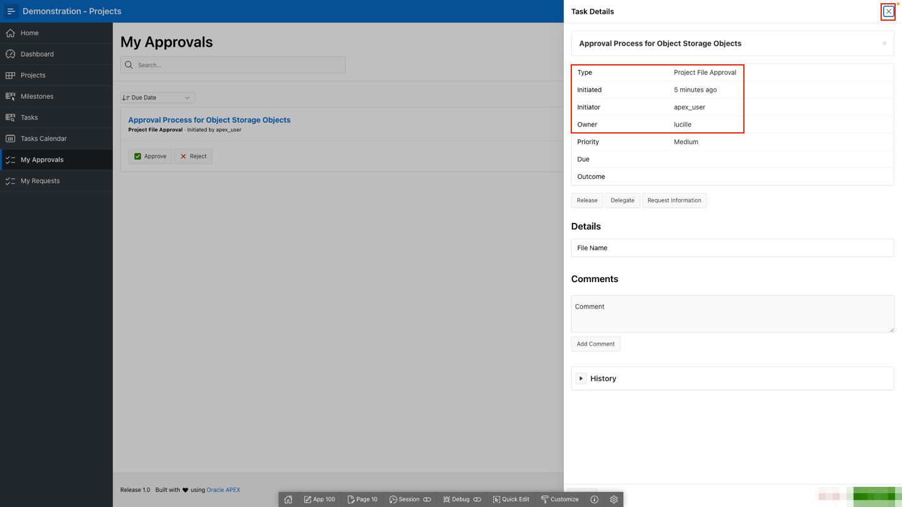

## Task 3: Upload File Process

1. Now, it's time to navigate back to page 11, where the necessary processing for uploading and downloading files from object storage will be added.

    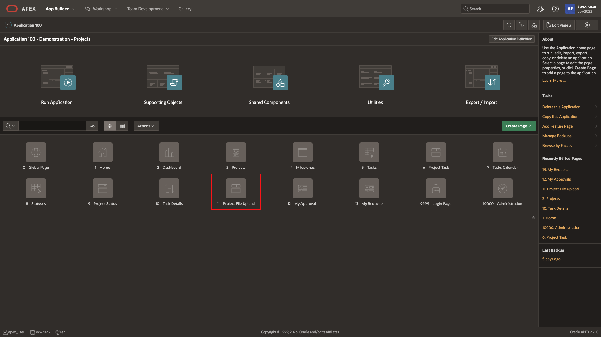

2. To proceed, navigate to the **Processing** tab and create a new process. Follow the same steps we previously used to create the **Assign to Project Lead** process. Right-click on **Processes** and select **Create New Process**.

    

    

3. Enter a new name and enter the SQL Query as shown. Save Changes!

    ```SQL
     <copy>
        DECLARE
        l_request_url VARCHAR2(32767);
        l_content_length NUMBER;
        l_response CLOB;
        upload_failed_exception EXCEPTION;
        l_request_object BLOB;
        l_request_filename VARCHAR2(500);
        l_selected apex_application_global.vc_arr2;
        l_project varchar2(500);
        BEGIN
        -- Get the list of selected files from the file browser item
        l_selected := apex_util.string_to_table(:P11_FILEBROWSER, ':');
        -- Get the name of the current project
        l_project := :P11_NAME;
        -- If at least one file is selected in the file browser item
        IF :P11_FILEBROWSER IS NOT NULL THEN
            -- Loop through the selected files
            FOR i IN 1 .. l_selected.COUNT LOOP
            BEGIN
                -- Get the contents and filename of the current file
                SELECT blob_content, filename INTO l_request_object, l_request_filename
                FROM apex_application_temp_files
                WHERE name = l_selected(i);
                -- Modify the filename to include the project name and replace spaces with underscores
                l_request_filename := REPLACE(l_project, ' ', '') || '/' || REPLACE(l_request_filename, ' ', '_');
                -- Build the URL for the object storage REST API request
                l_request_url := :G_BASE_URL || '/b/' || 'OCW23' || '/o/' || APEX_UTIL.URL_ENCODE(l_request_filename); --Change Bucket name (OCW23), if required.
                -- Make a PUT request to upload the file to object storage using the REST API
                l_response := apex_web_service.make_rest_request(p_url => l_request_url, p_http_method => 'PUT', p_body_blob => l_request_object, p_credential_static_id => 'OCI_AUTH');
            EXCEPTION
                -- Handle the case where no data is found for the specified file name
                WHEN NO_DATA_FOUND THEN
                -- Do nothing and continue to the next file
                NULL;
                -- Handle all other exceptions by raising an error
                WHEN OTHERS THEN
                RAISE_APPLICATION_ERROR(-20001, 'An error occurred while processing file ' || l_selected(i) || ': ' || SQLERRM);
            END;
            END LOOP;
        END IF;
        END;
         </copy>
    ```

    >**Note: Drag new process above assign to project lead. In line 31, "G\_Base\_URL is a substitution string we will need to establish.**

    

    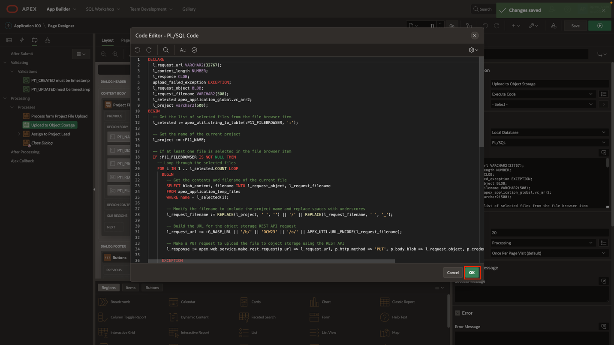

You may now **proceed to the next lab**.

## Acknowledgements

- **Created By/Date** - Shayne Jayawardene, January 2023
- **Last Updated By/Date** - Shayne Jayawardene, May 2023
