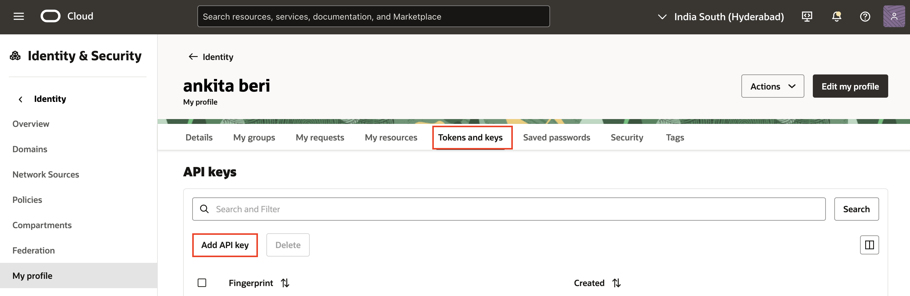
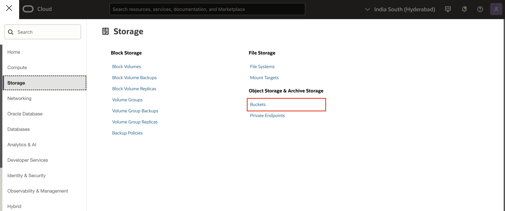
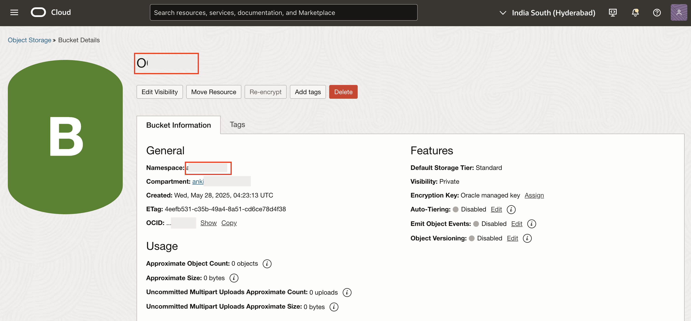

# Configure the OCI API keys

## Introduction

In this lab, you learn how to configure the OCI API keys and Create Buckets in OCI Object Storage. In Oracle Cloud Infrastructure (OCI), API keys are used for secure authentication when accessing OCI resources through REST APIs and a bucket refers to a logical container used for storing and managing data objects within an Object Storage service.

OCI API keys consist of two parts: a **Public key** and a **Private key**. You use the OCI console to generate the Private/Public key pair.

Estimated Time: 10 Minutes

### Objectives
In this lab, you:

- Generate API Keys using OCI Console
- Create a Bucket in OCI Object Storage

## Task 1: Generate API Keys using OCI Console

To Generate the API Keys using OCI Console:

1. Login into your OCI Account.

   

2. Click **My Profile** at the top-right corner.

    

3. Under Resources at the bottom-left, select **API Keys** and  click **Add API Key**.

    

4. The Add API Key dialog is displayed. Select **Generate API Key Pair** to create a new key pair.

5. Click **Download Private Key**. A *.pem* file is saved to your local device. You do not need to download the public key.

   *Note: You will use this private key while configuring the web credentials in Oracle APEX in the upcoming lab.*

6. Click **Add**.

    

7. The key is added, and the Configuration File Preview is displayed. Copy and save the configuration file snippet from the text box into a notepad. You will use this information for creating Oracle APEX Web Credentials.

    

## Task 2: Create a Bucket in OCI Object Storage
To create a Bucket using OCI Console, Login into your OCI Account.

1. Navigate to the Object Storage service by clicking on the menu icon **(☰)** in the top-left corner.

   

2. Under Storage, Select **Buckets**.

   

3. Select the compartment where you want to create the bucket. You can choose an existing compartment or create a new one if needed. Now, Select **Create Bucket**.

   

4. Enter the following:

    - Name: **OCIDocAI**

    - Default Storage Tier: **Standard**

    Click **Create**.

    

    
