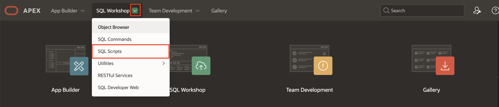
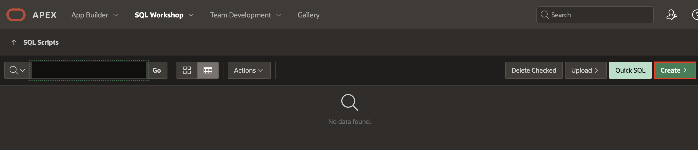
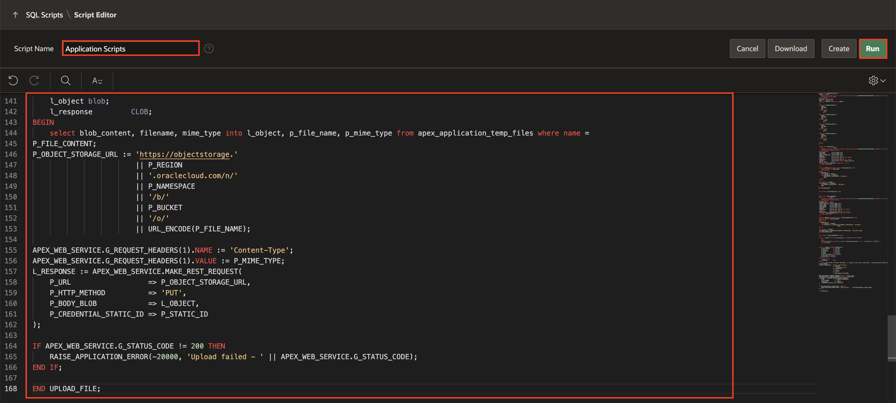
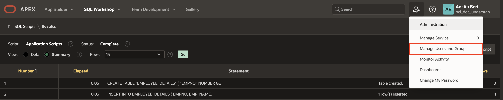
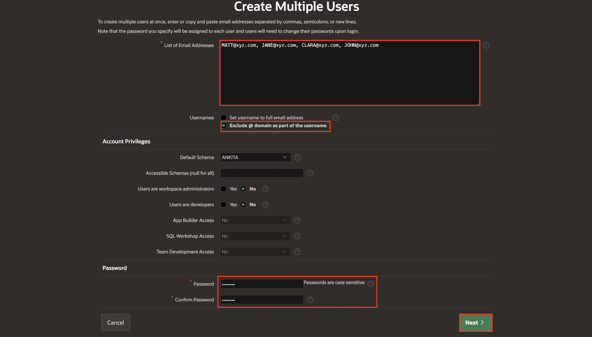
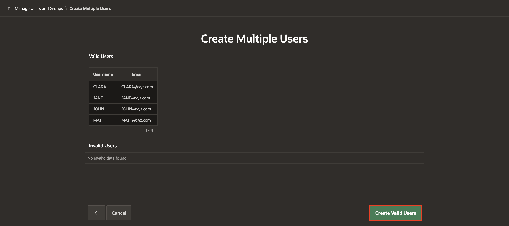

# Setup Tasks for Application Development

## Introduction

In this lab, you will run SQL commands using SQL Scripts. A SQL script can contain one or more SQL statements or PL/SQL blocks. You can use SQL scripts to create, edit, view, run, and delete database objects.

Furthermore, you'll discover how to create multiple accounts in a single operation.

Moreover, you'll configure Web credentials to authenticate connections to external REST services or REST-Enabled SQL services from APEX.

Estimated Time: 10 Minutes

### Objectives

In this lab, you:

- Create database objects using SQL Scripts
- Create multiple Application Users
- Create Web Credentials

## Task 1: Create database objects using SQL Scripts

1. Log in into your APEX Workspace. Click **'⌄'** next to **SQL Workshop** and Select **SQL Scripts**.

    

2. Click **Create**.

    

3. Copy the following SQL code and paste it into the code editor:

    ```
    <copy>
    CREATE TABLE "EMPLOYEE_DETAILS" (
    "EMPNO"    NUMBER
        GENERATED BY DEFAULT ON NULL AS IDENTITY MINVALUE 1 MAXVALUE 9999999999999999999999999999 INCREMENT BY 1 START WITH 8000 CACHE
        20 NOORDER NOCYCLE NOKEEP
    NOT NULL ENABLE,
    "EMP_NAME" VARCHAR2(100),
    "MGR"      NUMBER(4, 0),
    CONSTRAINT "EMP_PK" PRIMARY KEY ( "EMPNO" )
    ) ;

    INSERT INTO EMPLOYEE_DETAILS (
        EMPNO,
        EMP_NAME,
        MGR
    ) VALUES ( 10,
           'JOHN',
           20 );

    INSERT INTO EMPLOYEE_DETAILS (
        EMPNO,
        EMP_NAME,
        MGR
    ) VALUES ( 20,
           'CLARA',
           30 );

    INSERT INTO EMPLOYEE_DETAILS (
        EMPNO,
        EMP_NAME,
        MGR
    ) VALUES ( 30,
           'JANE',
           40 );

    INSERT INTO EMPLOYEE_DETAILS (
        EMPNO,
        EMP_NAME,
        MGR
    ) VALUES ( 40,
           'MATT',
           NULL );

    COMMIT;
    /

    CREATE TABLE "INV_UPLOAD" (
       "ID"                 NUMBER
        GENERATED BY DEFAULT ON NULL AS IDENTITY MINVALUE 1 MAXVALUE 9999999999999999999999999999 INCREMENT BY 1 START WITH 1 CACHE 20
        NOORDER NOCYCLE NOKEEP NOSCALE
    NOT NULL ENABLE,
    "FILE_NAME"          VARCHAR2(4000 CHAR),
    "MIME_TYPE"          VARCHAR2(4000 CHAR),
    "OBJECT_STORAGE_URL" VARCHAR2(4000 CHAR),
    "CREATED"            DATE NOT NULL ENABLE,
    "CREATED_BY"         VARCHAR2(255 CHAR) NOT NULL ENABLE,
    "UPDATED"            DATE NOT NULL ENABLE,
    "UPDATED_BY"         VARCHAR2(255 CHAR) NOT NULL ENABLE,
    "STATUS"             VARCHAR2(50) DEFAULT 'Pending Approval',
    "DOC_AI_JSON"        CLOB,
    CONSTRAINT "INV_UPLOAD_ID_PK" PRIMARY KEY ( "ID" )
        USING INDEX ENABLE
    );

    CREATE OR REPLACE EDITIONABLE TRIGGER "INV_UPLOAD_BIU" BEFORE
        INSERT OR UPDATE ON INV_UPLOAD
        FOR EACH ROW
    BEGIN
    IF INSERTING THEN
        :NEW.CREATED := SYSDATE;
        :NEW.CREATED_BY := COALESCE(
            SYS_CONTEXT('APEX$SESSION', 'APP_USER'),
            USER
        );
    END IF;

    :NEW.UPDATED := SYSDATE;
    :NEW.UPDATED_BY := COALESCE(
        SYS_CONTEXT('APEX$SESSION', 'APP_USER'),
        USER
    );
    END INV_UPLOAD_BIU;
    /

    ALTER TRIGGER "INV_UPLOAD_BIU" ENABLE;

    /

    CREATE TABLE "DOCAI_RESPONSE" (
    "ID"              NUMBER
        GENERATED BY DEFAULT ON NULL AS IDENTITY MINVALUE 1 MAXVALUE 9999999999999999999999999999 INCREMENT BY 1 START WITH 1 CACHE 20
        NOORDER NOCYCLE NOKEEP NOSCALE
    NOT NULL ENABLE,
    "DOCUMENT_ID"     NUMBER,
    "FIELD_TYPE_CODE" VARCHAR2(4000 CHAR),
    "FIELD_LABEL"     VARCHAR2(4000 CHAR),
    "LABEL_SCORE"     VARCHAR2(4000 CHAR),
    "FIELD_VALUE"     VARCHAR2(4000 CHAR),
    "CREATED"         DATE NOT NULL ENABLE,
    "CREATED_BY"      VARCHAR2(255 CHAR) NOT NULL ENABLE,
    "UPDATED"         DATE NOT NULL ENABLE,
    "UPDATED_BY"      VARCHAR2(255 CHAR) NOT NULL ENABLE,
    CONSTRAINT "DOCAI_RESPONSE_ID_PK" PRIMARY KEY ( "ID" )
        USING INDEX ENABLE
     );

    CREATE OR REPLACE EDITIONABLE TRIGGER "DOCAI_RESPONSE_BIU" BEFORE
    INSERT OR UPDATE ON DOCAI_RESPONSE
    FOR EACH ROW
    BEGIN
    IF INSERTING THEN
        :NEW.CREATED := SYSDATE;
        :NEW.CREATED_BY := COALESCE(SYS_CONTEXT('APEX$SESSION', 'APP_USER'),
                                   USER);
    END IF;

    :NEW.UPDATED := SYSDATE;
    :NEW.UPDATED_BY := COALESCE(SYS_CONTEXT('APEX$SESSION', 'APP_USER'),USER);
    END DOCAI_RESPONSE_BIU;
    /

    ALTER TRIGGER "DOCAI_RESPONSE_BIU" ENABLE;
    /
    create or replace FUNCTION url_encode(p_str IN VARCHAR2) RETURN VARCHAR2
        IS
        BEGIN
        RETURN sys.utl_url.escape( url => p_str, escape_reserved_chars => true, url_charset => 'AL32UTF8' );
        end url_encode;

        /

    create or replace PROCEDURE UPLOAD_FILE (
        P_FILE_CONTENT      IN VARCHAR2,
        p_static_id         IN VARCHAR2,
        p_namespace         IN VARCHAR2,
        p_bucket            IN VARCHAR2,
        p_region            IN VARCHAR2,
        p_object_storage_url OUT VARCHAR2,
        p_file_name OUT VARCHAR2,
        p_mime_type OUT VARCHAR2
    ) IS
        l_object blob;
        l_response         CLOB;
    BEGIN
        select blob_content, filename, mime_type into l_object, p_file_name, p_mime_type from apex_application_temp_files where name =
    P_FILE_CONTENT;
    P_OBJECT_STORAGE_URL := 'https://objectstorage.'
                            || P_REGION
                            || '.oraclecloud.com/n/'
                            || P_NAMESPACE
                            || '/b/'
                            || P_BUCKET
                            || '/o/'
                            || URL_ENCODE(P_FILE_NAME);

    APEX_WEB_SERVICE.G_REQUEST_HEADERS(1).NAME := 'Content-Type';
    APEX_WEB_SERVICE.G_REQUEST_HEADERS(1).VALUE := P_MIME_TYPE;
    L_RESPONSE := APEX_WEB_SERVICE.MAKE_REST_REQUEST(
        P_URL                  => P_OBJECT_STORAGE_URL,
        P_HTTP_METHOD          => 'PUT',
        P_BODY_BLOB            => L_OBJECT,
        P_CREDENTIAL_STATIC_ID => P_STATIC_ID
    );

    IF APEX_WEB_SERVICE.G_STATUS_CODE != 200 THEN
        RAISE_APPLICATION_ERROR(-20000, 'Upload failed - ' || APEX_WEB_SERVICE.G_STATUS_CODE);
    END IF;

    END UPLOAD_FILE;

     </copy>
    ```

4. For **Script Name**: Enter **Application Scripts** and click **Run**.

   

5. On the Run Script page, click **Run Now**.

    

6. The Results page shows the results of running the script. Scroll to the bottom to see a summary. You should not see any errors.

    

## Task 2: Create Multiple Application Users

Workspace administrators can create new user accounts one at a time or create multiple accounts in a single operation.

To create multiple users accounts simultaneously:

1. At the top of the Workspace home page, under Administration, click **Manage Users and Groups**.

   

2. Click **Create Multiple Users**.

   

3. Enter/select the following details:

    - List of Email Addresses: **MATT@xyz.com, JANE@xyz.com, CLARA@xyz.com, JOHN@xyz.com**

    - Usernames: **Exclude @ domain as part of the username**

    Under Password:

      - Password: Specify a password

      - Confirm Password: Enter the password again.

    Click **Next**.

    

4. Click **Create Valid Users**.

    

## Task 3: Create Web Credentials in Oracle APEX

Web credentials authenticate the connection to external REST services or REST-Enabled SQL services from APEX.

Creating Web Credentials securely stores and encrypts authentication credentials for use by Oracle APEX components and APIs. Credentials cannot be retrieved back in clear text. They are stored at the workspace level and, therefore, visible to all applications.

To create a Web Credential in Oracle APEX:

1. On the Workspace home page, click **App Builder**.

   

2. Click **Workspace Utilities**.

   

3. Select **Web Credentials**.

   

4. Click **Create**.

   

5. Enter/select the following details using the configuration file you copied in the previous task.

    - Name: **APEX\_OCI\_AI\_CRED**

    - Static ID: **APEX\_OCI\_AI\_CRED**

    - Authentication Type: **OCI Native Authentication**

    - OCI User ID: Enter the OCID of the Oracle Cloud user Account. The OCID is in the Configuration File Preview generated during the API Key creation.
    Your OCI User ID looks similar to **ocid1.user.oc1..aaaaaaaa\*\*\*\*\*\*wj3v23yla**

    - OCI Private Key: Open the private key (.pem file) downloaded in the previous task. Copy and paste the API Key.

    

    - OCI Tenancy ID: Enter the OCID for Tenancy. Your Tenancy ID looks similar to **ocid1.tenancy.oc1..aaaaaaaaf7ush\*\*\*\*cxx3qka**

    - OCI Public Key Fingerprint: Enter the Fingerprint ID. Your Fingerprint ID looks similar to **a8:8e:c2:8b:fe:\*\*\*\*:ff:4d:40**

   

6. Click **Create**.

   

## Summary

You've gained the skills to create database objects using SQL Scripts, create multiple application users, and set up web credentials.

You're now ready to move on to the next lab!

## Acknowledgements

- **Author** - Roopesh Thokala, Senior Product Manager ; Ankita Beri, Product Manager
- **Last Updated By/Date** - Ankita Beri, Product Manager, June 2024
