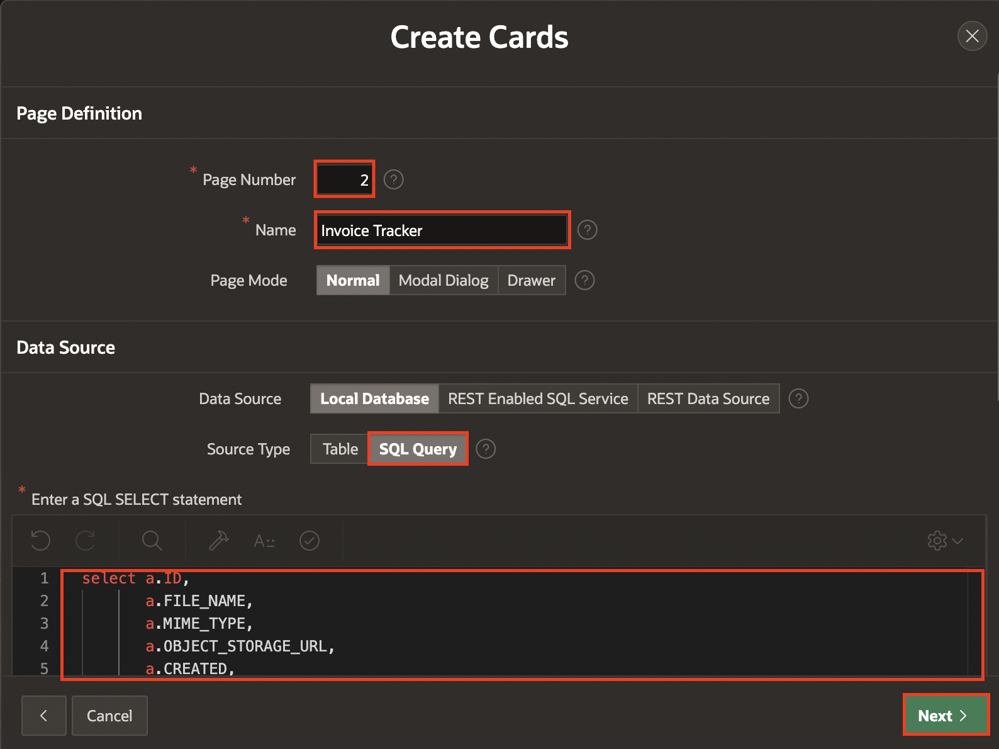
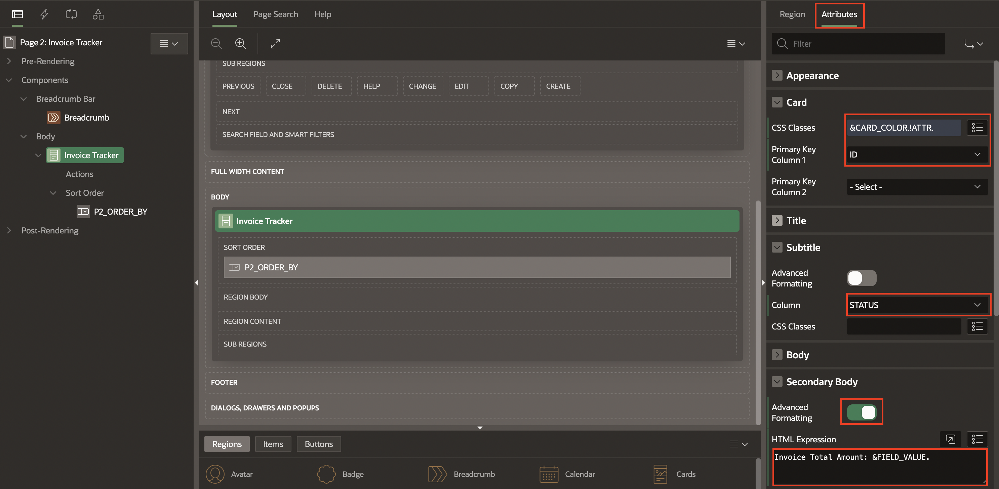
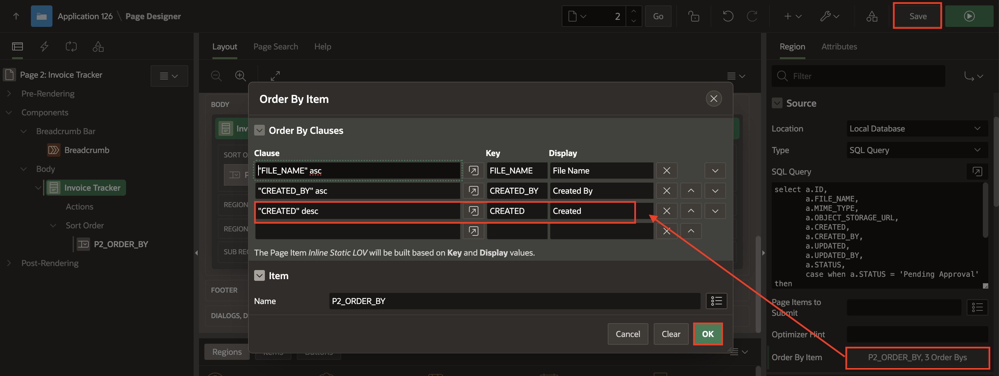
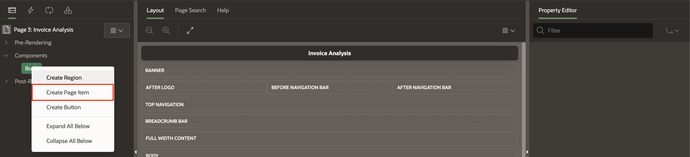
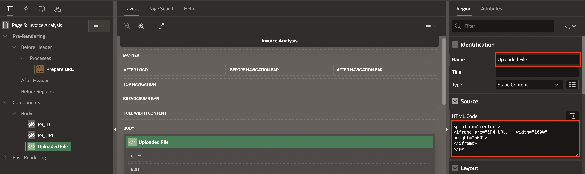
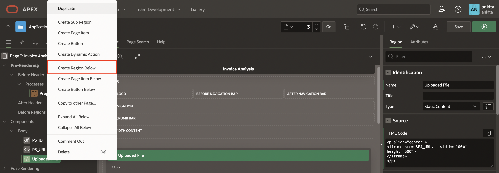
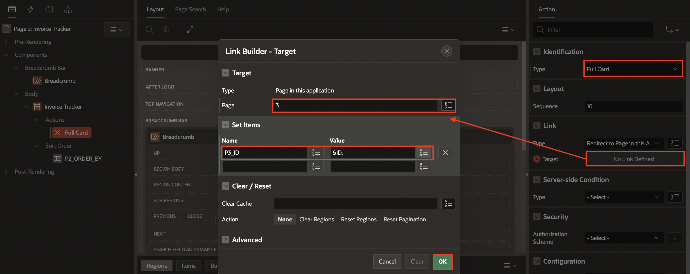
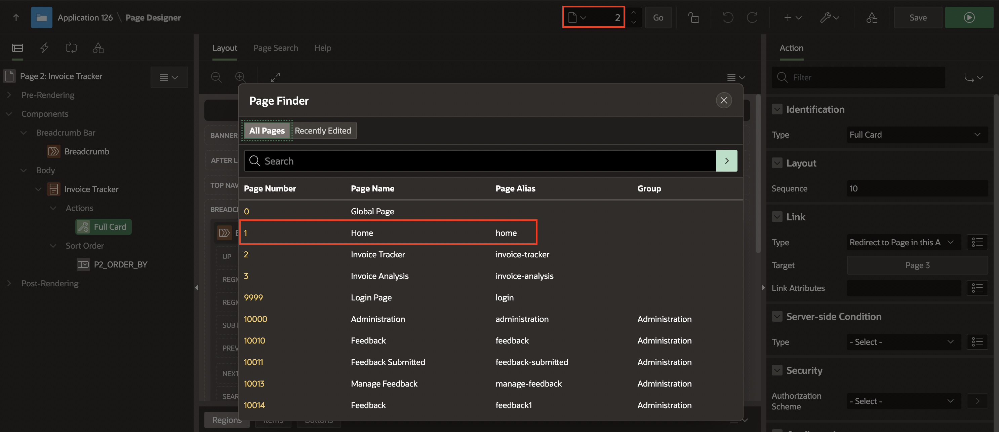
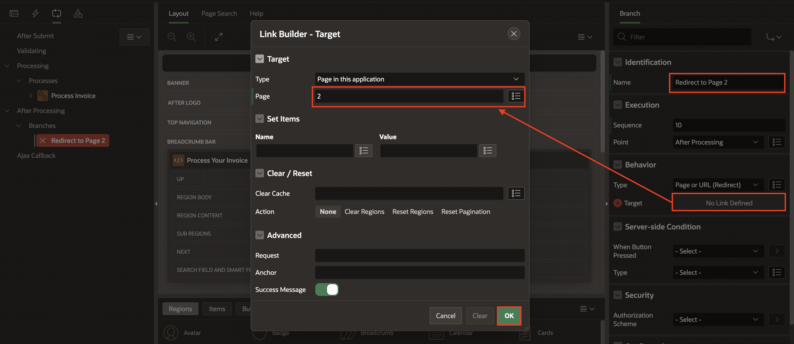

# Develop an Invoice Tracker and Invoice Analysis Page

## Introduction

This lab guides you through creating an application process to download a file from a URL stored in the database. Additionally, you'll develop two new pages for invoice tracking and invoice analysis.

Estimated Time: 15 Minutes

### Objectives
In this lab, you:

- Create an Application Process
- Develop an Invoice Tracking page using Cards
- Create an Invoice Analysis page

## Task 1: Create an Application Process
In this task, you create an application process to retrieve the URL and MIME type of a document stored in an Object Storage service. It makes an authenticated REST API call to retrieve the document as a BLOB, sets the appropriate HTTP response headers, and sends the document to the client for download. The operation is based on the ID provided in the input parameter ':P3_ID'.

1. Navigate to **Shared Components**

   

2. Under Application Logic, select **Application Processes**

   

3. Click **Create**.

   

4. Under Identification:

    - Name: **DISPLAY_PDF**

    - On Point: **AJAX Callback: Run this application process when requested by page process**

   Click **Next**.

   

5. Source > Code: Copy and Paste below code into the code editor:

     ```
     <copy>
     DECLARE
    L_BLOB      BLOB;
    L_URL       VARCHAR2(255);
    L_MIME_TYPE VARCHAR2(50);
  BEGIN
    SELECT
        MIME_TYPE,
        OBJECT_STORAGE_URL
    INTO
        L_MIME_TYPE,
        L_URL
    FROM
        INV_UPLOAD
    WHERE
        ID = :P3_ID;

    L_BLOB := APEX_WEB_SERVICE.MAKE_REST_REQUEST_B(P_URL => L_URL, P_HTTP_METHOD => 'GET', P_CREDENTIAL_STATIC_ID => 'APEX_OCI_AI_CRED'
    );

    OWA_UTIL.MIME_HEADER(L_MIME_TYPE, FALSE);
    HTP.P('Content-Length: ' || DBMS_LOB.GETLENGTH(L_BLOB));
    OWA_UTIL.HTTP_HEADER_CLOSE;
    WPG_DOCLOAD.DOWNLOAD_FILE(L_BLOB);
  END;
     <copy>
     ```
    Click **Next**.

    

6. Click **Create Process**.

    

## Task 2: Develop an Invoice Tracking page using Cards
In this task, you create an Invoice Tracking page featuring the Cards Region, which displays the uploaded image or PDF file.

1. Navigate to **Application ID**.

   

2. Click **Create Page**.

   

3. Under Component, select **Cards**.

   

4. Enter the following details:

    - Page Definition > Page Number: **2**

    - Page Definition > Name: **Invoice Tracker**

    - Data Source > Source Type: **SQL Query**

    - Enter a SQL SELECT Statement: Copy and paste the below code:

    ```
    <copy>
    SELECT
    A.ID,
    A.FILE_NAME,
    A.MIME_TYPE,
    A.OBJECT_STORAGE_URL,
    A.CREATED,
    A.CREATED_BY,
    A.UPDATED,
    A.UPDATED_BY,
    A.STATUS,
    CASE
        WHEN A.STATUS = 'Pending Approval' THEN
            'u-color-24'
        WHEN A.STATUS = 'Approved'         THEN
            'u-color-20'
    END CARD_COLOR,
    A.DOC_AI_JSON,
    B.FIELD_VALUE
FROM
    INV_UPLOAD     A,
    DOCAI_RESPONSE B
WHERE
        A.ID = B.DOCUMENT_ID
    AND B.FIELD_LABEL = 'InvoiceTotal'
     <copy>
     ```

     Click **Next**.

    

5. Under Card Attributes:

    - Title Column: **FILE_NAME (Varchar2)**

    - Body Column: **CREATED_BY (Varchar2)**

   Click **Create Page**.

   

6. In the left pane, select **Invoice Tracker** region and Under **Attributes**, enter the following:

    - Under Card:

        - CSS Classes: **&CARD\_COLOR.!ATTR.**

        - Primary Key Column 1: **ID**

    - Subtitle > Column: **STATUS**

    - Under Secondary Body:

        - Advanced Formatting: **Toggle On**

        - HTML Expression: **Invoice Total Amount: &FIELD\_VALUE.**

    

7. In the property editor, select **Region** tab. Under Source, Select **Order By Item** and enter the following:

      | Clause | Key | Display |
      |--------|-----|---------|
      | "CREATED" desc| CREATED | Created |
      {: title="Order By Item"}

     Click **OK**.

    

8. Click **Save**.

## Task 3: Create an Invoice Analysis page
In this task, you create an Invoice Analysis page featuring the Cards Region, which displays extracted fields from the uploaded image or PDF file in an organized manner. Clicking on a card brings up a Pop-up Dialog page where you will find a clear comparison between your uploaded PDF and the output from OCI Document Understanding.

1. Navigate to Create(+) in Page Designer toolbar and select **Page**.

   

2. Select **Blank Page**.

   

3. On Create Page dialog, enter the following:

    - Page Definition > Page Number: **3**

    - Page Definition > Name: **Invoice Analysis**

    - Navigation > Use Breadcrumb: **Toggle Off**

   Click **Create Page**.

   

4. In the left pane, Right-click Body, select **Create Page Item**.

    

5. Create the following two page items one after the other.

     |   | Name | Type |
     |---|------|------|
     | 1 | P3\_ID| Hidden |
     | 2 | P3\_URL| Hidden |
     {: title="Page Items"}

     

     

6. Under Pre-Rendering, Right-Click **Before Header** and select **Process**.

    

7. In the Property Editor, enter the following details:

    - Indentification > Name: **Prepare URL**

    - Source > PL/SQL Code: Copy and paste the below code into code editor:

    ```
    <copy>
    :P3_URL := APEX_PAGE.GET_URL(P_PAGE => 3, P_REQUEST => 'APPLICATION_PROCESS=DISPLAY_PDF', P_PLAIN_URL => TRUE);:P3_URL := APEX_PAGE.GET_URL(P_PAGE => 3, P_REQUEST => 'APPLICATION_PROCESS=DISPLAY_PDF', P_PLAIN_URL => TRUE);
    <copy>
      ```

    

8. In the left pane, Right-click Body and Select **Create Region**.

    

9. In the Property Editor, enter the following details:

    - Indentification > Name: **Uploaded File**

    - Source > HTML Code: Copy and paste the below code into code editor:

    ```
   <copy>
   <p align="center">
   <iframe src="&P3_URL."  width="100%" HEIGHT = "500" > </IFRAME > </p>
   <copy>
    ```

   

10. Right-Click **Uploaded File** region, select **Create Region Below**.

    

11. In the Property Editor, enter the following details:

    - Under Identification:

        - Name: **Generated Output**

        - Type: **Interactive Report**

    - Under Source:

        - Type: **SQL Query**

        - SQL Query: Copay and Paste the below code into the code editor:

       ```
       <copy>
       SELECT
    ID,
    DOCUMENT_ID,
    REGEXP_REPLACE(FIELD_LABEL, '([A-Z])', ' \1') FIELD_LABEL,
    CASE
        WHEN FIELD_LABEL LIKE '%Date%' THEN
            TO_CHAR(TO_TIMESTAMP(FIELD_VALUE, 'YYYY-MM-DD"T"HH24:MI:SS.FF3"Z"'),
                    'DD-MON-YYYY')
        ELSE
            FIELD_VALUE
    END                                           AS FIELD_VALUE,
    LABEL_SCORE
FROM
    DOCAI_RESPONSE
WHERE
        DOCUMENT_ID = :P3_ID
    AND FIELD_VALUE <> '#';
       <copy>
        ```

      

12. In the left Pane, select **Page 3: Invoice Analysis** and update the following:

    - Under Appearance:

        - Page Mode: **Model Dialog**

        - Dialog Template: **Modal Dialog**

        - Template Options > Click **Use Template Defaults** : Check **Strech to Fit Window** and Click **OK**.

    

13. Click **Save**.

14. In Page Designer toolbar, select Page Selector and Navigate to **Page 2: Invoice Tracker**.

   

15. Under **Invoice Tracker** region, Right-click **Actions** and select **Create Action**.

   

16. In the Property Editor, enter the following details:

    - Identification > Type: **Full Card**

    - Link > Target: **No Link Defined**

        - Target > Page: **3**

        - Set Items > Name: **P3\_ID** and Value: **&ID.**

          Click **OK**.

   

17. Click **Save**.

18. In Page Designer toolbar, select Page Selector and Navigate to **Page 1: Home**.

   

19. Under Processing, Right-click After Processing and select **Create Branch**.

   

20. In the Property Editor, enter the following details:

    - Identification > Type: **Redirect to Page 2**

    - Link > Target: **No Link Defined**

        - Target > Page: **2**

         Click **OK**.

    

21. Click **Save**.

    

## Summary
You now know how to create an application process and have learned to develop an Invoice Tracking and Invoice Analysis page. This page features a Cards Region that displays extracted fields from the uploaded image or PDF in an organized manner. Clicking on a card opens a Pop-up Dialog page, providing a clear comparison between your uploaded PDF and the output from OCI Document Understanding.

You're now ready to move on to the next lab!

## Acknowledgements
- **Author** - Roopesh Thokala, Senior Product Manager ; Ankita Beri, Product Manager
- **Last Updated By/Date** - Ankita Beri, Product Manager, June 2024
