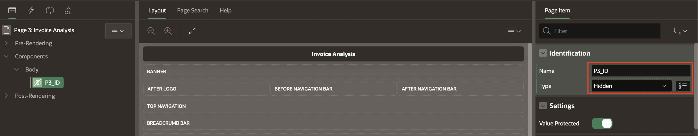
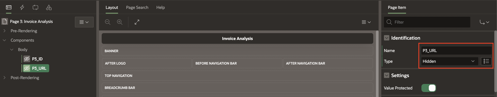
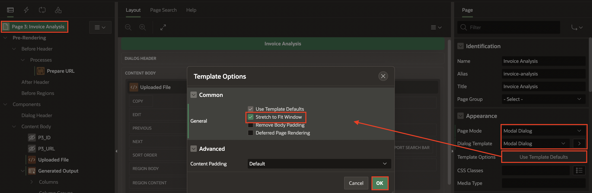
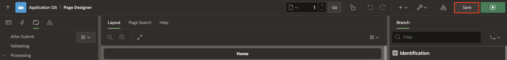

# Develop an Invoice Tracker and Invoice Analysis Page

## Introduction

This lab guides you through creating an application process to download a file from a URL stored in the database. Additionally, you'll develop two new pages for invoice tracking and invoice analysis.

Estimated Time: 15 Minutes

### Objectives
In this lab, you:

- Create an Application Process
- Develop an Invoice Tracking page using Cards
- Create an Invoice Analysis page

## Task 1: Create an Application Process

1. Navigate to **Shared Components**

   

2. Under Application Logic, select **Application Processes**

   

3. Click **Create**.

   

4. Under Identification:

    - Name: **DISPLAY_PDF**

    - On Point: **AJAX Callback: Run this application process when requested by page process**

   Click **Next**.

   

5. Source > Code: Copy and Paste below code into the code editor:

     ```
     <copy>
    declare
     l_blob blob;
     l_url varchar2(255);
     l_mime_type varchar2(50);
    begin

    select MIME_TYPE, object_storage_url into l_mime_type, l_url from INV_UPLOAD where ID = :P4_ID;
    l_blob := apex_web_service.make_rest_request_b
    (p_url                  => l_url,
    p_http_method          => 'GET',
    p_credential_static_id => 'APEX_OCI_AI_CRED');
    owa_util.mime_header(l_mime_type,false);
    htp.p('Content-Length: ' || dbms_lob.getlength(l_blob));
    owa_util.http_header_close;  
    wpg_docload.download_file(l_blob);

    END;
     <copy>
     ```
    Click **Next**.

    

6. Click **Create Process**.

    

## Task 2: Develop an Invoice Tracking page using Cards

1. Navigate to **Application ID**.

   

2. Click **Create Page**.

   

3. Under Component, select **Cards**.

   

4. Enter the following details:

    - Page Definition > Name: **Invoice Tracker**

    - Data Source > Source Type: **SQL Query**

    - Enter a SQL SELECT Statement: Copy and paste the below code:

    ```
    <copy>
    select a.ID,
       a.FILE_NAME,
       a.MIME_TYPE,
       a.OBJECT_STORAGE_URL,
       a.CREATED,
       a.CREATED_BY,
       a.UPDATED,
       a.UPDATED_BY,
       a.STATUS,
       case when a.STATUS = 'Pending Approval' then
        'u-color-24'
            when a.STATUS = 'Approved' then
        'u-color-20'
        end card_color,
       a.DOC_AI_JSON,
       b.FIELD_VALUE
      from INV_UPLOAD a, DOCAI_RESPONSE b where a.ID = b.DOCUMENT_ID and b.FIELD_LABEL = 'InvoiceTotal'
     <copy>
     ```

     Click **Next**.

    

5. Under Card Attributes:

    - Title Column: **FILE_NAME (Varchar2)**

    - Body Column: **CREATED_BY (Varchar2)**

   Click **Create Page**.

   

6. In the left pane, select **Invoice Tracker** region and Under **Attributes**, enter the following:

    - Under Card:

       - CSS Classes: **&CARD\_COLOR.!ATTR.**

       - Primary Key Column 1: **ID**

    - Subtitle > Column: **STATUS**

    - Under Secondary Body:

       - Advanced Formatting: **Toggle On**

       - HTML Expression: **Invoice Total Amount: &FIELD\_VALUE.**

    

7. In the property editor, Under Source, Select **Order By Item** and enter the following:

      | Clause | Key | Display |
      |-----------|--------------|--------------|
      | "CREATED" desc| CREATED | Created |

    Click **OK**.

    

8. Click **Save**.

## Task 3: Create an Invoice Analysis page

1. Navigate to Create(+) in Page Designer toolbar and select **Page**.

   

2. Select **Blank Page**.

   

3. On Create Page dialog, enter the following:

    - Page Definition > Name: **Invoice Analysis**

    - Navigation > Use Breadcrumb: **Toggle Off**

   Click **Create Page**.

   

4. In the left pane, Right-click Body, select **Create Page Item**.

    

5. Create the following two page items one after the other.

     |   | Name | Type |
     |---|-----------|--------------|
     | 1 | P3\_ID| Hidden |
     | 2 | P3\_URL| Hidden |

     

     

6. Under Pre-Rendering, Right-Click **Before Header** and select **Process**.

    

7. In the Property Editor, enter the following details:

    - Indentification > Name: **Prepare URL**

    - Source > PL/SQL Code: Copy and paste the below code into code editor:

    ```
    <copy>
     :P4_URL:= APEX_PAGE.GET_URL(P_Page => 4,
                               p_request => 'APPLICATION_PROCESS=DISPLAY_PDF',
                               P_PLAIN_URL => True
                            );
     <copy>
      ```

    

8. In the left pane, Right-click Body and Select **Create Region**.

    

9. In the Property Editor, enter the following details:

    - Indentification > Name: **Uploaded File**

    - Source > HTML Code: Copy and paste the below code into code editor:

    ```
   <copy>
   <p align="center">
   <iframe src="&P4_URL."  width="100%" height="500">
   </iframe>
   </p>
   <copy>
    ```

   

10. Right-Click Uploaded File region, Select **Create Region Below**.

    

11. In the Property Editor, enter the following details:

    - Under Identification:

       - Name: **Generated Output**

       - Type: **Interactive Report**

    - Under Source:

       - Type: **SQL Query**

       - SQL Query: Copay and Paste the below code into the code editor:

       ```
       <copy>
       select ID,
       DOCUMENT_ID,
       regexp_replace(FIELD_LABEL, '([A-Z])', ' \1' ) FIELD_LABEL,
       case when FIELD_LABEL like '%Date%' then TO_CHAR(to_timestamp(FIELD_VALUE, 'YYYY-MM-DD"T"HH24:MI:SS.FF3"Z"'), 'DD-MON-YYYY')
       else FIELD_VALUE
       end as
       FIELD_VALUE,
       LABEL_SCORE
       from DOCAI_RESPONSE where DOCUMENT_ID = :P4_ID and FIELD_VALUE <> '#';
       <copy>
        ```

      

12. In the left Pane, select **Page 3: Invoice Analysis** and update the following:

    - Under Appearance:

       - Page Mode: **Model Dialog**

       - Page Template: **Modal Dialog**

       - Template Options > Click **Use Template Defaults** : Check **Strech to Fit Window** and Click **OK**.

    

13. Click **Save**.

14. In Page Designer toolbar, select Page Selector and Navigate to **Page 2: Invoice Tracker**.

   

15. Under Invoice Tracker region, Right-click Action and select **Create Action**.

   

16. In the Property Editor, enter the following details:

    - Identification > Type: **Full Card**

    - Link > Target: **No Link Defined**

        - Target > Page: **3**

        - Set Items > Name: **P3\_ID** and Value: **&ID.**

          Click **OK**.

   

17. Click **Save**.

18. In Page Designer toolbar, select Page Selector and Navigate to **Page 1: Home**.

   

19. Under Processing, Right-click After Processing and select **Create Branch**.

   

20. In the Property Editor, enter the following details:

    - Identification > Type: **Redirect to Page 2**

    - Link > Target: **No Link Defined**

       - Target > Page: **2**

         Click **OK**.

    

21. Click **Save**.

    
