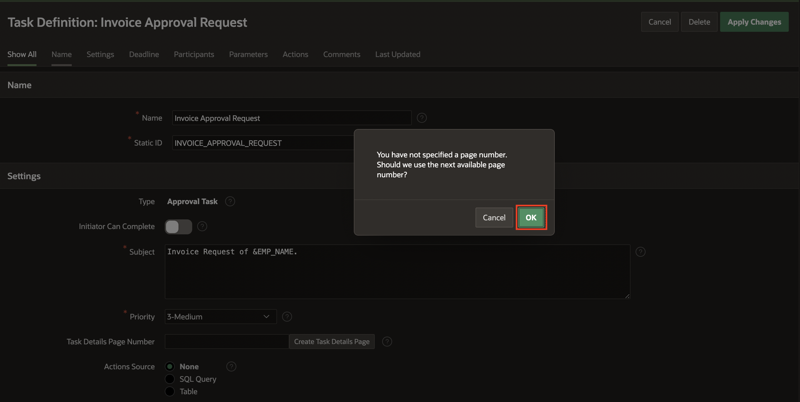
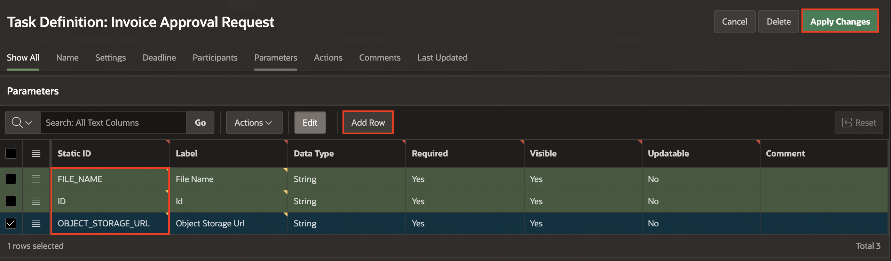
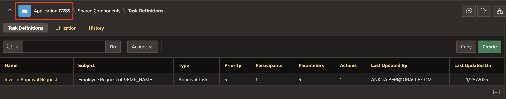
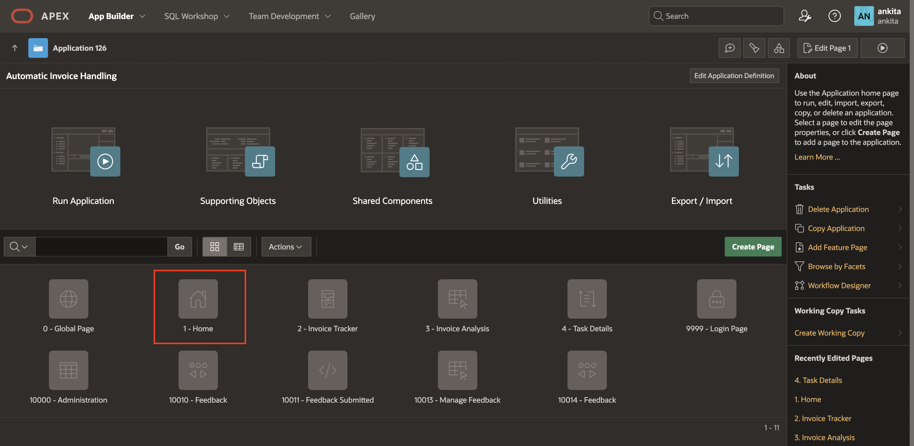
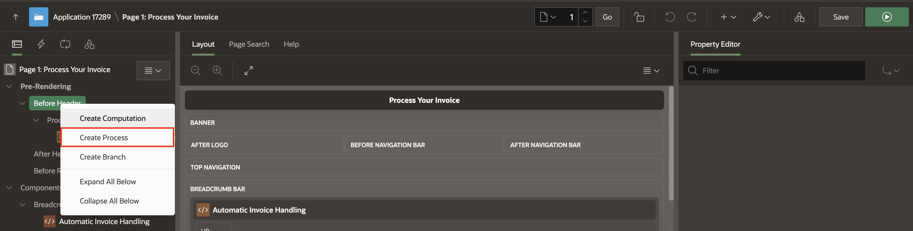
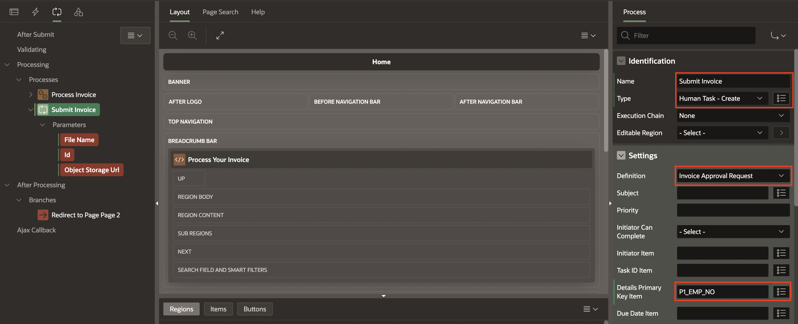
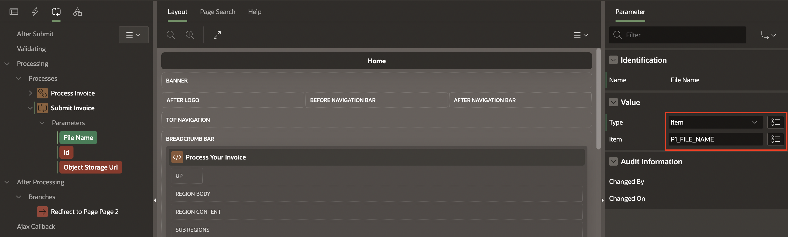
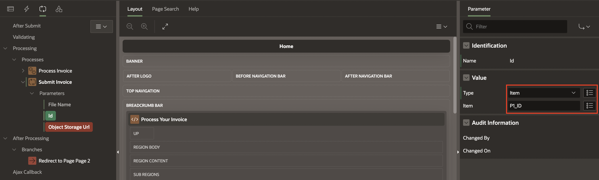
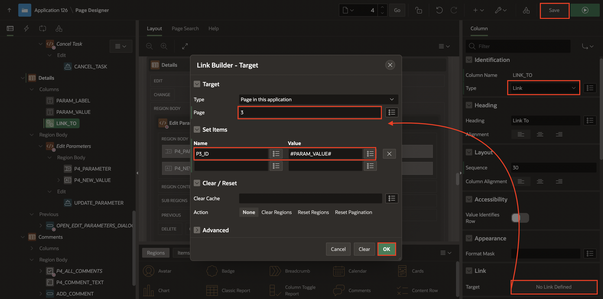

# Implement Invoice Approval Requests Using Approvals Component

## Introduction

In this lab, you will create a Task Definition to support the Invoice Approval Requests. You will also configure the processes required to retrieve employee information and execute human-task approvals. Additionally, you will create two unified task list pages—one to display tasks initiated by the user and another to show tasks assigned to them for action.

Estimated Time: 15 Minutes

### Objectives

In this lab, you:

- Create a Task Definition and its corresponding Task Details page.
- Develop a Process to Fetch Employee details and manage human-task approvals.
- Create Unified Task List pages.

## Task 1: Create a Task Definition

In this task, you'll create a Task Definition to support the invoice approval workflow. You will define the task structure, configure participants, set required parameters, and add actions that update invoice status upon approval.

1. In the Page Designer toolbar, navigate to **Shared Components** icon.

   

2. Under **Workflows and Automations**, select **Task Definitions**.

   

3. Click **Create**.

   

4. In **Create Task Definition** page, enter/select the following:

    - Name: **Invoice Approval Request**

    - Subject: **Employee Request of &EMP\_NAME.**

    Click **Create**.

    

5. Navigate to **Settings** and do the following:

    - Task details Page Number: Click **Create Task Details Page**

    Click **OK**

    

    

6. Click task definition - **Invoice Approval Request** to continue editing.

    

7. Navigate to **Settings** tab, enter/select the following:

    - Actions Source: **SQL Query**.

    - Actions SQL Query: Copy the code below and paste it into  the code editor:

        ```
        <copy>
        SELECT
        E.EMPNO,
        E.EMP_NAME,
        M.EMP_NAME AS MGR_NAME
        FROM
        EMPLOYEE_DETAILS E, EMPLOYEE_DETAILS M
        WHERE
            M.EMPNO (+) = E.MGR
            AND E.EMPNO = :APEX$TASK_PK
        </copy>
        ```

    

8. Under **Participants**, click **Add Row** and enter/select the following:

     - Participant Type: **Potential Owner**

     - Value Type: **SQL Query**

     - Value: Copy the code below and paste it into  the code editor

     ```
     <copy>
     SELECT
        UPPER(EMP_NAME)
     FROM
     EMPLOYEE_DETAILS
     WHERE
       EMPNO = (
       SELECT
            MGR
        FROM
            EMPLOYEE_DETAILS
        WHERE
            EMPNO = (
                SELECT
                    EMPNO
                FROM
                    EMPLOYEE_DETAILS
                WHERE
                    UPPER(EMP_NAME) = UPPER(:APP_USER)
                    )
                 )
      </copy>
      ```

    

9. Under **Parameters**, click **Add Row** and enter the three parameters one after the other:

      | Static ID |  Label  | Data Type
      | --- |  --- | --- |
      | FILE\_NAME | File Name | String |
      | ID | id | String |
      | OBJECT\_STORAGE\_URL | Object Storage URL | String |
      {: title="Task Definition Parameters"}

     - Click **Apply Changes**.

    

10. Click **Invoice Approval Request** to continue editing.

     

11. Under **Actions**, click **Add Action**.

    

12. Enter/select the following details:

     - Name: **On Approval**

     - On Event: **Complete**

     - Outcome: **Approved**

     - Success Message: **Approved!**

     - Code: Copy the code below and paste it into the code editor:

        ```
        <copy>
        DECLARE
        L_REQ_ID NUMBER;
        BEGIN
        --   if :APP_USER = :EMP_NAME then --this is the original initiator
        L_REQ_ID := :ID;
        UPDATE INV_UPLOAD
        SET
            STATUS = 'Approved'
        WHERE
            ID = L_REQ_ID;

        END;
        </copy>
        ```

    Click **Create**.

     

13. Click **Apply Changes**.

## Task 2: Create a Process to Fetch Employee details

In this task, you'll create processes to fetch employee details and submit an invoice for approval. You will retrieve the logged-in employee’s information using PL/SQL and configure a Human Task process that initiates the invoice approval workflow with the required parameters.

1. Navigate to **Application ID**.

    

2. Select **1 - Home** page.

   

3. In the **Rendering** tab, navigate to **Pre-Rendering** and right-click **Before Header**, select **Create Process**.

   

4. In the Property Editor, enter/select the following:

    - Identification > Name: **Fetch Employee Details**

    - Source > PL/SQL Code: Copy and paste the below code into the code editor:

        ```
        <copy>
        SELECT
        EMPNO
        INTO :P1_EMP_NO
        FROM
        EMPLOYEE_DETAILS
        WHERE
        UPPER(EMP_NAME) = UPPER(:APP_USER);
        </copy>
        ```

    - Execution > Sequence: **1**

    

5. Navigate to **Processing** tab, right-click **Processing** and select **Create Process**.

    

6. In the property editor, enter/select the following details:

    - Under Identification:

        - Name: **Submit Invoice**

        - Type: **Human Task - Create**

    - Under Settings:

        - Definition: **Invoice Approval Request**

        - Details Primary key item: **P1\_EMP\_NO**

    

7. Under the **Submit Invoice** process, update the following parameters:

    | Parameter |  Value > Item | Value > Item
    | --- |  --- | --- |
    | File Name| Item | P1\_FILE\_NAME |
    | id | Item | P1\_ID |
    | Object Storage URL | Item | P1\_OBJECT\_STORAGE\_URL |
    {: title="Human Task-Create Parameters"}

    

    

8. Click **Save**.

## Task 3: Create Unified Task Lists

In this task, you'll create unified task list pages to display tasks initiated by the user and tasks requiring their approval. You will also update the Task Details page to include navigation links that allow users to review related invoice information.

1. On Page Designer toolbar, navigate to **Create(+ v)** and select **Page**.

    

2. Under Components, select **Unified Task List**.

    

3. In **Create Unified Task List** page, enter/select the following:

    - Under Page Definition:

        - Page Number: **5**

        - Name: Enter **Initiated By Me**

        - Report Context: **Initiated By Me**

    - Navigation > Use Breadcrumb: **Toggle Off**

        Click **Create Page**.

    

4. In Page Designer toolbar, navigate to **Create(+)** and select **Page**.

    

5. Under Components, select **Unified Task List**.

    

6. In **Create Unified Task List** page, enter/select the following:

    - Under Page Definition:

        - Page Number: **6**

        - Name: **My Approvals**

        - Report Context: **My Tasks**

    - Navigation > Use Breadcrumb: **Toggle Off**

    Click **Create Page**.

    

7. On the Page Designer toolbar, navigate to **Page Finder** and select **4 - Task Details** page.

    

8. Under the **Rendering** tab, select **Details** region and update the following:

    - Source > SQL Query: Copy and replace the below code into the code editor:

        ```
        <copy>
        SELECT
        UPPER(PARAM_LABEL)      PARAM_LABEL,
        PARAM_VALUE,
        'Check the Comparision' LINK_TO
        FROM
        APEX_TASK_PARAMETERS
        WHERE
            TASK_ID = :P4_TASK_ID
            AND IS_VISIBLE = 'Y'
            AND UPPER(PARAM_LABEL) = 'ID';
        </copy>
        ```

    

9. Under **Details** region, select **LINK_TO** column and update the following:

    - Identification > Type: **LINK**

    - Link > Target: Click **No Defined Link**

        - Target > Page: **3**

        - Set Items > Name: **P3\_ID**, Value: **#PARAM\_VALUE#** and click **OK**.

    Click **Save**.

    

## Summary

You now know how to create a Task Definition for Invoice Approval Requests. Additionally, you learned how to set up processes to fetch employee details and manage human-task approval. Furthermore, you created two unified task list pages: one for initiated tasks and another for assigned tasks.

## Acknowledgements

- **Author(s)** - Roopesh Thokala, Senior Product Manager; Ankita Beri, Product Manager
- **Contributing Author** - Pankaj Goyal, Member Technical Staff
- **Last Updated By/Date** - Pankaj Goyal, Member Technical Staff, December 2025