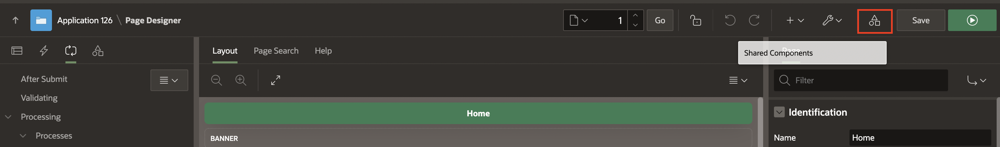
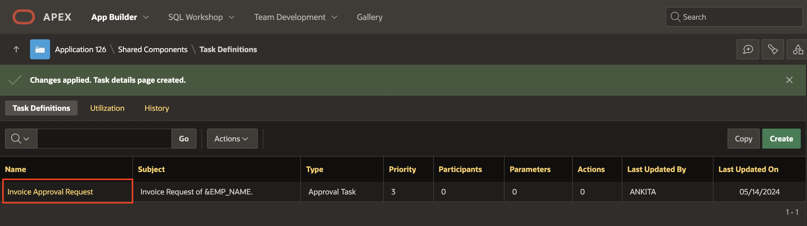
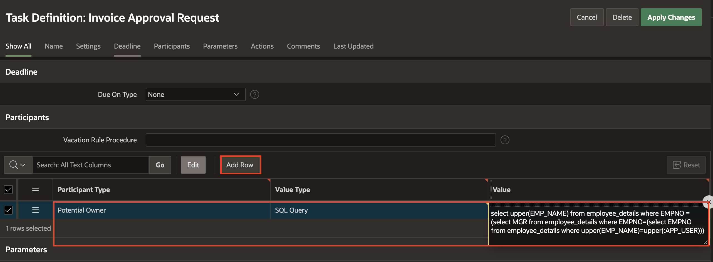
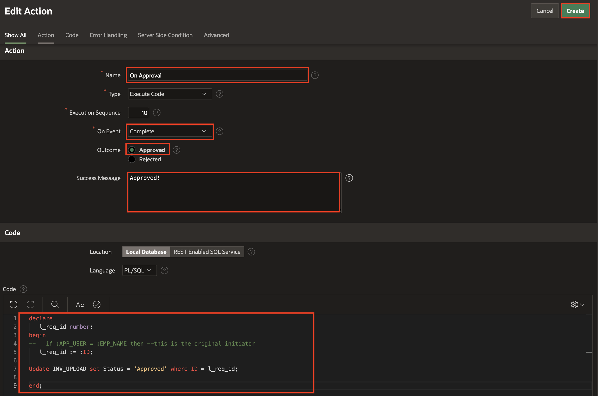
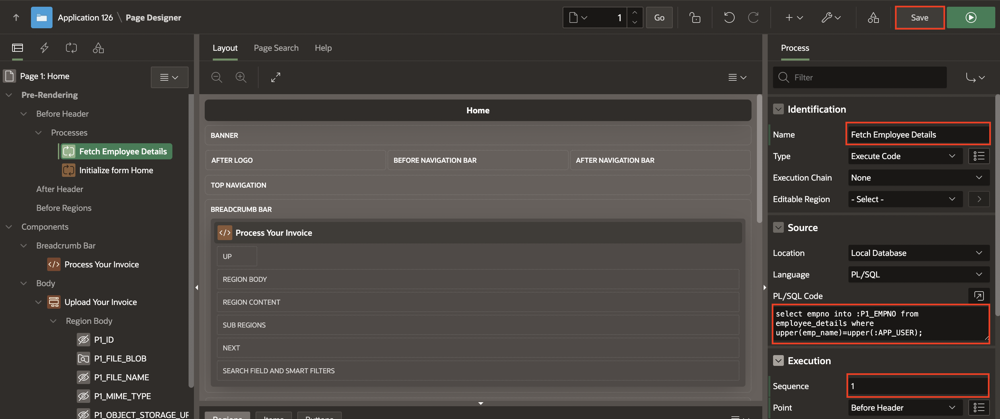
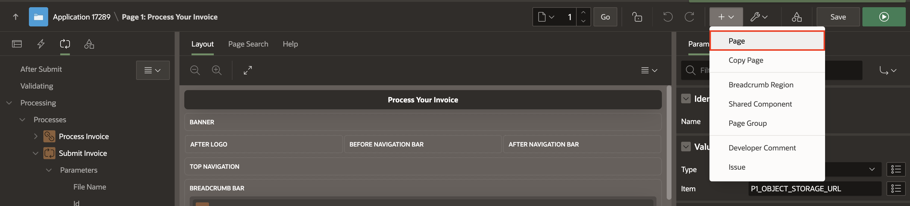
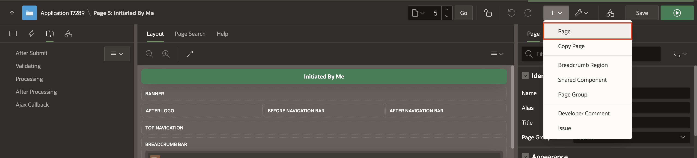
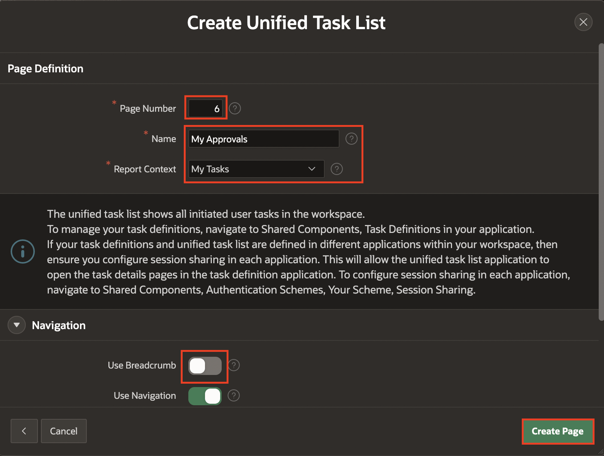
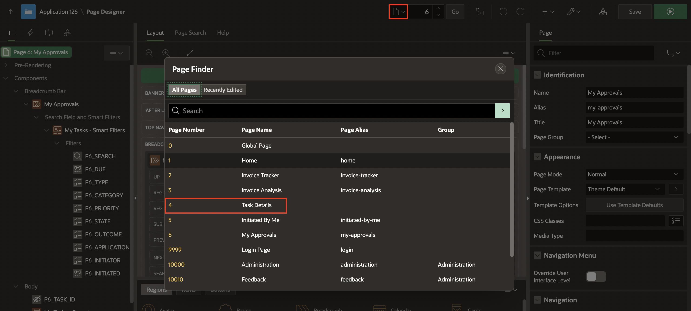
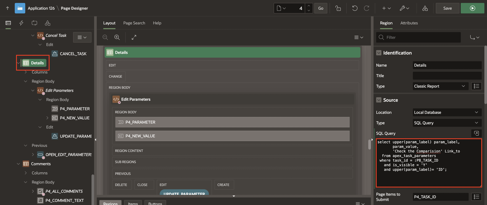

# Implement Invoice Approval Requests Using Approvals Component
## Introduction

This lab will walk you through creating a Task Definition for Invoice Approval Requests. Additionally, you'll set up two processes to fetch employee details and manage human-task approval. Furthermore, you'll create two unified task list pages—one for initiated tasks and another for tasks assigned to you.

Estimated Time: 15 Minutes

### Objectives
In this lab, you:

- Create a Task Definition
- Develop a Process to Fetch Employee details and and manage human-task approval
- Create Unified Task Lists

## Task 1: Create a Task Definition

1. Navigate to **Shared Components**.

   

2. Under Workflows and Automations, Select **Task Definitions**.

   

3. Click **Create**.

   

4. Specify the task definition attributes and Click **Create**.

    - For Name: Enter **Invoice Approval Request**

    - For Subject: Enter **Employee Request of &EMP\_NAME.**

    

5. Under **Settings**:

    - Task details Page Number - Click **Create Task Details Page** and Click **OK**

    

    

6. Click task definition - **Invoice Approval Request** to continue editing.

     

    Under Settings, Specify the following:

    - Actions Source: **SQL Query**.

    - Actions SQL query: Copy the code below and paste it into  the code editor:

    ```
    <copy>
    select e.empno, e.emp_name, m.emp_name as mgr_name from EMPLOYEE_DETAILS e, EMPLOYEE_DETAILS m
    where m.empno(+)=e.mgr and e.empno= :APEX$TASK_PK
    </copy>
    ```

    

7. Under Participants, Click **Add** and enter the following:

     - Participant Type: **Potential Owner**

     - Value Type: **SQL Query**

     - Value: Copy the code below and paste it into  the code editor

     ```
     <copy>
     select upper(EMP_NAME) from employee_details where EMPNO =(select MGR from employee_details where EMPNO=(select EMPNO from employee_details where upper(EMP_NAME)=upper(:APP_USER)))
     </copy>
     ```

     - Click **Apply Changes**.

    

8. Under Parameters, Click **Add Row** and enter the three parameters one after the other:

      | Static ID |  Label  | Data Type
      | --- |  --- | --- |
      | FILE\_NAME | File Name | String |
      | ID | id | String |
      | OBJECT\_STORAGE\_URL | Object Storage URL | String |
      {: title="Task Definition Parameters"}

     - Click **Apply Changes**.

     

10. Click **Invoice Approval Request** to continue editing.

     

14. Under **Actions**, Click **Add Action**.

    

15. Enter the following details:

     - Name: **On Approval**

     - On Event: **Create**

     - Outcome: **Approval**

     - Success Message: **Approved!**

     - Code: Copy the code below and paste it into the code editor:

    ```
    <copy>
    declare
       l_req_id number;
    begin
    --   if :APP_USER = :EMP_NAME then --this is the original initiator
   l_req_id := :ID;

    Update INV_UPLOAD set Status = 'Approved' where ID = l_req_id;
    end;
    </copy>
    ```

     

## Task 2: Create Process to Fetch Employee details

1. Navigate to **Application ID**.

    

2. Select **Home - 1** page.

   

3. In the left pane, under Pre-Rendering, Right-click Before Header and click **Create Process**.

   

4. In the Property Editor, enter the following details:

    - Indentification > Name: **Fetch Employee Details**

    - Source > PL/SQL Code: Copy and paste the below code into the code editor:

    ```
    <copy>
    select empno into :P1_EMP_NO from employee_details where upper(emp_name)=upper(:APP_USER);
    </copy>
    ```

    

5. Navigate to Processing tab, Right-click processing and select **Create Process**.

    

6. In the property editor, enter the following details:

    - Under Identification:

        - Name: **Submit Invoice**

        - Type: **Human Task - Create**

    - Under Settings:

        - Definition: **Invoice Approval Request**

        - Details Primary key item: **P1\_EMP\_NO**

      

7. Under **Submit Invoice** process, update the following parameters:

    | Parameter |  Value > Item | Value > Item
    | --- |  --- | --- |
    | File Name| Item | P1\_FILE\_NAME |
    | id | Item | P1\_ID |
    | Object Storage URL | Item | P1\_OBJECT\_STORAGE\_URL |
    {: title="Human Task-Create Parameters"}

    

    

8. In the rendering pane, Under Upload Your Invoice, Select P1_STATUS and update the following:

    - Source > Query Only: **Toggle On**

    

9. Click **Save**.


## Task 3: Create Unified Task Lists

1. On Page Designer toolbar, Navigate to **Create(+)** and select **Page**.

    

2. Under Components, Select **Unified Task List**.

    

3. Specify the following page attributes:

    - Under Page Definition:

        - Page Number: **5**

        - Name: Enter **Initiated By Me**

        - Report Context: **Initiated By Me**

    - Navigation > Use Breadcrumb: **Toggle Off**

         Click **Create Page**.

      

4. In Page Designer toolbar, Navigate to **Create(+)** and select **Page**.

    

5. Under Components, Select **Unified Task List**.

    

6. Specify the following page attributes:

    - Under Page Definition:

        - Page Number: **6**

        - Name: **My Approvals**

        - Report Context: **My Tasks**

    - Navigation > Use Breadcrumb: **Toggle Off**

    Click **Create Page**.

    

7. On the Page Designer toolbar, Select Page **4** from Page Selector.

    

8. Under Page Rendering tab, Select **Details** region and update the following:

    - Source > SQL Query: Copy and replace the below code into the code editor:

    ```
    <copy>
    select upper(param_label) param_label,
       param_value,
       'Check the Comparision' Link_to
    from apex_task_parameters
    where task_id = :P8_TASK_ID
    and is_visible = 'Y'
    and upper(param_label)= 'ID';
    </copy>
    ```

    

9. Under Details region, Select **LINK_TO** column and update the following:

    - Identification > Type: **LINK**

    - Link > Target: Click **No Defined Link**

        - Target > Page: **3**

        - Set Items > Name: **P3\_ID**, Value: **#PARAM\_VALUE#** and Click **OK**.

    Click **Save**.

    
