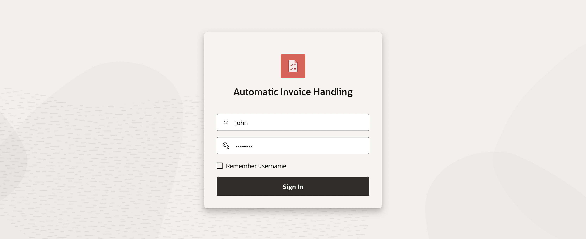
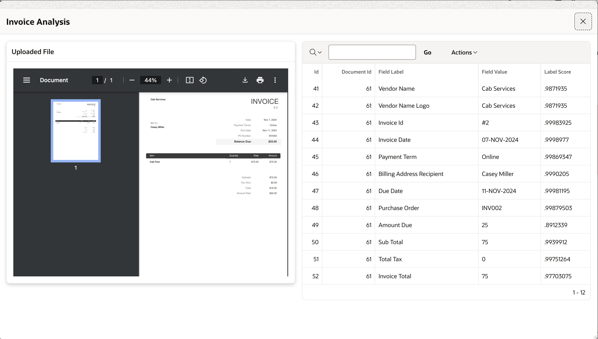
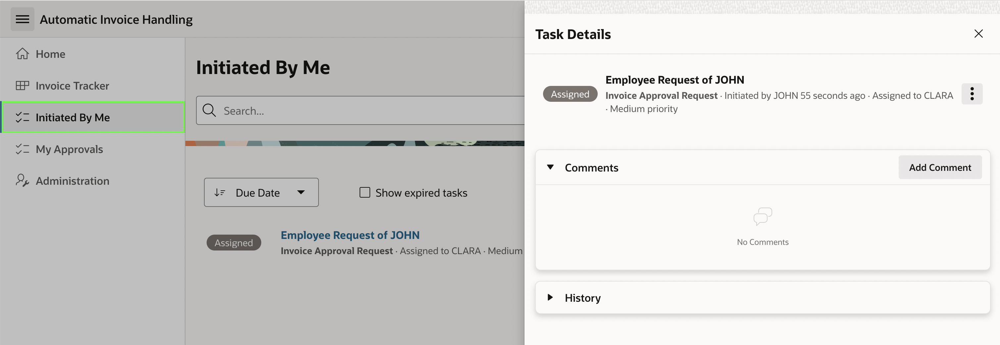

# Run the Application

## Introduction

In this lab, you will run the Automatic Invoice Handling application and use OCI Document Understanding to process uploaded invoices. You will walk through the end-to-end workflow, including uploading invoices, reviewing extracted data, tracking submissions, and approving pending requests.

Estimated Time: 2 Minutes

### Objectives

In this lab, you:

- Run the Application.
- Explore the various features of the app.

## Task 1: Run the Application

In this task, you will launch the application and test the complete invoice-processing workflow. You will log in as different users, upload sample invoices, review the extracted data, track submitted invoices, and approve pending requests through the unified task lists.

1. From your Application home page, click **Run Application**.

    

2. Log in as one of the users you created in lab 2: **Clara, John, Jane, or Matt**. For example, I have log in as JOHN.

    

3. Upload invoices by selecting **Select an Invoice or Receipt** and clicking **Process Document**. OCI Document Understanding will extract invoice fields from the uploaded image or PDF file.

    Download the following sample invoices to upload:

    - [Sample Invoice 1](https://c4u04.objectstorage.us-ashburn-1.oci.customer-oci.com/p/EcTjWk2IuZPZeNnD_fYMcgUhdNDIDA6rt9gaFj_WZMiL7VvxPBNMY60837hu5hga/n/c4u04/b/livelabsfiles/o/labfiles%2FInvoice%201.pdf)

    - [Sample Invoice 2](https://c4u04.objectstorage.us-ashburn-1.oci.customer-oci.com/p/EcTjWk2IuZPZeNnD_fYMcgUhdNDIDA6rt9gaFj_WZMiL7VvxPBNMY60837hu5hga/n/c4u04/b/livelabsfiles/o/labfiles%2FInvoice%202.pdf)

    

4. After uploading, you will be redirected to the **Invoice Tracker** page, where you can view all your invoices as well as those uploaded by others.

    

5. Click on an invoice card to open the **Invoice Analysis** dialog page, where you can compare your uploaded PDF with the output from OCI Document Understanding.

    

6. Navigate to **Initiated by Me** to view all invoices uploaded by JOHN.

    

7. Now, log in as CLARA to approve invoice requests by JOHN. Navigate to **My Approvals** page, where you can view all invoices that require your approval.

    

## Summary

You now know how to run the Automatic Invoice Handling application and obtain results using Oracle APEX and OCI Document Understanding for uploaded invoices.

## Acknowledgements

- **Author(s)** - Ankita Beri, Product Manager
- **Contributing Author** - Pankaj Goyal, Member Technical Staff
- **Last Updated By/Date** - Pankaj Goyal, Member Technical Staff, December 2025
