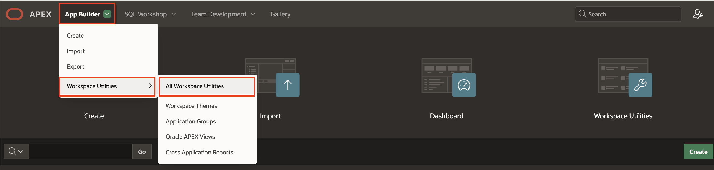
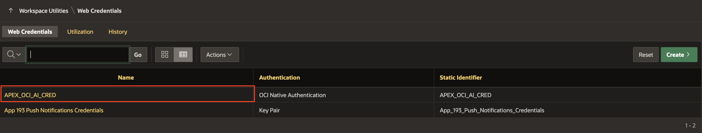
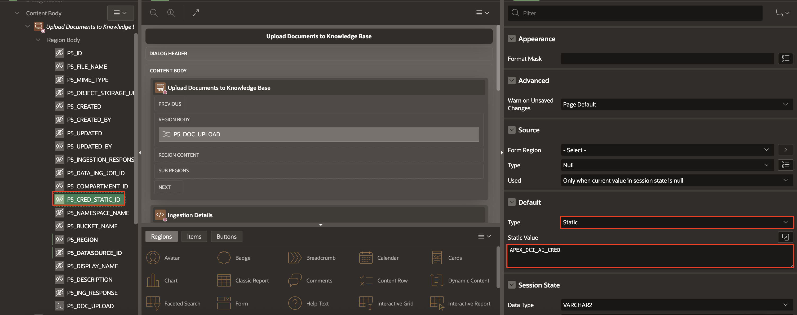

# Introduction

## About this Workshop

This workshop demonstrates how to integrate Oracle APEX with OCI **Generative AI Agents**, showcasing how enterprises can enhance their applications with intelligent, context-aware capabilities. You will explore the power of **Large Language Models (LLMs)** combined with **Retrieval-Augmented Generation (RAG)** to transform raw enterprise documents into actionable insights.

As part of this workshop, you will upload Oracle App Builder documentation to OCI Object Storage. The documents will be ingested and indexed using an ingestion job, making them searchable by the OCI Generative AI service. Once processed, users can interact with Generative AI agents by asking questions. The agents will retrieve relevant information directly from the uploaded documents and provide accurate, context-aware responses which enables a powerful, document based Q&A experience.

Here is a demo of what to expect from this application:

Estimated Time: 1 hour 30 mins

### Objectives

In this workshop, you will:

- Creating an Agent in OCI Generative AI Agents.

- Add API Keys in the OCI Console.

- Create Web Credentials in Oracle APEX.

- Create Session and Ingestion Job using OCI Ingestion Job REST APIs.

- Set up an automation to monitor the status of incomplete Ingestion Jobs.

- Create and invoke a REST Data Source in your APEX app using the OCI Generative AI Agents' Create Sessions REST API.

- Design and customize a Classic Report for the chat widget.

- Interact with OCI Generative AI Agents through the Chat REST API.

>Note: This workshop assumes you are using Oracle APEX 24.2. Some of the features might not be available in prior releases and the instructions, flow, and screenshots might differ if you use an older version of Oracle APEX.

## Prerequisites

- A paid Oracle Cloud Infrastructure (OCI) account.

- An OCI compartment. An Oracle Cloud account comes with two pre-configured compartments - The tenancy (root compartment) and ManagedCompartmentForPaaS (created by Oracle for Oracle Platform services).

- The logged-in user should have the necessary privileges to create and manage Autonomous Database instances in this compartment. You can configure these privileges via an OCI IAM Policy. If you are using a Free Tier account, it is likely that you already have all the necessary privileges.

### **Let's Get Started!**

If the menu is not displayed, you can open by clicking the menu button () at the upper-left corner of the page.

## Downloads: Download and Install the Complete Application

If you are stuck or the app is not working as expected, you can download and install the completed App as follows:

1. Setup OCI:

    - Follow Lab 1 > Task 1 to generate API keys using the OCI Console, and update the existing web credentials with your credentials.

    - Follow Lab 1 > Task 2 to create a bucket in OCI Object Storage.

    - Follow Lab 2 > Task 1 and Task 2 to create a Knowledge Base and Generative AI Agents in OCI.

2. [Click here](https://c4u04.objectstorage.us-ashburn-1.oci.customer-oci.com/p/EcTjWk2IuZPZeNnD_fYMcgUhdNDIDA6rt9gaFj_WZMiL7VvxPBNMY60837hu5hga/n/c4u04/b/livelabsfiles/o/genai_agents_export.sql) to download the completed application.

3. Import the **genai\_agents\_export.sql** file into your workspace. Follow the steps in the Install Application wizard to install the app along with the Supporting Objects.

4. Update **Web Credentials**

    - Expand **App Builder**, then select **All Workspace Utilities** and click **Workspace Utilities**.

    

    - Click **Web Credentials**.

    

    - Click  **APEX\_OCI\_AI\_CRED**.

    

    - Enter the following details using the configuration file you copied and click **Apply Changes**.

        - **OCI User ID**: Enter the OCID of the Oracle Cloud user Account. You can find the OCID in the Configuration File Preview generated during the API Key creation.
        Your OCI User ID looks similar to **ocid1.user.oc1..aaaaaaaa\*\*\*\*\*\*wj3v23yla**

        - **OCI Private Key**: Open the private key (.pem file) downloaded in the previous task. Copy and paste the API Key.

        - **OCI Tenancy ID**: Enter the OCID for Tenancy. Your Tenancy ID looks similar to **ocid1.tenancy.oc1..aaaaaaaaf7ush\*\*\*\*cxx3qka**

        - **OCI Public Key Fingerprint**: Enter the Fingerprint ID. Your Fingerprint ID looks similar to **a8:8e:c2:8b:fe:\*\*\*\*:ff:4d:40**

    

5. Navigate to Shared Components > Data Sources > Rest Data Sources > Click **Create Sessions API**.

6. Under Parameters, click **Add Parameter**.

   

7. Enter/select the following:

    - Type: **URL Pattern**

    - Name: **agentEndpointId**

    - Default Value: Enter your agent endpoint OCID, Refer - [Lab 2, Task3, Step 6](?lab=2-configure-kb-genai#Task3:FetchOCIDofGenerativeAIAgentandDataSource)

   

8. Navigate to Page 1 of application, map the following page item:

    - Under Body, select **P1\_AGENT\_ENDPOINT\_ID**.

    - In the property editor, Default > Type : **Static**.

    - Under Static Value:  Enter your agent endpoint OCID, Refer - [Lab 2, Task3, Step 6](?lab=2-configure-kb-genai#Task3:FetchOCIDofGenerativeAIAgentandDataSource)

   

9. Navigate to Page 5 of application, map the following page item:

   |   | Page Item |Default > Type | Default > Static Value |
   |---|-----------------|------|----------|
   | 1 | P5\_COMPARTMENT\_ID| Static |Enter your OCI account Compartment OCID|
   | 2 | P5\_CRED\_STATIC\_ID|  Static | APEX\_OCI\_AI\_CRED |
   | 3 | P5\_NAMESPACE\_NAME| Static | Enter Namespace which you copied while creating a Bucket|
   | 4 | P5\_BUCKET\_NAME| Static | Enter the Bucket Name which you copied while creating a Bucket (For this Lab we have **GenAIRAGBucket**) |
   | 5 | P5\_REGION| Static | Enter your Region. e.g. us-chicago-1 |
   | 6 | P5\_DATASOURCE\_ID| Static | Enter your data source OCID.|
   {: title="Map Page Items"}

   

   

   

   

   

   

10. All set. Now, run the application with the users you created and see it in action!

## Learn More - *Useful Links*

- [OCI Generative AI](https://www.oracle.com/artificial-intelligence/generative-ai/large-language-models/)
- [APEX on Autonomous](https://apex.oracle.com/autonomous)
- [APEX Collateral](https://www.oracle.com/database/technologies/appdev/apex/collateral.html)
- [Tutorials](https://apex.oracle.com/en/learn/tutorials)
- [Community](https://apex.oracle.com/community)
- [External Site + Slack](http://apex.world)

## Acknowledgements

- **Author(s)**: Roopesh Thokala, Senior Product Manager; Shailu Srivastava, Product Manager
- **Last Updated By/Date**: Shailu Srivastava, Product Manager, June 2025
