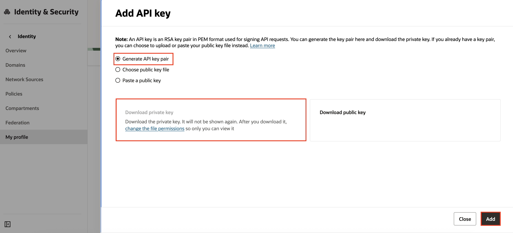
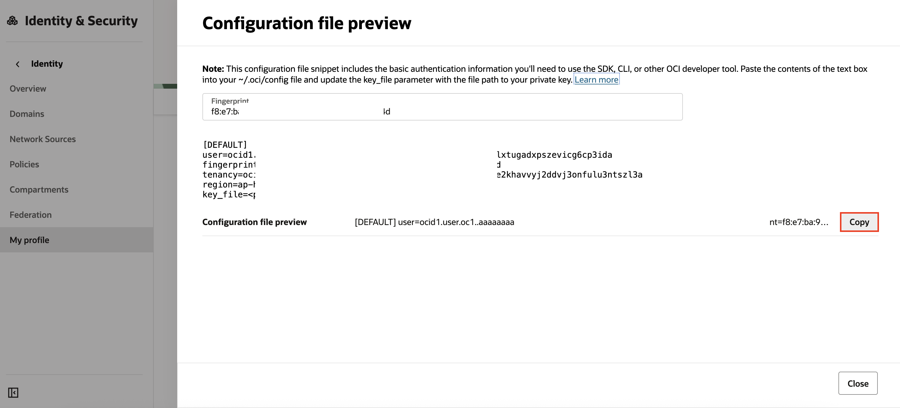
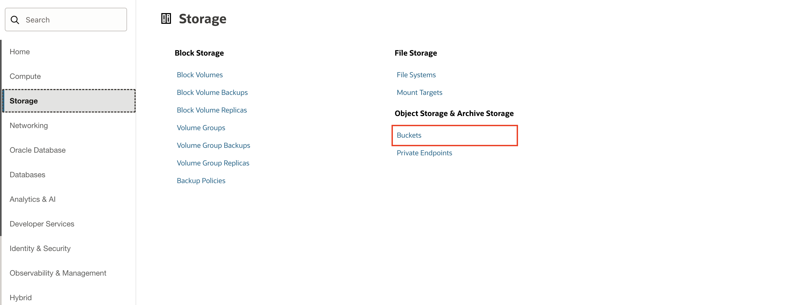
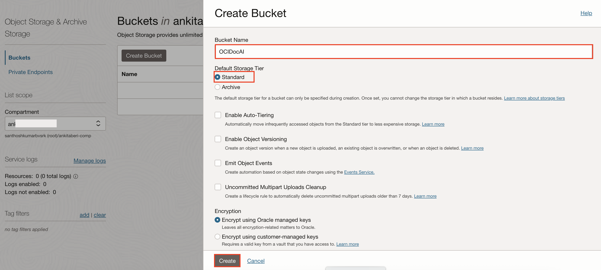
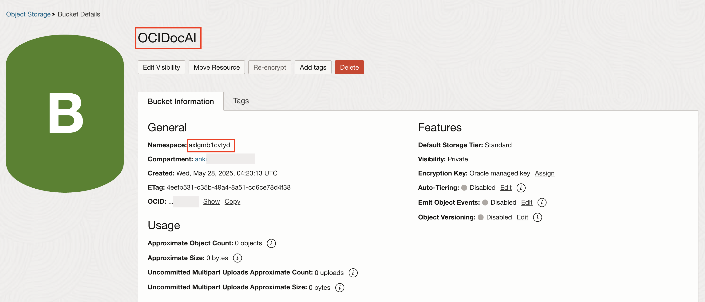

# Configure OCI API Keys and Bucket

## Introduction

In this lab, you learn how to configure the OCI API keys and create buckets in OCI Object Storage. In Oracle Cloud Infrastructure (OCI), API keys are used for secure authentication when accessing OCI resources through REST APIs, and a bucket refers to a logical container used to store and manage data objects within an Object Storage service.

Setting up API keys is a one time step that allows your applications or tools to connect safely with your OCI account, giving trusted access to your environment in a secure way. OCI  buckets allows you to store files like documents, PDFs, or any data you want to process or retrieve later.

Estimated Time: 10 Minutes

Watch the video below for a quick walk-through of the lab.
[Configure OCI API Keys and Bucket](videohub:1_26r632er)

### Objectives

In this lab, you:

- Generate API Keys using OCI Console.

- Create a Bucket in OCI Object Storage.

## Prerequisite

- In the navigation bar of the Console, select a region with Generative AI Agents, for example, **US Midwest (Chicago) or UK South (London)**. See [Regions with Generative AI Agents](https://docs.oracle.com/en-us/iaas/Content/generative-ai-agents/overview.htm#regions) for the regions in which Generative AI Agents is hosted.

## Task 1: Generate API Keys using OCI Console

To Generate the API Keys using OCI Console:

1. Login into your OCI Account.

   

2. Click **My Profile** at the top-right corner and select **User settings**.

    

3. Under **Tokens and keys** tab and click **Add API key**.

    

4. The Add API key dialog is displayed. Select **Generate API key pair** to create a new key pair.

5. Click **Download private key**. A **.pem** file will be saved to your local device. You do not need to download the public key.

   >*Note: You will use this private key while configuring the web credentials in Oracle APEX in the upcoming lab.*

6. Click **Add**.

    

7. The key is added, and the Configuration file preview is displayed. Copy and save the configuration file snippet from the text box into a notepad. You will use this information to create Oracle APEX Web Credentials.

    

## Task 2: Create a Bucket in OCI Object Storage

To create a Bucket using OCI Console, login to your OCI Account.

1. To access the Object Storage service, click on the menu icon **(☰)** at the top-left corner.

   

2. Under Storage > Object Storage & Archive Storage > select **Buckets**.

   

3. Select the compartment where you want to create the Bucket. You can choose an existing compartment or create a new one if needed. Now, select **Create Bucket**.

   

4. Enter/select the following:

    - Bucket Name: **OCIDocAI**

    - Default Storage Tier: **Standard**

    Click **Create**.

    

5. Navigate to **OCIDocAI** Bucket.

    

6. Copy and save **Bucket Name** and **Namespace** from the bucket details into a notepad. You will use this information to upload an invoice to OCI Object Storage using Invoke API.

    

## Summary

In this lab, you have learned how to configure OCI API keys and create buckets in OCI Object Storage. You set up secure authentication to allow safe access to OCI resources and created storage buckets to organize and manage files PDFs and text files. This setup forms the foundation for securely storing and accessing data.

You may now proceed to the next lab.

## Acknowledgements

- **Author(s)** - Roopesh Thokala, Senior Product Manager; Shailu Srivastava, Product Manager
- **Last Updated By/Date** - Shailu Srivastava, Product Manager, June 2025
