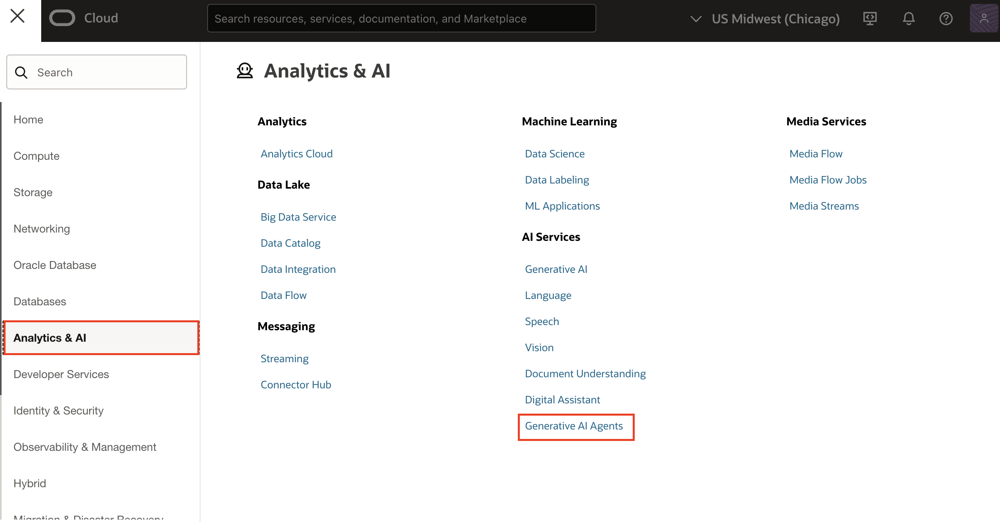
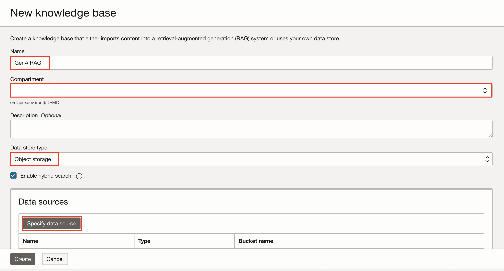
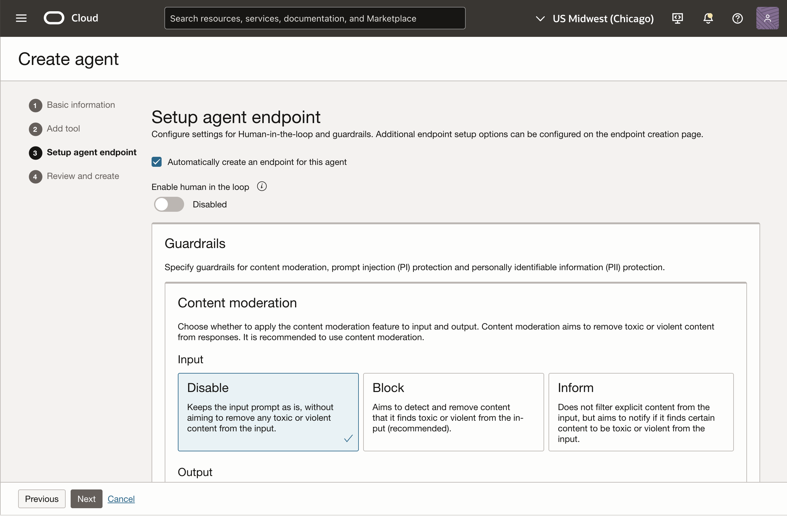
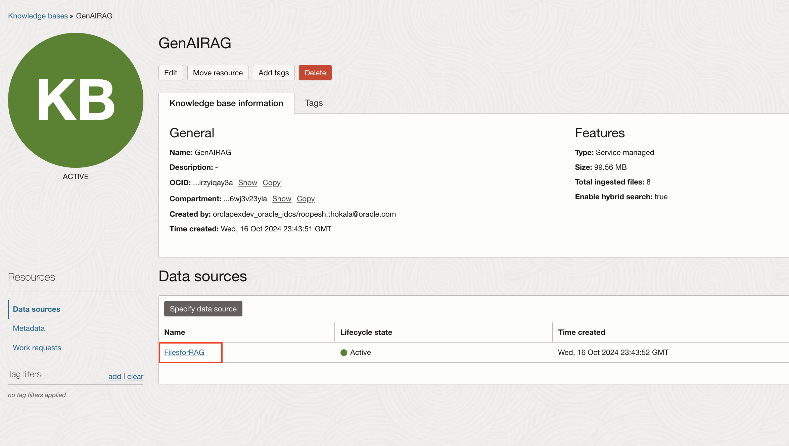

# Create Knowledge Base and Generative AI Agents in OCI

## Introduction

In this lab, you will learn how to create a **Knowledge Base** and **Generative AI Agents** using Oracle’s Generative AI services.

- A **Knowledge Base** serves as the foundation for all the data sources that an AI agent can access to retrieve relevant information and provide more accurate, context-aware responses during a conversation.

- Oracle Cloud Infrastructure (OCI)  **Generative AI Agents** combines the power of large language models (LLMs) and retrieval-augmented generation (RAG) with your enterprise data, letting users query diverse enterprise knowledge bases. The service provides up-to-date information through a natural language interface and the ability to act directly on it.

Estimated Time: 10 Minutes

### Objectives

In this lab, you will:

- Create a Knowledge Base in OCI.

- Create Generative AI Agents in OCI.

## Prerequisite

- In the navigation bar of the Console, select a region with Generative AI Agents, for example, **US Midwest (Chicago) or UK South (London)**. See [Regions with Generative AI Agents](https://docs.oracle.com/en-us/iaas/Content/generative-ai-agents/overview.htm#regions) for the regions in which Generative AI Agents is hosted.

## Task 1: Create a Knowledge Base in OCI

To create Knowledge Base in OCI console:

1. Click the menu icon **(☰)** at the top-left corner.

2. Navigate to **Analytics & AI** > **AI Services** and select **Generative AI Agents**.

   

3. Under **Generative AI Agents**, select **Knowledge Bases**.

    

4. Select your **Compartment**.

5. Click **Create Knowledge Base**.

    

6. Under **New knowledge base**, enter/select the following:

    - Name : **GenAIRAG**

    - Compartment: Choose your compartment

    - Data store type: **Object storage**

    

7. Under **Data sources**, click **Specify data source**.

8. Under **Specify data source**, enter/select the following and click **Create**.

    - Name : **FilesforRAG**

    - Under Data bucket:

        - Select your bucket created in [Lab1 > Task2](?lab=1-configure-oci-keys#Task2:CreateaBucketinOCIObjectStorage)

        - Select all in bucket: **Enable**

    

9. Click **Create**.

    

## Task 2: Create Generative AI Agents in OCI

Follow the below steps to create Generate AI Agents in OCI Console:

1. In the Console's navigation bar, choose a region that supports Generative AI Agents, such as US Midwest (Chicago) or UK South (London). For a full list of supported regions, refer to [Regions with Generative AI Agents](https://docs.oracle.com/en-us/iaas/Content/generative-ai-agents/overview.htm#regions).

2. Navigate to menu icon **(☰)** at the top-left corner.

3. Navigate to **Analytics & AI > AI Services** and select **Generative AI Agents**.

   

4. Under **Generative AI Agents** and select **Agents**.

    

5. Under **Create agent**, enter/select the following and click **Next**:

    - Name: **OCIGenAlAgents_APEX**

    - Compartment: Choose your compartment

    

6. Click **Add tool**.

    

7. Under **Add tool**, enter/Select the following:

    - Select **RAG**

    - Name: **AIAgentsRAG_APEX**

    - Description: **RAG tool to chat with documents from OCl Object Storage**

    

8. Scroll down and choose your **Knowledge base**, which you created in [Lab2 > Task1](?lab=2-configure-kb-genai#Task1:CreateaKnowledgeBaseinOCI).

    >*Note: If you have not created Knowledge Base in previous task, you can create it here by clicking **Create knowledge base***

9. Click **Add tool**.

    

10. Once tool is created, click **Next**.

11. Under **Setup agent endpoint**, leave everything as default and click **Next**.

    

    

12. Now, click **Create agent**.

    

13. For **Llama 3 License Agreement and Acceptable Use Policy**, accept the agreement and click **Submit**.

    

## Task 3: Fetch OCID of  Generative AI Agent and  Data Source

To Fetch the OCID of the Generative AI Agent and Data Source in OCI console:

1. Navigate to the menu icon **(☰)** at the top-left corner.

2. Navigate to **Analytics & AI > AI Services** and select **Generative AI Agents**.

   

3. Under **Generative AI Agents**, select **Agents**.

    

4. Select your agent.

5. Under **Endpoint**, select your endpoint.

    

6. Copy the agent endpoint **OCID**. (*Will use it in Lab 4 & 5*)

    

7. Navigate back to your agent. Under **Resources**, click **Knowledge Bases**.

    

8. Under **Knowledge Bases**, select your knowledge base:  **GenAIRAG**.

    

9. Under **Data sources** , click **FilesforRAG**.

    

10. Copy the **OCID**. (*will use it in LAB 5*)

    

## Summary

In this lab, you have learned how to configure a Knowledge Base for OCI Generative AI Agents. You explored how these agents utilize large language models (LLMs) and retrieval-augmented generation (RAG) to access and retrieve relevant information from enterprise data sources, enabling the delivery of accurate, context-aware responses through a natural language interface.

You may now proceed to the next lab.

## Acknowledgements

- **Author(s)** - Roopesh Thokala, Senior Product Manager; Shailu Srivastava, Product Manager
- **Last Updated By/Date** - Shailu Srivastava, Product Manager, June 2025
