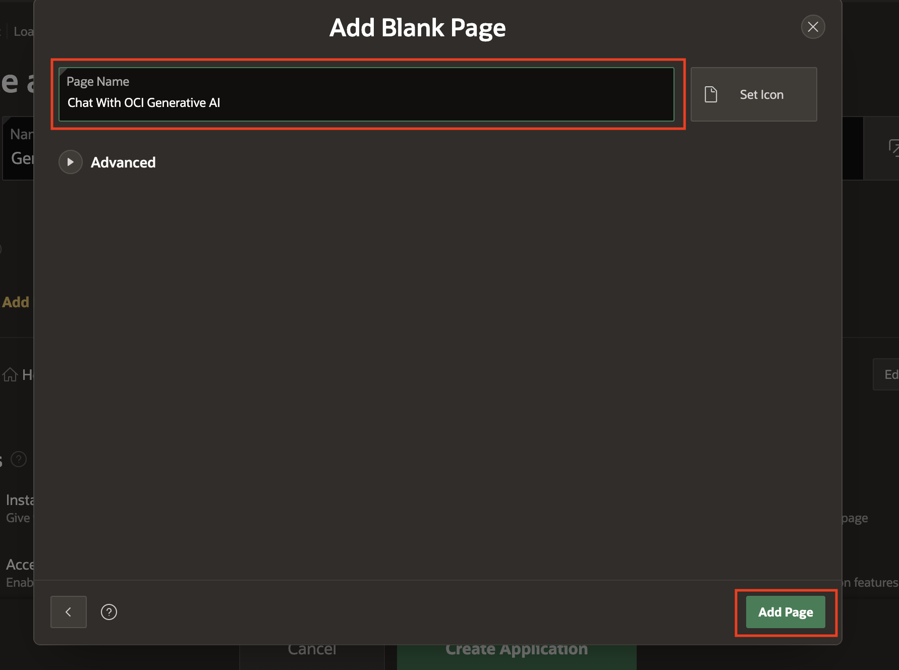
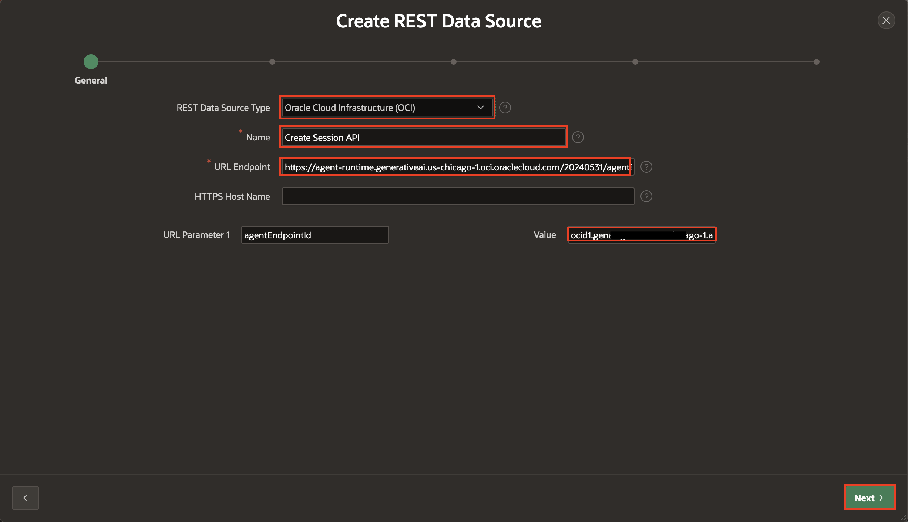

# Create APEX App and Configure REST Data Source

## Introduction

In this lab, you create an APEX application named **GenAI Agents for APEX** using the Create App Wizard. Later, you will set up a REST Data Source to **Create Sessions** and invoke **Ingestion Job**.

**Session Creation REST Data Source**: This REST data source is used to create a secure session with the Oracle Generative AI service. It establishes the authentication context required to interact with other AI APIs.

**Ingestion Job REST Data Source**:This REST data source triggers an ingestion job to process and embed documents into the knowledge base. It enables the AI agent to access and retrieve relevant information for RAG-based responses.

Estimated Time: 15 Minutes

Watch the video below for a quick walk-through of the lab.
[Create APEX App and Configure REST Data Source](videohub:1_anvfb960)

### Objectives

In this lab, you will:

- Create an APEX Application.

- Create REST Data Sources for creating session

- Create REST Data Source for Creating Ingestion Job

## Task 1: Create an Application

In this task, you will create an application that allow you to build pages, add components, and define business logic for your project.

1. On the workspace home page, click down arrow **'⌄'** next to **App Builder** and click **Create**.

   

2. Select **Use Create App Wizard**.

   

3. In Create an Application Wizard, enter/select the following:

    - Name : **GenAI Agents for APEX**

   

4. Click **Add Page**.

   

5. Select **Blank**.

    

6. Under **Add Blank Page**, enter/select the following:

    - Name : **Chat With OCI Generative AI**

7. Click **Add Page**.

    

8. Under **Pages**, click **Edit** beside **Home**.

    

9. Click **Delete**.

    

10. Click **Create Application**.

    

## Task 2: Invoke Create Session using REST Data Source

1. Navigate to App Builder > Select your application > **Shared Components**.

     

     

2. Under **Data Sources**, select **REST Data Sources**.

   

3. Click **Create**.

   

4. Select **From scratch** and click **Next**.

   

5. Under Create REST Data Source, enter/select the following:

    - REST Data Source Type: **Oracle Cloud Infrastructure (OCI)**

    - Name: **Create Session API**

    - URL Endpoint: <https://agent-runtime.generativeai.us-chicago-1.oci.oraclecloud.com/20240531/agentEndpoints/:agentEndpointId/sessions>

    - Value: your OCID from previos lab (lab 2 Task 3)

    Click **Next**.

    >**Note**:
    - URL Endpoint may differ based on Region. Refer to the following link for more details- <https://docs.oracle.com/en-us/iaas/api/#/en/generative-ai-agents-client/20240531/>
    - POST endpoint for Create Session: Refer to the following link for more details- <https://docs.oracle.com/en-us/iaas/api/#/en/generative-ai-agents-client/20240531/Session/CreateSession>

   

6. Under Create REST Data Source - Remote Server, click **Next**.

   

7. Under Authentication, enter/select the following:

    - Authentication Required: Toggle **ON**

    - Credentials: **APEX\_OCI\_AI\_CRED**

8. Click **Create REST Source Manually**.
   The REST data source is created successfully. The next step is to configure the POST operation parameters for this REST Data Source.

   

9. On the REST Data Sources page, click **Create Session API**.

   

10. Navigate to **Operations** tab , select **Edit icon** for the **POST** operation

    

11. For **Request Body Template**: Copy and paste the JSON given below.

    ```
    <copy>
    {
      "displayName": "#AGENT_NAME#",
      "description": "#DESCRIPTION#"
    }
    </copy>
    ```

12. Click **Synchronize with Body** and click **OK**.

    

    

13. Under **Operation Parameters**, select **Add Parameter**.

    

14. In the **Edit REST Data Source Parameter** dialog, add the following  parameters:

    |   | Type | Name | Direction | Default Value | Static |
    |---|-------|------|----------| --------------| ------ |
    | 1. | HTTP Header| Content-Type | In | application/json | ON |
    | 2. | Request or Response Body| RESPONSE | Out |  |  |
    {: title="POST Operation Parameters"}

    

15. Click **Add Parameter**.

   

## Task 3: Invoke Ingestion Job using REST Data Source

1. Navigate to **Shared Components**.

     

2. Under **Data Sources**, select **REST Data Sources**.

   

3. Click **Create**.

   

4. Select **From scratch** and click **Next**.

   

5. Under **Create REST Data Source**, enter/select the following:

    - REST Data Source Type: **Oracle Cloud Infrastructure (OCI)**

    - Name: **Create Ingestion Job API**

    - URL Endpoint: <https://agent.generativeai.us-chicago-1.oci.oraclecloud.com/20240531/dataIngestionJobs>

    Click **Next**.

    >**Note**:
    - URL Endpoint differs based on region not based on OCI Tenancy. Refer to the following link for more details- <https://docs.oracle.com/en-us/iaas/api/#/en/generative-ai-agents/20240531>
    - POST endpoint for Ingestion job Refer to the following link for more details <https://docs.oracle.com/en-us/iaas/api/#/en/generative-ai-agents/20240531/DataIngestionJob/CreateDataIngestionJob>

   

6. Under Create REST Data Source - Remote Server, click **Next**.

   

7. Under Authentication, enter/select the following:

    - Authentication Required: Toggle **ON**

    - Credentials: **APEX\_OCI\_AI\_CRED**

8. Click **Create REST Source Manually**.
   The REST data source is created successfully. The next step is to configure the POST operation parameters for this REST Data Source.

   

9. On the REST Data Sources page, click **Create Ingestion Job API**.

   

10. Navigate to **Operations** tab , select **Edit icon** for the **POST** operation.

    

11. For **Request Body Template**: Copy and paste the JSON given below.

      ```
       <copy>
       {
         "dataSourceId": "#DATASOURCEID#",
         "compartmentId": "#COMPARTMENTID#",
         "displayName": "#DISPLAYNAME#",
         "description": "#DESCRIPTION#"
       }
       </copy>

        ```

12. Click **Synchronize with Body** and click **OK**.

    

    

13. Under **Operation Parameters**, select **Add Parameter**.

    

14. In the **Edit REST Data Source Parameter** dialog, add the following two parameters one after the other:

    |   | Type | Name | Direction | Default Value | Static |
    |---|-------|------|----------| --------------| ------ |
    | 1. | HTTP Header| Content-Type | In | application/json | ON |
    | 2. | Request or Response Body| RESPONSE | Out |||
    {: title="POST Operation Parameters"}

    

    

15. Click **Add Parameter**.

    

## Summary

In this lab, you have learned how to set up REST Data Sources for secure session creation and triggering ingestion jobs.

You may now proceed to the next lab.

## Acknowledgements

- **Author(s)** - Roopesh Thokala, Senior Product Manager; Shailu Srivastava, Product Manager
- **Last Updated By/Date** - Shailu Srivastava, Product Manager, June 2025
