# Add Page Items and Page Processes

## Introduction

Now that you have created the application, in this lab you will extend its functionality by creating the necessary processes and page items to support user interaction. Then, you will create interactive pages and invoke AI services using REST Data Sources. You'll also display AI-generated results and citations, add navigation buttons, and implement automation to fetch ingestion job details.

Estimated Time: 45 Minutes

### Objectives

In this lab, you will:

- Create Page Items and a Region for user input.

- Create a Sub Region to add functional buttons.

- Create Page Processes and Computations.

- Create Pages for Document Processing and Viewing Citation.

- Create Automation Process to fetch Ingestion Job details.

## Task 1: Create Page Items and Region

In this task, you will create Page Items, Static Content region and a subregion, and configure dynamic actions to control their behavior based on user interactions.

1. Under **Rendering** tab, right-click **Body** and select **Create Page Item**.

   

2. Create the following Page Items, one after another:

    |   | Name | Type | Value Protected | Default > Static Value |
    |---|-------|------|----------|---- |
    | 1 | P1\_RESPONSE\_SESSION| Hidden | Toggle On ||
    | 2 | P1\_SESSION\_ID| Hidden | Toggle On ||
    | 3 | P1\_CONV\_ID| Hidden | Toggle On ||
    | 4 | P1\_APEX\_AI\_CRED| Hidden | Toggle Off ||
    | 5 | P1\_AGENT\_ENDPOINT\_ID| Hidden | Toggle Off ||
    | 6 | P1\_REGION| Hidden | Toggle On |us-chicago-1 (enter your region)|
    {: title="Page Item Details"}

   

   

   

   

   

   

3. Select **P1\_APEX\_AI\_CRED** page item, enter/select the following:

    - Under Default:

        - Type: **Static**

        - Static value: **APEX\_OCI\_AI\_CRED**

4. Select **P1\_AGENT\_ENDPOINT\_ID** page item, enter/select the following:

    - Under Default:

       - Type: **Static**

       - Static value: **ocid1.genaiagentendpoint.oc1.us-chicago-1.\*\*\*\*\*\*flywv7a** [Refer Lab 2, Task3, Step5](?lab=2-configure-kb-genai#Task3:FetchOCIDofGenerativeAIAgentandDataSource)

5. In the **Rendering Tab**, right-Click **Body** and click **Create Region**

   

6. In the Property editor, enter/select the following:

    - Under Identification:

        - Name: **Chat with OCI Generative AI Agent**

        - Type: **Static Content**

    - Appearance > Template: **Blank with Attributes**

    - Advanced > Static ID : **functional_chat**

   

7. Right-click **Chat with OCI Generative AI Agent** region, select **Create Sub Region**.

    >* This sub-region is being created to display a chat conversation between user and  AI agent, such as in a chatbot scenario.

8. In the Property Editor, enter/select the following:

    - Under Identification:

        - Name: **AI Agents Conversation**

        - Type: **Classic Report**

    - Under Source:

        - Type: **SQL Query**

        - SQL Query : Copy and paste the below code

        ```
        <copy>

            SELECT
      CONV_ID,
      USER_NAME,
      COMMENT_TEXT,
      COMMENT_DATE,
      APEX_STRING.GET_INITIALS(USER_NAME) USER_ICON,
      CASE IS_OWN
         WHEN 'Yes' THEN
               NULL
         ELSE
               'View Citations'
      END                                 ACTIONS,
      NULL                                AS ATTRIBUTE_1,
      NULL                                AS ATTRIBUTE_2,
      NULL                                AS ATTRIBUTE_3,
      NULL                                AS ATTRIBUTE_4,
      CASE IS_OWN
         WHEN 'Yes' THEN
               't-Chat--own'
         ELSE
               NULL
      END                                 COMMENT_MODIFIERS
      FROM
         RAG_CHATBOT
      WHERE
         SESSION_ID = :P1_SESSION_ID
      ORDER BY
         COMMENT_DATE ASC
      </copy>
      ```

    

    - Under Appearance:

        - Template: **Blank with Attributes**

        - CSS Class: **t-Chat**

    - Under Advanced > Static ID: **ai-agents-chat**

    

9. Navigate to **Attributes** tab, enter/select the following:

    - Under Appearance:

        - Template Type: **Theme**

        - Template: **Comments**

    - Pagination > Type: **No Pagination (Show All Rows)**

    - Performance > Maximum Rows to Process: **500**

    - Message > When No Data Found: Copy the below HTML Code.

      ```
      <copy>

         <h3 style="margin:0; display:flex; justify-content:center; align-items:center; height:300px;">Start Conversation</h3>

      </copy>
      ```

    

10. In the **Rendering** pane, select **AI Agents Conversation** sub region. Expand the columns and click **COMMENT_TEXT**.

11. In the Property Editor, enter/select the following:

    - Identification > Type: **Rich Text**

    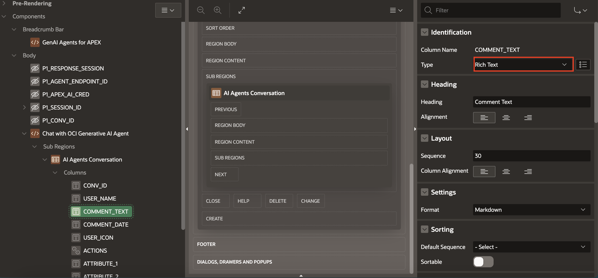

12. Under **AI Agents Conversation** sub-region, click **ACTIONS**.

13. In the property editor, enter/select the following:

    - Identification > Type: **Link**

    - Under Link:

        - Link Text: **#ACTIONS#**

        - Link Attributes: **target="_blank"**

        

        - Target: Click **No Link Defined**, enter/select the following:

            - Page : **7**

            - Under Set Items, enter the following:

                - Name: **P7\_CONV\_ID**

                - Value: **#CONV\_ID#**

            - Click **OK**

        

        >**Note**: Page 7 will create in next task

14. Right-click **AI Agents Conversation** sub-region, click **Create Dynamic Action**.

    

15. In the Property Editor, enter/select the following:

    - Name: **Scroll to bottom**

    - Under When:

        - Event: **After Refresh**

        - Selection **Type: Region**

        - Region: **AI Agents Conversation**

    

16. Under **True** action, click **Show**.

17. In the Property Editor, enter/select the following:

    - Identification > Action : **Execute JavaScript Code**

    - Settings > Code : Copy and paste the below code

    ```
    <copy>

    $("#ai-agents-chat .t-Comments").scrollTop($("#ai-agents-chat .t-Comments")[0].scrollHeight);

    </copy>
    ```

    

## Task 2: Create Buttons Sub Region

In this task, you will create buttons to trigger specific actions and configure subregions to logically group related components, enhancing the functionality.

1. Right-click **Chat with OCI Generative AI Agent** region, select **Create Sub Region**.

2. In the Property Editor, enter/select the following:

    - Under Identification:

        - Name: **Buttons**

        - Type: **Static Content**

    - Appearance > Template: **Blank with Attributes**

    

3. Right-click **Buttons** sub-region, click **Create Page Item**.

    

4. In the Property Editor, enter/select the following:

    - Under Identification:

        - Name: **P1\_PROMPT**

        - Type: **Text Field**

    - Under Appearance:

        - Template: **Hidden**

        - Template Options: **Use Template Default**

            - Under Common:

                - General: Check **Use Template Defaults** and **Stretch From Item**

                - Size: **Large**

            - Click **OK**

        - Value Placeholder: **Enter your message...**

    

5. Right-click **P1_PROMPT** page item and click **Create Dynamic Action**.

6. In the Property Editor, enter/select the following:

    - Identification > Name: **Prompt Item Enter Key Action**

    - Under When:

        - Event: **Key Down**

        - Selection Type: **Item(s)**

        - Items: **P1_PROMPT**

    - Under Client-side Condition:

        - Type: **JavaScript expression**

        - JavaScript expression: Copy the below code

        ```
        <copy>
               this.browserEvent.key === 'Enter' && !apex.item("P1_PROMPT").isEmpty()
        </copy>
        ```

    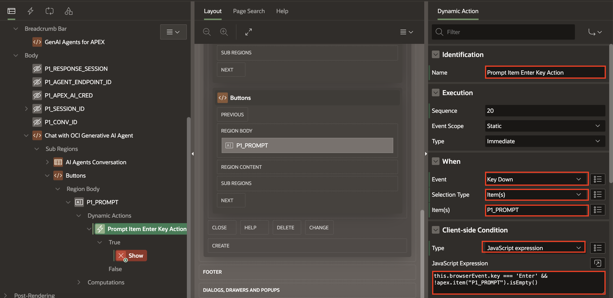

7. Under **True** action, click **Show**.

8. In the Property Editor, enter/select the following:

    - Identification > Action: **Execute JavaScript Code**

    - Settings > Code : Copy the below code

    ```
    <copy>
        this.browserEvent.preventDefault();
        apex.event.trigger($("#call-genai-agents"), "click");
    </copy>
    ```

   

9. Right-click **Buttons** sub-region, click **Create Button**.

     

10. In the Property Editor, enter/select the following:

    - Under Identification:

        - Name: **Send**

        - Label: **Send**

    - Under Layout:

        - Start New Row: **Toggle Off**

        - New Column: **Toggle On**

        - Column Span: **2**

        - Column Attributes: **style="align-self: center;"**

      

    - Under Appearance:

        - Button Template: **Icon**
        - Hot: **Toggle On**
        - Template Option > Click Use Template Defaults :
            - Size: **Small**
            - Type: **Normal**
        - Icon : **fa-arrow-circle-up**

    - Under Behavior:

        - Action : **Defined by Dynamic Action**
        - Execute Validations: **Toggle On**

    - Advanced > Static ID: **call-genai-agents**

      

11. Under **Button** sub-region, right-Click **Send** button, and click **Create Dynamic Action**.

12. In the Property Editor, enter/select the following:

    - Identification > Name: **Interact with AI Agents on Button Click**

    - Under Client-side Condition:
        - Type: **JavaScript expression**
        - JavaScript Expression : **!apex.item("P1_PROMPT").isEmpty()**

    

13. Under True action, click **Show**.

14. In the Property Editor, enter/select the following:

    - Identification > Action: **Execute Server-side Code**

    - Under Settings, enter/select the following:
        - Language: **PL/SQL**
        - PL/SQL Code: Copy the below code:

        ```
        <copy>

            begin insert into RAG_CHATBOT (
            user_name, is_own, comment_text, comment_date,
            session_ID
            )
            values
            (
               :APP_USER, 'Yes', :P1_PROMPT, sysdate,
               :P1_SESSION_ID
            );
            end;

        </copy>
        ```

       - Item to Submit: **P1\_PROMPT,P1\_SESSION\_ID**
       - Item to Return: **P1\_CONV\_ID**

    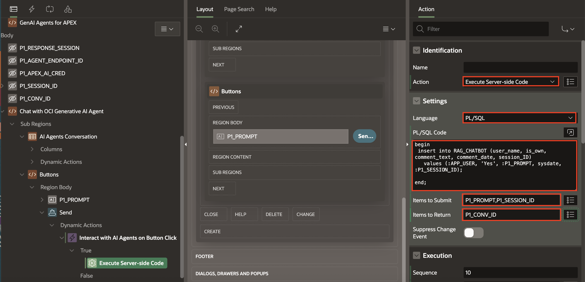

15. Right-click **True** action and click **Create TRUE Action**.

    

16. In the Property Editor, enter/select the following:

    - Identification > Action: **Execute Server-side Code**
    - Under Settings > Code : Copy and paste the below code

    ```
    <copy>
    apex.region("ai-agents-chat").refresh();
    var spinner = apex.util.showSpinner();
    </copy>
    ```

    

17. Right-click **True** action and click **Create TRUE Action**.

18. In the Property Editor, enter/select the following:

    - Under Identification:
        - Name: Calling RAG Agent
        - Action: **Execute Server-side Code**

    - Under Settings:
        - Language: PL/SQL
        - Code : Copy and paste the below code

    ```
    <copy>

        declare
        l_body       clob;
        l_response   clob;
        l_url        varchar2(2000);
        l_result     varchar2(4000);
    begin
        l_url := 'https://agent-runtime.generativeai.'
                    || :P1_REGION
                    ||'.oci.oraclecloud.com/20240531/agentEndpoints/'
                    || :P1_AGENT_ENDPOINT_ID
                    || '/actions/chat';
        l_body := '{"sessionId"    : "' || :P1_SESSION_ID || '",'
                || '"shouldStream" : "false",'
                || '"userMessage"  : "' || :P1_PROMPT || '"}';

        apex_web_service.g_request_headers(1).name := 'Content-Type';
        apex_web_service.g_request_headers(1).value := 'application/json';

        l_response := apex_web_service.make_rest_request(
                        p_url                  => l_url,
                        p_http_method          => 'POST',
                        p_body                 => l_body,
                        p_credential_static_id => :P1_APEX_AI_CRED
                    );


            SELECT response_text into l_result
        FROM   JSON_TABLE(l_response, '$.message[*]'
                COLUMNS (response_text varchar2(4000) PATH '$.content.text'
                            )) jt;

    insert into RAG_CHATBOT (user_name, is_own, comment_text, comment_date, session_ID)
    values ('AI', 'No', l_result, sysdate, :P1_SESSION_ID)
    returning CONV_ID into :P1_CONV_ID;

    -- Adding Citations

    for i in (SELECT jt.source_text, jt.source_location
    FROM JSON_TABLE(
        l_response,
        '$.traces[*]'
        COLUMNS (
            NESTED PATH '$.citations[*]'
                COLUMNS (
                    source_text VARCHAR2(4000) PATH '$.sourceText',
                    source_location VARCHAR2(4000) PATH '$.sourceLocation.url'
                )
        )
    ) jt
    where jt.source_text is not null and
    jt.source_location is not null
    )
    loop
        insert into RAG_CITATIONS (conv_id, prompt, source_text, source_location, asked_on) 
            values (:P1_CONV_ID,:P1_PROMPT, i.source_text,i.source_location, systimestamp);

    end loop;

    end;

    </copy>
    ```

    - Item to Submit: **P1\_PROMPT,P1\_SESSION\_ID,P1\_AGENT\_ENDPOINT\_ID,P1\_APEX\_AI\_CRED**, **P1\_REGION**

    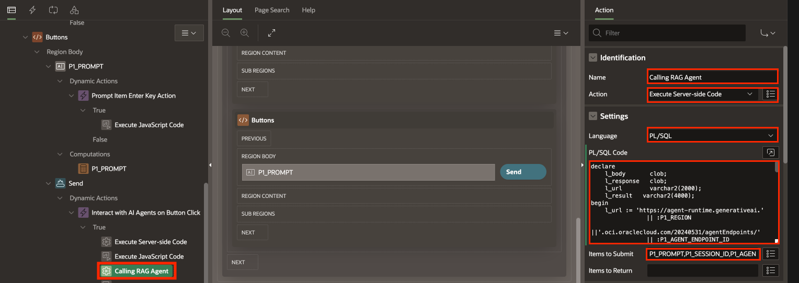

19. Right-click **True** action and click **Create TRUE Action**.

20. In the Property Editor, enter/select the following:

    - Identification > Action: **Execute JavaScript Code**
    - Under Settings > Code : Copy and paste the below code

    ```
    <copy>
        apex.region("ai-agents-chat").refresh();
        apex.item("P1_PROMPT").setValue("");
        apex.item("P1_PROMPT").enable();
        apex.item("P1_PROMPT").setFocus();
        $("#apex_wait_overlay").remove();
        $(".u-Processing").remove();
    </copy>
    ```

    

## Task 3: Create Page Processes and Computation

In this task, we will create a Static Content region and a subregion, and configure dynamic actions to control their behavior based on user interactions.

1. Under **Rendering** Tab, expand **Pre-Rendering**, right-click **Before Header** and select **Create Computation**.

   

2. In the Property Editor, enter/select the following:

    - Identification > Item Name: **P1_PROMPT**
    - Computation > Type: **Static Value**
    - Error > Error Message: **Clear the message if page is refreshed.**

   

3. Right-click **Before Header** and select **Create Computation**.

4. In the Property Editor, enter/select the following:

    - Identification > Item Name: **P1\_SESSION\_ID**
    - Computation > Type: **Static Value**

   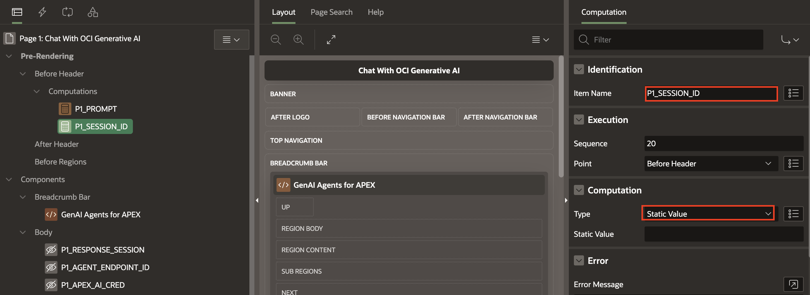

5. Right-click **Before Header** and select **Create Process**.

   

6. In the Property Editor, enter/select the following:

     - Under Identification:
        - Item Name: **Create Session**
        - Type: **Invoke API**

     - Under Settings:
        - Type: **REST Source**
        - REST Source: **Create Session API** [Refer Lab 4](?lab=4-configure-restapi)
        - Operation: **POST**

        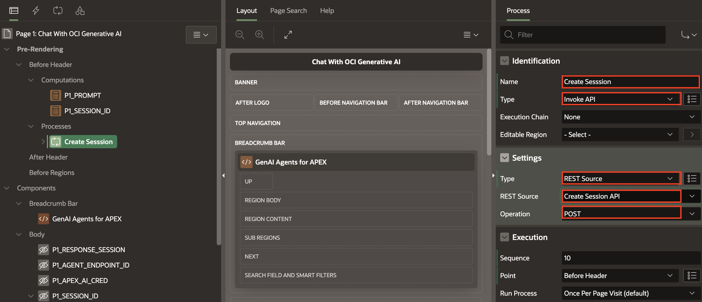

7. Navigate to **Body**, click **P1\_SESSION\_ID**.

8. In the Property Editor, enter/select the following:

    - Under Default:

        - Type: **SQL Query (return single value)**

        - SQL Query (return single value): Copy the below code

        ```
        <copy>

        SELECT id
        FROM
        JSON_TABLE(
            :P1_RESPONSE_SESSION,
            '$' COLUMNS (
                id VARCHAR2(4000) PATH '$.id'
            )
        ) jt;

        </copy>
        ```

   

9. Navigate to **Pre-Rendering**. Select **Create Session** process and expand **Parameters**.

10. Click **AGENT_NAME** parameter. In the Property Editor, enter/select the following:

    - Under Value:
        - Type : **Static Value**
        - Static Value: **RAGAgent**

    

11. Click **DESCRIPTION** parameter. In the Property Editor, enter/select the following:

    - Under Value:
        - Type : **Static Value**
        - Static Value: **Session for RAG Agent**

    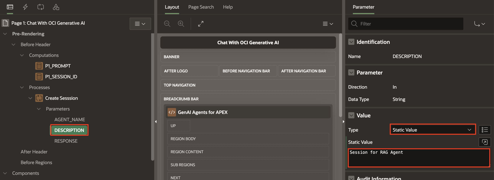

12. Click **RESPONSE** parameter. In the Property Editor, enter/select the following:

    - Under Value:

        - Parameter > Ignore Output : **Toggle Off**

        - Value > Item : **P1\_RESPONSE\_SESSION**

    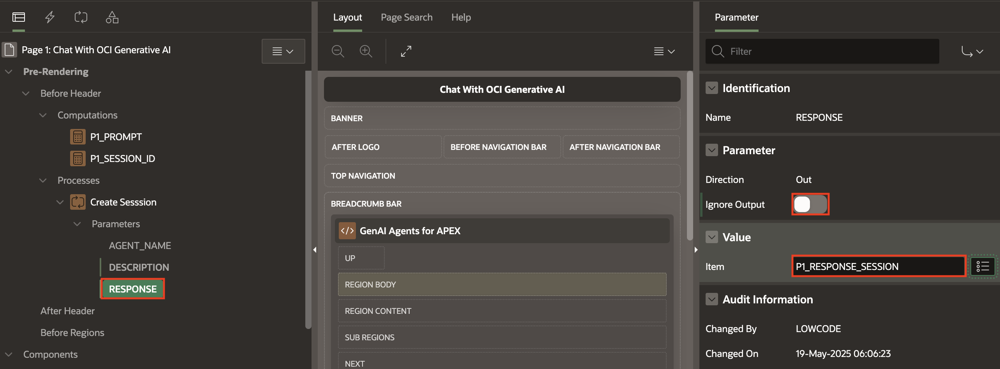

## Task 4: Add Pages for Document Upload

1. Navigate back to the Page Designer. In the page designer toolbar, click ( + v ) icon and select **Page**.

   

2. Select **Form**.

   

3. In the Property Editor, enter/select the following:

    - Page Number : **5**
    - Name: **Upload Documents to knowledge Base**
    - Page Mode: **Drawer**
    - Table/View Name: **DOC\_UPLOAD**

4. Click **Next**.

    

5. Click **Create Page**.

   

6. Once Page is created, navigate to the page, right-click on **Upload Documents to Knowledge Base** region and select **Create page Item**.

7. Now, add the following nine page items one after the other:

   |   | Identification > Name | Identification > Type | Default > Type | Default > Static | Session State > Datatype | SQL Query (return single value)
   |---|-------|------|----------| --------------| ------ |------ |
   | 1 | P5\_COMPARTMENT\_ID| Hidden | Static |Enter your OCI account Compartment OCID|
   | 2 | P5\_CRED\_STATIC\_ID| Hidden | Static | APEX\_OCI\_AI\_CRED |
   | 3 | P5\_NAMESPACE\_NAME| Hidden | Static | Enter  Namespace which you copied while creating a Bucket|
   | 4 | P5\_BUCKET\_NAME| Hidden | Static | Enter the Bucket Name which you copied while creating a Bucket(For this Lab we have **GenAIRAGBucket**) |
   | 5 | P5\_REGION| Hidden | Static | Enter your Region. e.g. us-chicago-1 |
   | 6 | P5\_DATASOURCE_ID| Hidden |  |  | [Refer Lab 2, Task3, Step10](?lab=2-configure-kb-genai#Task3:FetchOCIDofGenerativeAIAgentandDataSource)
   | 7 | P5\_DISPLAY\_NAME| Hidden | SQL Query (return single value) | | | select concat('IngestionJob\_', ingestion\_seq.nextval) from dual;  |
   | 8 | P5\_DESCRIPTION| Hidden | | Creating an Ingestion Job for the latest files | | |
   | 9 | P5\_ING\_RESPONSE| Hidden | |  | | |
   {: title="Form Page Items"}

     - Select **P5\_FILE\_NAME**, **P5\_MIME\_TYPE**, **P5\_OBJECT\_STORAGE\_URL**, **P5\_CREATED**, **P5\_CREATED\_BY**, **P5\_UPDATED**, **P5\_UPDATED\_BY**, **P5\_INGESTION\_RESPONSE**,**P5\_DATA\_ING\_JOB\_ID**.

     - Navigate to **Property Editor**, Identification > Type : **Hidden**

   

8. Right-click **Upload Documents to Knowledge Base** region, click **Create Page Item**.

9. In the Property Editor, enter/select the following:

    - Under Identification:
        - Name: **P5\_DOC\_UPLOAD**
        - Type: **File Upload**

    - Under Display:
        - Display As: **Block Dropzone**
        - Dropzone Title: **Upload your Document**

   

10. Right-click **Content Body**, click **Create Page Item**.

11. In the Property Editor, enter/select the following:

    - Under Identification:
        - Name: **P5\_INGESTION\_COUNT**
        - Type: **Hidden**

    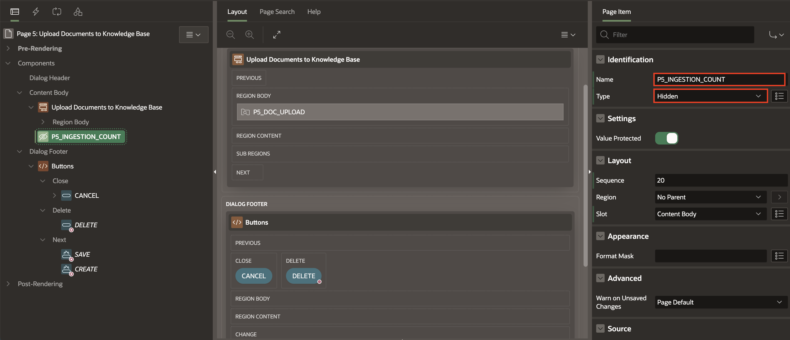

12. Right-click **P5\_INGESTION\_COUNT** page item, click **Create Computation**.

13. In the Property Editor, enter/select the following:

    - Under Computation:
        - Type: **SQL Query (return single value)**
        - SQL Query: Copy the below code
        ```
        <copy>

        select count(*) from DOC_UPLOAD where INGESTION_RESPONSE in ('ACCEPTED','IN_PROGRESS');

        </copy>
        ```

    

14. Right-click **Content Body**, click **Create Region**.

15. In the Property Editor, enter/select the following:

    - Under Identification:

        - Name: **Ingestion Details**
        - Type: **Static Content**

    - Source > HTML Code : **An Ingestion Job is currently In-Progress. Please wait before uploading Documents**

        

    - Under Server-side Condition:

        - Type: **Item is NOT zero**
        - Item: **P5\_INGESTION\_COUNT**

        

16. Under **Content Body**, select **Upload Documents to Knowledge Base** region.

17. In the Property Editor, enter/select the following:

    - Under Server-side Condition:
        - Type: **Item is zero**
        - Item **P5\_INGESTION\_COUNT**

       

## Task 5: Add Processes to the Page

In this task you will learn how to create processes and will create  processes:

- **Process form Upload Documents to Knowledge Base**: This process handles the submission of uploaded documents from the form and initiates the upload to the Knowledge Base. It prepares the data to be vectorized and stored for use by Oracle Generative AI services.

- **Work with Ingestion Jobs**: This process triggers a REST API call to start an ingestion job. The job processes uploaded documents, converting them into AI-readable embeddings to populate the Knowledge Base.

- **Delete File in Object Storage**: This process connects to Oracle Object Storage and deletes selected files, helping manage storage efficiently and ensuring outdated or incorrect files are removed.

- **Auto DML**: This process helps in Data Manipulation Language (DML) operations such as insert, update, or delete based on user actions on the form.

1. On Page 5, Navigate to the **Processing** tab, select **Process form Upload Documents to Knowledge Base** process, enter/select the following:

    - Identification > Type: **Invoke API**

    - Under Settings:
        - Type: **PL/SQL Package**
        - Package: **OCI\_OBJECT\_STORAGE\_UTILS**
        - Procedure or Function: **UPLOAD_FILE**

    - Under Server-side Condition:

        - When Button Pressed: **--Select--**
        - Type: **Request is contained in Value**
        - Value: **CREATE,SAVE**

        

2. Expand the **Parameters** and map the following items one after another:

    |   | Parameters | Value > Item |
    |---|-------|------|
    | 1 | p\_file_content| P5\_DOC\_UPLOAD |
    | 2 | p\_static\_id| P5\_CRED\_STATIC\_ID |
    | 3 | p\_namespace| P5\_NAMESPACE_NAME |
    | 4 | p\_bucket| P5\_BUCKET_NAME |
    | 5 | p\_region| P5\_REGION |
    | 6 | p\_object_storage\_url| P5\_OBJECT\_STORAGE\_URL |
    | 7 | p\_file_name| P5\_FILE_NAME|
    | 8 | p\_mime_type| P5\_MIME_TYPE |
    {: title="Parameters Mapping"}

     

3. Right-click **Processes** and click **Create Process**.

4. In the Property Editor, enter/select the following:

    - Under Identification:
        - Name: **Work with Ingestion Jobs**
        - Type: **Execution Chain**

    - Under Server-side Condition:
        - Type: **Request is contained in Value**
        - Value: **CREATE,SAVE**

     

5. Right-click **Work with Ingestion Jobs** processes, click **Add Child Process**.

6. In the Property Editor, enter/select the following:

    - Under Identification:
        - Name: **Call Ingestion API**
        - Type: **Invoke API**
        - Execution Chain: **Work with Ingestion Job**

    - Under Settings:
        - Type: **REST Source**
        - Value: **Create Ingestion Job API**
        - Operation: **POST**

     

7. Under **Call Ingestion API** child process, expand the parameters and map the following parameters:

    |   | Parameters | Parameter > Ignore Output|Value > Item |
    |---|-------|------|----|
    | 1 | COMPARTMENTID| |P5\_COMPARTMENT\_ID |
    | 2 | DATASOURCEID| |P5\_DATASOURCE\_ID |
    | 3 | DESCRIPTION| |P5\_DESCRIPTION |
    | 4 | DISPLAYNAME| |P5\_DISPLAY\_NAME |
    | 5 | RESPONSE| Toggle Off |P5\_ING\_RESPONSE |
    {: title="Parameters Mapping"}

     

8. Right-click **Work with Ingestion Jobs** process, click **Add Child Process**.

9. In the Property Editor, expand the **Parameters** and enter/select the following:

    - Under Identification:
        - Name: **Set Ingestion Job Details**
        - Type: **Execute Code**
        - Execution Chain: **Work with Ingestion Job**

    - Under Source:
        - Language: **PL/SQL**
        - PL/SQL Code: Copy the below code:
        ```
        <copy>
            SELECT
            jt.Status,
            jt.job_id into :P5_INGESTION_RESPONSE,
            :P5_DATA_ING_JOB_ID
            FROM
            JSON_TABLE(
                :P5_ING_RESPONSE,
                '$' COLUMNS (
                Status VARCHAR2(50) PATH '$.lifecycleState',
                job_id varchar2(300) PATH '$.id'
                )
            ) jt;

        </copy>
        ```

     

10. Right-click **Processes**, select **Create Process**.

11. In the Property Editor, enter/select the following:

    - Under Identification:
        - Name: **Delete File in Object Storage**
        - Type: **Invoke API**

    - Under Settings:
        - Type: **PL/SQL Package**
        - Package: **OCI\_OBJECT\_STORAGE\_UTILS**
        - Procedure or Function: **DELETE\_FILE**

    - Server-side Condition > When Button Pressed: **DELETE**

        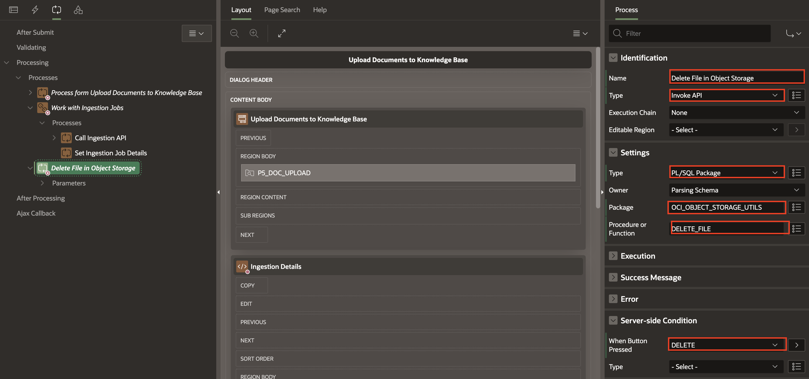

12. Under **Delete File in Object Storage** process and map the following parameters:

    |   | Parameters | Value > Item |
    |---|-------|------|
    | 1 | p\_object\_storage\_url| P5\_OBJECT\_STORAGE\_URL |
    | 2 | p\_static\_id| P5\_CRED\_STATIC\_ID |
    | 3 | p\_mime\_type| P5\_MIME\_TYPE |
    {: title="Parameters Mapping"}

    

13. Right-click **Processes** and click **Create Process**.

14. In the Property Editor, enter/select the following:

    - Under Identification:
        - Name: **Auto DML**
        - Type: **Form - Automatic Row Processing (DML)**
        - From Region: **Upload Documents to Knowledge Base**

    - Under Server-side Condition:
        - Type: **Request is contained in Value**
        - Value: **CREATE,SAVE,DELETE**

    

15. Right-click **After Processing**, click **Create Branch**.

    

16. In the Property Editor, enter/select the following:

    - Identification > Name: **Go To Page 6**

    - Behavior > Target: **No Link Defined**

    - Link Builder - Target > Page : **6**

    

## Task 6: Create Page for Document Processing

In this task we will create Application Items,Application Processes and Content Row Dialog page

1. In the Page designer toolbar, click **Shared Components** icon.

   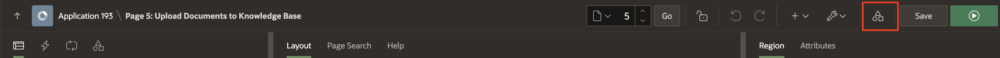

2. Click **Application Items**.

   

3. Click **Create**.

    

4. In the Property Editor, enter/select the following:

    - Name: **ID**
    - Scope: **Application**
    - Security > Session State Protection : **Unrestricted**

    

    - Click **Create Application Item**

5. Navigate back to **Shared Components** page.

6. Under **Application Logic**, select **Application Processes**.

    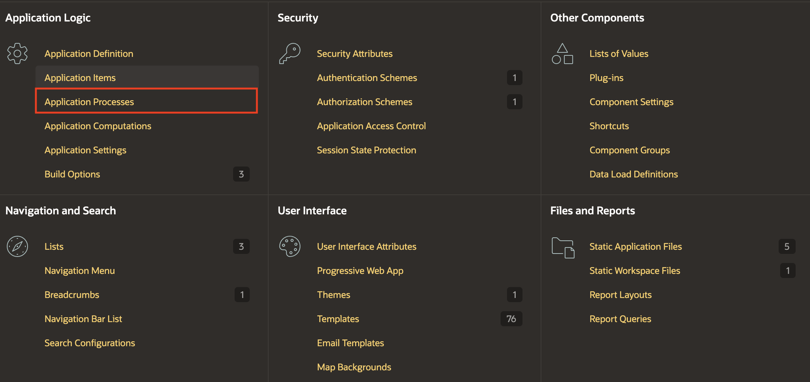

7. Click **Create**.

    

8. Enter/select the following::

    - Name : **DOWNLOAD_DOC**
    - Sequence: **1**
    - Point: **Ajax Callback:Run this application process when requested by a page process.**

    

    - Click **Next**

9. Enter/select the following::

    - Language : **PL/SQL**
    - Code: Copy the below code
    ```
    <copy>

    BEGIN
      OCI_OBJECT_STORAGE_UTILS.get_file(:ID);
    END;

    </copy>
    ```

    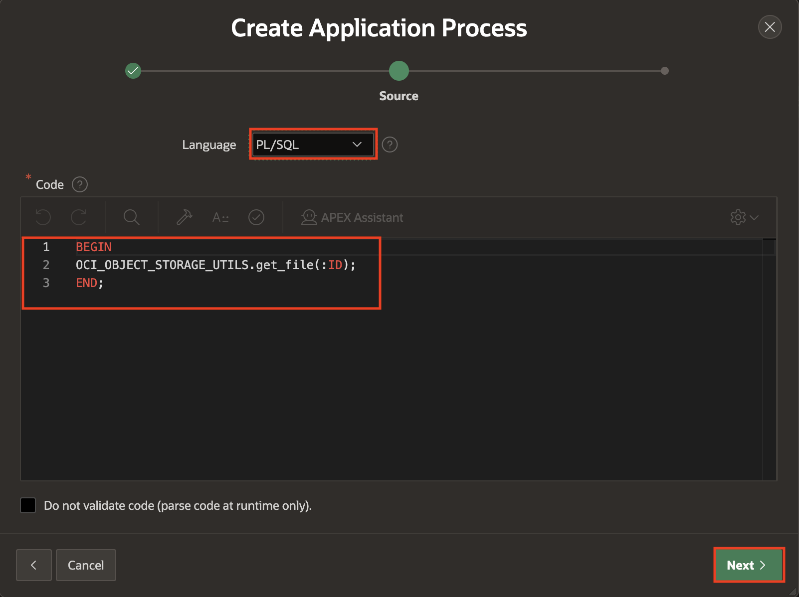

    - Click **Next**

10. Click **Create Process**.

    

11. Navigate to your Application ID and click **Create Page**.

    

    

12. Select **Content Row**.

    

13. Enter/select the following::

    - Page Number : **6**
    - Name: **Documents Processing Tracker**
    - Page Mode: **Drawer**

    

    - Click **Next**

14. Click **Create Page**.

15. Under Content Body, select **Document Processing Tracker**.

16. In the property editor, enter/select the following

    - Identification > Name : **List Available Documents**

    - Under Source:

        - Type: **SQL Query**
        - SQL Query: Copy the below code

        ```
        <copy>

        select
        ID,
        FILE_NAME,
        MIME_TYPE,
        OBJECT_STORAGE_URL,
        CREATED,
        CREATED_BY,
        UPDATED,
        UPDATED_BY,
        INGESTION_RESPONSE,
        case when INGESTION_RESPONSE = 'SUCCEEDED'
              then 'success' when INGESTION_RESPONSE = 'ACCEPTED' then 'danger' else 'warning' end as response_color,
         DATA_ING_JOB_ID
        from
        DOC_UPLOAD

        </copy>
        ```

    - Appearance > Template: **Blank with Attributes (No Grid)**

    

    

17. In the Property Editor, select **Attributes** tab and enter/select the following:

    - Under Settings:

        - Title: **File Name: &FILE\_NAME.**

        - Description: **Ingestion Job ID: &DATA\_ING\_JOB\_ID.**

        - Miscellaneous: **Created By: &CREATED\_BY.**

        - Display Badge: **Toggle ON**

    - Under Badge:

        - Label: **&INGESTION\_RESPONSE.**

        - Value: **INGESTION\_RESPONSE**

        - State: **RESPONSE\_COLOR**

        - Column Width: **Auto**

    

18. Under **List Available Documents**, right-click **Action**, and click **Create Action**.

    

19. In the Property Editor, enter/select the following:

    - Under Identification :
        - Position: **Primary Actions**
        - Template : **Menu**
        - Label : **Menu**

    - Under Appearance :
        - Display Type: **Icon**
        - Icon : **fa-ellipsis-v**

    

20. Under **Menu** action, right-click **Menus** add below items one after another:

    - Under Identification enter/select the following:

        - Type: **Menu Entry**
        - Target: **Download PDF**

    - Under Link enter/select the following:

        - Type: **Redirect to Page in this Application**
        - Label: Click **No Link Defined**

    - In the dialog **Under Link Builder - Target** enter/select the following:

        - Target > Page : **6**

        - Set Items > Name : **ID**

        - Set Items > Value : **&ID.**

        - Advanced > Request : **APPLICATION\_PROCESS=DOWNLOAD\_DOC**

    

21. Under **Menu** action, right-click **Menus** add below items one after another:

    - Under Identification enter/select the following:

        - Type: **Menu Entry**
        - Target: **Edit/Delete Document**

    - Under Link enter/select the following:

        - Type: **Redirect to Page in this Application**
        - Label: Click **No Link Defined**

    - In the dialog **Under Link Builder - Target** enter/select the following:

        - Target > Page : **5**

        - Set Items > Name : **P5\_ID**

        - Set Items > Value : **&ID.**

        - Clear / Reset > Clear Cache : **5**

    

22. Right-click on **List Available Documents** click **Create Button**, create below buttons one after another.

    |   | Identification > Button Name | Identification > Label | Layout > Slot | Appearance > Hot |Behavior > Action | Target > No Link Defined > Target > Page  | Clear Cache |
    |---|-------|------|----------| --------------| ---- | --- | --- |
    | 1 | Chat\_with\_AI\_Agent| Chat With AI Agent | Top of Region [Legacy]| |Redirect to Page in this Application| 1 | 1 |
    | 2 | Upload| Upload Document to KB | Top of Region [Legacy]| Toggle On |Redirect to Page in this Application| 5 | 5 |
    {: title="Link Builder - Target"}

    

    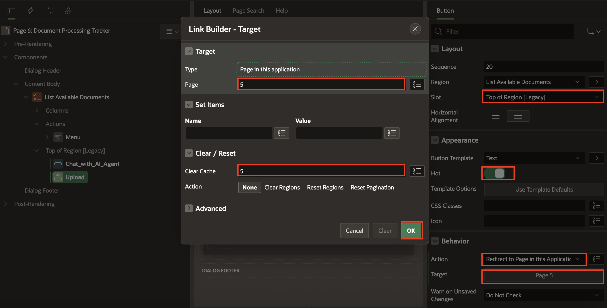

23. Right-click **Content Body**, click **Create Page Item**.

24. In the Property Editor, enter/select the following:

    - Under Identification:

        - Name: **P6\_ID**

        - Type: **Hidden**

    

25. Navigate to **Page 6: Document Processing Tracker** root node.

26. In the Property Editor, enter/select the following:

    - Template Options > Size: **Large**

    - Under Dialog > Chained : **Toggle On**

    

## Task 7: Add Buttons in HomePage

1. Go to **Navigation Bar** and navigate to **Page 1**.

2. In the **Rendering Pane**, right-click  **Breadcrumb Bar** and select **Create Button**.

3. In the Property Editor, enter/select the following:

    - Under Identification:

        - Button Name: **NewSession**

        - Label: **New Session**

    - Layout > Slot: **Before Navigation Bar**

    - Under Appearance:

        - Button Template: **Text with Icon**
        - Hot: Toggle **On**
        - Icon: **fa-plus-square-o**

    - Behavior >Action: **Submit Page**

    

4. Right-click  **Breadcrumb Bar** and select **Create Button**.

5. In the Property Editor, enter/select the following:

    - Under Identification:

        - Button Name: **UploadDocuments**
        - Label: **Upload Documents**

    - Layout > Slot: **Before Navigation Bar**

    - Under Appearance:

        - Button Template: **Text with Icon**

        - Hot: Toggle **On**

        - Icon: **fa-cloud-upload**

    - Behavior >Action: **Redirect to Page in this Application**

    - Target > Link Builder-Target > Page :**6**

        - Click **OK**

    

## Task 8: Create Page to View Citations

1. In the page designer toolbar, click ( + v ) icon and select **Page**.

   

2. Select **Content Row** .

    

3. Enter/select the following::

    - Page Number : **7**
    - Name: **View Citations**
    - Page Mode: **Drawer**

    

4. Click **Create Page**

5. Right-click **Content Body**, select **Create Page Item**.

6. In the property editor enter/select the following:

    - Identification > Name: **P7\_CONV\_ID**
    - Identification > Type: **Hidden**

    

7. Select **View Citations** region, in the property editor enter/select the following:

    - Under Source:

        - Type: **SQL Query**

        - SQL Query: Copy the below code

    ```
    <copy>

    select * from RAG_CITATIONS WHERE CONV_ID = :P7_CONV_ID;

    </copy>
    ```

    - Appearance > Template: **Blank with Attributes (No Grid)**

    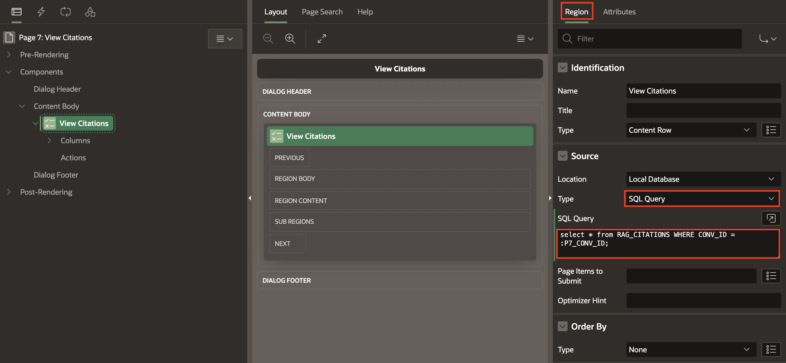

8. Navigate to **Attributes** tab, enter/select the following:

    - Under Settings: (including period (**.**) ):

        - Overline: **CONVERSATION ID: &CONV_ID.**

        - Title: **PROMPT: &PROMPT.**

        - Description: Copy and paste the below HTML code:

        ```
        <copy>
        <b>SOURCE TEXT</b>: &SOURCE_TEXT. <br> <br> <br>
        <b>SOURCE LOCATION</b>: &SOURCE_LOCATION.
        </copy>
        ```

        - Display Avatar: Toggle **On**

    - Under Avatar:

        - Type: **Icon**
        - Icon: **fa-chatbot**

    

## Task 9: Create Automation

1. In the Page designer toolbar, click **Shared Components** icon.

   

2. Under Workflows and Automations, click **Automations**

   

3. Click **Create**

   

4. Under Create Automation, enter/select the following:

    - Name: **Get Ingestion Status**
    - Type: **Scheduled**
    - Actions initiated on: **Query**
    - Execution Schedule: **Custom**
    - Frequency: **Minutely**
    - Interval: **2**

5. Click **Next**.

   

6. Under Create Automation > Table/View name: **DOC_UPLOAD(table)**, leave others default.

7. Click **Create**.

   

8. Under Actions, click **Edit Icon**

   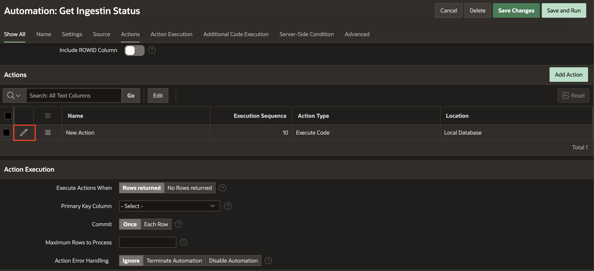

9. Under Edit Action, enter/select the following:

   

    - Name: **Get Ingestion Job Status**
    - Type: **Execute Code**
    - Execution Sequence: **10**

10. Under Code, copy paste the below PL/SQL:

    ```
    <copy>

        declare
        l_ing_jobid varchar2(300);
        l_response clob;
        l_json varchar2(1000);
        l_status varchar2(100);

        cursor c_jobid is select id, DATA_ING_JOB_ID,INGESTION_RESPONSE from doc_upload where upper(INGESTION_RESPONSE) <> 'SUCCEEDED';

        begin
        apex_web_service.set_request_headers(
            p_name_01 => 'Content-Type'
            , p_value_01 => 'application/json'
        );

        FOR i in c_jobid
        LOOP
            l_ing_jobid := i.DATA_ING_JOB_ID;

            l_response := apex_web_service.make_rest_request(
            p_http_method => 'GET'
            , p_url => 'https://agent.generativeai.us-chicago-1.oci.oraclecloud.com/20240531/dataIngestionJobs/'
                        || l_ing_jobid
            , p_credential_static_id => 'APEX_OCI_AI_CRED'
        );

        SELECT jt.Status into l_status
        FROM JSON_TABLE(
            l_response,
            '$'
            COLUMNS (
                Status VARCHAR2(50) PATH '$.lifecycleState'
            )
        ) jt;

        update doc_upload set INGESTION_RESPONSE = l_status where id = i.id;
            dbms_output.Put_line(l_response);
        END LOOP;
        end;

    </copy>
    ```

11. Click **Apply Changes**.

    

12. Under Settings, Schedule Status > Active.

13. Click **Save and Run**.

    

## Summary

In this lab, you have learned how to work with static components, create computations and processes, define page items, invoke REST APIs. Additionally, you created an automation process to fetch ingestion job details.

You may now proceed to the next lab

## Acknowledgements

- **Author(s)** - Roopesh Thokala, Senior Product Manager; Shailu Srivastava, Product Manager
- **Last Updated By/Date** - Shailu Srivastava, Product Manager, June 2025
