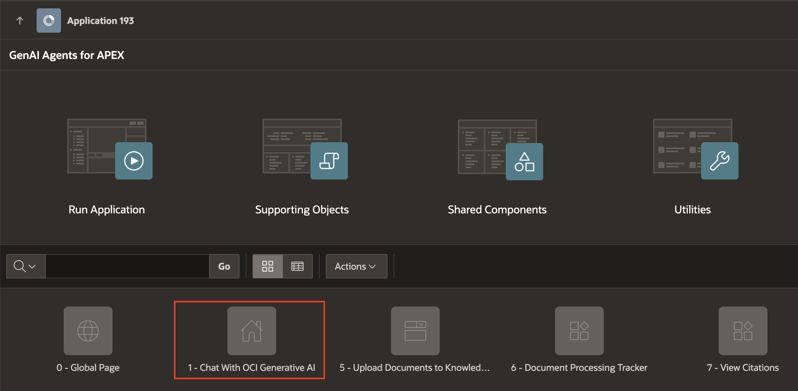
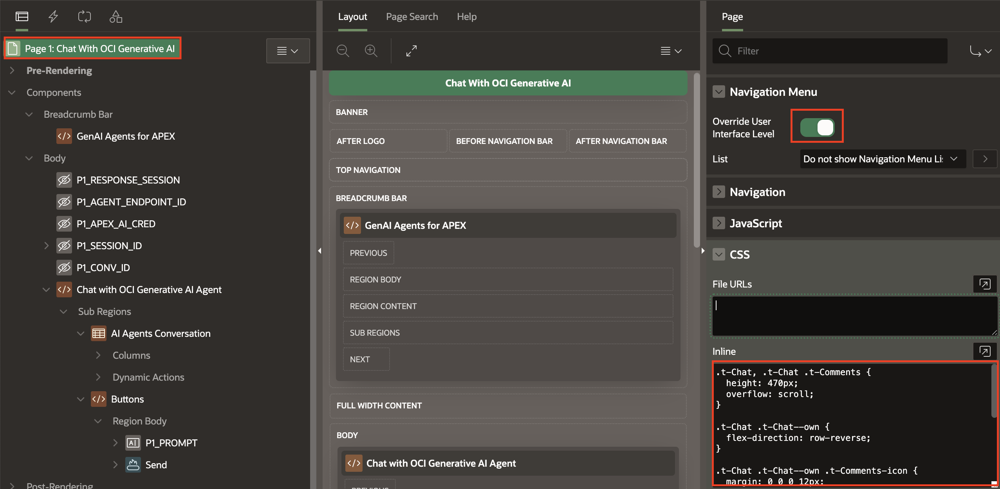

# Enhance Application UI

## Introduction

In this lab, we will focus on improving the visual design and user experience of the application. You will apply the Redwood theme, use inline CSS for styling specific components, and explore Theme Roller to customize the look and feel of your application. These enhancements help create a more modern, consistent, and user-friendly interface.

Estimated Time: 5 Minutes

### Objectives

In this lab, you will:

- Add Inline CSS.

- Customize Theme using Theme Roller.

## Task 1: Add Inline CSS

1. Click on **Application Id**. Navigate to Page 1 **Chat With OCI Generative AI**.

    

    

2. Under **Breadcrumb Bar**, click **GenAI Agents for APEX** .

3. In the Property Editor, enter/select the following:

    - Appearance > Template: **Blank with Attributes**

    

4. Navigate to **Page 1 : Chat With OCI Generative AI** root node and in the Property Editor, enter/select the following:

    - Navigation Menu > Override User Interface Level: **Toggle On**

    - CSS > Inline: Copy and paste the below CSS in the code editor:

        ```
        <copy>

        .t-Chat, .t-Chat .t-Comments {
        height: 470px;
        overflow: scroll;
        }

        .t-Chat .t-Chat--own {
        flex-direction: row-reverse;
        }

        .t-Chat .t-Chat--own .t-Comments-icon {
         margin: 0 0 0 12px;
         }

        .t-Chat .t-Chat--own .t-Comments-body {
        align-items: flex-end;
        }

        .t-Chat .t-Chat--own .t-Comments-comment:after {
        border-left-color: var(--ut-comment-chat-background-color);
        border-right-color: transparent;
        right: auto;
        left: 100%;
        }

        </copy>
        ```

    

5. Click **Save** and run the application.

## Task 2: Explore Theme Roller to customize the look and feel

1. At bottom navigate to **Developer Toolbar**. Click **Customize > Theme Roller**.

   

2. Theme > Select Theme > **Redwood Light**.

   

3. Under Redwood Options, enter/select the following:

    - Pillar > **Neutral(Default)**

    - Layout > **Floating**

4. Under Appearance, enter/select the following:

    - Header > **Dark**

    - Navigation > **Pillar**

    - Body Header > **Dark**

    - Body Background > **Light(Default)**

5. Click **Save As**.

    

6. Enter Style Name: **Theme**, click **Save**.

   

   

## Summary

In this lab, you have learned how to work with and the Theme Roller.

You may now proceed to the next lab.

## Acknowledgements

- **Author(s)**: Roopesh Thokala, Senior Product Manager; Shailu Srivastava, Product Manager
- **Last Updated By/Date**: Shailu Srivastava, Product Manager, June 2025
