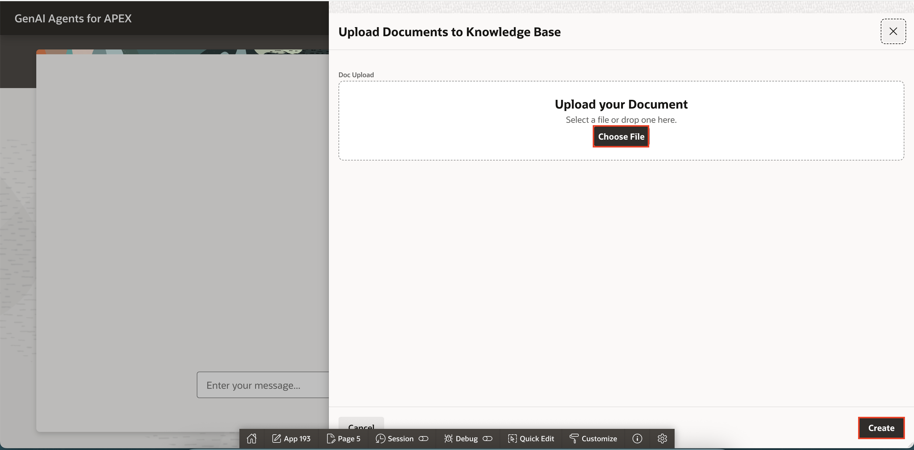
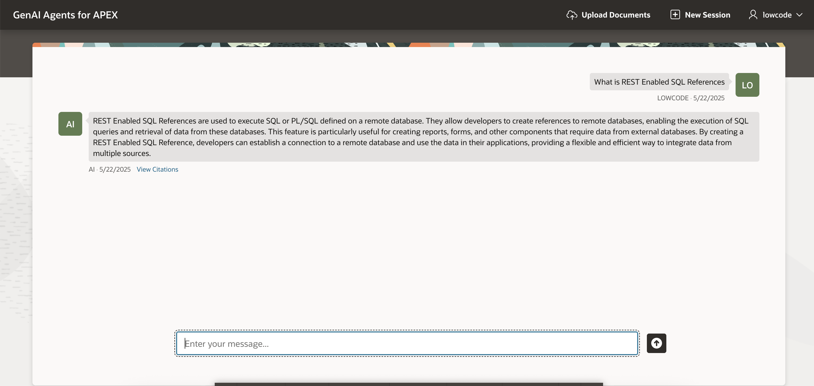

# Run the Application

## Introduction

In this lab, we will focus on enhancing the visual design and overall user experience of the APEX application. You will begin by running the application to explore its key features in action. Specifically, you'll interact with the **Upload Document**, **Create Session** functionality, experience how to chat with the RAG Agent, and perform essential file operations such as deleting and saving files.

Estimated Time: 5 Minutes

### Objectives

In this lab, you will:

- Add document to Object Storage, using APEX

- Chat with Generative AI Agent on the documents uploaded

- View Citations for the response from Agent

- Establish New Session

- Download/delete the file from Object Store by using APEX

## Task 1: Add document to Object Storage, using APEX

In this task you will upload document to OVI Object storage using APEX.

1. Click **Upload Documents** in the navigation bar.

    

2. Click the **Choose File** option or drag and drop the [apex\_document.pdf](files/apex_document.pdf) file on to the dialog window.

3. Click **Create**.

    

4. File gets added to OCI Object Storage bucket and ingestion job will run at t backend and details like ingestion id will be stored in database table.

    

5. Once the document uploaded successfully, click **Chat With AI Agent**

    

## Task 2: Chat with AI and view citations of the response

In this task you will chat with AI and can view the citations of the response, so you can verify the information and gain more context.

1. Type your question and press **Enter**.

    

    

2. Click **View Citations** link.

    

3. Close the dialog.

## Task 3: Create New Session, download/delete the documents

In this task you can create new session which refreshes the current chat and starts a new session and download or delete your existing document.

1. Click **New Session** button on navigation bar.

    

    

2. Click **Upload Documents** in the navigation bar.

    

3. Click three dot and select Download or Delete.

    

## Summary

In this lab, you have learned how to work with static components, create computations and processes, define page items, invoke REST APIs. Additionally, you created an automation process to fetch ingestion job details.

You may now proceed to the next lab

## Acknowledgements

- **Author(s)** - Roopesh Thokala, Senior Product Manager; Shailu Srivastava, Product Manager
- **Last Updated By/Date** - Shailu Srivastava, Product Manager, May 2025