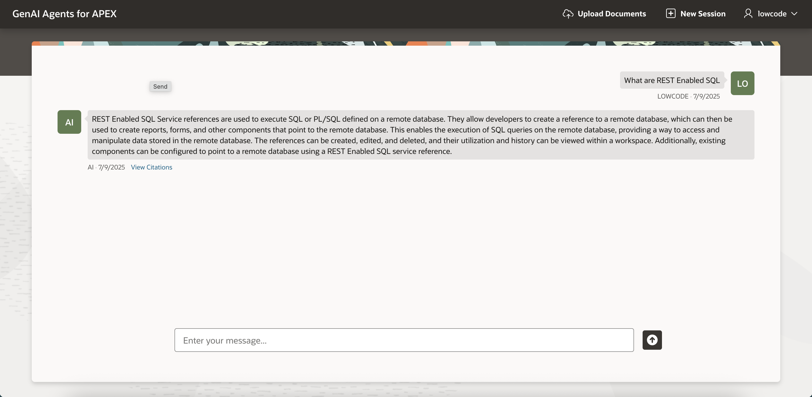

# Explore the Application Features

## Introduction

In this lab, you will explore the application features. You will start by uploading the document to the OCI Object Storage.Then you will chat with the Generative AI Agent and it will respond intelligently using the information from your uploaded document.Also you can use the Create Session option which helps you start a fresh chat session.

Estimated Time: 5 Minutes

Watch the video below for a quick walk-through of the lab.
[Create APEX App and Configure REST Data Source](videohub:1_evsvnjk6)

### Objectives

In this lab, you will:

- Upload a document to OCI Object Storage.

- Chat with Generative AI Agent.

- View Citations for the Response.

- Establish New Session.

- Download/delete the file from Object Storage.

## Task 1: Upload a document to OCI Object Storage

In this task, you will upload document to OCI Object storage.

1. In the **Navigation Bar**, click **Upload Documents**.

    

2. Click  **Choose File** option or drag and drop the [App Builder User's Guide.pdf](https://c4u04.objectstorage.us-ashburn-1.oci.customer-oci.com/p/EcTjWk2IuZPZeNnD_fYMcgUhdNDIDA6rt9gaFj_WZMiL7VvxPBNMY60837hu5hga/n/c4u04/b/livelabsfiles/o/labfiles%2Foracle-apex-app-builder-users-guide.pdf?download=1) document onto the dialog window.

    >* Note: This document **App Builder User's Guide** is available at [Oracle APEX Documentation](https://apex.oracle.com/en/learn/documentation/) page under Oracle APEX Release 24.2.

3. Click **Create**.

    

4. The document will be uploaded to OCI Object Storage bucket. Ingestion job will run in the background and details like ingestion id will be stored in database table.

    

5. Once the document uploaded successfully, click **Chat With AI Agent**

    

## Task 2: Chat with AI and View Citations of the Response

In this task, you will chat with Generative AI Agents. You can also view the citations of the responses to verify the information and identify the source document.

1. Enter your question and press **Enter**.

    

    

2. Click **View Citations** link.

    

3. Close the dialog.

## Task 3: Create a New Chat session

In this task, you can create new session which refreshes the current chat and starts a new session.Moreover you can download or delete your existing document.

1. On the **Navigation Bar**, click **New Session**.

    

    

2. Click **Upload Documents** in the navigation bar.

    

3. Click three dot and select **Download** or **Delete**.

    

## Summary

In this lab, you have learned how to work with static components, create computations and processes, define page items, invoke REST APIs. Additionally, you created an automation process to fetch ingestion job details.

## Acknowledgements

- **Author(s)**: Roopesh Thokala, Senior Product Manager; Shailu Srivastava, Product Manager
- **Last Updated By/Date**: Shailu Srivastava, Product Manager, June 2025
